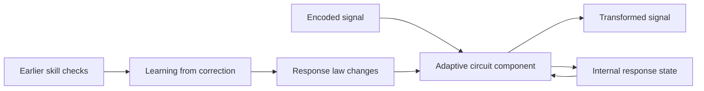

# Pathways as adaptive circuits, not single scalar connections

Author: Arnav123-s. Clarified design, 2026-09-04. **Proposal, not a measured new
architecture.** The linked small-repair comparison tests only some ingredients.

## Intended meaning

A pathway is a stateful signal-processing circuit. Its junctions are components
that route, delay, rotate, combine, or change their response to a signal. The
incoming signal can change a component's internal state, just as a heated
material can change its electrical response. Learning adjusts the circuit's
response laws. The information does not need to be represented by an individual
artificial neuron or a single scalar connection strength.

Heat is only an example. The target is an abstract computational circuit, not
a mandatory simulation of real materials. Signals and context may influence
timing, phase, thresholds, nonlinear response, coupling, and component state.
Which influences matter should be learned and ablated, not declared in advance
to be inherently intelligent. Fast adaptable learning remains a testable goal.

The finite machine still needs numbers or discrete instructions to represent
the circuit. Eliminating the word "weight" does not eliminate configuration
storage. A stateful circuit can use parameters very differently from a static
weighted sum, but this difference must be specified and measured.



The feedback loop is the key difference from a static scalar edge. This is a
schematic, not a real-time activation trace or a claim that literal metal is
simulated at atomic resolution.

## Three different kinds of change

### The configurable-board analogy

The board, rather than any individual square, is the learned program. Input
symbols act like supplied moves, not necessarily random dice. Junctions, jumps,
loops, and response rules determine how those inputs become an output. Teaching
changes the board; ordinary inference traverses its current configuration.

Write a board as $\mathcal B=(V,E,\{\mathcal P_p\},m_0)$ and its evaluator as
$\widehat y=\operatorname{Eval}(\mathcal B,x)$. An idealized learning objective is

$$\min_{\mathcal B'} L_{new}(\mathcal B')+\lambda C(\mathcal B')
\quad\text{subject to}\quad
\operatorname{Eval}(\mathcal B',x_i)=y_i\ \text{for protected earlier cases},
\quad C(\mathcal B')\le C_{max}.$$

Here $C$ counts representation and execution costs, not an unlimited abstract
board. The existing code does not solve this full discrete/continuous search
problem. It tests a few numerical configuration changes and small additions,
then measures failures on separate examples. The non-frozen loss projection is
only a local approximation to preserving earlier behavior.

A compact algorithm can cover many never-seen inputs by reusing a true rule.
It cannot guarantee exact storage of arbitrarily many independent labels in a
fixed finite number of states. Nor can a finite test prove correctness for every
future input. Thus all-earlier-cases preservation and new-input generalization
are explicit targets to investigate, not capabilities inferred from the analogy.

| Quantity | Changes when | Role |
| --- | --- | --- |
| Signal $z_t$ | Every input byte and circuit hop | Carries the current computation. |
| Component state $h_t,r_t$ | As signals pass through the component | Makes present response depend on recent signal history. |
| Response configuration $\xi_k$ | A verified teaching update is applied | Learns reusable behavior across questions. |

Here $t$ is signal time and $k$ is learning time; neither is relativity or a
claim that physical past and future occur simultaneously. A short-term state
alone does not preserve an indefinitely old ability. The response law must also
remain useful as the configuration changes.

The deterministic contract is the same input sequence **from the same initial
state and configuration** gives the same output. A stateful circuit can respond
differently to the same next symbol after different earlier symbols. That is
necessary context dependence, not a contradiction.

## General form: the model learns a response law

Represent pathway $p$ by a local state $m_p$ and a configurable transformation:

$$\mathcal P_p(u,m_p;\eta_p)=(v,m'_p).$$

The learned object is the transformation, not just one multiplier. A bounded
candidate implementation can combine a small library of response operators:

$$\mathcal P_p=\sum_{r=1}^{R}\operatorname{softmax}(a_p)_r
\,\mathcal T_r(u,m_p;\eta_{p,r}),$$

provided every operator has compatible signal/state shapes. The library might
contain phase rotation, smooth thresholds, bounded products, short delays,
relaxation, resonators, and a small learnable spline response. This is a proposal,
not code already used by the learner. Computing every candidate response costs
time and memory; later committing to selected operators requires revalidation.
It is a mixture of local mathematical operations, not independent specialist
answering models. The circuit cannot choose an operation that has no executable
definition, or obtain unlimited compute by calling its settings theoretical.

Learning functions on connections rather than only scalars has a concrete
precedent in [Kolmogorov-Arnold Networks](https://arxiv.org/abs/2404.19756), which
use learned univariate spline functions. That is a useful ingredient, not the
same as this stateful circuit proposal and not proof of general intelligence.
[Differentiable architecture search](https://arxiv.org/abs/1806.09055) supplies
another relevant idea: learn among a specified set of operations using a
continuous relaxation. Neither method justifies unrestricted self-modifying
code or a claim of laptop-scale frontier performance.

The model can adjust response coefficients and, in a future bounded search,
operator choices and connectivity. A meaningful experiment must compare this
extra freedom against its resource and optimization costs, using fresh tests.

## Minimal numerical candidates, not mandatory physical laws

The following nondimensional recurrences are a small, bounded candidate, not an
assertion that arbitrary knowledge literally has heat, frequency, or energy.
Actual token-to-signal encoding must be explicitly learned and tested.

### 1. Signal-driven relaxation

Let $u_t$ be a bounded complex signal at a component and define
$p_t=|u_t|^2/(1+|u_t|^2)$. A heat-like response state can follow

$$h_{t+1}=\rho h_t+(1-\rho)p_t,\qquad 0\le\rho<1.$$

With $h_0\in[0,1]$, every subsequent $h_t\in[0,1]$, since this is a convex
combination. It is the exact step for a first-order relaxation equation with
constant drive during a step if $\rho=e^{-\Delta t/\tau}$. It is not a claim
to solve a full heat equation or metal-expansion model. A thresholded response
can use $q_t=\sigma((h_t-b)/T)$ with $T>0$.

### 2. Frequency-selective temporal response

A small classical resonator can use

$$r_{t+1}=\rho_f e^{\mathrm{i}\omega}r_t+(1-\rho_f)u_t,
\qquad 0\le\rho_f<1.$$

$\omega$ is an angle per signal step, not a semantic truth about a concept.
For bounded inputs and zero initial state, the triangle inequality gives a
bounded response. The recurrent phase makes different temporal patterns produce
different responses. It costs an additional complex state per resonator.

### 3. State-conditioned transmission

For a component with configurable coefficients, one simple response is

$$G_t=\sigma(b_G+a_hh_t+a_r|r_t|),\qquad
v_t=G_t e^{\mathrm{i}\phi}u_t.$$

Several such $v_t$ can interfere at a junction. Optional small repair
connections can contribute additional context-dependent signals. Gates or
resonators may overlap across tasks rather than having one module for a field.
All these calculations are classical; a sum of complex signals is not an
efficient simulation of arbitrary many-body quantum states.

The simple $G_tu_t$ law is an illustrative state-dependent conductance model,
not a claim to implement the ideal charge/flux memristor relation exactly.

### 4. Preserve abilities while changing configuration

We want useful old behavior $F_{old}$ to survive as $\xi_k$ changes:

$$\xi_{k+1}\ne\xi_k,\qquad
F_{old}(\xi_{k+1})\approx F_{old}(\xi_k).$$

Locally, exact-output preservation would ask for
$J_{old}(\xi)\Delta\xi\approx0$. That Jacobian can be expensive. A cheaper
sampled approximation constrains an earlier-task loss gradient:
$g_{old}^T\Delta\xi\le0$. The
[small-repair experiment](../experiments/2026-09-04-small-repair-connections.md)
implements that first-order average-loss projection while allowing base and
added parameters to change. It cannot certify all past answers. Repeatedly
adding corrections also needs a finite capacity/compression policy; it does
not create unlimited storage.

## Research connections: mechanism, adaptation, and limit

| Field | Mechanism to borrow | Where it fits | Important limit |
| --- | --- | --- | --- |
| Circuit theory and materials | History-dependent response | Internal component state influences transmission | A phenomenological state equation is not an atomic simulation. |
| Dynamical systems | Stable relaxation and bounded recurrence | Keep internal states numerically controlled | Stability does not imply intelligence or good memory. |
| Signal processing | Resonance, filtering, phase interference | Encode and distinguish temporal patterns | Choosing frequencies does not assign meaning automatically. |
| Control and optimization | Constraints on allowed changes | Retain measured earlier behavior while learning | Sampled first-order constraints can miss nonlinear or unseen failures. |
| Geometry | Different configurations with similar output maps | Reconfigure without insisting on identical parameters | Equivalent behavior on finite tests is not equivalence everywhere. |
| Computer science and information theory | Finite-state capacity, graph composition, cost accounting | Reuse pathways and bound memory/compute | No exact arbitrary-history memory in fixed finite precision. |

These are selected relevant mechanisms, not a completed study of every STEM
field. Chemistry, biology, cosmology, or quantum terminology should be added
only when it supplies a definite computable mechanism and a falsifiable test.

[Chua's original memristor paper](https://doi.org/10.1109/TCT.1971.1083337)
provides a historical circuit-theory connection to history-dependent response.
The original [dynamic-memristor reservoir experiment by Du and colleagues](https://www.nature.com/articles/s41467-017-02337-y)
demonstrates temporal processing using device dynamics and a trained readout.
The present proposal differs by aiming to learn internal response laws as well;
that paper's hardware efficiency cannot be assumed for a CPU simulation.
[A-GEM](https://arxiv.org/html/1812.00420v2) supplies a concrete efficient
continual-learning constraint, not a physical time model.

## Ordered implementation and evaluation plan

### Thinking as search, learning as consolidation

The intended distinction is learning reusable procedures rather than saving a
question-to-answer table. During problem solving, a future core could search
alternative traversals/configurations of its own circuit. After a solution is
verified, it could consolidate a smaller reusable change.

```text
try the currently learned computation on the input
if the result is unresolved, search a bounded set of alternate routes/operators
verify proposed solutions using checks available for the task
prefer a cheaper verified solution, not a short unverified route
propose a small reusable circuit change from the successful computation
check old behavior and fresh problems before accepting the lasting change
```

For a route program $p$, an illustrative target is

$$p^*=\arg\min_p Cost(p)\quad\text{subject to}\quad
Verify(x,Execute(p,x))=true.$$

The verifier must not be a hidden benchmark answer supplied during inference.
Some tasks have executable checks or proof checkers; many open-ended questions
do not have a decisive automatic verifier. Model confidence alone does not
establish correctness. Search has a device budget and must be able to report
unresolved cases rather than silently treating guesses as new ground truth.

[DreamCoder](https://arxiv.org/abs/2006.08381) is a relevant original example of
searching for programs and learning reusable abstractions. It is not Kavi's
current implementation, nor proof that this proposal will achieve broad
intelligence at fixed size. Lasting changes in reusable procedures are a form
of learned memory even when no verbatim examples remain in the model.

The current byte core generates greedily and does not yet perform this explicit
per-question route-program search. The
[verified consolidation experiment](../experiments/2026-09-04-verified-consolidation.md)
searches smaller whole-configuration changes from already-trained proposals;
it is a bounded test of preserving behavior, not the complete thinking loop.

Status after the experiments: steps 1 and 2 below are complete in isolated
copies. An additional 63-configuration consolidation search preserved all 196
protected guard answers, but its selected configuration broke two previously
correct answers on fresh confirmation questions. Steps 3 onward remain proposed;
the current learner has not been replaced or resumed.

1. Keep the current live checkpoint paused and finish the already sealed
   teacher/topology comparison. Its results apply to the old architecture.
2. Complete the separate small-repair experiment with all base groups trainable:
   ordinary updates, joint small connections, and joint connections with an
   average-loss preservation constraint. Report gains and broken old answers.
3. Before claiming the adaptive-material idea is built, implement explicit
   component state and test it separately from the repair algorithm. Start with
   relaxation only, then resonance only, then both. Preserve identical teacher,
   update, parameter, state-memory, and elapsed-time accounting as far as possible.
4. Test sequence ordering, boundary retention, longer unseen sequences, and
   noise/delay sensitivity. Compare each mechanism with a same-budget recurrent
   control. Do not infer comprehension from symbol-task performance.
5. Only consider merging, replacing, or promoting a learned circuit after
   separate retention and fresh confirmation checks. Retest the oldest skills.
   Keep archived candidates outside inference and count their disk usage.

At 64 components, one float32 relaxation state adds 256 bytes per independent
row and one complex resonator adds 512 bytes, before training activations and
any new parameters. These are prospective state costs, not whole-process memory
measurements. Start serially with one numerical CPU thread; adjust independent
row microbatching according to measured memory headroom. Do not change hardware
thermal protection or infer temperatures from model size.

## Present implementation boundary

- Implemented in the existing core: recurrent state, learned phase mixing,
  activity-dependent routing, normalization, and supervised parameter updates.
- Implemented in experimental copies: eight context-dependent repair signals;
  first-order displacement projection without freezing base groups.
- Implemented outside the live learner: smaller whole-configuration search
  with exact finite guard checks and an untouched confirmation test. This is
  not yet automatic route search inside each inference.
- Not yet implemented: the explicit $h_t$ relaxation state, $r_t$ resonator,
  frequency-based input representation, learned discrete component types,
  arbitrary circuit rewriting, per-question verified route-program search,
  or a no-forgetting theorem.

This boundary prevents results from the older model being presented as proof of
the newly clarified architecture.
