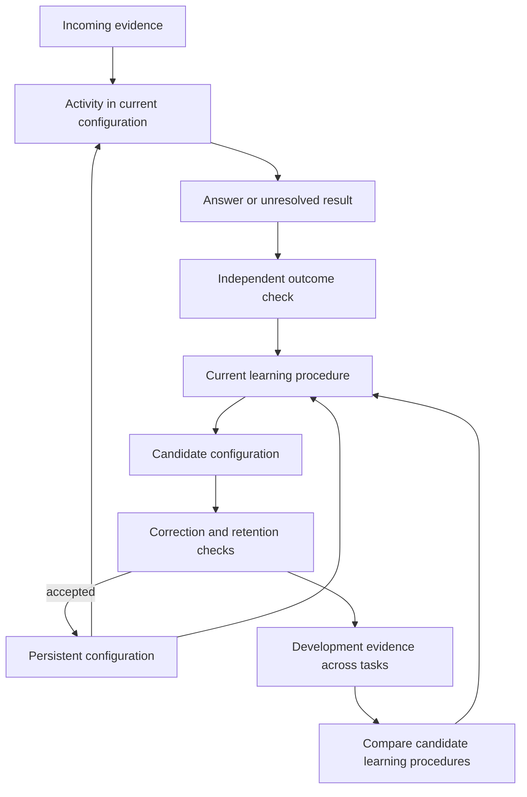

# Animal learning and configuration change

Author: [Arnav123-s](https://github.com/Arnav123-s)

Research and design study, 7 September 2026. This extends the [neural pathway study](NEURAL_PATHWAY_LEARNING.md) to animal learning, teaching, learning to learn, and replacement of a configuration while retaining valid abilities. The mechanisms below are proposals unless an existing experiment is explicitly linked.

## The design requirement

Kavi should acquire a new configuration from its existing configuration and evidence about what its behavior accomplishes. Earlier knowledge may survive as reorganized structure. The successor can be larger, smaller or the same size. Pruning, neuron death and separate emotional modules are not required stages.

Let K_t be the current configuration, e_t newly available evidence, and T_phi a transformation procedure:

$$K_{t+1}=T_{\phi_t}(K_t,e_t).$$

The transformation can replace a subgraph or construct an entirely different graph. Its operations may include composition, substitution, sharing, expansion or a change in local dynamics. The symbols + and * would need definitions for these objects; ordinary numerical addition of two unspecified “brains” has no defined meaning.

What must carry forward is the required behavior. For deterministic tasks with a fixed input/output interface, let D_valid be a domain on which the old behavior is established as valid. Require

$$f_{K_{t+1}}(x)=f_{K_t}(x)\quad\text{for every }x\in D_{\rm valid}.$$

For a correction (x_c,y_c), require f_{K_{t+1}}(x_c)=y_c. If the old answer at x_c was wrong, that answer cannot also be protected. A finite collection of past answers supplies finite evidence; it does not establish the equation over an unlimited domain.

Old outputs can help evaluate a replacement when their validity is known. Old structure can help construct it. Neither requires a permanent archive of answer records inside the deployed model. During comparison, however, the old graph, proposed graph and external checks consume real storage. Their costs remain part of the experiment.

## What animal learning contributes

The useful questions concern behavior: what experience changes later choices, how quickly that change occurs, whether it transfers, and when the animal adapts after conditions change. A digital implementation can test these functions without naming internal components fear, pleasure or curiosity.

| Evidence | Experimental finding | Kavi interpretation to test |
| --- | --- | --- |
| Aplysia reflex learning | Repetition depressed particular sensory-to-motor synaptic responses; stimulation of another pathway facilitated them. | Response depends on experience and interacting pathways, not only the present stimulus. |
| Pigeon discrimination | Gradually changing the training stimuli allowed discrimination with very few errors. | Start with distinguishable cases and remove teaching aids; repeated failure is not itself the objective. |
| Honeybee relation learning | Bees transferred matching and non-matching rules to new stimuli. | Test the acquired relationship with unfamiliar values and appearances. |
| Meerkat teaching | Helpers changed prey provisioning as pups developed. | Adjust lesson demands using evidence about current ability. |
| Ant tandem running | Leader and follower exchanged signals affecting their progress. | Teaching can be an interaction paced by the learner's state. |
| Crow tool construction | Some crows combined short pieces into a usable longer tool. | Test new functional compositions of familiar components. |
| Rat outcome devaluation | Extensive training could reduce sensitivity to a changed outcome value. | Fast familiar behavior needs tests of flexibility when the situation changes. |
| Mouse reversal learning | Experience across sessions improved the policy used to learn within a session. | Distinguish acquiring an answer from improving the way later learning occurs. |

### Learning does not always require an explicit verdict

**Castellucci, Pinsker, Kupfermann and Kandel (1970)** recorded identified sensory and motor neurons in an Aplysia preparation. Changes in the efficacy of specific synapses explained important features of habituation and dishabituation. This is a direct connection between experience, circuit change and behavior, under a limited preparation. It also shows why biological inspiration cannot honestly exclude synaptic strengths from the account. [Original study](https://pubmed.ncbi.nlm.nih.gov/5416543/).

Kavi could learn predictive regularities from input, then use explicit corrections for task errors. These are distinct learning signals. Simply repeating an observation should not create independent evidence each time; a useful test introduces an exception after repetition and measures whether the system notices it.

### Teaching can change the difficulty and timing of experience

**Terrace (1963)** taught pigeons a color discrimination by initially making the alternatives differ in brightness and duration as well as color, then reducing the extra differences. This demonstrates the value of controlling the training path. It does not establish that mistakes are always harmful or that this procedure is optimal for every learner. [Original study](https://pmc.ncbi.nlm.nih.gov/articles/PMC1404228/).

**Thornton and McAuliffe (2006)** combined observation and experiment on wild meerkats. Helpers altered prey provisioning in response to pup begging calls, providing changing opportunities to acquire handling skills. [Original study](https://pubmed.ncbi.nlm.nih.gov/16840701/).

**Franks and Richardson (2006)** studied tandem-running ants. Signals between the leader and follower regulated the run, meeting their behavioral account of teaching through feedback. This does not require attributing a human explanation or a human emotional state to either ant. [Original study](https://www.nature.com/articles/439153a).

For Kavi, a teacher can supply an easier prerequisite, a contrastive case or a demonstration when a specific gap appears. The teaching aids must then be removed. Success with operation hints remains success with hints; the final test should establish whether the intended independent ability was acquired. A responsive teacher and a learned internal teaching policy are separate results.

### Relations and recombination are stronger evidence than repetition

**Giurfa et al. (2001)** trained honeybees on delayed matching-to-sample and non-matching tasks and tested transfer to new stimuli, including across sensory modalities. The evidence concerns these relational tasks; it does not imply unrestricted reasoning. [Original study](https://pubmed.ncbi.nlm.nih.gov/11309617/).

**von Bayern et al. (2018)** presented eight New Caledonian crows with components too short to retrieve food alone. Four combined components into functional tools; one constructed tools with three and four parts. Familiarization and species-specific tool experience matter. The authors explicitly leave the underlying cognitive process unresolved; the result is not proof of a particular internal simulator. [Original study, methods and results](https://www.nature.com/articles/s41598-018-33458-z).

The corresponding Kavi tests should change surface forms while preserving a relation, then combine learned relations in an arrangement absent from teaching. A supplied equality test, arithmetic operator or composition rule must be declared. Otherwise, the experiment could merely demonstrate use of a solution already built into the substrate.

### Mastery includes adapting when conditions change

**Adams (1982)** found differences in rats' sensitivity to reinforcer devaluation after different training conditions. The experiments implicated training distribution and exposure to the outcome, so “more practice causes a habit” is too simple a summary. [Original study abstract](https://journals.sagepub.com/doi/abs/10.1080/14640748208400878).

For Kavi, an early confident answer may be efficient on familiar cases and wrong under changed conditions. Tests must include changed symbol definitions, misleading familiar cues and delayed evidence that requires revision. New evidence should redirect the computation without forcing the system to discard valid unrelated skills.

## Learning a better way to learn

**Hattori et al. (2023)** trained mice on a probabilistic reversal task across sessions. Interventions implicated CaMKII-dependent plasticity in orbitofrontal cortex in improvement across sessions, while expert trial-by-trial adaptation did not require that same plasticity mechanism. Recurrent activity and slower synaptic adaptation must therefore be distinguished in interpreting the result. The study does not show arbitrary invention of learning algorithms or replacement of an entire brain. [Original study](https://www.nature.com/articles/s41593-023-01485-3). Its [2024 correction](https://www.nature.com/articles/s41593-024-01718-z) amends a targeting coordinate in the methods.

**Wang et al. (2018)** supplied a computational theory in which slower training shapes recurrent dynamics that implement faster learning. This is a relevant model of multiple learning timescales, not an identity between its neural network and all animal learning. [Original paper](https://www.nature.com/articles/s41593-018-0147-8).

There are also direct software precedents for searching over a learning procedure. **Real et al. (2020), AutoML-Zero**, search programs with initialization, prediction and learning parts. Candidate algorithms are evaluated on defined tasks; the search machinery, operations and objective are supplied. This demonstrates a bounded form of algorithm discovery, not unlimited improvement from self-generated evidence. [Paper and algorithm specification](https://proceedings.mlr.press/v119/real20a/real20a.pdf).

For Kavi, three changes must be measured separately:

| Level | What changes | What would count as evidence |
| --- | --- | --- |
| Activity | Temporary bindings, signals and predictions | Later input revises a current interpretation. |
| Task configuration | Persistent representation and execution structure | Teaching transfers to fresh cases and retains earlier valid abilities. |
| Learning procedure | How evidence generates and selects structural changes | The acquired procedure learns new tasks more effectively than the fixed procedure under matched budgets. |

These can inhabit one model. Distinguishing them for measurement does not require three separate brains or an external semantic blackboard.

Let phi encode the current learning procedure. A proposed update is

$$\phi_{t+1}=M(\phi_t,\mathcal H_t),$$

where H_t contains development evidence from learning attempts, including their costs and outcomes on cases not used to fit each task. M is initially supplied. If the learning procedure is itself represented as an executable subconfiguration, it may eventually be transformed by the same bounded machinery. A fixed interpreter still defines valid operations; an independent evaluator determines whether the change achieved the stated task.

One evaluation objective for a candidate phi is

$$J(\phi)=\frac{1}{m}\sum_{i=1}^{m}
L_{Q_i}\!\left(U_\phi(K_i,D_i)\right),$$

subject to retention and resource constraints. D_i teaches task i; Q_i evaluates the resulting configuration. The task-selection history and starting K_i must be fixed for a comparison. Q_i is development evidence for choosing phi, even though it was unseen during that individual task's teaching. A separate bank of new tasks is required for final evaluation of learning to learn.

The diagram specifies a proposed evaluation arrangement. It does not claim that Kavi already learns its updater. Feedback is data to the model; the model's internal interpretation cannot silently change the external definition of a correct answer.

## Reorganization with retained capability

Two relevant precedents are **Net2Net** and **Network Morphism**. Net2Net constructs wider or deeper neural networks using function-preserving transformations. Network Morphism studies transformations involving depth, width, kernels and subnets, with equations that constrain preservation. They are examples within particular neural architectures, not guarantees that arbitrary replacement or shrinking preserves knowledge. Subsequent unconstrained training can still change the retained function. [Chen, Goodfellow and Shlens](https://arxiv.org/abs/1511.05641), [Wei et al. (2016)](https://proceedings.mlr.press/v48/wei16.html).

For Kavi's discrete circuits, a simple exact-integer illustration is

$$f_K(x,y)=((x+x)+y)+y,$$

replaced by

$$t=x+y,\qquad f_Z(x,y)=t+t.$$

Both return 2x+2y for every integer pair. The second arrangement evaluates t once and reuses it, preserving the result through changed structure. It invokes addition twice instead of three times under these explicit evaluation rules. That is a logical call count, not a wall-time measurement or proof of reduced bit-level work. Floating-point reassociation and overflowing fixed-width arithmetic need different contracts.

This is a hand-derived transformation, not a newly learned Kavi result. Its purpose is to show what it means for earlier knowledge to remain in a different form. The old execution path need not remain as a separately addressable subgraph. More broadly, a replacement can retain established behavior while adding new behavior outside the established domain.

A practical replacement protocol should:

1. Start from a versioned old configuration and a declared correction or learning objective.
2. Construct the candidate using old structure, relevant evidence and the allowed transformation language.
3. Check interfaces, termination limits and established operation contracts.
4. Check corrected behavior and earlier valid behavior. An old output is a reference only where it is trusted.
5. Compare work and full storage. Growth is acceptable within the device ceiling; size reduction is not a mandatory target.
6. Switch to the accepted version at an episode boundary. Retain rollback material externally for the experiment.

Replacing a configuration during an unfinished input additionally requires migration of active bindings and pending events. The state-mapping condition in the [neural pathway study](NEURAL_PATHWAY_LEARNING.md#replacement-while-preserving-behavior) states a sufficient preservation condition for a restricted deterministic case. Merely replacing a file or assigning new node identifiers does not supply that migration.

Independent final tests establish the reported scope after selection. If their failures inform another revision, the revised model needs a fresh final bank. Exact equivalence can be proved for restricted operation classes; finite regression tests must not be presented as universal guarantees.

## Experiments in order

First establish the learned recurrent configuration described in the [neural study](NEURAL_PATHWAY_LEARNING.md#the-discriminating-kavi-experiment). Then compare changes along independent axes:

| Question | Comparison | Main measure |
| --- | --- | --- |
| Does teaching order help? | Fixed order versus a responsive curriculum, using the same lesson pool and budget | Independent transfer per teaching example and per unit of work |
| Is a relation acquired? | Familiar objects versus new symbols, values and combinations | Generalization with surface cues changed |
| Does feedback repair a rule? | Verdict only, corrected answer, and explanation under declared interfaces | Transfer and retention; teaching information counted |
| Can the whole configuration change? | Retained original versus accepted transformed successor | Required behavior, actual execution and total state |
| Does learning itself improve? | Fixed updater versus candidate learned updater on new task families | Learning efficiency and forgetting at matched total compute |

Do not combine all new mechanisms in the first run: that would make improvements or failures difficult to attribute. Each trial needs a readable live display, pause/stop controls, declared budgets and a preserved record of predictions before correction. Animal emotions, biological pruning schedules and neuron-shaped objects are not prerequisites.

## Scope of the work

This study inspected primary-paper abstracts for the animal findings, the accessible crow methods/results, the corrected Hattori task and model descriptions, the AutoML-Zero program/evaluation specification and the Network Morphism formulation. Net2Net was checked at the author abstract level. No biological datasets or external learning code were installed, and these sources were not used as training material.

The subsequent [recurrent-configuration experiment](../experiments/2026-09-07-recurrent-configuration.md) implements a restricted replacement: observations generated from an old two-state graph and new labeled streams produce one eight-state successor. After a coverage repair, exact audits establish the new task and preservation of every old-domain stream. The first course and its regressions remain recorded. This is finite automata inference with a supplied update procedure, not animal-level intelligence or a learned updater. General replacement, dynamic state migration and improvement of the learning rule remain open; previously deferred implementation recommendations remain deferred.
