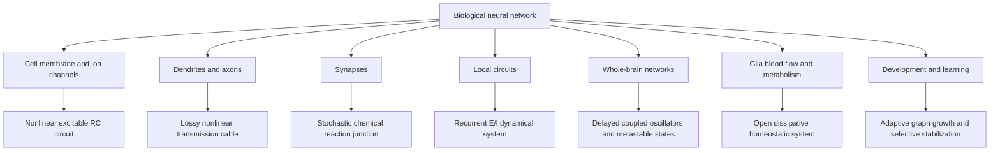

# Biological Neural Networks and Their Closest Physical Systems

Author: Arnav123-s

Status: research comparison and design audit; proposed changes are not implemented, trained, or validated

## 1. The short answer

A real biological neural network is not most like a solar system, a clock, or an ordinary computer circuit by itself.

The closest single physical description is:

> **An open, powered, dissipative, excitable electrochemical medium arranged as a sparse adaptive graph, with delayed signals, nonlinear local compartments, interacting rhythms, stochastic transitions, and homeostatic feedback.**

In child-friendly words, the brain is closest to a living electrical-and-chemical ecosystem. Tiny parts store charge and chemicals, branches combine messages, connections change with experience, support cells deliver resources, and the whole system continually spends energy to keep itself within a usable range.

No one physical analogy covers every scale. Different parts of the biology match different physical systems:



The diagram's main lesson is that biological intelligence comes from several kinds of physics working together. A useful artificial core should therefore combine only the abstractions that survive measurement, rather than force every mechanism into one metaphor.

## 2. What is directly observed and what is an engineering proposal

This distinction is essential.

- **Observed biology:** membrane voltages, ion currents, chemical transmission, stochastic release, local dendritic nonlinearities, excitation and inhibition, conduction delays, synaptic and structural plasticity, glial regulation, blood-flow coupling, metabolic cost, oscillations, and homeostasis.
- **Scientific models of observations:** cable equations, conductance models, reaction kinetics, recurrent population equations, attractors, coupled oscillators, metastable dynamics, and non-equilibrium thermodynamics.
- **Kavi proposals:** knowledge mass, semantic position, cognitive momentum, semantic gravity, computational temperature, local clocks, equilibrium learning, and artificial cell fission/fusion.

The proposals may be useful even when they are not literal biology. They must not be described as discoveries about the brain until experiments support that claim.

## 3. Scale one: a membrane is an excitable electrochemical circuit

A neuron's membrane separates different ion concentrations. Ion pumps maintain those concentration differences by spending chemical energy. Ion channels open and close depending on voltage, chemicals, mechanical effects, and other signals. The membrane itself stores separated electric charge, so it behaves partly like a capacitor.

The classical conductance description is:

\[
C_m\frac{dV}{dt}
=I_{\mathrm{ext}}
-\bar g_{\mathrm{Na}}m^3h(V-E_{\mathrm{Na}})
-\bar g_{\mathrm K}n^4(V-E_{\mathrm K})
-g_L(V-E_L),
\]

with channel gates such as

\[
\frac{dx}{dt}=\alpha_x(V)(1-x)-\beta_x(V)x.
\]

This is not a passive wire. The conductances depend on the state, which creates a threshold-like regenerative event: an action potential.

### Closest physical systems

1. **Nonlinear electrical circuit:** capacitance plus state-dependent conductances.
2. **Excitable chemical reaction system:** channel states and ion concentrations follow kinetic rules.
3. **Driven dissipative system:** pumps supply energy while resistance and leakage dissipate it.

### Why this match is strong

The variables correspond to things that can be measured: voltage, capacitance, ionic conductance, concentration, and time. The equations predict the shape and propagation of action potentials. Hodgkin and Huxley's original quantitative model is therefore a much stronger biological foundation than semantic gravity.

## 4. Scale two: a dendrite is a branched nonlinear cable and a local computer

Dendrites receive synaptic input across a branching tree. A first approximation treats a dendritic segment like a lossy cable:

\[
\tau_m\frac{\partial V(x,t)}{\partial t}
=\lambda^2\frac{\partial^2 V(x,t)}{\partial x^2}
-V(x,t)+R_m I(x,t).
\]

The diffusion-like term spreads voltage along the branch, while leakage makes the signal decay. Real dendrites also contain active voltage-dependent channels, so the full dynamics are nonlinear. Nearby inputs on one thin branch can combine superlinearly, while separated inputs can combine differently. A neuron can therefore contain many local computational compartments before its cell body produces an output event.

### Closest physical systems

- a branched RC transmission line;
- a reaction-diffusion cable with active local elements;
- a tree of nonlinear coincidence detectors.

### Design consequence

A single feature vector per artificial cell throws away an important part of the biological design. A closer core gives each cell several dendritic compartments. Each compartment combines a small set of inputs locally, then the soma combines the compartment outputs.

## 5. Scale three: an axon is a finite-speed active transmission line

An action potential regenerates as it travels along an axon. Propagation is not instantaneous. Axon diameter, membrane properties, myelin, branch points, and synaptic transmission all affect timing and reliability.

For a graph edge from cell \(i\) to cell \(j\), a useful abstraction is

\[
y_{ij}(t)=r_{ij}(t)\,f_i\!\left(t-\delta_{ij}(t)\right),
\]

where \(\delta_{ij}\) is a conduction delay and \(r_{ij}\) is transmission reliability.

### Closest physical systems

- a regenerative transmission line;
- a delayed communication network;
- a causal wave moving through an active medium.

### What the light analogy gets right

Information has a finite propagation speed, so remote events cannot affect one another instantly. This gives the network a causal cone.

### What the light analogy gets wrong

Neural spikes do not move at light speed, and their delay is not relativistic time dilation. Biological delays arise mainly from electrochemical propagation, geometry, myelination, and synapses. Kavi can keep finite-speed messages and local delays without claiming literal relativity.

## 6. Scale four: a synapse is a stochastic adaptive chemical junction

At many chemical synapses, an arriving spike can trigger vesicle release probabilistically. Transmitter crosses a tiny gap and changes conductance in the receiving cell. A minimal current model is

\[
I_{ij}^{\mathrm{syn}}(t)
=\bar g_{ij}s_{ij}(t)\bigl(V_j(t)-E_{ij}\bigr).
\]

A simple stochastic release abstraction is

\[
s_{ij}(t^+)=\rho s_{ij}(t)+b_{ij}(t),
\qquad
b_{ij}(t)\sim\operatorname{Bernoulli}(p_{ij}).
\]

Synapses can strengthen or weaken over many timescales. Timing matters in some synapses, but there is no single plasticity rule used everywhere. Cell type, dendritic location, receptor type, recent activity, neuromodulators, developmental stage, and behavioral state all matter.

A broad three-factor abstraction is

\[
\dot e_{ij}=F(\text{pre}_i,\text{post}_j)-\frac{e_{ij}}{\tau_e},
\]

\[
\dot w_{ij}=\eta\,M(t)e_{ij}-\lambda w_{ij}.
\]

Here \(e_{ij}\) is a temporary eligibility trace formed by local pre/post activity, and \(M(t)\) is a later modulatory or teaching signal.

### Closest physical systems

- a noisy chemically gated junction;
- a reaction network with memory;
- an adaptive conductance whose change depends on local history and global context.

### Design consequence

Biological learning is closer to many interacting local update rules than to one universal update applied uniformly to every connection. A Kavi experiment should permit different synapse classes and should test a local three-factor rule against its equilibrium-learning rule and an ordinary gradient baseline.

## 7. Scale five: a local circuit is an excitation-inhibition dynamical system

Neural circuits contain excitatory and inhibitory cells with diverse properties. Excitation recruits activity; inhibition shapes timing, gain, routing, competition, and stability. A simplified population model is

\[
\tau_E\dot E=-E+\phi(w_{EE}E-w_{EI}I+P),
\]

\[
\tau_I\dot I=-I+\phi(w_{IE}E-w_{II}I+Q).
\]

Depending on parameters and input, such a system can settle, oscillate, amplify selected patterns, switch between states, or become unstable.

### Closest physical systems

- a nonlinear feedback-control system;
- a coupled activator-inhibitor network;
- a driven oscillator near several possible regimes.

### Why this matters

Stable intelligence does not require removing all positive feedback. It requires positive feedback paired with fast and slow negative feedback. The inhibitory part is not merely a brake: it helps select which signals matter and when they may pass.

## 8. Scale six: large networks are delayed, metastable, multiscale dynamics

Large groups of neurons show rhythms at multiple timescales. These rhythms can coordinate windows of excitability, but the brain is not one perfectly synchronized oscillator. Activity often visits temporary patterns, remains there for a while, and then transitions. This is called metastable dynamics.

A deliberately simplified phase description is

\[
\dot\varphi_i
=\omega_i
+\sum_j K_{ij}
\sin\!\left(\varphi_j(t-\delta_{ij})-\varphi_i(t)\right)
+\xi_i(t).
\]

This describes delayed coupled rhythms, not meanings or individual spikes. A different state-space description is

\[
\dot z=F(z,u)-\Gamma z+\Sigma(z)\xi,
\]

where the nonlinear flow \(F\), dissipation \(\Gamma\), input \(u\), and noise \(\xi\) produce temporary attractor-like or metastable states.

### Closest physical systems

- delayed coupled oscillators;
- a stochastic nonlinear dynamical system;
- a non-equilibrium system moving among metastable states;
- an adaptive graph whose topology and edge delays affect global flow.

### Important caution about criticality

Some experiments and models suggest neural activity can show signatures associated with systems near a critical point. Whether brains are generally tuned to exact criticality remains debated. Kavi should measure stability, dynamic range, branching statistics, and susceptibility rather than assume that “critical” is always best.

## 9. Scale seven: the brain is a neuron-glia-vascular system

Neurons are only part of the operational network. Astrocytes contact synapses, help regulate extracellular ions and transmitter, participate in metabolic support, and contribute to the relation between sustained neural activity and blood flow. Oligodendrocytes make myelin and thereby affect propagation. Blood vessels deliver oxygen and fuel and remove heat and waste.

The whole brain is therefore an open system:

\[
\frac{dE_{\mathrm{brain}}}{dt}
=P_{\mathrm{metabolic}}
-P_{\mathrm{signaling}}
-P_{\mathrm{maintenance}}
-P_{\mathrm{heat}}.
\]

It remains organized only because matter and energy continually cross its boundary.

A proposed artificial support field could be

\[
\tau_G\dot G_i
=D_G\sum_j A_{ij}(G_j-G_i)
+S_i-D_i-\lambda_G G_i,
\]

where \(G_i\) represents available support, \(S_i\) supplied resources, and \(D_i\) local demand. This is an engineering proposal, not a claim that one scalar captures astrocyte or vascular biology.

### Closest physical systems

- an open dissipative thermodynamic system;
- a resource-distribution network under feedback control;
- an active material that maintains itself away from equilibrium;
- at a high level, an ecosystem with producers, consumers, transport, repair, and recycling.

### Heat is real but not thought

Neural activity produces heat and temperature changes reaction rates, channel kinetics, blood flow, and tissue state. However, the semantic content of a thought is not literally heat. In an artificial model, “temperature” can be a mathematically useful exploration/noise variable, but it must be kept separate from the device's measured physical temperature.

## 10. Scale eight: development is growth, competition, stabilization, and removal

Biological development initially creates many cells, branches, and synapses, then refines circuits through molecular guidance, spontaneous activity, experience, competition, stabilization, and elimination. Adult learning can form, eliminate, enlarge, shrink, and stabilize dendritic spines. Myelination and conduction timing can also change with activity.

This is not equivalent to ordinary artificial weight pruning. Nor is ordinary adult learning mainly neurons splitting and merging.

### Closest physical systems

- morphogenesis and reaction-diffusion pattern formation;
- adaptive network growth;
- competitive resource allocation;
- selective stabilization under repeated use;
- coarse-graining only as a limited engineering analogy.

### Design consequence

If Kavi aims for biological fidelity, its normal growth unit should be a dendritic compartment, synapse, branch, or conduction adaptation—not cell fission. Artificial cell split/merge can remain a separate architecture-search experiment, but it should not be presented as how a mature brain normally learns.

## 11. Ranking the physical analogies

| Physical analogy | Match strength | What it explains well | Where it fails |
|---|---|---|---|
| excitable reaction-diffusion medium | very strong | membrane events, local activation waves, chemical kinetics | does not by itself explain symbolic knowledge or long-range structure |
| nonlinear adaptive electrical network | very strong | voltage, capacitance, conductance, feedback, dendritic integration | a brain is chemical, structural, stochastic, and living too |
| open dissipative non-equilibrium system | very strong | continual energy use, maintenance, noise, recovery, metastability | too broad to specify a learning algorithm alone |
| sparse adaptive delayed graph | strong | connectivity, signal routes, propagation delays, structural plasticity | abstracts away cellular geometry and chemistry |
| coupled oscillator network | strong but partial | rhythms, coordination, phase and delay effects | cognition is not reducible to synchronization |
| stochastic reaction network | strong at synapses | probabilistic release, molecular state, plasticity | too microscopic for whole-circuit reasoning alone |
| ecosystem | useful system-level analogy | multiple cell classes, resource flows, competition, support | metaphorical rather than one exact physical law |
| fluid or active matter | partial | waves, transport, collective patterns | neurons do not freely move like fluid particles during cognition |
| orbital or gravitational system | weak | an invented attraction can cluster artificial representations | gravity is negligibly weak at neural scales and is not known to bind thoughts |
| equilibrium thermodynamic system | poor | local energy landscapes can model stable states | the living brain is open, powered, and far from equilibrium |
| quantum computer | unsupported as a general neural explanation | all matter is quantum at a fundamental level | ordinary neural signaling is well described at electrochemical and statistical scales; this does not establish quantum cognition |

## 12. Why gravity is not the closest biological mechanism

Gravity dominates planets because astronomical bodies have enormous mass. At the scale of ions, proteins, synapses, and neurons, electromagnetic interactions, molecular binding, diffusion, fluid transport, and thermal noise dominate. Neural computation has no measured equivalent of concepts attracting one another through literal gravitational mass.

The current semantic-gravity term

\[
V_{\mathrm{bind}}
=-\sum_{(i,j)}
\frac{G c_{ij}m_im_j}
{\sqrt{\lVert q_i-q_j\rVert^2+\epsilon^2}}
\]

can still be tested as an artificial inductive bias. But biologically closer alternatives are:

1. learned synaptic conductance;
2. local chemical modulation;
3. attractor energy created by recurrent E/I couplings;
4. dendritic coincidence and branch-specific gating;
5. eligibility-based strengthening after useful activity;
6. resource-dependent stabilization.

The honest label is therefore **engineered binding potential inspired by gravity**, not **biological gravity**.

## 13. Audit of the current Kavi Physical Dynamics Core

| Current mechanism | Biological match | Judgment | Recommended interpretation or change |
|---|---|---|---|
| sparse graph | strong | keep | connections are sparse and structured, but add cell/edge types |
| finite-speed delayed messages | strong | keep | map to axonal and synaptic delays; allow measured heterogeneous delays |
| reaction-diffusion activation | moderate to strong | keep and refine | map to spreading chemical/support fields and excitable activation, not all cognition |
| activator and inhibitor | strong abstraction | keep and refine | separate excitatory cells, inhibitory cells, and slow modulators |
| homeostasis | strong | keep | control firing/activity ranges, E/I balance, plasticity, and resource demand |
| dissipative open dynamics | very strong | keep | add an explicit supply field and budget, because dissipation requires replenishment |
| computational temperature | partial | keep only as a measured control variable | define it as noise/gain/exploration; never confuse it with tissue or laptop temperature |
| local clocks | partial | reinterpret | use heterogeneous time constants, event timing, eligibility windows, and conduction delays—not relativity |
| cognitive momentum | weak to partial | ablate carefully | short-lived membrane, dendritic, synaptic, and eligibility state create persistence; literal momentum is not required |
| knowledge mass | weak as biology | reinterpret | map to consolidation, redundancy, stability, and learning-rate resistance; do not claim literal mass |
| semantic gravity | weak | challenge against alternatives | retain only if it beats learned conductance/attractor coupling under equal budgets |
| repulsive core | moderate artificial analogy | test | inhibition, decorrelation, competition, and normalization are closer biological mechanisms |
| equilibrium learning | plausible engineering method, unestablished biology | benchmark | compare with local three-factor learning and ordinary gradient training |
| cell fission and fusion | weak for ordinary mature learning | move to architecture research | prefer synapse, spine, branch, and delay adaptation inside a fixed cell population |
| one vector per latent cell | biologically weak | change | add dendritic subcompartments and an explicit soma/output event |
| neuron-only graph | incomplete | change | add slow support fields representing glial/metabolic constraints |

## 14. The biologically closer core

The recommended next hypothesis is not to discard the physics-native design. It is to use the physics that most closely matches the biology.

Its exact proposed type is:

> **An open, dissipative, multi-compartment excitable network on a sparse adaptive delayed graph, with heterogeneous excitatory, inhibitory, and modulatory units; local eligibility-based plasticity; metastable recurrent dynamics; and glial-like resource homeostasis.**

### One artificial neuron

Cell \(i\) contains:

\[
s_i=\{V_i^{\mathrm{soma}},
V_{i1}^{\mathrm{dend}},\ldots,V_{iB}^{\mathrm{dend}},
h_i,a_i,r_i,e_i\}.
\]

- \(V^{\mathrm{dend}}\): local branch voltages/states;
- \(V^{\mathrm{soma}}\): combined cell-body state;
- \(h_i\): slower channel or adaptation state;
- \(a_i\): recent activity;
- \(r_i\): available local resource/support;
- \(e_i\): local eligibility state.

Each edge stores

\[
e_{ij}=\{w_{ij},\delta_{ij},p_{ij},\kappa_{ij},c_{ij}\},
\]

where \(w\) is conductance-like strength, \(\delta\) delay, \(p\) release reliability, \(\kappa\) plasticity class, and \(c\) consolidation/stability.

### One bounded inference step

```text
1. Inject the observation into designated sensory compartments.
2. Deliver only messages whose edge delays have elapsed.
3. Sample or approximate release using each edge's reliability.
4. Integrate inputs inside each active dendritic compartment.
5. Apply local inhibitory and modulatory gating.
6. Integrate compartment outputs at each soma.
7. Emit sparse events when a cell crosses its event rule.
8. Update E/I balance, adaptation, support demand, and local resources.
9. Update temporary eligibility traces but not permanent weights.
10. Repeat for a bounded number of microsteps or until a declared criterion is met.
11. Produce the prediction from the resulting population state.
```

### One bounded learning step

```text
1. An external trainer supplies the target or measured task result.
2. The evaluator computes an auditable teaching/modulatory signal.
3. Eligible synapses change according to their declared plasticity class.
4. Homeostasis adjusts thresholds and gain on a slower timescale.
5. Consolidation rises only after independent repeated success.
6. Contradicting evidence can lower consolidation and reopen learning.
7. Proposed synapse/branch additions or removals are tested in a sandbox.
8. A change is accepted only if protected retention and resource tests pass.
9. The stop controller remains external and always able to halt the run.
```

## 15. How the earlier physics ideas fit after this comparison

| Earlier idea | Best scientifically grounded role |
|---|---|
| knowledge as mass | consolidation and resistance to overwriting, capped and evidence-controlled |
| energy as knowledge | separate these: knowledge is encoded structure; energy is the resource needed to create, maintain, and use it |
| heat guides thought | computational noise/gain may guide exploration; physical heat is a constraint and by-product |
| time and light are one | replace with finite propagation, causal ordering, heterogeneous delays, and local time constants |
| planets spiral inward | optional trajectory prior for optimization; not the primary neural mechanism |
| gravity binds ideas | optional learned binding potential; recurrent conductance and coincidence are closer to biology |
| neuron growth and pruning | synapse/branch formation, stabilization, elimination, and myelin adaptation are the closer units |
| compression into heavier neurons | measured consolidation or distillation may compress function, but all retained capabilities must be tested |
| pendulum or coil motion | useful oscillator/resonance hypothesis for temporal processing, not a complete learning theory |

## 16. Testable predictions instead of metaphors

Every borrowed physical idea should make a measurable prediction.

| Hypothesis | Required comparison | Evidence that would support it | Evidence that would reject it |
|---|---|---|---|
| dendritic compartments improve reasoning per parameter | single-vector cell | better transfer or compositional accuracy at equal time/memory | no benefit or slower learning without quality gain |
| heterogeneous delays improve temporal tasks | all delays equal | better delayed-copy, rhythm, speech, or algorithm traces | equal-delay model matches or wins |
| local E/I control prevents collapse | generic scalar inhibitor | wider stable operating range and fewer runaway states | no stability gain or chronic under-activation |
| eligibility plus modulatory signal supports credit assignment | equilibrium learning and ordinary gradient baseline | competitive learning with local updates and lower memory | poor long-delay credit or unstable training |
| support field improves graceful degradation | fixed compute gate | better performance under constrained budgets and fewer abrupt failures | extra state adds cost without resilience |
| semantic gravity helps binding | learned conductance/attractor potential | reproducible binding gain after ablation | collapse, instability, or no gain |
| artificial fission/fusion helps capacity | fixed graph and synapse-only growth | better quality per byte with retention preserved | regressions, churn, or hidden state growth |

## 17. What should be built first

The full biological system is too complicated to reproduce on the target device. The first experiment should test the smallest decisive combination:

1. 64 to 128 event-driven cells;
2. 4 dendritic compartments per cell;
3. distinct excitatory and inhibitory cell classes;
4. sparse edges with delays of 1 to 4 microsteps;
5. leaky conductance-like dynamics;
6. temporary eligibility traces and a bounded modulatory teaching signal;
7. slow homeostatic threshold control;
8. one slow support/resource field;
9. fixed architecture during the first comparison;
10. identical parameter, training-token, wall-time, memory, and evaluation budgets for all baselines.

Only after this works should experiments add structural growth, activity-dependent delays, gravitational binding, or alternative learning dynamics. This ordering tells us which mechanism actually caused an improvement.

## 18. The simplest explanation

Imagine a city that is alive.

- A neuron's membrane is a rechargeable electric wall with doors for different chemicals.
- A dendrite is a tree of small neighborhoods that can make local decisions.
- An axon is a road on which messages take real time to travel.
- A synapse is a tiny, somewhat unreliable chemical gate whose behavior can change with experience.
- Excitatory cells say “more”; inhibitory cells decide “not now,” “not here,” or “not so much.”
- Rhythms act like changing traffic lights that coordinate when groups can communicate.
- Glia and blood vessels are the power, maintenance, cooling, cleaning, and supply systems.
- Learning changes routes, gate strengths, local branches, timing, and which changes become stable.

That city is not at rest. It constantly consumes fuel and repairs itself. It is not governed by one central sun pulling every thought inward. Its intelligence comes from local electrochemical rules, carefully timed communication, feedback, support, and many levels of adaptation.

## 19. Conclusion for Kavi

The strongest parts of the current physics-native core are sparse delayed communication, reaction-diffusion-style activation, dissipation, homeostasis, controlled stochasticity, and different update timescales. They agree with useful abstractions of biology.

The weakest biological claims are semantic gravity, literal knowledge mass, momentum-dominated thinking, relativistic local time, and routine cell fission/fusion. These may remain engineering experiments, but they should not define the core merely because the metaphors are attractive.

The central design should shift from **a miniature gravitational universe that thinks** to **a metabolically constrained, excitable, multi-compartment electrochemical network that learns through local history and system-level feedback**. Gravity-like binding can then compete as one optional mechanism. Measurement decides whether it stays.

## 20. Primary research and technical sources

### Membrane excitation and dendrites

- Hodgkin, A. L. and Huxley, A. F. (1952), quantitative conductance model of membrane current and excitation: <https://pmc.ncbi.nlm.nih.gov/articles/PMC1392413/>
- Polsky, A., Mel, B. W., and Schiller, J. (2004), experimental evidence that thin dendritic branches act as nonlinear computational subunits: <https://www.nature.com/articles/nn1253>
- Frick, A., Magee, J., and Johnston, D. (2004), local dendritic excitability changes accompanying long-term potentiation: <https://www.nature.com/articles/nn1178>

### Synaptic learning, inhibition, and structure

- Bliss, T. V. P. and Lomo, T. (1973), long-lasting potentiation after repetitive stimulation: <https://pubmed.ncbi.nlm.nih.gov/4727084/>
- Bi, G. and Poo, M. (1998), timing-dependent synaptic modification: <https://pubmed.ncbi.nlm.nih.gov/9852584/>
- Turrigiano, G. G. et al. (1998), activity-dependent scaling of synaptic strengths: <https://pubmed.ncbi.nlm.nih.gov/9495341/>
- Vogels, T. P. et al. (2011), inhibitory plasticity and excitation-inhibition balance: <https://pubmed.ncbi.nlm.nih.gov/22075724/>
- Yang, G., Pan, F., and Gan, W. (2009), stable dendritic spines associated with long-lasting memories: <https://pubmed.ncbi.nlm.nih.gov/19946265/>
- Xu, T. et al. (2009), rapid spine formation and selective stabilization during motor learning: <https://pubmed.ncbi.nlm.nih.gov/19946267/>

### Propagation, myelin, and support systems

- Bakkum, D. J. et al. (2008), activity-dependent plasticity of action-potential propagation delay and amplitude: <https://pubmed.ncbi.nlm.nih.gov/18461127/>
- Noori, R. et al. (2020), activity-dependent myelination as a mechanism affecting oscillatory organization and conduction delay: <https://pubmed.ncbi.nlm.nih.gov/32482855/>
- Institoris, A. et al. (2022), astrocytes amplify neurovascular coupling during sustained cortical activation: <https://pubmed.ncbi.nlm.nih.gov/36550102/>
- Kim, K. J. et al. (2016), evidence for vessel-to-astrocyte-to-neuron communication: <https://pubmed.ncbi.nlm.nih.gov/27821575/>

### Network dynamics and limits of interpretation

- Buzsaki, G. and Draguhn, A. (2004), neuronal oscillations in cortical networks: <https://buzsakilab.com/content/PDFs/Buzsaki2004Science.pdf>
- Brinkman, B. A. W. et al. (2022), review of metastable neural dynamics and their relation to behavior: <https://pmc.ncbi.nlm.nih.gov/articles/PMC8900181/>
- Beggs, J. M. and Plenz, D. (2003), neuronal avalanches as evidence relevant to critical branching hypotheses: <https://pubmed.ncbi.nlm.nih.gov/14657176/>
- Wilting, J. and Priesemann, V. (2019), evidence and argument for a reverberating regime rather than exact criticality: <https://pubmed.ncbi.nlm.nih.gov/31008508/>

These sources support particular measured mechanisms. They do not prove that the proposed Kavi architecture will learn language, reason reliably, or outperform established methods. That question requires controlled implementation and evaluation.
