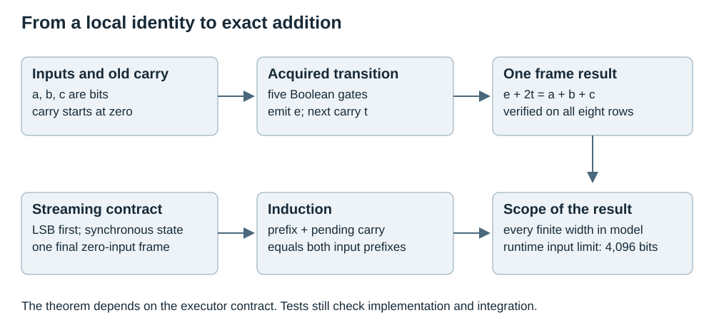
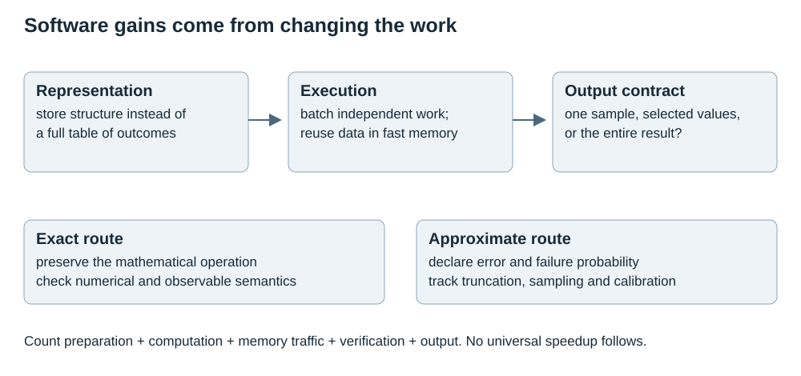
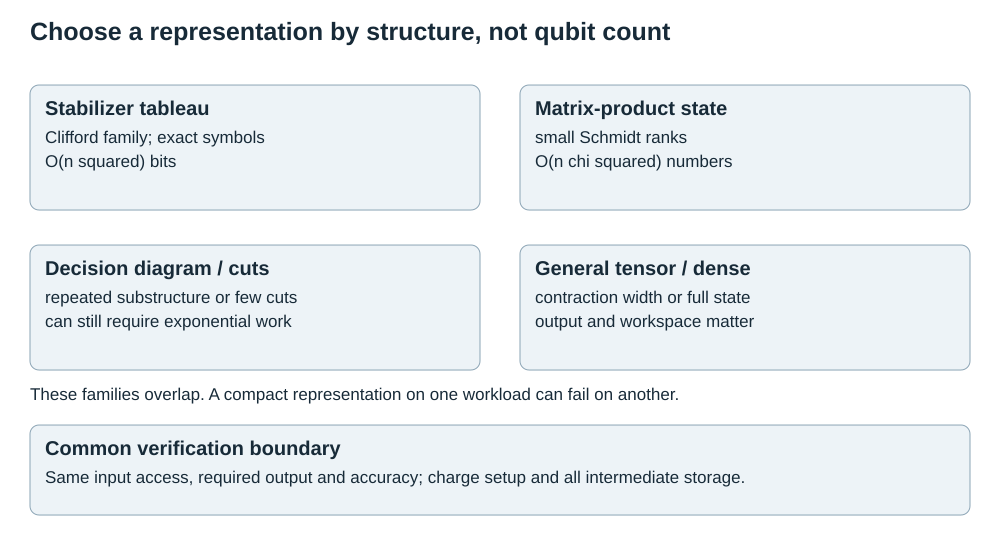
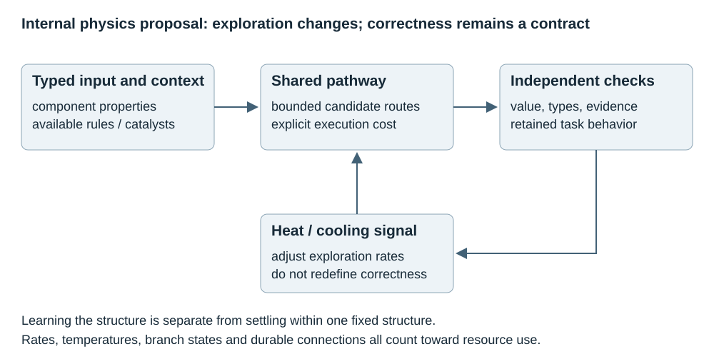
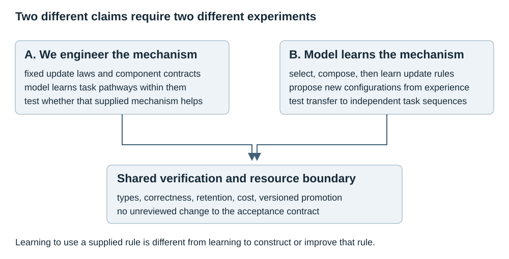
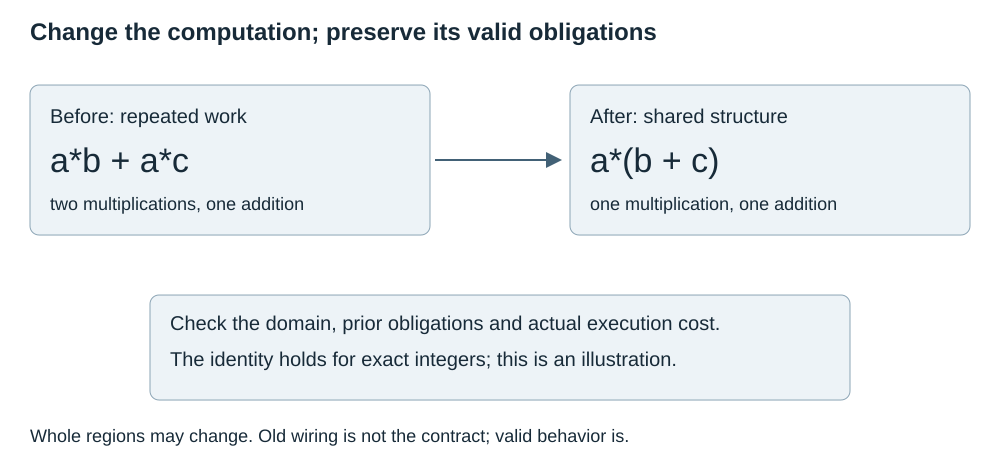

# Kavi: Certified Arithmetic and Software Efficiency

Author: Arnav123-s

Subsequent experiment: the [configuration reuse and repair audit](../experiments/2026-09-07-mechanism-audit.md) rechecks the addition certificate and measures shared notation, supervised composition and a limited temperature/priority search comparison. The [current assessment](PROJECT_ASSESSMENT.md) consolidates capabilities. This study and its dated PDF retain their original research scope; deferred review recommendations remain deferred.

Revision: 7 September 2026

Structural learner baseline: 288e9ec; unchanged learner and search mechanisms

## Abstract

Kavi's acquired addition circuit admits a width-independent correctness theorem under a precise streaming contract. The deployed graph is 321 bytes, and all eight local transition rows satisfy the full-adder identity. That result deserves explicit documentation. It does not establish learning from three examples, unlimited runtime capacity, a novel addition algorithm, or a proof of the Python implementation. The recorded selection bank contained 129 operand pairs; the runtime limits each input to 4,096 bits.

This study audits an external technical review, records its proposed changes without adopting them, and investigates software methods that make demanding computations practical on conventional devices. It covers packed Boolean execution, memory-aware algorithms, sampling-based dequantization, stabilizer simulation, tensor networks, decision diagrams, circuit simplification and error mitigation. Their gains depend on specific structure and access assumptions. Exact mathematical equivalence, floating-point agreement, approximation error and measured speed are separate claims.

No search policy, library-retirement rule, abstraction learner, curriculum or quantum backend was changed. The accompanying checks inspect the existing addition certificate and demonstrate two small software identities. A separate proposal translates heat, cooling, catalysts and a computational element table into explicit internal rules, distinguishing mechanisms engineered by the developer from mechanisms learned by the model. The diagrams describe evidence boundaries and method families; they are not a claim that a new execution architecture has been implemented.

## 1 Finding and disposition

The strongest supported finding is an explicit correctness argument for the acquired arithmetic transducer. It is an instance of a classical serial full-adder construction, with the local gate arrangement acquired by Kavi's bounded search. Serial adders with a full adder and a carry register are established digital-system designs; see the [MIT serial-adder exercise](https://ocw.mit.edu/courses/6-111-introductory-digital-systems-laboratory-fall-2002/1d2f63cb082a51f6dab830726759e680_ps4f02.pdf). This is useful project evidence, not evidence of research priority.

| Review claim | Finding | Documentation action |
| --- | --- | --- |
| Eight transition rows imply correctness at every width | True for the stated transducer and framing contract | State and prove the theorem |
| Learned from approximately three examples | Contradicted by the published run record | Preserve the 129-case exposure count |
| Correct forever on every input | Mathematical finite-width theorem; implementation has limits | Separate theorem from runtime guarantee |
| The result was previously unclaimed | Existing runtime and experiment already mention the induction | Make the argument explicit, not retroactively novel |
| AbstractBeam is identical to Kavi | Related synthesis direction, different architecture | Add a qualified prior-art comparison |
| Utility, entropy and description length are the same objective | Incorrect without additional definitions and assumptions | Record distinctions and counterexamples |
| Suggested changes provide measured local speedups | Supporting benchmark artifacts were not supplied | Preserve as unverified review assertions |

All recommendations in the review are recorded in Section 4 as deferred. This document does not rank them for implementation. The software-method survey is a separate investigation of representation and computation, not a decision to install those recommendations.

## 2 The addition theorem

### 2.1 Contract

Let A and B be nonnegative integers. Their bits arrive least significant first. The circuit has one carry bit, initialized to zero. Each frame computes its emitted bit and next carry from the same old carry. Gates preserve Boolean values. After all significant input positions, one frame containing two zero input bits flushes the final carry. Emitted bits occupy distinct output positions.

For every local input triple, require:

$$e(a,b,c)+2t(a,b,c)=a+b+c,\qquad a,b,c\in\{0,1\}.$$

Here e and t are Boolean-valued output functions. There are exactly eight triples. The eight-row check is exhaustive for these local functions; its size does not grow with operand length.



### 2.2 Invariant with an unambiguous index

Let c at index i be the carry before processing bit i. Let R at index i contain exactly the i bits already emitted. Define:

$$R_i=\sum_{j=0}^{i-1}e_j2^j,\qquad c_0=0,\quad R_0=0.$$

The invariant before frame i is:

$$R_i+2^ic_i=(A\bmod2^i)+(B\bmod2^i).$$

At i=0 both sides are zero. Assuming the invariant, write a_i and b_i for the current operand bits. The next output prefix and the transition identity give:

$$\begin{aligned}R_{i+1}+2^{i+1}c_{i+1}&=R_i+2^i(e_i+2c_{i+1})\\&=R_i+2^i(a_i+b_i+c_i)\\&=(A\bmod2^{i+1})+(B\bmod2^{i+1}).\end{aligned}$$

Thus induction proves the invariant at every finite position. Choose w at least one and large enough to contain both operands. Before flushing:

$$R_w+2^wc_w=A+B.$$

At the zero-input frame, the local identity becomes e_w+2c_(w+1)=c_w. Since both outputs are bits and c_w is zero or one, necessarily e_w=c_w and c_(w+1)=0. Therefore:

$$R_{w+1}=A+B.$$

This proves exact addition for every finite operand width in the abstract streaming model. It is not induction over training examples and does not depend on a probabilistic extrapolation from the eight-bit audit.

### 2.3 Why the assumptions matter

A nonzero initial carry changes the result. Omitting the final frame loses an overflow bit: with one-bit inputs 1 and 1, the first emitted bit is zero and the carry is one. Computing one output from a newly updated carry changes the transition semantics. A non-Boolean next-state value invalidates the final-flush reasoning.

In `kavi/circuit_core.py`, the constructor checks the allowed gate operations and reference structure. `execute` reads old state for both outputs, initializes state and result to zero, and uses one final padded frame. It constructs the result with bitwise OR; because each Boolean output occupies a distinct position, that operation equals the sum defining R. Python's mathematical-integer behavior is assumed within available resources.

The runtime rejects inputs longer than 4,096 bits. An output may have 4,097 bits. The proof describes the algorithm independently of that guard; it does not override the guard or prove the interpreter, operating system, memory subsystem or underlying hardware correct.

### 2.4 What is already certified and what remains empirical

`kavi/circuit_runtime.py:local_invariant` already checks all eight rows after selection and records the graph digest. `kavi/procedure_optimizations.py:addition_certificate` checks the same identity before the supplied multiplication compilation. The 5 September experiment already stated that the identity supports an induction under the documented executor. This study supplies the complete argument and audits the existing artifact without changing either checker.

The canonical graph has five gates and 321 serialized bytes. Its SHA-256 is recorded in the accompanying audit. The learning run exposed 81 foundation pairs and 48 carry-producing pairs. Recorded foundation counterexamples were two, one and one across the three seeds; each repair used six. Counterexamples alone are not the full supervision received by the search and verifier.

The 65,536-pair audit remains useful. It checks the concrete integration of loading, framing, execution and decoding and can catch implementation mistakes outside the local theorem. Proof and tests have different responsibilities. Neither is a reason to erase the other from the record.

The defensible claim is: **Kavi acquired a 321-byte addition transition whose complete local truth table, together with the declared streaming contract, proves exact addition for arbitrary finite widths. The current implementation accepts inputs up to 4,096 bits.** The small artifact excludes the executor, search catalog, teacher, verifier and logs. The experiment does not demonstrate a general arithmetic learner free of supplied structure.

## 3 Prior art and corrected comparisons

### 3.1 AbstractBeam

[AbstractBeam, version 3](https://arxiv.org/html/2405.17514v3), by Zenkner and colleagues, combines execution-guided bottom-up synthesis with neural argument selection, Stitch abstractions and iterative retraining. Kavi lacks that combination. The relationship is close enough to cite, but “identical architecture” is inaccurate.

The paper's 2.57 versus 4.57 seconds compares handwritten tasks both systems solved across five trials. It is not total training cost or an unconditional all-task average. On matched synthetic tasks, the reported averages reverse: 3.62 seconds for AbstractBeam versus 1.37 for LambdaBeam. Synthetic solve-rate gains were not statistically significant. Abstractions were used, but supplied no demonstrated benefit under that distribution shift. This is a bounded negative result, not a proof that all cross-domain transfer fails.

Adding library entries can increase search width while shortening useful programs. The tradeoff is already explicit in that paper. Kavi's observed slowdown as its library grew is an instance to investigate, not a newly discovered universal law.

### 3.2 The utility problem

[Minton's 1988 primary paper](https://cdn.aaai.org/AAAI/1988/AAAI88-100.pdf) studies whether learned control knowledge saves more work than it costs to match and use. Its utility expression is:

$$U=\overline{\mathrm{Savings}}\;\mathrm{ApplicFreq}-\overline{\mathrm{MatchCost}}.$$

Application frequency is a fraction of tests, and the cost terms use compatible computational units. This is relevant to Kavi's library-growth problem. It is not identical to subtracting candidate counts from syntax-node savings: those are different units unless an explicit conversion or objective is defined. Nor does zero observed reuse prove that a requested skill may safely be removed.

### 3.3 Originality boundary

The checked transducer, counterexample-guided acquisition and compact persistent program are a useful engineering result. The sources reviewed establish substantial prior art for the individual ideas. They do not establish a complete priority search across every possible integration. No claim that Kavi is the first certified learner, the first weight-free system, or the first width-generalizing arithmetic system follows from this audit.

## 4 Deferred recommendations and mathematical corrections

This register records the review's proposals without introducing them into Kavi's source, configurations, curriculum, search ranking or acceptance rules. It also avoids treating their proposed order as an approved roadmap.

| Recommendation | Status | Evidence or correction needed before consideration |
| --- | --- | --- |
| A. Utility-based retirement | Deferred | Define compatible costs and preserve requested skills and dependencies |
| B. Count-based PCFG / best-first enumeration | Deferred | Distinguish proposal probability from search complexity; retain exploration |
| C. Interval pruning | Deferred | Supply sound completion bounds; the stated rejection rule is invalid |
| D. Resource types and binary-fold search | Deferred | Separate supplied primitive selection from algorithm discovery |
| E. Anti-unification / abstraction extraction | Deferred | Account for binding, types, equivalent forms and actual compression |
| F. E-graph rewriting | Deferred | Prove every rule under the actual value, failure and resource semantics |
| G. Conflict-driven learning | Deferred | Define sound reusable conflicts; no general dominance established |
| Promote a new model-certificate API | Deferred | Existing checker is audited; theorem is documented without API changes |

The review's 4.8-times speedup, 33-percent contract-failure share and seven-of-twelve zero-savings procedures remain unverified assertions. The supplied text contains no reproducible benchmark setup or result artifact for those figures. They are not added to Kavi's measured performance claims.

### 4.1 Entropy is not a runtime law

For production probabilities p, entropy and perplexity are:

$$H(p)=-\sum_fp_f\log_2p_f,\qquad\operatorname{PP}(p)=2^{H(p)}.$$

For the review's counts (4,2,2,2,1,0,0,0,0,0,0,0), perplexity is approximately 4.553. Adding its proposed smoothing of one to every count gives approximately 9.929, not four or five. These are arithmetic calculations on the supplied hypothetical counts, not measurements of Kavi.

Perplexity does not replace the branching factor of every typed program search. Tree shapes, invalid combinations, context, deduplication, target placement and evaluation cost still matter. Entropy alone is minimized by putting all mass on one operation, which can suppress needed programs. Utility, description length and entropy can be related in a carefully defined model; they are not interchangeable objectives.

For a normalized distribution over complete programs, probability-ordered enumeration has a simple rank bound:

$$\operatorname{rank}(p^*)\le1/P(p^*).$$

At most that many programs can each have probability at least P(p*), since total probability is one. This bounds position among complete candidates, not construction work, intermediate expressions or execution time.

### 4.2 The proposed interval rule can discard a solution

For intervals X=[l_x,u_x] and Y=[l_y,u_y], the condition l_x>=u_y proves all represented pairs satisfy x>=y. Failure of that condition proves nothing of the kind. If x and y are the same teaching vector with values zero through ten, x-y is always zero, but the proposed test compares zero with ten and fails.

The condition u_x<l_y proves every represented pair invalid for natural subtraction. Overlapping intervals require more information. A subterm below the target is also not generally disposable: constant one can be part of a program producing two. Sound pruning must overapproximate every permitted completion. The [forward-backward abstract interpretation paper](https://arxiv.org/html/2304.10768) supplies a formal framework, not a guarantee that an arbitrary short interval implementation is sound.

### 4.3 The proposed generic rewrite is false here

Kavi's current `binary_fold` doubles a numeric step with an integer left shift. It does not square an element using an arbitrary supplied monoid operation. With multiplication as f, identity one, count two and step three:

$$\operatorname{repeat}(f,2,1,3)=9,\qquad\operatorname{binary\_fold}(f,2,1,3)=6.$$

Associativity and an identity therefore do not justify the review's generic replacement. A general monoid powering algorithm has a different step update. Even a value-preserving rewrite needs explicit treatment of timeouts, overflow guards, traces and exceptions.

[egg's equality-saturation paper](https://arxiv.org/html/2004.03082v3) discusses conditional rewrites and practical resource limits. An e-graph maintains the equations it is given; it does not independently establish their truth or necessarily represent every equivalent form within a finite run.

### 4.4 Discovery and selection are different claims

Adding a binary-fold primitive to a grammar may allow the learner to select a faster program. The primitive's algorithm remains supplied. Discovering the algorithm would require synthesizing the count-halving, conditional accumulation and step-update structure from lower-level operations and validating its behavior and cost. This distinction also applies to any specialized software kernel considered later.

The review identifies [SynPlexity](https://arxiv.org/pdf/2103.04188), [QuaSi](https://link.springer.com/chapter/10.1007/978-3-319-96145-3_21) and [Stitch](https://arxiv.org/pdf/2211.16605) as further reading. They are retained as deferred references, not new implementation choices or independently replicated results in this study.

## 5 What software can change on a regular device

The intended goal is internal emulation that may improve the program, not hardware parity. There is no single level called “quantum performance” or “supercomputer performance.” A device can match another system on a structured workload by performing less work or representing less information. It cannot thereby match every workload, memory capacity or throughput.

Four distinct mechanisms should be separated: reduce the mathematical work; exploit a compact representation; reduce data movement and interpreter overhead; or accept a controlled approximation. Comparing them requires the same problem, input access, output requirement and accuracy.



### 5.1 Compute and memory ceilings

The Roofline model relates attainable arithmetic rate to peak compute, memory bandwidth and arithmetic intensity. In consistent units:

$$P\le\min(P_{\rm peak},B_{\rm memory}I),\qquad I=\frac{\text{operations}}{\text{bytes moved}}.$$

The [Berkeley Lab Roofline material](https://amcr.lbl.gov/wp-content/uploads/2025/11/ECP20-Roofline-4-cpu-compressed.pdf) provides the performance-model context. Tiling, fusion and reuse can raise intensity or reduce transferred bytes without changing the mathematical answer. The ceiling is not a guarantee: dependencies, branch behavior and software overhead can keep execution far below it.

A serial fraction also limits parallel speedup. With serial fraction s and p ideal workers, the basic work-accounting model gives:

$$\operatorname{speedup}\le\frac1{s+(1-s)/p}.$$

This expression assumes fixed total work and negligible communication overhead. More workers cannot eliminate a sequential dependency. Kavi's small Python gate loops should not be treated as floating-point accelerator workloads without profiling; dispatch and object handling may dominate.

### 5.2 Packed Boolean execution

Independent Boolean cases can occupy separate bit positions of a machine word. A bitwise XOR or AND then performs the same gate across all packed cases. NOT must be masked to the chosen width. The accompanying example packs all eight local certificate rows and verifies agreement with scalar execution.

For G gates and N independent cases, the ideal gate-operation count changes from GN scalar Boolean operations to:

$$G\left\lceil N/W\right\rceil$$

word operations at word width W. This excludes packing, unpacking and memory traffic. Python's arbitrarily large integers are not constant-cost machine words at arbitrary width. The gain concerns independent cases; the carry dependency along one number remains sequential. This demonstration is not installed into Kavi's search or runtime.

### 5.3 Memory-aware exact aggregation

[FlashAttention](https://arxiv.org/pdf/2205.14135) is an important example of changing execution order to avoid materializing a large intermediate matrix while preserving the attention operation mathematically. It retains quadratic arithmetic in sequence length for dense attention. Its benefits depend on the memory hierarchy and implementation; it is not a new source of model understanding.

For a scalar softmax-weighted mean, maintain a maximum m, denominator l and weighted numerator z. For a new score s and value v:

$$m'=\max(m,s),\quad l'=e^{m-m'}l+e^{s-m'},\quad z'=e^{m-m'}z+e^{s-m'}v.$$

The result is z/l after the stream. Starting with m negative infinity and l=z=0 produces a numerically stable finite-score update. This identity is the scalar illustration implemented in the accompanying script; it is not a replacement FlashAttention kernel. Mathematical equality does not require bit-for-bit equality after reordered floating-point operations.

The [official implementation](https://github.com/Dao-AILab/flash-attention) contains optimized accelerator kernels with specific platform requirements. No installation or compatibility claim for this Windows device is made here. The lesson is to account for data movement, not to insert an attention layer into a symbolic learner.

## 6 Quantum-inspired classical algorithms

### 6.1 Dequantization through matched data access

[Tang's recommendation-system algorithm](https://arxiv.org/pdf/1807.04271) shows how a classical algorithm can reproduce a particular quantum algorithm's useful sampling behavior under comparable access to structured data. Length-square sampling uses:

$$P(i)=\frac{|v_i|^2}{\|v\|_2^2}.$$

The algorithm exploits low-rank structure and a data structure supporting the needed sampling and queries. Input preparation, accuracy dependence and rank dependence matter. It is not a method for reading an arbitrary huge matrix for free, nor for producing an entire exponentially large output in sublinear time.

For Kavi, the relevant question is whether a future response matrix has exploitable rank or sampling structure and whether that structure is cheap to maintain. Nothing in the current arithmetic artifact establishes those conditions. This is a comparison family to understand, not an adopted algorithm.

### 6.2 Similar-looking mathematics can have different costs

A classical vector of amplitudes explicitly stores numbers. A sampling data structure supports selected observations without necessarily materializing an entire vector. A tensor representation stores factors. A physical quantum system permits different operations and measurements. Matching a task requires matching what the algorithm can read and what it must output, not merely matching the notation used for a state.

## 7 Exact and approximate quantum simulation in software



### 7.1 Stabilizer tableaux

Clifford circuits acting on stabilizer states admit exact symbolic simulation through Pauli generators. The [Aaronson-Gottesman algorithm](https://www.scottaaronson.com/papers/chp6.pdf) stores stabilizer and destabilizer information in a binary tableau. Its principal storage is:

$$2n(2n+1)\text{ bits},$$

plus scratch space and implementation overhead. Elementary Clifford updates take O(n) work and measurements O(n squared) in the stated algorithm. This supports some large and highly entangled states efficiently. Entanglement alone is therefore not a sufficient test of classical simulation hardness.

Arbitrary non-Clifford gates or arbitrary initial states leave this guarantee. The relevant resource is the required representation and operation family, not qubit count alone. [Qiskit Aer](https://qiskit.github.io/qiskit-aer/stubs/qiskit_aer.AerSimulator.html) documents a stabilizer method; its availability is a software reference, not a local benchmark.

### 7.2 Matrix-product states

For a chosen order of qubits, represent amplitudes as products of smaller matrices:

$$\psi_{i_1\ldots i_n}=A^{[1]i_1}A^{[2]i_2}\cdots A^{[n]i_n}.$$

With maximum bond dimension chi, [Vidal's method](https://arxiv.org/pdf/quant-ph/0301063) uses O(n chi squared) numbers; adjacent two-qubit updates using singular-value decomposition cost O(chi cubed). Nonadjacent operations introduce further work. Exact bond dimension is determined by Schmidt rank across the corresponding cut and may reach:

$$\chi_k=2^{\min(k,n-k)}.$$

That is a worst-case possible rank, not the rank of every state. Limiting chi can make simulation approximate. If one normalized Schmidt decomposition discards squared coefficient mass delta, normalized truncation has squared fidelity one minus delta. Repeated truncations need a cumulative error analysis; a per-step threshold is not a final correctness guarantee.

### 7.3 General tensor-network contraction

Tensor networks need not be chains. [Markov and Shi](https://arxiv.org/abs/quant-ph/0511069) relate simulation time to circuit-graph structure. Their bound has the form:

$$T^{O(1)}\exp[O(d)],$$

where T is gate count and d the relevant graph treewidth. Small width can make a large circuit manageable; large intermediate tensors can exhaust memory. Contraction ordering is an algorithmic problem of its own. Asking for one amplitude, samples, selected observables or the entire state changes the workload.

### 7.4 Decision diagrams and partitioned simulation

Decision diagrams merge repeated or proportional substructures. Their size depends on the circuit and variable ordering and can still grow exponentially. The [hybrid decision-diagram simulation paper](https://www.cda.cit.tum.de/files/eda/2021_qce_hybrid_schrodinger_feynman_simulation_with_decision_diagrams.pdf) combines compact representations with a partitioning approach.

If crossing gate l has an operator decomposition with R_l terms, a direct exact expansion has:

$$G_l=\sum_{r=1}^{R_l}A_{lr}\otimes B_{lr},\qquad N_{\rm branches}=\prod_lR_l.$$

A controlled-Z crossing can use two terms, so c such crossings yield 2 to the c branches before simplification. Smaller partitions trade memory for branch work and recombination. This is useful software engineering, but no universal exponential saving follows.

[MQT DDSIM](https://github.com/munich-quantum-toolkit/ddsim) provides decision-diagram and hybrid simulation implementations. Its actual cost must be measured for the selected circuit and requested output. A compressed internal result does not remove the cost of writing a full state vector if that is the requested output.

### 7.5 Dense simulation remains the reference case

Using 16-byte complex numbers, dense pure-state storage is:

$$B=16\cdot2^n\text{ bytes}.$$

At 30 represented qubits this is 16 GiB before workspace; at 40 it is 16 TiB. A dense density matrix uses 16 times 4 to the n bytes. These are mathematical payload calculations, not claims about the capacity of this device. A structured simulator succeeds by avoiding this representation when justified, not by making its full array disappear at no cost.

## 8 Improving quantum programs through software

### 8.1 Circuit simplification and compilation

ZX-calculus represents quantum linear maps graphically and supports semantics-preserving transformations under its rules. [PyZX](https://arxiv.org/abs/1904.04735) automates such reasoning. Its [official simplification documentation](https://pyzx.readthedocs.io/en/stable/notebooks/simplify.html) also warns that circuit extraction can increase CNOT count and does not itself optimize for a target device's connectivity.

Gate count, depth, costly gate families, simulation time and equivalence should be checked separately. A transformation beneficial for one backend may hurt another. Global phase can be irrelevant for isolated measurement probabilities but matters in a stronger equivalence contract, including some controlled uses. A simplifier failing to prove equivalence does not prove inequivalence.

This is relevant to the idea of changing configurations while preserving behavior. It supplies concrete mathematics and software precedents, not permission to import unchecked rewrite rules into Kavi. All such changes remain outside this update.

### 8.2 Error mitigation is an estimator, not free correction

Mitigation combines noisy executions and classical processing to estimate ideal observables. Suppose an exact signed decomposition has coefficients eta. Define:

$$\gamma=\sum_r|\eta_r|,\qquad P(r)=|\eta_r|/\gamma.$$

Sampling r and rescaling a bounded observation by gamma times its coefficient's sign yields an unbiased estimator under the assumed decomposition. Its magnitude is at most gamma, so the sample requirement for precision epsilon and failure probability delta scales as:

$$O\!\left(\gamma^2\epsilon^{-2}\log(1/\delta)\right).$$

Per-gate decompositions can multiply their gamma factors, producing severe overhead. Calibration error can introduce bias. [Takagi and colleagues](https://www.nature.com/articles/s41534-022-00618-z) establish fundamental limits under specified noise and mitigation settings. These results are not an unconditional impossibility theorem for every circuit.

An ideal classical simulator gains nothing by adding noise and then paying to mitigate it. Mitigation addresses a different task from exact ideal simulation. It also does not eliminate the need for physical executions when those are the data being corrected.

## 9 Code and reproducibility

The repository now includes `scripts/check_software_study.py`. It loads the published model, compares the existing certificate implementations, checks scalar versus packed truth-table evaluation, checks the current input-width boundary, and evaluates a small online softmax identity. It does not alter the model or any search behavior.

```text
python -B scripts/check_software_study.py
```

The archived result is `experiments/2026-09-07-addition-certificate-audit.json`. Under Python 3.13.5, all eight local rows passed; both checkers agreed; the 4,096-bit boundary example passed; the 4,097-bit input was rejected; swapped output references failed six rows; packed evaluation matched all eight scalar rows. The online weighted-mean example matched its stable reference with zero observed floating-point difference on that example.

These are checks of fixed artifacts and mathematical examples. They are not a training run, a speed benchmark, a quantum simulation benchmark, or machine-checked verification of the theorem.

### 9.1 Minimal software interfaces inspected online

The following interfaces were verified against official documentation. The packages were not installed or executed during this study; pin versions and verify platform support before a separate experiment.

```python
# Qiskit Aer: restricted exact family or a tensor representation
from qiskit_aer import AerSimulator
clifford_backend = AerSimulator(method="stabilizer")
mps_backend = AerSimulator(method="matrix_product_state")
```

MPS defaults and truncation settings must be inspected before claiming exactness. Bond limits and discarded-weight logging are part of the evidence, not cosmetic options.

```python
# PyZX: diagram reduction and circuit extraction
import pyzx as zx
graph = circuit.to_graph()
zx.simplify.full_reduce(graph)
optimized = zx.extract_circuit(graph.copy())
```

This snippet assumes an already constructed compatible circuit. Verify the extracted circuit and measure its relevant costs. It is not connected to Kavi.

### 9.2 Operational logic for a future comparison

Specify the input and desired output first. Identify whether exactness is required or an error tolerance is allowed. Inspect circuit structure or matrix structure. Select a compatible representation, record its setup cost, and compare on small instances against an independent reference. Then measure time, peak memory, approximation error and failed cases under a fixed budget.

This is a research protocol, not an approved implementation sequence. A later Kavi experiment should name one hypothesis and one mechanism at a time. The present learner and its measured baseline remain unchanged.

## 10 Internal physics as a computational hypothesis

The proposed goal is to make the program's internal dynamics more expressive and useful for learning. It is not to make the laptop equal a quantum computer or supercomputer in raw hardware capacity. Heat, cooling, catalysis and a periodic-table-like organization can have precise software meanings. Their value depends on the rules chosen and their measured effect on acquisition, transfer and retention.

The closest mathematical relatives are typed reaction networks, multiset rewriting, stochastic search and energy-based dynamics. These are different models with different guarantees. Combining their vocabulary is not yet a combined algorithm.



### 10.1 A table of computational elements

The periodic table is a useful organizational analogy: a small set of components with systematic composition properties can produce many compounds. A software version should classify components by verified behavior, not assign literal chemical elements or assume electron-shell laws apply to programs.

| Property | Computational meaning | Example boundary |
| --- | --- | --- |
| Species or family | Input and output types | Integer, proposition, sequence and physical quantity are distinct |
| Bonding sites | Arity, binding and composition rules | A binary operation needs two compatible arguments |
| Reaction laws | Verified algebraic identities | Integer addition is commutative; subtraction is not |
| Conserved quantity | Invariant preserved by a transformation | Value, unit, resource token or proof obligation |
| Activation condition | Context in which a rule is valid | Nonzero divisor, available lemma, matched grammar |
| Catalytic effect | Change in proposal or execution rate | A valid reusable rule accelerates a known transformation |
| Stability class | Conditions for valid settling behavior | Fixed energy and admissible dynamics |

This table is a proposed representation, not a new chemistry implementation. A component's properties may need proofs or qualified evidence. Learning an unknown property is part of the problem; it cannot be supplied by an attractive label. The table also need not have 118 entries or imitate the real periodic ordering.

### 10.2 Reaction rules as pathways

Let a count vector n describe available typed objects. A reaction consumes a multiset alpha and produces beta:

$$r:\alpha_r\longrightarrow\beta_r,\qquad n'=n+\nu_r,\quad\nu_r=\beta_r-\alpha_r.$$

The reaction is enabled only when n is componentwise at least alpha and all type and context guards hold. If N collects the reaction vectors, a linear invariant is certified by:

$$\ell^TN=0\quad\Longrightarrow\quad\ell^Tn'=\ell^Tn.$$

For example, reactions A to Y and B to Y preserve A+B+Y. Starting with counts (a,b,0), eventual exhaustion of both inputs yields Y=a+b. Explicitly firing one event per unit takes a+b events, however. It is much less efficient for large integers than Kavi's binary representation. Emulation should preserve useful logic without mechanically copying a costly molecular encoding.

[Chen, Doty and Soloveichik](https://web.cs.ucdavis.edu/~doty/papers/dfccrn-journal.pdf) characterize deterministic stable count-output computation by finite chemical reaction networks as semilinear under their model. Their work distinguishes that model from probabilistic computational universality. “Chemical networks can compute” is not a guarantee that every chosen reaction system learns general intelligence.

### 10.3 Rates and concentrations

A continuous mass-action model uses concentrations x and reaction rates v:

$$\dot x=Nv(x),\qquad v_r(x)=k_r\prod_i x_i^{\alpha_{ir}}.$$

Rate constants depend on the concentration and time units. If concentration has unit C, a reaction of total order m requires k with units C to the power 1-m per time. Discrete molecule counts require combinatorial propensities instead of blindly reusing the continuous rate law. In a software-only analogue, these may instead be dimensionless activation variables and computational update rates; that choice must be stated.

If a connector changes a rate based on incoming information, the program has a context-dependent dynamical system. This could encourage some transitions and suppress others. It does not determine whether the resulting output is correct. That remains a separate task contract.

### 10.4 Heat and cooling as exploration controls

For a finite feasible set of candidate configurations G, assign a declared score E(G) and positive temperature T in matching score units:

$$\pi_T(G)=\frac{e^{-E(G)/T}}{Z_T}.$$

Higher temperature makes unfavorable alternatives less suppressed. Lower temperature concentrates probability on lower-score alternatives. [Simulated annealing](https://hedibert.org/wp-content/uploads/2013/12/1983KirkpatrickGelattVecchi.pdf) gives an established computational use of this idea. Each proposed state still has to be constructed and evaluated; temperature does not evaluate all branches simultaneously.

A proposed connector-level heat signal could respond to a bounded diagnostic mismatch r, then cool between events:

$$h_{t+1}=\operatorname{clip}_{[0,h_{\max}]}\big((1-\lambda)h_t+\alpha r_t\big),\quad T_t=T_{\min}+(T_{\max}-T_{\min})h_t/h_{\max}.$$

Here 0<lambda<=1, alpha is nonnegative, h_max is positive, and 0<T_min<=T_max. This is a candidate control rule devised for the study, not an implemented learner or a physical heat equation. A mismatch could increase exploration locally; success or inactivity could permit cooling. The signal must not be derived from withheld evaluation answers.

For proposal q, a fixed-temperature Metropolis-Hastings step accepts with:

$$A(G,G')=\min\left(1,e^{-[E(G')-E(G)]/T}\frac{q(G\mid G')}{q(G'\mid G)}\right).$$

The ratio matters when catalysts bias proposals asymmetrically. Invalid types and invalid proofs are outside the feasible set, so heating never makes them acceptable. Correctness is not a finite energy penalty that sufficiently high temperature may override.

[Hajek's cooling theorem](https://web.mit.edu/6.435/www/Hajek88.pdf) concerns a fixed finite landscape under explicit connectivity and cooling conditions. For its deepest nonglobal barrier d*, the relevant infinite-series condition is:

$$\sum_{k=1}^{\infty}e^{-d^*/T_k}=\infty.$$

The familiar logarithmic schedule can satisfy this condition, but it is an asymptotic convergence result, not a practical runtime promise. A changing learned graph, changing energy or local reheating cannot simply inherit it.

### 10.5 Catalysts and controlled settling

A reaction C+X to C+Y leaves the catalyst present. In software, C might represent an available lemma, a typed context or an already validated conversion. Its presence can enable a route or alter proposal rates. It does not make a false statement true.

Another precise classical analogue is a mobility matrix that changes how an internal state z moves down a fixed energy:

$$\dot z=-M(z,c)\nabla E(z),\qquad M=M^T\succeq0.$$

Then direct differentiation gives:

$$\dot E=-\nabla E^TM\nabla E\le0.$$

A positive scalar multiplier changes continuous-time speed along the same trajectory. A positive-definite matrix can change the trajectory while preserving descent; a singular one can introduce stuck states. This is a computational analogy to catalysis. Numerical integration still costs work and requires stability checks.

For actual fixed complex-balanced mass-action networks with positive equilibrium x*, an established Lyapunov function is:

$$V(x)=\sum_i\left[x_i\log(x_i/x_i^*)-x_i+x_i^*\right].$$

[Anderson's proof](https://people.math.wisc.edu/~dfanderson/CRNT_Lyapunov.pdf) establishes decrease in the positive stoichiometric class under the stated assumptions. It does not apply automatically to an arbitrary adaptive graph, driven input stream or changing reaction table. Likewise, when learning makes E time-dependent:

$$\frac{dE(z,t)}{dt}=\nabla E^T\dot z+\partial_tE.$$

The extra term can be positive. Fixed-configuration settling and structural learning therefore need separate analysis. A low-energy state is also not necessarily a correct answer; the chosen energy must represent the actual objective adequately.

### 10.6 More outputs from one pathway

A shared pathway can produce a structured result, a distribution over alternatives, or a bounded set of candidates. Connectors can expose different outputs based on types and context. This is compatible with reusable computation, but a branching implementation must count every evaluated branch and its stored state.

If B alternatives are maintained, their aggregate state and work generally grow with B unless a demonstrated shared representation reduces them. Sampling one branch, returning all B outputs and calculating an interference amplitude are distinct operations. Chemical concentrations are nonnegative populations; complex amplitudes have phases and interference. One cannot substitute one model for another while keeping all of its guarantees.

### 10.7 A falsifiable research question

The useful hypothesis is: do typed components, context-sensitive reaction rules and temperature-controlled exploration improve acquisition or transfer at a fixed total compute and storage budget? Compare thermal routing against fixed-temperature routing, catalytic context against an equally informed ordinary selector, and the component table against the same properties represented without chemistry terminology.

Track withheld compositional success, retention, number of candidates, time, peak memory and persistent state. Include failures such as runaway activation, cycling, overconfident settling and incorrect rule reuse. Rates, barriers, heat variables and durable graph choices all count as state; changing their names does not eliminate parameters.

No physical-pathway mechanism is implemented in this update. It is recorded as a separate user-proposed direction, alongside the software survey. The external review's recommendations remain deferred. A later bounded experiment can decide whether the new dynamics add useful computation beyond the existing baseline.


### 10.8 Two tracks: engineered rules and learned rules

The research direction has two distinct tracks. In the first, an engineer designs the component taxonomy, connector rules, thermal response and catalytic effects. The learner uses those supplied mechanisms. In the second, the learner acquires improvements to configurations or to the rules that generate and modify configurations. Success in the first track does not establish success in the second.



| Track | What is supplied | What may be learned | Evidence required |
| --- | --- | --- | --- |
| A. Engineered mechanism | Update rules, component contracts, thermal law, catalyst behavior | Task-specific pathways within that system | Benefit over the same task learner without the mechanism |
| B1. Learned selection | A menu of engineered mechanisms | Which mechanism to use and its settings | Transfer of the selector to new tasks |
| B2. Learned composition | Lower-level operations and a bounded composition language | New configurations and control programs | Held-out success from compositions not supplied as complete solutions |
| B3. Learned adaptation | A bounded language for proposing graph and rule changes | A reusable update procedure that improves later learning | Improvement across independent task sequences, with retained skills and full resource accounting |

Learning an update procedure has precedents such as [Andrychowicz et al. (2016)](https://arxiv.org/abs/1606.04474), which studies learned numerical optimizers. That is relevant prior art, not an implementation match for Kavi. B1 is useful but should not be reported as inventing a mechanism. B2 and B3 are stronger claims. Even those tracks require a supplied execution substrate, admissible representation and evaluation contract. What the learner is permitted to change must be explicit.

Let K be the persistent configuration and D new teaching evidence. A learned update procedure M with parameters or structural description phi proposes:

$$K'=M_\phi(K,D).$$

Here phi may itself be an executable graph rather than a dense weight array. Its description and training workspace still count as stored information. A proposed cross-task objective is:

$$J(\phi)=\sum_{\tau\in\mathcal T_{\rm train}}\left[\mathcal E_\tau\!\left(M_\phi(K_\tau,D_\tau),V_\tau\right)+\lambda C_\tau+\mu\ell(K'_\tau)\right].$$

D contains task-specific teaching examples; V contains feedback used to train the update procedure; C counts adaptation and execution cost; and length uses a fixed encoding. Because V influences phi, V is training data at the outer learning level. Final evaluation needs independent tasks and examples that influenced neither the update rule nor selection of its reported version.

Before accepting a proposal, check type validity, configured resource limits, relevant correctness certificates and the retained bank. Store changes as versioned model data with a reversible promotion step. The research proposal does not authorize arbitrary source-code editing or removal of these checks. The current update adds documentation only; it does not run an adaptive rule learner.

The hypothesis is that increasing experience yields more useful configurations and eventually a better adaptation mechanism. More complex configurations are not automatically better: complexity must earn its cost through new capability, cheaper acquisition or stronger reuse. Progress should be measured against experience while separately plotting retained-task performance, held-out transfer, persistent size and total computation. Learning can stall, overfit or regress; monotonic improvement is a claim to test, not an assumption built into the score.

Scientific, mathematical and literary material can supply candidate structures and relationships, but text ingestion alone does not specify valid update rules. The system needs a process that turns material into typed hypotheses, checks consequences and retains reusable results. This remains the central learning challenge in both tracks.


### 10.9 Learned restructuring of the whole computation

The intended learner is not limited to adding a pathway for each new lesson. It may reorganize an entire computation, share intermediates, fuse operations, replace an algorithm or remove unnecessary structure when the replacement is justified. Preserving valid earlier behavior does not require preserving the old nodes and wires.



For exact integers, a simple example is:

$$ab+ac=a(b+c).$$

The left form has two multiplications and one addition; the right has one of each. This illustrates a supplied algebraic identity, not a newly learned Kavi optimization. Floating-point evaluation can round differently, and actual runtime depends on operand sizes and the executor. A shorter graph is not automatically faster on every input.

One shared configuration can expose addition, subtraction, multiplication and division through a typed operation selector and common components. It still has to distinguish their meanings. A fused composition can avoid materializing intermediate results or repeating a subcomputation, but arbitrary inputs do not acquire answers without computation. Division also needs a defined zero-divisor policy and a declared integer, rational or real-number semantics.

Let W denote a declared workload and R a set of protected input/output obligations. A possible restructuring objective is:

$$\min_{G'} C(G';W)+\lambda\ell(G')\quad\text{subject to}\quad F_{G'}(x)=y\;\;\forall(x,y)\in R.$$

New teaching obligations and type/resource constraints are additional conditions. This is a proposed objective. A finite R supplies finite retention evidence; proof-backed equivalence over a declared domain is stronger. Incorrect old answers should not be protected merely because they are old. If newly admitted evidence conflicts with a protected obligation, resolve the assumptions or labels rather than quietly changing the evaluation contract.

The permissible change can include many small coordinated edits or a complete replacement of a connected region. The system should inspect dependency effects, compare the replacement's outputs and costs, and only then promote the new configuration. When no beneficial replacement is found within the search budget, keeping the current configuration is a valid outcome. Discovering the globally shortest program is not assumed to be tractable; measured improvement under a bounded search is a realistic target.

Chemistry and physical dynamics might provide proposal mechanisms for those changes: local reactions suggest edits, catalytic context enables reusable transformations, and temperature changes the willingness to explore alternatives. They do not discharge the semantic obligations. A phase of fixed-graph settling can be followed by a checked restructuring step, but the stability proof for the old graph must not be asserted for the new graph without checking its assumptions.

The central hypothesis is that accumulated knowledge improves both the available computations and the learner's ability to reorganize them. Test separately whether additional teaching improves correctness, reduces execution cost, improves later learning, or changes persistent size. These outcomes may move in different directions. The desired trajectory is better capability per unit of computation and stored structure, not complexity growth for its own sake.


## 11 Interpretation for Kavi

The addition result is stronger than a finite collection of successful answers: it is an acquired artifact satisfying a complete local identity with a global induction proof. Its strength comes from the supplied finite-state representation and verifiable semantics. The same benefit cannot simply be assumed for language, creativity or arbitrary scientific reasoning.

The software survey offers a useful way to think about the broader ambition. A small representation can describe a large family of outcomes when those outcomes have shared structure. Stabilizers, tensor factors, repeated Boolean computations and streaming aggregates achieve that in different, precisely limited ways. Their success is evidence for exploiting structure, not evidence that every difficult problem has a cheap representation.

No recommendation from the external review has been adopted. The immediate outcome is better evidence: an explicit theorem, corrected claims, diagrams, primary-source references and reproducible read-only checks. Future experiments can use this record without treating a proposed mechanism or favorable analogy as a result.

## 12 Source and scope notes

Research accessed 7 September 2026. Links appear beside supported claims. AbstractBeam methods and results, Minton's utility discussion, Aaronson-Gottesman's tableau description, Vidal's update bounds, PyZX's limitations, Tang's access assumptions and FlashAttention's memory-aware formulation were inspected. Markov-Shi's theorem scope was checked from the original paper record. SynPlexity, QuaSi and Stitch remain deferred reading references here. The learned-optimizer reference is used at abstract-level scope only. The reaction-network Lyapunov proof and the main annealing conditions were inspected separately for the physical-pathway extension.

The external review was treated as a claim source, not as authority for benchmarks or implementation instructions. Its raw text remains local. The public document contains technical findings and corrected summaries without republishing that conversation. Existing Kavi experiment records remain the authority for training exposure and earlier measured results.

The prior `STRUCTURAL_SHARING_AND_QUANTUM_RESEARCH.md` study remains a record of the earlier hardware-oriented investigation. This document redirects the current research emphasis to software methods and explicitly records the decision to defer the review's implementation recommendations. Neither study establishes a hardware-independent path to unrestricted quantum or supercomputer performance.
