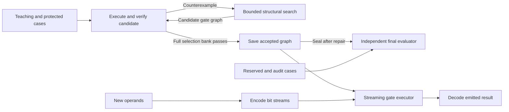

# Architecture

Author: [Arnav123-s](https://github.com/Arnav123-s)

The [addition theorem](ADDITION_CORRECTNESS.md) states the current circuit's certificate and executor assumptions. The [physical-pathway research](PHYSICAL_PATHWAY_RESEARCH.md) describes two tracks: engineer mechanisms and measure them, or teach a bounded learner to select, compose and improve mechanisms. The [latest audit](../experiments/2026-09-07-mechanism-audit.md) implements limited composition and classical repair comparisons; broader physical dynamics remain proposals. The [project assessment](PROJECT_ASSESSMENT.md) summarizes the evidence.

Kavi's learned object is an executable operation represented by circuit structure. The current implementation acquires a Boolean transition graph from examples and repairs its shared behavior through counterexamples. Signals and a one-bit working state are temporary. The accepted graph persists.

## Implemented components

The [recurrent-configuration study](../experiments/2026-09-07-recurrent-configuration.md) adds a finite-state learner alongside the existing cores. It acquires cycles by folding labeled input histories, then constructs one successor from old behavior and new evidence. A separate evaluator checks complete finite-state equivalence. The latest extension teaches another notation without an alias map and learns connections from controller outputs to acquired arithmetic through numerical feedback. The sentence system remains a separate interface.

The composition extension searches small acyclic graphs over acquired procedures. A node can reuse a previous intermediate; each node executes once. A candidate that passes separate promotion examples can enter a new immutable catalog with an exact dependency digest. This is supervised library growth. It does not replace the entire library or learn the update algorithm. A separate repair search changes finite-state transitions under exact earlier-task constraints, comparing greedy, heated and error-path-priority proposals.

The [input-driven extension](INPUT_DRIVEN_PATHWAYS.md) adds two isolated mechanisms: a learned discrete component selector for program acquisition, and an incremental shared graph compiled from acquired sentence frames. The latter resolves complete constructions as tokens arrive and can execute the resulting arithmetic interpretation. It has no physics-unit checker or general semantic activation dynamics. The earlier context-indexed route-memory prototype is retained for inspection and tests; its curriculum was not run after the design was clarified.

The [foundation extension](../experiments/2026-09-07-foundation-curriculum.md) adds exact rational execution over acquired integer dependencies, controlled search restrictions and a consolidated checkpoint. Fraction signs, normalization and division semantics are engineered; the learner acquires call compositions above them. The optional language v2 resolution policy prefers the most specific matching frame by literal-token count and preserves ties as ambiguity. Neither change implements autonomous semantic invention or the proposed physical dynamics.

| Component | Implementation | Responsibility |
| --- | --- | --- |
| Configuration composition and bridge | `kavi/configuration_composition.py` | Candidate graphs, shared intermediates, feedback-selected arithmetic and supervised catalog admission |
| Structural repair comparison | `kavi/configuration_repair.py` | Finite edge proposals, old-task preservation, error scoring, asymmetric temperature acceptance and work counts |
| Mechanism audit | `scripts/run_mechanism_audit.py` | Reviewed live stages, independent promotion/final data, causal controls and capability probes |
| Composed-model queries | `kavi/configuration_cli.py` | Read-only execution of the published bridge and catalog |
| Recurrent configuration learner | `kavi/recurrent_configuration.py` | Labeled-sequence evidence, compatible state folding, learned transitions and frozen inference |
| Finite-state auditor | `kavi/finite_state_audit.py` | Reachable state-pair comparison, completeness obligations and shortest distinguishing inputs |
| Recurrent teaching and display | `scripts/run_recurrent_configuration.py`, `scripts/recurrent_window.py` | Separate teaching/development/final banks, old-behavior obligations, controls and readable live graphs |
| Saved recurrent queries | `kavi/recurrent_cli.py` | Execute an exported configuration without teaching data |
| Gate graph and executor | `kavi/circuit_core.py` | Strict graph schema, bit operations, state transitions and actual traces |
| Structural learner | `kavi/circuit_search.py` | Function catalog, candidate graphs, sharing, ranking and counterexample filtering |
| Teacher and final evaluator | `kavi/circuit_runtime.py` | Separate data partitions, protected behavior, sealed final tests and local invariant checks |
| Run controller | `kavi/circuit_runtime.py` | Finite budgets, pause/stop, checkpoints, events and resource records |
| Interactive interface | `kavi/circuit_cli.py` | Run, watch, inspect, query, console and controls |
| Procedure library | `kavi/procedure_core.py` | Typed acquired calls, bounded iteration, validation and serialization |
| Program learner | `kavi/procedure_search.py` | Search program arrangements and count all attempted work |
| Source-guided curriculum | `kavi/library_curriculum.py`, `kavi/library_runtime.py` | Formal exercises, library comparison, storage and sealed final tests |
| Live library interface | `kavi/library_cli.py`, `kavi/learning_window.py` | Actual worker transcript, controls and saved-procedure queries |
| Checked product compiler | `kavi/procedure_optimizations.py` | Local addition certificate, canonical operand connector and binary-loop transformation |
| Sentence-frame learner | `kavi/grounded_language.py` | Annotated span alignment, typed meanings, ambiguity and separate lexical memory |
| Connector and language trial | `kavi/connector_language_cli.py` | Reviewed source packet, finite live run and sealed model evaluation |
| Foundation curriculum | `kavi/foundation_curriculum.py` | Separate teaching/correction/final banks, explicit hints and retained-skill checks |
| Exact scalar library | `kavi/rational_paths.py` | Bounded signed fractions, acquired integer dependencies and learned call compositions |
| Consolidated inspection | `kavi/curriculum_cli.py` | Read-only public checkpoint queries |

During learning, the teacher supplies whole-input examples. Search proposes a gate graph; the verifier executes it and supplies a counterexample when it fails. Only a graph passing the selection bank is installed. During inference, the input is encoded as two bit streams, the same acquired graph executes at each position, and the emitted bits form the result. Teaching records and search catalogs are outside that execution path.

The executor reuses the graph at each bit position, carrying one temporary state bit between frames. Each new query starts with zero state. The final evaluator reads the sealed graph and never feeds its cases back to search.

## Learned and supplied structure

Gate choices, connections and output references are learned. AND, XOR and NOT semantics, binary encoding, one state register, zero initialization, a processing loop and final output framing are supplied. The graph changes between accepted learning stages; topology does not change during a single query. The first phase fixes the state transition to zero; the second phase enables its acquisition according to a declared curriculum.

The concrete mathematical model is a two-state Mealy transducer whose output and transition functions are learned circuits. The broader objective remains a dynamical system on computational graphs with feedback-dependent rewrites, including future acquisition of control structure and learning rules.

## Repair and preservation

A wrong result refutes the current procedure's claimed contract. Repair changes the shared transition rather than appending an answer for one operand pair. Every candidate must retain the protected domain. Final evaluation measures both new correct answers and losses among previously correct answers after the model is sealed.

The first trial acquired a five-gate addition circuit in each of three seeds. It passed exhaustive eight-bit evaluation and all declared longer-input cases with zero audit regressions. The [experiment record](../experiments/2026-09-05-circuit-learning.md) distinguishes selection exposure, independent tests, costs and the supplied architecture assumptions.

## Extension boundaries

The procedure extension acquires named programs that call earlier learned operations. Its supplied instruction forms are argument, zero/one constant, call, repeated application and fold over an integer range. Types, signatures, iteration semantics, task order and search policy are supplied. Callees, arguments and program arrangements are learned. The closest current mathematical description is bounded typed program induction over acquired finite-state transducers.

Two live trials measured reuse and cost. A 113-byte acquired scaling wrapper enabled more effective power and factorial programs, while the enlarged vocabulary made another task time out. The [study](../experiments/2026-09-05-procedure-library.md) records both effects. Earlier definitions remain immutable; this retention result concerns append-only growth. Combining compatible procedures from the two trials is a supplied packaging operation.

The [connector extension](CONNECTORS_AND_LANGUAGE_PROTOCOL.md) changes the multiplication definition through checked compilation, with measured retention on 516 previously successful cases. Its operation-specific connector canonicalizes interchangeable operands. Binary scanning and shifts are supplied control semantics; the acquired addition circuit still performs additions. Old artifacts remain unchanged.

The sentence extension learns typed frames from annotations and routes recognized calculations to the procedure library. A relation frame preserves claim/reason and speaker roles; it does not validate the claim. The source-reading component retains lexical counts and adjacency in separate persistent memory. The [trial](../experiments/2026-09-07-connectors-language.md) distinguishes these results from general prose comprehension.

The system does not discover arbitrary control semantics, invent general abstractions, interpret unrestricted prose, calibrate uncertainty or learn its own update rule. These require separate curricula and evidence. Shared-subexpression elimination is a compiler operation, not cross-task abstraction invention.

The earlier symbolic and recurrent implementations remain separate comparison systems. Physical dynamics and quantum-style flow are research hypotheses. Their terminology does not describe operations secretly performed by the discrete circuit.

The [runtime reference](CIRCUIT_RUNTIME.md) specifies every interface and the live CLI. The [engineering specification](KAVI_ENGINEERING_SPECIFICATION.md) connects the implementation to the larger research program.
