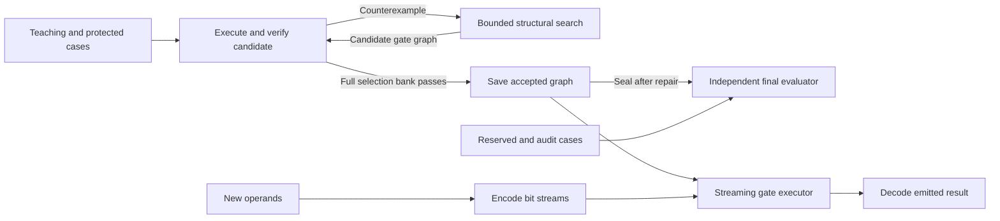

# Architecture

Author: [Arnav123-s](https://github.com/Arnav123-s)

Kavi's learned object is an executable operation represented by circuit structure. The current implementation acquires a Boolean transition graph from examples and repairs its shared behavior through counterexamples. Signals and a one-bit working state are temporary. The accepted graph persists.

## Implemented components

| Component | Implementation | Responsibility |
| --- | --- | --- |
| Gate graph and executor | `kavi/circuit_core.py` | Strict graph schema, bit operations, state transitions and actual traces |
| Structural learner | `kavi/circuit_search.py` | Function catalog, candidate graphs, sharing, ranking and counterexample filtering |
| Teacher and final evaluator | `kavi/circuit_runtime.py` | Separate data partitions, protected behavior, sealed final tests and local invariant checks |
| Run controller | `kavi/circuit_runtime.py` | Finite budgets, pause/stop, checkpoints, events and resource records |
| Interactive interface | `kavi/circuit_cli.py` | Run, watch, inspect, query, console and controls |
| Procedure library | `kavi/procedure_core.py` | Typed acquired calls, bounded iteration, validation and serialization |
| Program learner | `kavi/procedure_search.py` | Search program arrangements and count all attempted work |
| Source-guided curriculum | `kavi/library_curriculum.py`, `kavi/library_runtime.py` | Formal exercises, library comparison, storage and sealed final tests |
| Live library interface | `kavi/library_cli.py`, `kavi/learning_window.py` | Actual worker transcript, controls and saved-procedure queries |

During learning, the teacher supplies whole-input examples. Search proposes a gate graph; the verifier executes it and supplies a counterexample when it fails. Only a graph passing the selection bank is installed. During inference, the input is encoded as two bit streams, the same acquired graph executes at each position, and the emitted bits form the result. Teaching records and search catalogs are outside that execution path.

The executor reuses the graph at each bit position, carrying one temporary state bit between frames. Each new query starts with zero state. The final evaluator reads the sealed graph and never feeds its cases back to search.

## Learned and supplied structure

Gate choices, connections and output references are learned. AND, XOR and NOT semantics, binary encoding, one state register, zero initialization, a processing loop and final output framing are supplied. The graph changes between accepted learning stages; topology does not change during a single query. The first phase fixes the state transition to zero; the second phase enables its acquisition according to a declared curriculum.

The concrete mathematical model is a two-state Mealy transducer whose output and transition functions are learned circuits. The broader objective remains a dynamical system on computational graphs with feedback-dependent rewrites, including future acquisition of control structure and learning rules.

## Repair and preservation

A wrong result refutes the current procedure's claimed contract. Repair changes the shared transition rather than appending an answer for one operand pair. Every candidate must retain the protected domain. Final evaluation measures both new correct answers and losses among previously correct answers after the model is sealed.

The first trial acquired a five-gate addition circuit in each of three seeds. It passed exhaustive eight-bit evaluation and all declared longer-input cases with zero audit regressions. The [experiment record](../experiments/2026-09-05-circuit-learning.md) distinguishes selection exposure, independent tests, costs and the supplied architecture assumptions.

## Extension boundaries

The procedure extension acquires named programs that call earlier learned operations. Its supplied instruction forms are argument, zero/one constant, call, repeated application and fold over an integer range. Types, signatures, iteration semantics, task order and search policy are supplied. Callees, arguments and program arrangements are learned. The closest current mathematical description is bounded typed program induction over acquired finite-state transducers.

Two live trials measured reuse and cost. A 113-byte acquired scaling wrapper enabled more effective power and factorial programs, while the enlarged vocabulary made another task time out. The [study](../experiments/2026-09-05-procedure-library.md) records both effects. Earlier definitions remain immutable; this retention result concerns append-only growth. Combining compatible procedures from the two trials is a supplied packaging operation.

The system does not discover arbitrary control semantics, invent general abstractions, interpret prose, calibrate uncertainty or learn its own update rule. These require separate curricula and evidence. Shared-subexpression elimination is a compiler operation, not cross-task abstraction invention.

The earlier symbolic and recurrent implementations remain separate comparison systems. Physical dynamics and quantum-style flow are research hypotheses. Their terminology does not describe operations secretly performed by the discrete circuit.

The [runtime reference](CIRCUIT_RUNTIME.md) specifies every interface and the live CLI. The [engineering specification](KAVI_ENGINEERING_SPECIFICATION.md) connects the implementation to the larger research program.
