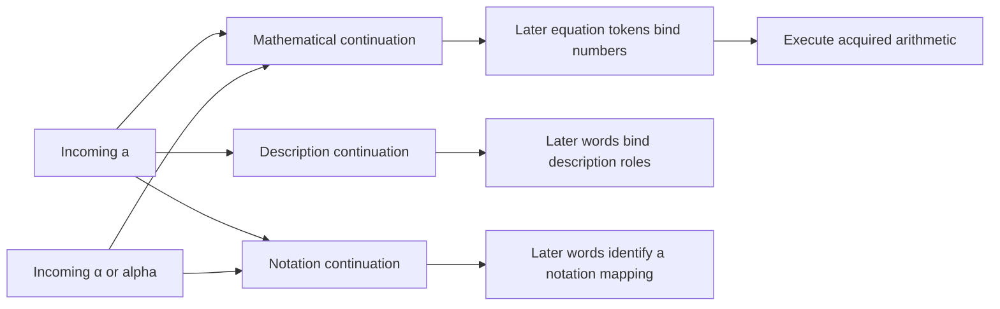

# Input-driven shared pathways

Author: [Arnav123-s](https://github.com/Arnav123-s)

## Intended architecture

The [geometry and neural-activation note](NEURAL_GEOMETRY_AND_ACTIVATION.md) extends “configuration” to functional geometry, local excitability, timing and temporary activity. The owner's brain analogy concerns the organized dynamics of the system, not merely surface folds. Geometry can constrain a discrete graph's execution; the relevant biological literature does not establish a complete learning algorithm for Kavi.

The intended configuration is **recurrent and learned**, not restricted to the acyclic sentence compiler in the current prototype. Later information may activate a backward connection, revisit an earlier binding and redirect subsequent flow. The owner does not prescribe an `a -> alpha` repair path: Kavi is meant to acquire whatever admissible arrangement produces the required behavior and transfers. The following implemented grammar is a limited prerequisite experiment, not a claim that this architectural objective is complete.

Input enters a shared configuration. Later input constrains how earlier input participates in that configuration. The system should not require a separate subject label before deciding whether a token is mathematical, grammatical or a notation choice. A character such as `a` may initially participate in several possible interpretations. An equation, phrase, unit or explicit definition can subsequently connect it to an appropriate role.

The owner describes input as power, with signals lighting parts of the configuration until an output becomes available. The computational interpretation is bounded, input-driven activation. Temporary signals propagate through persistent learned structure. The persistent structure is the learned state; it does not disappear merely because it contains no dense numerical weights. Temporary bindings are necessary to connect information arriving at different times. A separate workspace for explicit semantic plans is not required, although the software executor must represent its active signals in memory.

The [incremental experiment](../experiments/2026-09-07-incremental-paths.md) implements a small instance: acquired sentence frames become a shared state graph, and tokens advance compatible states without a subject-context input. Its compiler and transition rules are engineered. Learned frames determine which constructions the graph can recognize. This is not yet a physics reasoner, a self-designed execution substrate or general language understanding.

## Discrete mathematical foundation

The owner's latest formulation places discrete mathematics at the foundation. The closest structural description is a **learned recurrent dataflow graph with graph-rewrite updates**. This is a proposed classification, not the name of a newly established model family or a claim of novelty.

Represent the persistent configuration by a directed graph or hypergraph `K = (V, E, T, F)`: V contains components, E contains connections, T declares admissible port/value types, and F gives local transition rules. A hyperedge can require compatible information from several places before it activates. Internal node identifiers need not be human concept names. Cycles are permitted; token order does not impose a permanent forward-only order on internal computation.

Temporary state assigns information to ports and records enabled transitions. A discrete event changes a finite part of this state. For local rule r with guard g_r and update u_r:

$$g_r(s)=\mathrm{true}\quad\Longrightarrow\quad s\longrightarrow_r u_r(s).$$

The scheduler determines which enabled event runs next; event scheduling is a supplied mechanism unless separately learned. Several local events may implement one interpretation. A backward edge can change an earlier binding, which can enable another route. An output is observable only when the relevant acceptance conditions hold. A revisited node is not necessarily the same state: its temporary information may have changed.

Learning changes the persistent graph through an admissible rewrite `K -> K'`. A local rewrite replaces a matched subgraph while respecting its interface and the experiment's retained-behavior conditions. The desired invention is the learned choice of useful components, edges and rewrites; the execution substrate and evaluation evidence still have to be defined. Graph rewriting provides a language for describing changes, not an automatic solution to learning which changes are useful. [Dixon and Kissinger's open-graph framework](https://arxiv.org/abs/1011.4114) is relevant primary theory for compositional, interface-respecting graph rewriting; it is a mathematical reference, not an adopted implementation.

For a fixed graph, one possible disciplined propagation regime uses a finite-height information order and monotone transfer functions, iterated from its least-information state to a fixed point. Under the appropriate initialization and fair worklist updates, this supplies a termination argument for that regime. [LLVM's dataflow introduction](https://clang.llvm.org/docs/DataFlowAnalysisIntro.html) describes the finite-height/monotonicity condition. It does not establish that the fixed point is the correct interpretation. Retracting a mistaken commitment, arbitrary nonmonotone activation or rewriting the graph during propagation needs additional reasoning; it cannot inherit that termination claim automatically.

Chemistry, oscillations and quantum mathematics can supply optional transition laws or component representations inside this discrete framework. They are not needed to define connectivity, feedback, shared structure or graph learning. Introducing continuous or complex state would be an explicit extension with its own costs and guarantees.

## Symbol, role and shared continuation

Written form and computational role are distinct. `a`, `α` and `alpha` can share a mathematical continuation when teaching establishes compatible constructions. They should not be replaced globally: an article `a`, an acceleration variable and a Greek-letter name need not mean the same thing. Original forms remain available in the input trace while compatible uses share downstream structure.

This is a conceptual view of the measured constructions, not the full graph's exact topology. At a short prefix, several paths can remain active. The next token need not resolve every ambiguity. In the prototype, a text slot can absorb further words, so some alternatives remain pending until the end marker. A unique completed meaning is required for execution.

## Extra evidence and output gates

The broader proposal extends syntactic compatibility to semantic constraints. Let P_t be the currently possible interpretations and e_t new input evidence. A conceptual update is:

$$P_{t+1}=\{p\in P_t:\operatorname{compatible}(p,e_t)\}.$$

Several branches can share one representation while different evidence restricts them. This is constraint propagation when consequences eliminate incompatible interpretations. It becomes brute-force enumeration if the implementation separately evaluates many complete alternatives. Shared storage does not establish shared computation; both must be measured.

For a physical calculation, a candidate's output gate could require compatible dimensions, a defined divisor, the necessary quantities and a matching equation domain:

$$\operatorname{emit}(p)=\operatorname{complete}(p)\land\operatorname{typecheck}(p)
\land\operatorname{domaincheck}(p)\land\operatorname{evidencecheck}(p).$$

These predicates need executable definitions. For example, a supplied acceleration role with dimensions length/time squared must not silently satisfy a thermal-expansion coefficient role with inverse-temperature dimensions. Such a check can reject a wrong binding before numerical execution. The current incremental prototype checks sentence construction and natural-number slots; it does **not** implement these physical dimensions, domain rules or equation-based role inference.

Strong activation, a common association or repeated wording is not itself a validity certificate. Repetition may be correlated evidence. If frequency means occurrence count, it is a statistic that must be counted as state. If it means oscillation frequency, a phase/frequency representation and update equations must be defined. Neither interpretation is implemented by calling a match count “energy.”

## How the earlier ideas connect

| Owner's direction | Computational question | Current evidence boundary |
| --- | --- | --- |
| Wires instead of answer storage | Can persistent executable structure generalize across values? | Acquired arithmetic and bounded compositions are measured |
| Connectors make swapped inputs share paths | Can equivalent bindings share execution? | Compiled multiplication canonicalizes operands; supplied optimization |
| Inputs shape which paths activate | Can later input resolve an earlier token's role? | Small incremental sentence graph, without external subject labels |
| More learning produces better configurations | Can past successful programs improve later search? | Learned component selector improved this narrow polynomial trial |
| Do not search alternatives while a useful path remains | Does premature widening waste work? | Two failed acquisitions repaired by retaining the learned focus within the same total budget |
| Learning continues while being tested | Can feedback improve later predictions without rewriting history? | Unsupported sentence recorded, new construction taught, fresh sentence and retention checked |
| Heat and cooling | Can adaptive exploration help at matched budgets? | Proposed; no thermal controller in these trials |
| Catalysts and a systematic component table | Can compatible context enable useful transformations? | Learned selection is a limited analogue; chemical dynamics and general component taxonomy remain proposed |
| Quantum and equation mechanisms | Can the mathematics supply useful representations or transformations? | Research documented; no quantum evolution or physics solver added here |
| Internal roles need not have human names | Can useful internal representations arise without semantic labels? | Current sentence roles are annotated; that stronger claim remains untested |
| Shorter configurations preserve earlier knowledge | Can learned restructuring reduce work without regressions? | Shared grammar continuations are compiled; general learned restructuring remains unimplemented |

The [physical-pathway research](PHYSICAL_PATHWAY_RESEARCH.md), [equations-as-components note](EQUATIONS_AS_PATHWAY_COMPONENTS.md), [structural sharing and spectroscopy study](STRUCTURAL_SHARING_AND_QUANTUM_RESEARCH.md) and [expanding pathway design](OPEN_ENDED_PATHWAY_LEARNING.md) retain the wider mechanisms. The earlier review's specific implementation recommendations remain deferred. This experiment does not redefine Kavi as a collection of remembered answer records or require chemical terminology to describe every pathway.

## Next semantic test

### Learned feedback is a separate requirement

Keeping several forward interpretations open is not the same as learning a feedback connection. In the prototype, the persistent graph is acyclic. Temporary text-slot accumulation can continue over multiple tokens, but that supplied loop does not constitute a learned backward semantic link. The symbol-correction result adds an annotated construction through the supplied compiler; it does not demonstrate Kavi inventing its own recurrent wiring.

For the broader system, let K be persistent configuration, s temporary activation/bindings, and x incoming information. An internal transition may run even after the last token arrives:

$$s_{j+1}=F_K(s_j,x),\qquad y=R_K(s_j)\text{ only when its output conditions hold}.$$

Here j counts actual internal work, not merely input positions. K may contain cycles and connections to earlier binding locations. An output-side inconsistency may therefore influence an earlier assignment without restarting all interpretation. Input remains the information driving the computation; internal transitions require a finite work allowance. Neither cycling nor stronger activation guarantees a correct fixed point.

A bounded next learning experiment must permit alternative edges and internal state roles rather than supply the desired feedback path. The teacher supplies observations and corrections; the learner chooses a configuration within a declared substrate. Compare a forward-only learner, a supplied feedback controller and a learner allowed to acquire recurrent connections. Hold out input sequences where disambiguating information arrives at different positions, changes an earlier interpretation, or should leave it unchanged. Record actual backward transitions, revised bindings, work, size, earlier-skill retention and failures to settle. A supplied `rewind-to-a` routine would be an engineered control and must not be reported as discovery of a recurrent configuration.

The structural update can be expressed as a constrained search over candidate K':

$$K'\in\arg\min_{G\in\mathcal G_B}\left[L_D(G)+\lambda\,\operatorname{work}_D(G)+\mu\,\operatorname{size}(G)\right],$$

subject to execution bounds and the specified retained-behavior checks. D is development evidence; independent final sequences do not enter this objective. The grammar of admissible graphs, loss, encoding and budgets must be declared. This formula is a research contract, not an implemented recurrent learner. Corrections may replace a wrong rule rather than preserve its wrong answers; retention protects valid behavior.

### Semantic evidence

A useful next test would present an ambiguous symbol followed by quantities, units and an equation relation, then measure whether additional input resolves its role and blocks incompatible execution. It needs explicit dimensional types and independently checked equation contracts before teaching. Compare shared propagation with an equally informed ordinary constraint solver, count active branches and work, and withhold combinations of notation and physical context. Success would establish bounded semantic binding under supplied physics contracts, not acquisition of physical laws from raw prose.

The [three-track program](GRADUATE_CAPABILITY_PROGRAM.md) remains the broader objective. These steps develop prerequisites; they do not constitute a master's-level result.
