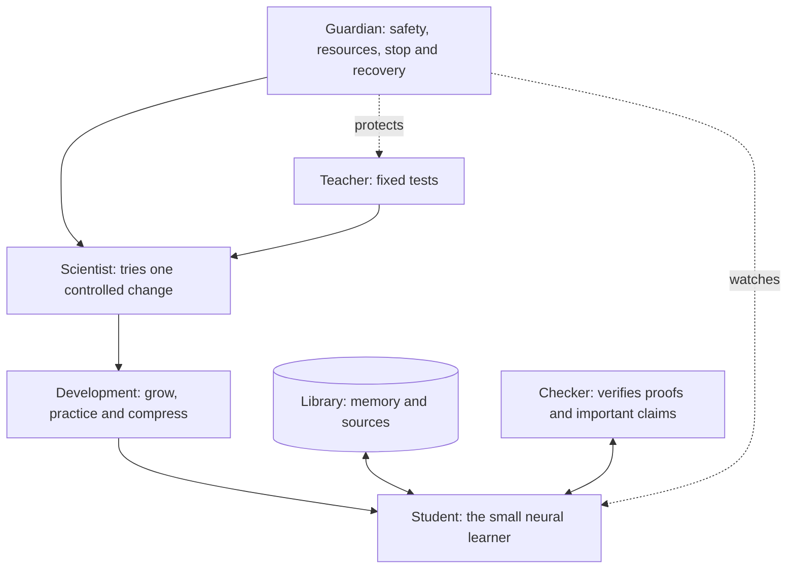
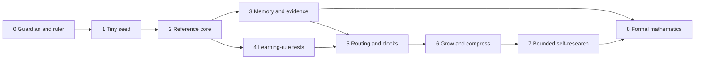

# Kritjnah: Revised Build Plan Explained Simply

Author: Arnav123-s

Status: proposed plan; the learner is not yet implemented or trained

This is the child-friendly companion to `KRITJNAH_COMPLETE_DESIGN.md`. It changes the build order so that we first create a small measurable learner, then add one new idea at a time. That lets us discover which ideas really help and which only sound interesting.

## The whole idea

Imagine that we are building a small student named Kritjnah.

The student lives inside one laptop. It has a small desk, a notebook, a library, a teacher, and a guardian. Because the desk is small, it cannot open every book or ask every helper to work at once. It must choose carefully.

We do not simply tell the student, "Become the smartest thing ever." That is a wish, not a learning method. We build parts that help the student:

- notice mistakes;
- remember where information came from;
- protect lessons that have been checked many times;
- change a belief when strong new evidence appears;
- use extra thinking only when it is worth the cost;
- try one controlled improvement at a time;
- recover after an ordinary failure;
- prove important answers with an outside checker.

## The six parts

### 1. The student

The student is the small neural model. It reads one piece at a time, remembers a compact state, and predicts what should come next. It works mostly in a line—step after step—because this laptop cannot run many large brains side by side.

The graphics processor still does the small matrix calculations it handles well. "Serial-first" does not mean doing every multiplication slowly on one processor. It means waking only the useful model modules instead of running all specialists at once.

### 2. The library

The laptop cannot place every book on the student's desk. The library stores experiences on disk and gives the student only a few relevant pages.

Every memory keeps a label showing:

- where it came from;
- when it was stored;
- whether it is an original source, explanation, replication, criticism, or derived note;
- which other source it copied or depended on;
- whether an independent check passed;
- which model version created the note.

This prevents ten copies of one rumor from looking like ten independent witnesses.

### 3. The class helpers

Some model modules become small specialists. A mathematics helper should not wake up for every history sentence. Usually the core and only one specialist run.

A relevance map spreads a little attention from the current idea to nearby ideas. It is inspired by reaction-diffusion in chemistry, but it is only graph arithmetic. We will compare it with a simpler learned router and keep it only if it is better.

### 4. The teacher

The teacher owns the tests. The student cannot change the teacher's answer key. The same tests are used before and after a proposed improvement.

The teacher checks several things separately:

- learning something new;
- remembering older things;
- using knowledge in a different problem;
- knowing when the answer is uncertain;
- producing formally valid mathematics;
- speed, memory, heat, and failures.

One big score is not enough. A change that becomes faster by forgetting mathematics is not simply called better.

### 5. The scientist

The scientist changes one small part of the recipe and predicts what should improve. It uses the same test and time allowance. It keeps a change only when repeated measurements support it.

It remembers several kinds of good recipe: perhaps the fastest, the smallest, the best at remembering, and the most accurate. This is a quality-diversity archive.

### 6. The guardian

The guardian watches temperature, memory, running processes, checkpoints, source rules, and the stop button. The student and scientist cannot modify the guardian or teacher.

The guardian can pause, save, recover, lower the workload, or stop everything. The reported shutdown temperature is treated as an emergency boundary, not a temperature to aim for.

## What the universe-inspired words mean

### Knowledge has weight

Suppose Kritjnah solves two plus three correctly in many different exercises. We attach a number saying that this lesson is well supported. The parameters holding that lesson then change more slowly.

It is like writing a checked fact in darker pencil. It can still be erased when strong contrary evidence appears, but one strange page cannot wipe it away. This is parameter importance and evidence support—not real physical mass.

### Evidence supplies energy

Imagine pushing a heavy toy box. A tiny push barely moves it; a strong push moves it farther. In the model, weak or copied evidence makes a small belief change, while strong independent evidence can make a larger change.

This is a Bayesian evidence update and an adjusted learning rate. The information is not physical fuel.

### Gravity binds related ideas

Gravity pulls matter together, but we will not invent fake inverse-square forces between model weights. We borrow only a useful pattern: many related pieces can form a stable center.

For Kritjnah, repeated related errors may form a cluster. The model can build a small helper around that cluster and later combine repeated structure into a simpler representation.

### There are two kinds of heat

- Idea heat means how willing the student is to explore unusual possibilities.
- Laptop heat means the real temperature of the computer.

They are separate. Making the computer physically hotter does not make the learner more creative.

### Different parts have different clocks

Some lessons need practice every day. Stable lessons need only an occasional review. Each module therefore has a counter controlling how often and how quickly it changes.

There is still one master diary listing what happened first, second, and third. These counters are not literal relativity.

### Chemistry supplies gates and proofreading

Some chemical reactions start only after receiving enough of a push. Kritjnah treats an expensive operation similarly: another reasoning step, retrieval, or tool call happens only when its expected benefit is worth its cost.

A remembered method behaves like a catalyst. It makes the path cheaper but cannot make a wrong answer true.

Important claims pass two gates. A cheap test rejects obvious mistakes, then a different checker performs a stronger test. Running the same check twice does not count as two independent checks.

### Growth and compression are like organizing toys

When Kritjnah keeps making one kind of mistake, it may receive a small new helper. The helper practices that problem. Later we look for repeated parts that can be combined.

The old version stays safe while the new smaller version is tested. We keep the compressed version only if every protected ability remains. This is like reorganizing a toy box while keeping the old box nearby until every important toy is found.

### Evolution is a one-kitchen recipe contest

This laptop cannot test hundreds of large models at once. It runs one child experiment at a time:

1. choose a promising old recipe;
2. change one ingredient;
3. say what the change should improve;
4. test it for the same amount of time;
5. measure the result;
6. keep, archive, or discard it;
7. restore the old recipe after a crash;
8. try a meaningfully different idea next.

The recipe cannot edit the judges or safety rules.

## How Kritjnah learns

The first version uses ordinary backpropagation. Backpropagation is a strong teacher that tells early parts of the model how they contributed to a final error. Removing it before measuring alternatives would leave us without a trustworthy reference.

Later experiments add four ideas separately:

1. Local prediction: each layer tries to predict a nearby state and receives a nearby error.
2. Eligibility traces: a temporary mark remembers which parameters recently helped cause an outcome.
3. Homeostasis: activity that becomes too high is gently turned down, while activity that becomes too low can recover.
4. Structural inertia: repeatedly verified knowledge changes more slowly, unless a strong contradiction temporarily releases it.

Only after testing each part do we combine them. A beautiful biological story is not enough reason to keep an algorithm.

## The revised build plan

### Phase 0: build the guardian and ruler

Before training a learner, build:

- device and resource measurements;
- run manifests;
- an append-only event diary;
- checksummed checkpoints;
- pause, resume, stop, and recovery;
- fixed small tests;
- a source and license ledger;
- a small independent proof checker.

We deliberately interrupt writes, corrupt copies, terminate children, hide a sensor, and exhaust an artificial memory limit.

Pass rule: every failure returns to the last good checkpoint, preserves the diary, and stops all children when asked.

### Phase 1: build a tiny seed

Build an 8-15 million parameter learner. It is small so mistakes in the training system are cheap to find.

Teach bytes, symbols, copying, order, basic arithmetic, short language tasks, tiny programs, and small formally checked propositions. Use ordinary end-to-end gradients only.

Pass rule: repeated runs behave consistently, learning improves held-out tests, and all costs are measured.

### Phase 2: choose the reference core

Test static models in the proposed 30-60 million parameter range. Compare width, physical layers, recurrent thinking steps, context, and small attention windows under equal time and data budgets.

Pass rule: choose a model that is not beaten on every important measure by another tested model. Save it as the reference parent and never quietly change its results.

### Phase 3: add memory and evidence

Add disk memory, retrieval, source dependence, competing hypotheses, independent checks, and careful consolidation one piece at a time.

Test with copied false stories, conflicting sources, rare facts, misleadingly similar passages, and outdated summaries.

Pass rule: memory improves useful work without treating copied sources as independent truth.

### Phase 4: test new learning pieces

Create separate experiments for local prediction, eligibility, homeostasis, structural inertia, and their combinations. Compare each with ordinary learning using equal examples, wall time, and memory.

Pass rule: keep only parts that repeatedly improve a protected measurement without causing an unacceptable loss elsewhere.

### Phase 5: test routing and clocks

Compare a simple learned router, the chemistry-inspired relevance map, and a fair control. Compare a fixed number of thinking steps with bounded adaptive steps.

Pass rule: the unusual router or clock stays only if it beats the simpler one at the same resource cost.

### Phase 6: test growth and compression

Find a stable cluster of mistakes, add a zero-output helper, train it, and compare with both the unchanged parent and a normal model of the same final size. Then try to compress.

Pass rule: the grown-and-compressed child must move to a better accuracy, retention, speed, and memory tradeoff. Returning to the same quality with more machinery is failure.

### Phase 7: unlock bounded code research

This remains locked until Phases 0-6 work. The teacher, guardian, source rules, resource limits, and old verified parent remain outside the editable playground.

Only one child runs at a time. It proposes one change, predicts the effect, passes file checks, runs a smoke test, receives a fixed experiment budget, and is then kept or rejected.

Pass rule: this search must find repeatable improvements more efficiently than random search without moving the answer key, hiding costs, losing checkpoints, or leaving processes behind.

### Phase 8: use mathematics as the honesty test

Start with known theorems the learner has not seen. Move from arithmetic and logic to algebra, number theory, counterexamples, and reusable lemmas. Every successful proof becomes a formal object checked by an outside kernel.

Only after this works should a famous unsolved hypothesis guide long-term exploration. Such a hypothesis cannot be the only lesson or the model's own final exam.

Pass rule: the adaptive system produces more independently checked proofs or useful lemmas per compute-hour than the static reference.

## A tiny example

Suppose Kritjnah is learning that `2 + 3 = 5`.

1. It reads the symbols.
2. It predicts an answer.
3. The teacher shows the correct answer.
4. Backpropagation and any tested local rule adjust the learner.
5. The event diary records the lesson and its source.
6. Later exercises check that it learned the rule rather than memorized one sentence.
7. Repeated independent success makes the useful parameters more stable.
8. If a new lesson contradicts this result, the model asks whether the lesson uses a different number system or is simply wrong.
9. A formal checker can verify the exact arithmetic statement.

The same loop can later work on harder ideas. Harder does not mean less careful.

## Can it keep trying forever?

The supervisor may keep placing new bounded experiments in the queue while it is enabled and the device is safe. After a failed idea, it can select a different idea instead of abandoning the project.

It must still stop when asked, when the device is unsafe, when the allowed budget ends, or when a failure is repeating without new information. An agent that cannot stop is broken; an agent that saves its work and can resume is persistent.

## Can it modify itself?

The early learner changes its weights, memory, routing state, and curriculum. That is already a form of adaptation.

Code modification comes much later. It is allowed only inside a small fenced area, with one child, a fixed test, a verified parent, and rollback. It cannot change the teacher, guardian, proof checker, audit history, source policy, or stop control.

## What a proof means

For a mathematics claim, Kritjnah must store:

- the exact statement;
- every definition and assumption;
- the earlier lemmas it used;
- a formal proof object;
- the outside checker's result.

A long explanation, high confidence, many numerical examples, or Kritjnah agreeing with itself is not a proof.

## What exists today

The research, equations, architecture, comparisons, and revised build order exist as documents. Kritjnah itself has not yet been implemented, trained, or shown to improve.

The next honest engineering step is Phase 0: build the guardian, fixed measuring ruler, provenance ledger, and recovery tests. After that comes the tiny seed—not an endless run and not the full experimental architecture all at once.
