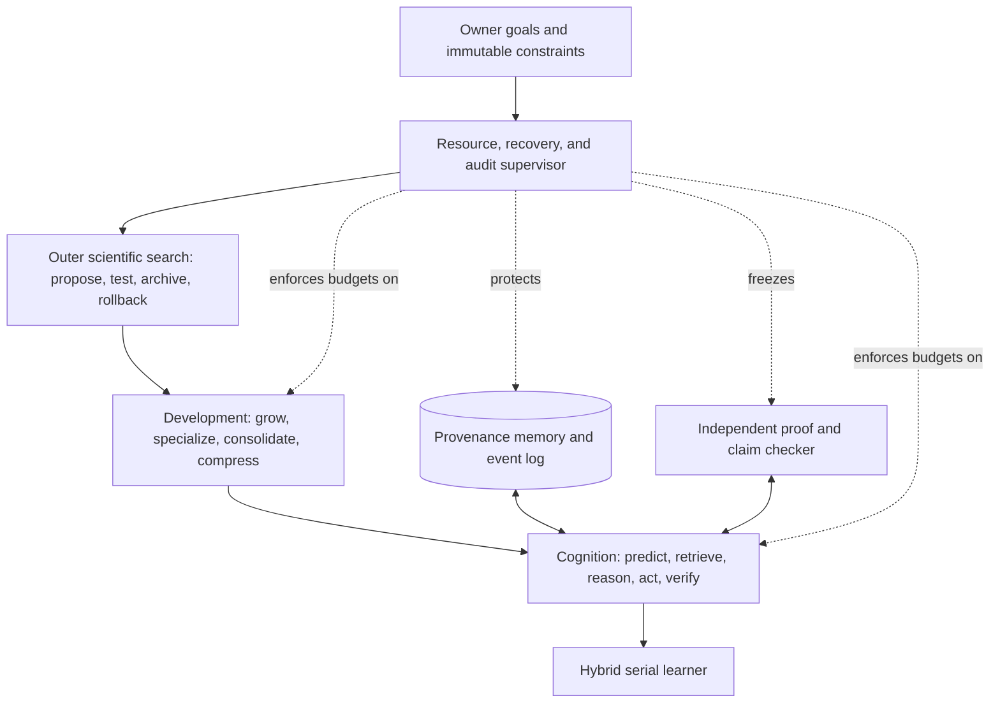

# Kritjnah: Complete Research-Derived Model Design

Author: Arnav123-s  
Status: research specification; not yet implemented, trained, or validated  
Target: one consumer laptop with 32 GB system memory, an 8-core/16-thread CPU, and a 4 GB graphics-memory ceiling

## 1. The answer in plain language

Kritjnah should not literally simulate a galaxy, a cell, or a brain. That would waste the device and would not automatically create intelligence. The useful idea is to extract the parts of those systems that can be stated as mathematics, implemented as algorithms, and disproved by experiments.

The proposed system has six nested loops:

1. A compact serial recurrent learner predicts the next observation and revises an internal state.
2. A sparse relevance field decides which small set of modules should work on the current observation.
3. A fast/slow memory system stores experiences, consolidates repeated structure, and retains source provenance.
4. A developmental loop temporarily grows capacity where residual errors cluster, then compresses only after retention tests pass.
5. A population loop proposes alternative code or training changes and retains a diverse Pareto archive rather than a single fragile winner.
6. An immutable supervisor enforces resource limits, evaluator integrity, rollback, and a user stop control.

The central learning rule is deliberately hybrid. It combines end-to-end gradients, local predictive errors, eligibility traces, homeostatic scaling, and evidence-dependent resistance to overwriting. Backpropagation remains available because removing the strongest known credit-assignment baseline before evidence exists would make the experiment weaker, not more original. Every unusual mechanism is an ablation: it must outperform a simpler baseline on learning, retention, calibration, or resource use to survive.

This is a plausible research program for the device. It is not a claim of frontier intelligence, consciousness, life, or a guaranteed path to solving an open mathematical problem.

## 2. Non-negotiable boundaries

The learner may adapt model parameters, routing state, memory, curriculum, and—only in a later explicitly unlocked phase—candidate code inside a sandbox. It may not modify these boundaries:

- the evaluator and held-out tests;
- source and license policy;
- the resource supervisor or stop control;
- the audit log and provenance ledger;
- the rule that a failed experiment must be reversible;
- the requirement that mathematical claims be checked independently;
- the device ceiling and thermal safety margin;
- the ban on using money, an identity, or external authority without explicit approval.

An endless scientific process means that a supervisor can schedule the next bounded experiment. It does not mean an unkillable process, an infinite retry of one broken idea, or permission to escape its environment.

## 3. Translation dictionary: metaphor to testable mechanism

| User idea | Operational meaning | Mathematical/computing form | What it must not mean |
|---|---|---|---|
| Knowledge has mass | Well-supported structure should resist accidental overwriting | Fisher/evidence-weighted parameter inertia; support-weighted memory | Knowledge creates literal gravity |
| Evidence is energy | New evidence pays the cost of changing a belief | Bayesian log-odds update; expected information gain | Information is physical energy in ordinary software |
| Thought has heat | Uncertainty and exploration can be controlled | entropy, sampling temperature, change rate | laptop temperature equals intelligence |
| Gravity pulls ideas together | Related fragments should bind into a shorter coherent explanation | graph attraction, clustering, minimum description length | inverse-square forces between weights |
| Each weight experiences time differently | Different parameters and memories should update on different timescales | local clocks, eligibility traces, exponential moving averages | relativistic proper time inside a tensor |
| Growth followed by pruning | Add capacity for unresolved structure, then compress verified redundancy | split/grow, distill/merge, sparsify, retention gates | repeatedly destroying learned weights |
| A coil or orbit | Learning should revisit old material at increasing scope | spiral curriculum and spaced replay | fixed periodic repetition regardless of need |
| Evolution | Generate variants, evaluate, retain diversity, reproduce from useful parents | quality-diversity archive, mutation, Pareto selection | unconstrained self-rewriting |
| Life-like persistence | Recover state and continue through bounded attempts | checkpoints, durable queue, backoff, rollback | inability to stop |
| Proving a theorem as a benchmark | Produce formal proof objects checked by a small trusted kernel | theorem prover interface and independent verifier | self-reported confidence counts as proof |

## 4. What physics contributes

### 4.1 Open systems and dissipative organization

Non-equilibrium structures persist only while matter or energy flows through an open system. Prigogine's work is useful here because it separates a maintained process from a static equilibrium. The engineering transfer is straightforward: learning exists only while there is an input stream and a resource budget, and the system must export waste in the form of discarded candidates, compressed traces, logs, and heat.

For one learning interval, account for all resources:

\[
B_t = C_t + M_t + I_t + W_t,
\]

where \(B_t\) is the supplied budget, \(C_t\) is useful compute, \(M_t\) is retained memory growth, \(I_t\) is I/O, and \(W_t\) is overhead or discarded work. This is accounting, not thermodynamics. Its purpose is to make hidden costs visible.

Design consequence: the learner never receives an abstract instruction to "try harder." It receives a bounded experiment budget and must show measured information or capability gained per unit of time, memory, and energy proxy.

Primary sources: Prigogine's Nobel lecture, <https://www.nobelprize.org/uploads/2018/06/prigogine-lecture.pdf>; Glansdorff and Prigogine's survey, <https://doi.org/10.1002/qua.560090854>.

### 4.2 Gravity, collapse, accretion, and binding

Gravity is attractive because mass-energy changes spacetime geometry. That fact does not give neural weights a useful inverse-square law. The transferable patterns are instead:

- local density can trigger a structural transition;
- a dense core can form before a larger system is assembled;
- accretion requires redistribution of angular momentum rather than simple radial falling;
- bound systems must balance competing terms rather than maximize attraction without limit.

Larson's collapse calculations showed non-homologous collapse: a small dense core forms first and later accretes surrounding material. The model analogue is to begin with a small stable core, create a new module only around a persistent cluster of residual error, and then consolidate that module. The virial idea becomes a bounded balance between fit and complexity:

\[
\mathcal V = L_{\text{task}} + \lambda_C C_{\text{model}} +
\lambda_R R_{\text{resource}} + \lambda_D D_{\text{drift}}.
\]

A change is accepted only when reduced task loss is worth its added complexity, resource cost, and regression risk. This resembles regularized empirical risk and minimum-description-length selection; it is not a gravitational equation.

Primary sources: Larson's protostar collapse model, <https://doi.org/10.1093/mnras/145.3.271>; Clausius on the virial theorem, <https://commons.princeton.edu/josephhenry/wp-content/uploads/sites/71/2021/01/1870-Virial-Thm-Classius-The-London-Edinburgh-and-Dublin-Philosophical-Magazine-and-Journal-of-Science.pdf>; Shakura and Sunyaev publication archive for accretion-disk work, <https://wwwmpa.mpa-garching.mpg.de/~sunyaev/publications6-en.html>.

### 4.3 Time, light, and multiple rates

Relativity joins measurements of space and time and makes elapsed proper time path-dependent. It does not imply that software parameters literally occupy different relativistic frames. The useful transfer is asynchronous change: a frequently contradicted belief should update rapidly; a repeatedly verified skill should update slowly; an event log preserves one auditable causal order.

Each module \(i\) therefore owns a local learning clock:

\[
\tau_i(t+1)=\tau_i(t)+a_i(t)\,\Delta t,
\]

where \(a_i(t)\in[0,1]\) is its activation. Its update interval is

\[
\Delta \tau_i = \frac{\Delta t}{1+\rho_i},
\]

where \(\rho_i\) is evidence-based structural inertia. Local clocks are scheduler counters, not new physical time.

### 4.4 Quantum mechanics: what transfers and what does not

A laptop running ordinary numerical code does not gain quantum computation by describing probabilities as superpositions. The useful lessons are classical:

- retain several hypotheses until evidence discriminates among them;
- track correlations so repeated copies of one source are not mistaken for independent evidence;
- require independently recoverable records before treating a result as objective;
- never clone an unknown state by assumption—store explicit snapshots and provenance instead.

The resulting implementation is a Bayesian mixture or particle population. No qubits, amplitudes, Planck constants, or quantum speedup are claimed.

### 4.5 Renormalization and scale

Coarse-graining removes microscopic detail while preserving declared macroscopic observables. The vital word is declared. Compression is never "make it smaller" in the abstract; it is:

\[
\min_{\theta'} \operatorname{bytes}(\theta')
\quad\text{subject to}\quad
\Delta Q_k(\theta',\theta) \le \epsilon_k
\quad \forall k\in\mathcal K,
\]

where \(\mathcal K\) contains retention, transfer, calibration, safety, and formal-correctness tests. This is most similar to distillation, quantization, pruning, the information bottleneck, and minimum description length. It differs from naive pruning because a compressed candidate is rejected if any protected observable regresses beyond tolerance.

## 5. What chemistry contributes

### 5.1 Free energy and reaction direction

Chemical potential and free-energy differences help determine equilibrium and reaction direction under specified conditions. For the model, "free energy" is only a shaped objective:

\[
F_t = L_{\text{prediction}} + \beta_U U_t + \beta_C C_t +
\beta_R R_t - \beta_N N_t,
\]

where \(U_t\) is uncertainty, \(C_t\) is complexity, \(R_t\) is regression risk, and \(N_t\) is measured novelty or information gain. The system chooses actions expected to reduce \(F_t\). The coefficients have software units and must be calibrated; this is not Gibbs free energy.

Original Gibbs source: <https://library.si.edu/digital-library/book/onequilibriumhe00gibb>.

### 5.2 Barriers, temperature, catalysts, and saturation

The Arrhenius law,

\[
k=Ae^{-E_a/(RT)},
\]

shows how reaction rate depends on an activation barrier and physical temperature. The transfer is a stochastic gate for expensive mental actions:

\[
p_i=\sigma\!\left(\frac{v_i-b_i}{T_c}\right),
\]

where \(v_i\) is expected value, \(b_i\) is compute cost or evidence barrier, and \(T_c\) is a dimensionless exploration setting. Retrieval of a proven reusable method lowers \(b_i\), acting like a catalyst. It changes the path cost, not the truth or final objective.

Tool and memory throughput saturate, so a Michaelis-Menten-shaped controller is a useful candidate:

\[
r(s)=\frac{r_{\max}s}{K+s}.
\]

This prevents the scheduler from treating twice as many queued items as twice as much useful throughput after a bottleneck is full.

Primary sources: Arrhenius's 1889 paper in translation, <https://webserver.lemoyne.edu/giunta/arrlaw.html>; translated Michaelis-Menten paper, <https://pubs.acs.org/doi/10.1021/bi201284u>.

### 5.3 Reaction-diffusion as sparse relevance propagation

Turing showed that diffusion coupled to local reactions can destabilize a uniform chemical state and generate spatial pattern. Kritjnah uses the equation only as a candidate router over a concept graph:

\[
\mathbf a_{t+1}=\Pi_{[0,1]}\!\left[
\mathbf a_t + \Delta t\left(
D L_{\text{diff}}\mathbf a_t + \mathbf u_t
-\lambda\mathbf a_t-\gamma\mathbf a_t\odot\mathbf a_t
\right)\right],
\]

where \(\mathbf a\) is module relevance, \(L_{\text{diff}}=A-\operatorname{diag}(A\mathbf1)\) spreads relevance to graph neighbors, \(\mathbf u_t\) is evidence input, and the last terms decay and saturate activity. Only the top \(k\) modules are executed. On this device the update is sparse and mostly serial; it does not instantiate a dense physical field.

Primary source: Turing, "The Chemical Basis of Morphogenesis," <https://groups.csail.mit.edu/mac/projects/amorphous/6.978/papers/turing-chemical-basis.pdf>.

### 5.4 Kinetic proofreading, checkpoints, and repair

Biochemistry often spends extra time and energy to reject a plausible but wrong match. Kinetic proofreading motivates a two-gate claim process:

1. a cheap model check rejects obvious failures;
2. an independent expensive check must pass before the claim enters durable memory.

If \(p_1\) and \(p_2\) are false-accept probabilities and their errors are sufficiently independent, the combined false accept is approximately \(p_1p_2\). Independence must be measured; duplicating the same check does not multiply confidence.

Cell-cycle checkpoints motivate ordered transitions: growth cannot enter compression before a checkpoint exists; compression cannot replace the parent before retention tests pass; code mutation cannot run before the sandbox and evaluator are frozen. DNA repair motivates immutable reference checksums, redundant snapshots, and mismatch detection—not a fantasy that corrupted state repairs itself.

Primary sources: Hopfield's kinetic proofreading paper, <https://doi.org/10.1073/pnas.71.10.4135>; direct experimental test, <https://pubmed.ncbi.nlm.nih.gov/1063397/>; Hartwell and Weinert on checkpoints, <https://pubmed.ncbi.nlm.nih.gov/2683079/>; Nobel scientific background on DNA repair, <https://www.nobelprize.org/uploads/2018/06/advanced-chemistryprize2015-1.pdf>.

## 6. What life and development contribute

### 6.1 Autocatalytic closure

An autocatalytic set is collectively self-supporting: its reactions are catalyzed from within the set and its required molecules can be generated from an allowed food set. The software transfer is a closure audit. A learner configuration is operationally closed only when, from its installed runtime and approved data, it can load a checkpoint, generate a candidate, run the evaluator, interpret the result, save or roll back, and produce the next bounded job.

Anything else is an external dependency and must appear in the bill of materials. Closure does not mean independence from electricity, hardware, people, or data.

Formal source: Hordijk, Hein, and Steel, <https://doi.org/10.3390/e12071733>.

### 6.2 Growth, specialization, and compression

Human cortex shows early growth of connections followed by later reduction, but biological pruning is region- and stage-dependent, not a universal percentage schedule. Kritjnah therefore does not copy a human age curve. It uses measured need:

- grow when a stable cluster of residual errors cannot be reduced by existing modules;
- specialize a new low-rank branch or expert on that cluster;
- consolidate repeated structure into the core;
- compress redundant branches only if protected capabilities survive.

The current size becomes the next stage's baseline—"zero" in the user's developmental scale—but its bytes remain counted. No storage becomes free merely because it is old.

Primary observation: Huttenlocher quantified a rise and later decline of synaptic density during human frontal-cortex development, <https://pubmed.ncbi.nlm.nih.gov/427544/>.

### 6.3 Local plasticity plus homeostasis

Hebbian correlation alone can produce runaway growth. Timing-dependent plasticity adds temporal direction; eligibility traces let a later outcome assign credit to recent local activity; homeostatic synaptic scaling restores a usable dynamic range.

For parameter group \(i\), define a local trace

\[
e_i(t)=\lambda_e e_i(t-1)+g_i^{\text{local}}(t),
\]

and a third-factor modulation

\[
m_t=\operatorname{clip}\left(
\frac{Q_t-Q_{t-1}}{\widehat\sigma_Q+\epsilon},-m_{\max},m_{\max}
\right).
\]

The candidate update is

\[
\Delta\theta_i =
-\eta_g g_i^{\text{global}}
-\eta_p g_i^{\text{local}}
-\eta_3 m_t e_i
-\eta_I \rho_i(\theta_i-\theta_i^\star).
\]

The first term is an end-to-end gradient, the second is a local predictive gradient, the third assigns delayed credit, and the fourth resists overwriting well-supported structure. Signs and scales are determined by controlled experiments; a biological name does not validate the rule.

Homeostatic gain keeps mean activity near a target:

\[
g_i \leftarrow g_i\exp\left[
\eta_h(a_i^\star-\operatorname{EMA}(a_i))
\right].
\]

Primary sources: Hebb's original book, <https://pure.mpg.de/pubman/item/item_2346268_3/component/file_2346267/Hebb_1949_The_Organization_of_Behavior.pdf>; Bi and Poo's timing experiment, <https://pubmed.ncbi.nlm.nih.gov/9852584/>; three-factor rule review, <https://pmc.ncbi.nlm.nih.gov/articles/PMC4717313/>; Turrigiano et al. on homeostatic scaling, <https://pubmed.ncbi.nlm.nih.gov/9495341/>.

### 6.4 Selection, niches, and diversity

Replicator dynamics state that a type grows in proportion to how its fitness differs from the population mean:

\[
\dot x_j=x_j(f_j-\bar f).
\]

For software experiments, unrestricted replication would converge prematurely and consume the laptop. Kritjnah instead uses a fixed-size quality-diversity archive. Candidate behavior descriptors might be memory use, latency, retention, calibration, and domain. Each bin retains its best verified candidate. This preserves alternative tradeoffs and gives failed-looking lineages a bounded route to later usefulness.

Primary sources: Taylor and Jonker's replicator dynamics, <https://doi.org/10.1016/0025-5564(78)90077-9>; MAP-Elites, <https://arxiv.org/abs/1504.04909>.

## 7. Exact model architecture

### 7.1 Blueprint nesting



The loops fit because each changes a different kind of state and runs at a different rate:

| Loop | Mutable state | Typical rate | Acceptance authority |
|---|---|---:|---|
| inference | activations and recurrent state | every token/step | model equations |
| learning | weights and gains | every batch | training loss plus local gates |
| memory | episodic records and summaries | every episode | provenance and retrieval tests |
| development | modules and precision | after an evaluation window | retention/generalization gate |
| scientific search | code/config candidates | one bounded trial at a time | frozen external evaluator |
| supervision | budgets, checkpoints, stop state | continuous | immutable owner policy |

### 7.2 Device-scaled core

The first prototype is a 30-60 million parameter causal recurrent model, not a billion-parameter imitation. Proposed defaults, all subject to measurement:

- UTF-8 byte base vocabulary with an optional learned 16,384-token merge layer; raw bytes always remain representable.
- width \(d=512\);
- six unique residual blocks;
- a recurrent state-space token mixer in every block;
- a gated feed-forward sublayer with expansion between 2 and 3;
- one bounded local-attention block every third layer, window 128;
- top-1 routing among at most four low-rank specialist branches;
- tied input/output embeddings;
- initial training context 256-512 tokens, with longer history supplied by retrieval rather than an enormous live cache;
- 16-bit or mixed-precision trainable state; low-bit inference copies are candidates, never the sole master state;
- gradient accumulation rather than oversized batches.

The model executes modules serially. Matrix operations still use the device's safe parallel capacity, because serial scalar arithmetic would be needlessly slow. Sparse routing means irrelevant specialists do not execute.

For token \(x_t\), block \(l\) computes

\[
h_t^{(l)} = h_{t-1}^{(l)} \odot e^{-\Delta_t A_l}
+ B_l(x_t,z_t^{(l-1)}),
\]

\[
u_t^{(l)}=\operatorname{Norm}\left(
z_t^{(l-1)}+C_l h_t^{(l)}+
G_l(z_t^{(l-1)})\odot F_l(z_t^{(l-1)})
\right),
\]

followed by the selected low-rank specialist

\[
z_t^{(l)}=u_t^{(l)}+s_{r_t,l}U_{r_t,l}V_{r_t,l}u_t^{(l)}.
\]

Here \(r_t\) is chosen from the sparse relevance field. This resembles recurrent state-space language models, residual networks, mixture-of-experts routing, and low-rank adaptation. It differs by tying routing to an explicit auditable concept graph, running only one specialist, and coupling growth to retention-tested residual clusters.

### 7.3 Predictive-coding state inference

Each higher level predicts the state below it. Define

\[
\epsilon_l=z_{l-1}-\hat z_{l-1},
\qquad
\hat z_{l-1}=G_l(z_l;\theta_l),
\]

and total state energy

\[
E(z,\theta)=L_{\text{next-token}}
+\sum_{l=1}^{L}\frac12\epsilon_l^\top\Pi_l\epsilon_l
+\beta_z\sum_l\lVert z_l\rVert_2^2.
\]

For a difficult item, the model may perform \(S\) bounded internal correction steps:

\[
z_l^{(s+1)}=z_l^{(s)}-\alpha_z\nabla_{z_l}E.
\]

The number of steps is chosen by expected value per millisecond and capped. The network then learns from both the end-to-end task loss and local residuals. This is most similar to hierarchical predictive coding and adaptive computation. It differs from an unrestricted recurrent thinker because stopping is decided by a budgeted marginal-gain test, not self-reported confidence.

Primary comparison: Rao and Ballard, <https://www.nature.com/articles/nn0199_79>.

### 7.4 Evidence-weighted structural inertia

After a consolidation window, estimate diagonal importance

\[
F_i\leftarrow\beta_F F_i+(1-\beta_F)
\mathbb E\left[\left(\frac{\partial L}{\partial\theta_i}\right)^2\right],
\]

and independent evidence support \(n_i^{\text{eff}}\). Define

\[
\rho_i=\log(1+n_i^{\text{eff}})\sqrt{F_i+\epsilon}.
\]

The effective rate is

\[
\eta_i=\frac{\eta_0}{1+\alpha\rho_i}.
\]

High-inertia structure still changes when a contradiction is strong. A contradiction override temporarily caps \(\rho_i\); otherwise the system would protect confident mistakes forever. This resembles elastic weight consolidation and Bayesian precision. It differs by discounting dependent sources and exposing the support ledger to audit.

### 7.5 Hypothesis population and source dependence

Maintain \(K\) explicit hypotheses \(H_k\) with log weights \(\ell_k\). For evidence item \(e_t\):

\[
\ell_k^{t+1}=\ell_k^t+
c_t\log p(e_t\mid H_k)-
c_t\log p(e_t\mid H_0),
\]

where \(c_t\in[0,1]\) discounts duplication and source dependence. Normalize with softmax to obtain \(q_k\). Surprise and uncertainty are

\[
S_t=-\log\sum_k q_k p(e_t\mid H_k),
\qquad
U_t=-\sum_k q_k\log q_k.
\]

If every hypothesis predicts poorly, create a bounded new slot by splitting the highest-residual explanation. If one explanation remains dominant under independent checks, merge or archive redundant slots. This is a classical Bayesian/particle mechanism, not quantum superposition.

### 7.6 Memory as fast episodes plus slow structure

Memory has four tiers:

1. current recurrent state on the accelerator;
2. a bounded recent-event cache in system memory;
3. an indexed episodic store on disk with source, timestamp, checksum, dependencies, and outcome;
4. consolidated semantic parameters and summaries.

Retrieval score is

\[
R_j=\alpha_s\operatorname{sim}(q,k_j)
+\alpha_r\operatorname{reliability}_j
+\alpha_n\operatorname{novelty}_j
-\alpha_d\operatorname{dependence}_j
-\alpha_c\operatorname{cost}_j.
\]

Only the highest-scoring items that fit the context budget enter the core. Consolidation replays rare failures and boundary cases, not only frequent successes. Summaries never delete their source links.

### 7.7 Developmental grow-compress cycle

A module \(m\) may grow only when all of these hold:

\[
\operatorname{EMA}(S_m)>\tau_S,
\quad
\operatorname{clusterability}(\epsilon_m)>\tau_K,
\quad
\frac{\widehat{\Delta Q_m}}{\Delta\operatorname{bytes}_m}>\tau_B,
\quad
B_{\text{peak}}+\Delta B_m<B_{\max}.
\]

Growth is function-preserving at initialization: duplicate or add a zero-output low-rank branch, then specialize it on the residual cluster. After a probation interval, compress the parent-plus-branch candidate by low-rank factorization, distillation, structured sparsity, or quantization. Accept the smaller child only if:

\[
Q_k(\theta_{\text{child}})\ge
Q_k(\theta_{\text{parent}})-\epsilon_k
\quad\forall k\in\mathcal K
\]

and it improves at least one resource measure. Otherwise restore the parent. The model can therefore grow and return near a budget ceiling while its organization changes; it does not pretend that compressed information occupies zero space.

### 7.8 Scientific self-research loop

Code evolution is a later phase and remains locked until the fixed learner, evaluator, and rollback path work. When unlocked, one job selects a parent from the quality-diversity archive, reads the immutable goal and one editable surface, proposes one falsifiable mutation, runs checks and a fixed-duration benchmark, compares with uncertainty, then keeps, archives, or discards the child. A crash restores a verified parent and causes a different bounded attempt.

Parent selection may use

\[
\alpha_{\mathrm{mid}}=\frac1m\sum_{j\in\mathrm{top} m}\alpha_j,
\quad
s_i=\sigma(\lambda(\alpha_i-\alpha_{\mathrm{mid}})),
\quad
h_i=\frac1{1+n_i},
\quad
p_i\propto s_i h_i,
\]

which balances measured performance with underexplored parents. A MAP-Elites descriptor grid preserves speed/retention/memory/calibration tradeoffs. This is closest to fixed-harness autoresearch, quality-diversity search, and self-referential agent search. It differs by keeping the evaluator, supervisor, provenance, and resource policy outside the editable surface.

Relevant sources: fixed-harness autoresearch, <https://github.com/karpathy/autoresearch>; HyperAgents, <https://arxiv.org/abs/2603.19461>; MAP-Elites, <https://arxiv.org/abs/1504.04909>; successive halving/Hyperband, <https://arxiv.org/abs/1603.06560>.

### 7.9 Resource and recovery controller

At interval \(t\), observe

\[
y_t=[T_{\text{cpu}},T_{\text{gpu}},P,\text{RAM},\text{VRAM},
\text{latency},\text{errors},\text{progress}],
\]

and choose

\[
u_t=[\text{batch},\text{context},\text{inner steps},
\text{CPU workers},\text{GPU fraction},\text{trial length}].
\]

A conservative model-predictive controller solves

\[
\min_{u_{t:t+H}}\sum_{h=0}^{H}
\left[-\widehat{\Delta Q}_{t+h}
+\lambda_T\phi_T(y_{t+h})
+\lambda_M\phi_M(y_{t+h})
+\lambda_F\phi_F(y_{t+h})\right]
\]

subject to verified operating limits and a safety margin below the owner's reported shutdown boundary. The reported 82-degree shutdown point is an emergency observation, not a target. Unknown sensor behavior triggers a lower workload. Repeated failure causes exponential backoff and rollback, then a different hypothesis—not a tight crash loop.

### 7.10 Formal mathematical research mode

A hard theorem is a benchmark for rigor, not a training signal by itself. Every proposed mathematical result is stored as

\[
(\text{statement},\text{definitions},\text{assumptions},
\text{dependencies},\text{proof object},\text{checker result}).
\]

The loop retrieves original definitions and proven lemmas, states a narrow subclaim, searches for counterexamples, formalizes the strongest surviving version, asks an independent proof kernel to check it, and adds only checked objects to the trusted library. A natural-language argument, numerical evidence, or the learner grading itself never closes an open theorem.

## 8. End-to-end algorithms

### Algorithm A: one learning episode

```text
INPUT: observation x, task context c, immutable budget B
1. Validate and fingerprint the source; attach provenance.
2. Encode x as bytes/learned tokens.
3. Retrieve a small, diverse evidence set within the context budget.
4. Update the sparse concept relevance field.
5. Activate only the top-k modules; normally k = 1 specialist plus the core.
6. Run the serial recurrent core.
7. If expected marginal gain exceeds cost, run another predictive-state step.
8. Produce output, uncertainty, cited evidence, and a proposed check.
9. Run the applicable independent checker.
10. Compute global loss, local residuals, and delayed outcome modulation.
11. Update parameters with the hybrid rule and homeostatic scaling.
12. Append an immutable event record; do not consolidate unverified claims.
```

### Algorithm B: evidence and hypothesis update

```text
INPUT: evidence e, source graph Gs, hypotheses H[1..K]
1. Estimate dependence discount c from shared authors, citations, data, and text.
2. For each hypothesis, compute or approximate log likelihood of e.
3. Update log weights using c; normalize safely with log-sum-exp.
4. Measure surprise, posterior entropy, and calibration error.
5. If all likelihoods are poor, allocate one bounded alternative slot.
6. If sources conflict, preserve the conflict; do not average it away.
7. Promote a belief to durable memory only after an independent check.
```

### Algorithm C: developmental cycle

```text
INPUT: checkpoint parent, residual ledger, protected test set
1. Cluster persistent residuals and estimate gain per added byte.
2. If no cluster passes the growth gate, continue ordinary learning.
3. Add a zero-output or duplicated branch so initial behavior is unchanged.
4. Train only the new branch, then briefly co-adapt the surrounding module.
5. Run retention, transfer, calibration, and resource tests.
6. If growth helps, start a compression candidate; otherwise roll back.
7. Distill/merge/quantize the candidate while the parent remains intact.
8. Accept only if every protected gate passes and one resource metric improves.
9. Make the accepted size the next stage baseline, while still counting its bytes.
```

### Algorithm D: bounded research continuation

```text
WHILE the supervisor is enabled and budget remains:
    recover the last verified state
    select a parent and one falsifiable mutation
    reject changes outside the editable surface
    smoke-test the candidate
    benchmark for a fixed budget
    estimate effect size and uncertainty
    keep/archive/discard without changing the evaluator
    checkpoint and enqueue the next distinct attempt
ON repeated crash:
    roll back, reduce budget, record cause, and change hypothesis
ON stop request or unsafe state:
    checkpoint, terminate children, and exit cleanly
```

## 9. How the blueprints fit—and where they conflict

| Blueprint | Fits inside / beside | Supplies | Conflict | Resolution |
|---|---|---|---|---|
| open-system physics | around all learning | resource accounting and flow | no permanent structure without cost | count compute, memory, I/O, and waste |
| gravity/accretion | developmental loop | local density-triggered growth and balance | attraction alone collapses diversity | complexity penalty and niche archive |
| relativistic-time analogy | learning and memory | heterogeneous rates plus ordered log | local clocks could hide causal order | one immutable global event sequence |
| quantum analogy | hypothesis loop | alternatives, correlation awareness | literal simulation is wasteful | classical Bayesian mixture only |
| reaction-diffusion | cognition router | neighbor relevance and pattern formation | dense parallel field exceeds device | sparse graph and top-k serial execution |
| barriers/catalysis | scheduler | cost-sensitive action gates and reuse | high exploration can thrash | adaptive temperature and hard budget |
| kinetic proofreading | claim pipeline | independent second check | duplicated checks create false confidence | measure dependence and vary checkers |
| neural plasticity | parameter learner | local temporal credit | Hebbian runaway | homeostatic scaling and clipping |
| developmental pruning | grow-compress loop | temporary excess then consolidation | pruning forgets rare skills | parent checkpoint and retention gates |
| evolution/ecology | scientific search | variation, selection, diversity | consumes too much memory | disk archive and one live child |
| backpropagation | inner learning | strong global credit assignment | memory and biological implausibility | truncated/global baseline plus local losses |
| low-bit inference | deployment/compression | memory and speed reduction | low precision harms plastic updates | higher-precision master state |
| formal methods | beside cognition | definitive syntax-level verification | cannot judge all empirical claims | use calibrated empirical tests elsewhere |

The most important compatibility decisions are:

1. Homeostasis surrounds plasticity. Local strengthening without negative feedback is rejected.
2. Proofreading surrounds memory writes. An idea may be explored cheaply but becomes trusted only after a separate check.
3. Compression follows growth. The system never compresses first and hopes lost capabilities return.
4. Quality-diversity surrounds self-research. One metric never gets absolute control.
5. Resource control surrounds everything. No cognitive score overrides the hardware envelope.
6. The evaluator sits outside evolution. A candidate cannot redefine success to declare itself improved.

## 10. Component lineage: inspiration, similarity, difference, and reason

| Kritjnah component | Natural inspiration | Closest existing algorithms | What is the same | What is different here | Why include it | Falsifying test |
|---|---|---|---|---|---|---|
| recurrent core | sequential neural and dynamical processing | state-space models, gated recurrent networks | compact recurrent state | sparse concept-routed low-rank specialists | avoid a large live key/value cache | compare quality/latency/memory with a small attention baseline |
| predictive state correction | hierarchical prediction errors | predictive coding, equilibrium inference, adaptive computation | revise latent state using residuals | bounded by measured gain per millisecond | spend extra thought only on hard inputs | disable inner steps; require significant quality gain at matched time |
| hybrid update | local plasticity plus global behavioral outcome | backpropagation, auxiliary losses, three-factor rules | gradients and delayed credit | evidence inertia and homeostatic gain are explicit | retain effective credit assignment while testing local learning | ablate every term and compare sample efficiency/retention |
| relevance field | reaction-diffusion patterning | graph diffusion, spreading activation, sparse routing | local propagation over a graph | saturating sparse serial update controls execution | activate related knowledge without all modules firing | compare with learned top-k gate and random routing |
| structural inertia | stable biological memory | elastic consolidation, synaptic intelligence, Bayesian precision | important parameters change less | source dependence and contradiction override | protect knowledge without protecting errors forever | continual-learning suite with deliberate concept correction |
| hypothesis slots | competing interpretations | Bayesian model averaging, particle filters, truth-maintenance systems | maintain weighted alternatives | provenance dependence directly discounts evidence | avoid premature certainty and duplicate-source inflation | correlated-evidence calibration benchmark |
| fast/slow memory | complementary learning systems | replay buffers, retrieval indexes, log-structured storage | episodes consolidate slowly | source graph and negative-result ledger are mandatory | learn continuously without treating summaries as originals | delayed recall, contradiction, and provenance tests |
| grow-compress development | core formation, synaptic overgrowth and reduction | function-preserving growth, progressive networks, dynamic sparsity, distillation | add then remove capacity | growth is residual-cluster driven; compression has multi-gate rollback | reorganize under a hard size ceiling | matched-budget static network and naive-pruning controls |
| quality-diversity research | evolution and ecological niches | MAP-Elites, population training, successive halving, fixed-harness autoresearch | mutate, evaluate, select | one live child; immutable evaluator; disk archive; resource Pareto axes | prevent one brittle metric from dominating | compare best and median archive descendants with single-winner search |
| resource supervisor | homeostasis and thermoregulation | model-predictive control, circuit breakers, watchdogs | closed-loop adjustment | measured capability gain appears in the control objective | use maximum safe headroom without targeting shutdown | injected heat/memory/failure disturbances |
| proof gate | scientific falsification and biochemical proofreading | proof assistants, property tests, independent replication | claims face an external checker | dependency provenance is part of the artifact | block confident but invalid theorem claims | seed invalid proofs and correlated false confirmations |

Every individual mechanism has predecessors. The research contribution would have to come from the tested composition: a sparse recurrent core whose routing is driven by an explicit diffusion-like concept field; a hybrid update combining global credit, local prediction, eligibility, homeostasis, and evidence-weighted inertia; development that grows only at residual clusters and compresses under declared invariants; a laptop-sized quality-diversity outer loop; and one provenance ledger connecting sources, confidence, memory, and formal checks. That composition is a proposal. It becomes an invention only if experiments show a reproducible advantage over controls.

## 11. Algorithm and repository cross-pollination

| Repository | Useful element | Placement | What is not imported |
|---|---|---|---|
| `microsoft/BitNet` | native low-bit research and efficient inference | compression/deployment experiment | low-bit weights as a theory of thought |
| `facebookresearch/HyperAgents` | self-referential task/meta structure, archive, parent selection | later scientific-search loop | editable evaluator or unconstrained execution |
| `facebookresearch/matrix` | durable task/message contracts | recovery queue and event log | distributed cluster stack on one laptop |
| `facebookresearch/SustainableConcrete` | uncertainty-aware multiobjective Bayesian search | experiment selector | its domain-specific objectives |
| `moodist` | lesson in high-throughput communication | exclusion baseline | RDMA/CUDA cluster collectives unsuitable for this device |
| `neuroai` | modular data/train/benchmark discipline | experiment organization | an assumption that a framework is itself brain-like learning |
| `three_bricks` | statistical thresholds, false-positive reasoning, unique-context accounting | claim and provenance audit | watermark-specific task logic |
| `ilyasu123/rlntm` | discrete external memory operations and delayed rewards | conceptual memory experiment | obsolete runtime and unverified direct reuse |
| `facebookresearch/theseus` | differentiable constrained nonlinear optimization | optional solver/tool layer | putting every cognitive operation inside a nonlinear solver |
| `ahojnnes/theseus` | confirms the same lineage | no separate component | double-counting a fork as independent evidence |
| `ahojnnes/faiss` | similarity retrieval, product quantization, graph indexes | external episodic memory | loading the entire corpus into active context |
| `bcherny/bst-next` | compare multiple exact algorithms for one problem | curriculum/evaluation lesson | treating toy algorithms as cognition |
| `bcherny/js-math` | tiny symbolic grammar and inspectable execution | earliest formal curriculum lesson | unlicensed code reuse and known incomplete behavior |

The strongest fit is a ring, not a pile: retrieval supplies evidence to cognition; cognition produces residuals for development; development creates candidates for the scientific-search archive; the archive is measured by a fixed evaluator; the supervisor budgets every stage; the provenance log makes every transition auditable.

## 12. Curriculum: a spiral, not a ladder that forgets

Stages increase scope while continuing to sample protected items from earlier stages:

1. bytes, symbols, order, copying, and exact comparison;
2. arithmetic operations and algorithm traces;
3. words, morphology, syntax, and grounded definitions;
4. elementary logic, causal distinction, measurement, and uncertainty;
5. school-level mathematics and science from original or licensed sources;
6. proof objects, programs, experiments, and counterexamples;
7. advanced fields with prerequisites represented as a dependency graph;
8. cross-field synthesis only after field-specific competence tests pass.

For stage \(s\), sample from

\[
p_s(d)=\alpha_s p_{\text{new}}(d)
+\beta_s p_{\text{review}}(d)
+\gamma_s p_{\text{failure}}(d)
+\delta_s p_{\text{transfer}}(d),
\]

with coefficients summing to one. Advancement requires mastery and retention confidence intervals, not a single score. If an earlier protected skill regresses, the scheduler increases targeted replay or rejects the structural change.

Only sources with clear provenance and usable rights enter training. "Original source only" is a useful preference for understanding an author's claim, but textbooks, replications, corrections, and counterexamples are necessary to detect errors and build pedagogy. The ledger distinguishes primary, secondary, replication, critique, and derived material rather than pretending one category is universally sufficient.

## 13. Evaluation and scientific controls

### 13.1 Baselines

At minimum compare a static recurrent core trained with ordinary end-to-end gradients; the same core plus retrieval; the same core plus local predictive losses; the full hybrid update; grow-only, compress-only, and grow-compress variants; single-winner search versus the quality-diversity archive; and learned top-k routing versus the reaction-diffusion candidate.

### 13.2 Metrics

Use a vector, never one scalar alone:

\[
Q=[q_{\text{new}},q_{\text{retain}},q_{\text{transfer}},
q_{\text{cal}},q_{\text{formal}},-t,-m,-e,-f],
\]

where the first five cover new-task quality, retention, transfer, calibration, and formal validity, and the negative terms cover latency, memory, energy proxy, and failures. Report medians and uncertainty across seeds. A candidate is not better because of one lucky run. Correct for repeated comparisons and maintain a never-trained final holdout.

### 13.3 Required failure tests

- repeated copies of one false source;
- a high-confidence belief contradicted by strong independent evidence;
- a rare skill vulnerable to compression;
- a router that starves a specialist;
- a candidate that improves speed by silently reducing context;
- a malformed checkpoint and interrupted write;
- thermal sensor loss or sudden resource pressure;
- an attractive natural-language theorem argument containing one invalid inference;
- a candidate code change that attempts to modify evaluator or supervisor files.

### 13.4 Decision rule

For change \(c\), estimate effect \(\Delta Q_c\) and uncertainty. Accept only if

\[
\Pr(\Delta q_{\text{primary}}>\delta_{\min})>1-\alpha,
\]

all hard constraints pass, no protected metric crosses its regression tolerance, and the artifact is reproducible from its manifest. Otherwise archive the result as negative evidence and restore the parent.

## 14. Implementation plan

### Phase 0: measurement and contracts

Reconfirm sensors and the sustained safe operating envelope; define manifests, event records, checkpoint checksums, and process-tree cleanup; implement stop, pause, resume, crash recovery, and deterministic tests; freeze a small evaluator. Exit only when injected crashes recover the correct parent without corruption.

### Phase 1: simple baseline

Build the byte/token curriculum and static recurrent core; train with ordinary gradients; record quality, throughput, memory, and retention. No novel mechanism proceeds without a reproducible baseline and profiler trace.

### Phase 2: memory and provenance

Add indexed episodic retrieval, the source-dependence graph, hypothesis slots, calibration tests, and independent claim gates. Exit when retrieval helps at matched context and correlated sources no longer multiply confidence.

### Phase 3: local learning and time

Add predictive state correction, local losses, eligibility traces, homeostatic gains, and structural inertia one at a time. Retain only mechanisms with statistically credible value per resource.

### Phase 4: development

Add residual clustering, function-preserving branches, compression candidates, and retention rollback. Require a better Pareto position than a static equal-parameter model.

### Phase 5: bounded scientific search

Freeze evaluator and immutable files, expose one small editable surface, and run one live child at a time with a disk-backed diversity archive. Human review is required before expanding the surface.

### Phase 6: formal research benchmark

Connect a trusted proof checker, start with small theorem corpora and counterexample generation, and measure valid lemmas per compute-hour. Famous open problems remain long-horizon navigation targets; no claim of completion exists without an independently checked proof object and expert review.

## 15. What would count as success

The first meaningful success is not "the model became alive." It is a controlled result such as better retention at equal parameters and compute, growth that beats a static equal-size network then compresses safely, more accuracy per millisecond from the relevance field, improved calibration under duplicated evidence, reproducible Pareto improvements without evaluator drift, clean recovery from ordinary failures, or more independently checked lemmas per resource than a non-adaptive baseline.

If those do not occur, the responsible result is to remove the failed mechanism. The blueprint is designed to improve by becoming simpler when an attractive idea does not survive measurement.

## 16. Source ledger

### Physical and chemical foundations

- Gibbs, equilibrium of heterogeneous substances: <https://library.si.edu/digital-library/book/onequilibriumhe00gibb>
- Arrhenius, reaction rates: <https://webserver.lemoyne.edu/giunta/arrlaw.html>
- Onsager, reciprocal relations near equilibrium: <https://journals.aps.org/pr/pdf/10.1103/PhysRev.37.405>
- Prigogine, Nobel lecture: <https://www.nobelprize.org/uploads/2018/06/prigogine-lecture.pdf>
- Turing, morphogenesis: <https://groups.csail.mit.edu/mac/projects/amorphous/6.978/papers/turing-chemical-basis.pdf>
- Larson, protostar collapse: <https://doi.org/10.1093/mnras/145.3.271>
- Clausius, virial theorem: <https://commons.princeton.edu/josephhenry/wp-content/uploads/sites/71/2021/01/1870-Virial-Thm-Classius-The-London-Edinburgh-and-Dublin-Philosophical-Magazine-and-Journal-of-Science.pdf>

### Biological learning and development

- Hebb, *The Organization of Behavior*: <https://pure.mpg.de/pubman/item/item_2346268_3/component/file_2346267/Hebb_1949_The_Organization_of_Behavior.pdf>
- Bi and Poo, timing-dependent plasticity: <https://pubmed.ncbi.nlm.nih.gov/9852584/>
- Turrigiano et al., synaptic scaling: <https://pubmed.ncbi.nlm.nih.gov/9495341/>
- Huttenlocher, human cortical synaptic density: <https://pubmed.ncbi.nlm.nih.gov/427544/>
- Hordijk, Hein, and Steel, autocatalytic sets: <https://doi.org/10.3390/e12071733>
- Taylor and Jonker, replicator dynamics: <https://doi.org/10.1016/0025-5564(78)90077-9>
- Hartwell and Weinert, checkpoints: <https://pubmed.ncbi.nlm.nih.gov/2683079/>
- Hopfield, kinetic proofreading: <https://doi.org/10.1073/pnas.71.10.4135>

### Machine learning and systems

- Rao and Ballard, predictive coding: <https://www.nature.com/articles/nn0199_79>
- Hinton, Forward-Forward investigations: <https://arxiv.org/abs/2212.13345>
- MAP-Elites: <https://arxiv.org/abs/1504.04909>
- fixed-harness autoresearch: <https://github.com/karpathy/autoresearch>
- HyperAgents: <https://arxiv.org/abs/2603.19461>
- Matrix: <https://arxiv.org/abs/2511.21686>
- ternary-weight training and inference lineage: <https://arxiv.org/abs/2402.17764>, <https://arxiv.org/abs/2502.11880>, <https://arxiv.org/abs/2504.12285>
- Theseus differentiable nonlinear optimization: <https://arxiv.org/abs/2207.09442>
- reinforcement-learned external interfaces: <https://arxiv.org/abs/1505.00521>
- similarity-search engineering: <https://github.com/facebookresearch/faiss>

## 17. Final specification in one sentence

Kritjnah is a compact, serial-first recurrent learner with sparse graph-routed specialization, hybrid global-and-local plasticity, evidence-weighted memory, retention-tested grow-compress development, a resource-aware quality-diversity research loop, and an independent proof and audit boundary—all inspired by testable patterns in open physical systems, chemical gating and repair, biological development, and established machine-learning algorithms, but treating none of those inspirations as literal equivalence or proof of intelligence.
