# Kritjnah Physics-Native Core

Author: Arnav123-s

Status: revised research specification; not implemented, trained, or validated

This document corrects the earlier core proposal. Physics, chemistry, development, and biological self-organization are not auxiliary metaphors attached to a mostly conventional recurrent model. They define the state variables, information flow, inference dynamics, learning rule, and structural development of the actual trainable core.

## 1. Exact model type

The revised neural model is named **Kritjnah Physical Dynamics Core**, shortened to **Kritjnah Core** or **K-PDC**.

Its model type is:

> **A dissipative energy-based adaptive graph dynamical system with particle-like latent cells, reaction-diffusion activation, finite-speed message propagation, local clocks, equilibrium learning, and retention-tested structural fission and fusion.**

It is not a standard Transformer with renamed components. It is also not a literal simulation of the universe. Physical equations are adapted into a computational inductive bias and must be compared experimentally with simpler models.

## 2. The central picture

```mermaid
flowchart LR
  X[Input arrives as an external impulse]
  F[Reaction-diffusion field selects active cells]
  D[Mass-energy graph evolves]
  O[Momentum creates orbits and paths]
  H[Heat controls exploration]
  T[Local clocks control update speed]
  R[Field relaxes toward a low-energy explanation]
  Y[Readout predicts the next item]
  N[Target gently nudges the field]
  L[Difference between equilibria changes local couplings]

  X --> F --> D --> O --> H --> T --> R --> Y
  Y --> N --> L --> D
```



In simple words, the model is a small artificial universe. An input disturbs it. Information moves only through nearby graph connections. Compatible knowledge attracts and binds. Momentum lets a thought continue rather than being recomputed from nothing. Damping removes useless motion. Uncertainty supplies controlled noise. Different cells change at different rates. The resulting pattern settles enough to make a prediction. During learning, the correct answer gently changes the final pattern, and local connections learn from the difference.

## 3. What one latent cell contains

The core contains a bounded population of latent cells. Cell \(i\) has this state:

\[
s_i=(q_i,p_i,m_i,T_i,a_i,b_i,\tau_i,g_i).
\]

| Variable | Name | Meaning inside the model | Physical inspiration |
|---|---|---|---|
| \(q_i\in\mathbb R^d\) | semantic position | current content represented by the cell | position/configuration |
| \(p_i\in\mathbb R^d\) | cognitive momentum | short-term direction and persistence of change | momentum |
| \(m_i>0\) | knowledge mass | verified support and resistance to overwriting | inertial/gravitational mass |
| \(T_i>0\) | local temperature | uncertainty and permitted stochastic exploration | thermodynamic temperature |
| \(a_i\ge0\) | activator | local relevance and tendency to become active | reaction concentration |
| \(b_i\ge0\) | inhibitor | suppresses runaway or uniform activation | inhibitory concentration |
| \(\tau_i\) | local time | amount of effective updating experienced by the cell | proper-time analogy |
| \(g_i\in[0,1]\) | activity gate | fraction of the cell's computation used now | permeability/excitability |

The cells are connected by a sparse graph. An edge \((i,j)\) stores:

\[
e_{ij}=(w_{ij},c_{ij},\delta_{ij},r_{ij}).
\]

- \(w_{ij}\) is learned coupling strength.
- \(c_{ij}\ge0\) is learned compatibility.
- \(\delta_{ij}\) is a small discrete propagation delay.
- \(r_{ij}\) is reliability or support for the relation.

The graph is sparse, so a cell communicates with a small neighborhood rather than every other cell.

## 4. Energy defines what the field prefers

The core owns one scalar energy:

\[
\mathcal H(s;x)=K(p,m)+V_{\mathrm{input}}(q;x)
+V_{\mathrm{bind}}(q,m,w)
+V_{\mathrm{core}}(q)
+V_{\mathrm{predict}}(q)
+V_{\mathrm{homeo}}(a,b,g).
\]

This energy is a learned compatibility score. Low-energy configurations are explanations the model prefers for the current input.

### 4.1 Kinetic energy: a thought can continue moving

\[
K=\sum_i\frac{\lVert p_i\rVert^2}{2m_i}.
\]

Momentum carries a direction across internal steps. The model does not throw away its trajectory after every update. Greater mass makes the same momentum change position more slowly.

### 4.2 Input potential: observations disturb the field

For input representation \(u(x)\), a small boundary set \(\mathcal B\) receives

\[
V_{\mathrm{input}}
=\sum_{i\in\mathcal B}\frac{k_i}{2}
\lVert q_i-P_i u(x)\rVert^2.
\]

This is comparable to attaching selected cells to the observation with springs. The input does not overwrite every cell.

### 4.3 Softened semantic gravity: compatible knowledge binds

\[
V_{\mathrm{bind}}
=-\sum_{(i,j)\in E}
\frac{G\,c_{ij}\,m_i m_j}
{\sqrt{\lVert q_i-q_j\rVert^2+\epsilon_g^2}}.
\]

This is a softened gravitational potential. The softening value \(\epsilon_g\) prevents a singularity when two states are close. Compatibility \(c_{ij}\) ensures that large mass alone cannot attract unrelated information.

The resulting attraction is bounded again before integration. This is necessary because unconstrained attraction would collapse every concept into one point.

### 4.4 Repulsive core: concepts must not all collapse

\[
V_{\mathrm{core}}
=\lambda_r\sum_{(i,j)\in E}
\exp\left(-\frac{\lVert q_i-q_j\rVert^2}{2\sigma_r^2}\right).
\]

Very close cells repel unless later consolidation deliberately merges them. Attraction builds coherent clusters; short-range repulsion preserves distinct structure.

### 4.5 Predictive potential: the configuration must explain the sequence

The field is pooled into output state

\[
z=\frac{\sum_i g_i m_i R_iq_i}
{\epsilon+\sum_i g_i m_i},
\]

and token logits are

\[
\ell=E_{\mathrm{token}}^\top z.
\]

The predictive term gives low energy to configurations that assign high compatibility to the observed continuation. During ordinary inference, the next item is selected from \(\operatorname{softmax}(\ell)\).

## 5. Motion is an open, dissipative physical process

The complete state follows a port-Hamiltonian-shaped system:

\[
\dot s=[J(s)-R(s)]\nabla_s\mathcal H(s;x)
+B(s)u(x)+\Xi(s,T)\xi.
\]

- \(J=-J^\top\) creates conservative transport and rotation.
- \(R=R^\top\succeq0\) removes unstable or unhelpful energy.
- \(Bu\) is the external input port.
- \(\Xi\xi\) is controlled temperature-dependent noise.

For the position and momentum variables this becomes

\[
\dot q_i=\frac{p_i}{m_i},
\]

\[
\dot p_i=-g_i\nabla_{q_i}\mathcal H
-\gamma_i p_i
+\sqrt{2\gamma_iT_i}\,\xi_i.
\]

This directly implements several of the requested ideas:

- attraction bends trajectories toward compatible knowledge;
- momentum creates continuing and sometimes orbital paths;
- damping turns an orbit into a spiral toward a stable configuration;
- temperature adds exploration rather than deterministic collapse;
- mass makes verified structures move slowly and influence nearby states strongly;
- an external input injects energy into an otherwise dissipating process.

The dynamics are discretized with a stable semi-implicit or symplectic-damped step. A naive explicit update is rejected if its energy or state norms explode.

## 6. Reaction-diffusion decides what becomes active

Cells do not all run equally. Their activator and inhibitor fields evolve over the sparse graph:

\[
\dot a_i=D_a\sum_{j\in\mathcal N(i)}A_{ij}(a_j-a_i)
+\alpha_a\sigma(U_aq_i+I_i)
-\lambda_a a_i-\eta a_ib_i,
\]

\[
\dot b_i=D_b\sum_{j\in\mathcal N(i)}A_{ij}(b_j-b_i)
+\rho a_i-\lambda_b b_i.
\]

The compute gate is

\[
g_i=\sigma\left(\frac{a_i-b_i-\theta_i}{T_i+\epsilon}\right).
\]

Only the highest-gated cells within the current budget receive full force and learning updates. Other cells decay slowly and retain state. The activator spreads relevance to related cells. The inhibitor prevents the whole graph from waking up.

This makes reaction-diffusion part of cognition itself, not merely an external router.

## 7. Light becomes bounded causal information propagation

The model does not pretend that messages travel at the physical speed of light. It imports the deeper computational rule: information does not influence every location instantly.

An edge message sent at global microstep \(k\) arrives after \(\delta_{ij}\) steps:

\[
M_{ij}^{k+\delta_{ij}}
=g_i g_j\,\phi(q_i,q_j,w_{ij},c_{ij}).
\]

One internal step therefore creates a graph causal cone. A distant cell can affect another only through a chain of edges and elapsed steps. This replaces all-to-all attention with sparse, delayed propagation.

On the laptop, each edge owns a tiny ring buffer. Delay is an actual execution rule, not a metaphor in a prompt.

## 8. Every cell experiences a different learning time

Local time advances as

\[
\frac{d\tau_i}{dt}
=g_i\frac{1+\alpha_s S_i}
{1+\alpha_m\log(1+m_i)},
\]

where \(S_i\) is local surprise.

- Relevant cells experience more internal time.
- Surprised cells temporarily update faster.
- Massive, well-supported cells change more slowly.
- Inactive cells experience almost no learning time.

There is still one global event index for causality and auditing. Local time changes update frequency; it does not claim literal relativistic time dilation.

## 9. Temperature controls exploration inside the core

Local temperature follows

\[
T_i\leftarrow\operatorname{clip}\left(
T_{\min}
+\alpha_U U_i
+\alpha_S S_i
-\alpha_C C_i,
T_{\min},T_{\max}\right),
\]

where \(U_i\) is uncertainty, \(S_i\) is surprise, and \(C_i\) is verified consistency.

High temperature permits more stochastic movement and broader hypothesis exploration. Repeated consistent evidence cools a cluster so it settles. Contradiction reheats the affected region without randomizing the entire model.

This computational temperature is dimensionless. It is completely separate from the laptop's physical temperature.

## 10. Knowledge mass is computed from evidence

Mass is not an arbitrary trainable number that can praise itself. After independent validation, cell mass is recomputed from effective source support and measured functional importance:

\[
m_i=m_{\min}
+\operatorname{softplus}\left(
\alpha_n\log(1+n_i^{\mathrm{eff}})
+\alpha_F\sqrt{F_i+\epsilon}
-\alpha_c C_i^{\mathrm{contra}}
\right).
\]

- \(n_i^{\mathrm{eff}}\) discounts copied or dependent evidence.
- \(F_i\) measures how much protected performance depends on the cell.
- \(C_i^{\mathrm{contra}}\) records independently verified contradiction.

Mass has two computational effects:

1. greater inertia: the cell moves and learns more slowly;
2. greater compatible influence: its verified structure affects related neighbors more.

Both effects are capped. Otherwise early mistakes could become immovable attractors.

## 11. Learning uses two physical phases

The primary proposed learning rule is equilibrium propagation rather than ordinary reverse-mode backpropagation through every microstep.

### Free phase

Clamp the input, leave the target absent, and let the field move for \(K_0\) bounded steps toward state \(s^0\):

\[
s^0\approx\arg\min_s\mathcal H(s;x).
\]

This phase produces the model's prediction.

### Nudged phase

Reveal the correct next item \(y\) and add a small target potential:

\[
\mathcal F_\beta(s)=\mathcal H(s;x)+\beta C(s,y).
\]

Starting from \(s^0\), let the same dynamics move to \(s^\beta\). The target does not replace the field; it gently pulls the output toward the correct state.

### Coupling update

For parameter \(\theta\), update from the energy difference between the two equilibria:

\[
\Delta\theta
=-\frac{\eta}{\beta}
\left[
\frac{\partial\mathcal F_\beta(s^\beta)}{\partial\theta}
-\frac{\partial\mathcal F_0(s^0)}{\partial\theta}
\right].
\]

For a simple symmetric edge this becomes a local contrast:

\[
\Delta w_{ij}\propto
q_i^\beta q_j^\beta-q_i^0q_j^0.
\]

The same field dynamics perform both inference and the propagation of teaching influence. Digital automatic differentiation may still calculate derivatives of local energy terms at the two endpoints, but the design does not require a separate conventional backward pass through the entire unrolled trajectory.

This method has real limitations: relaxation may be slow, symmetric or near-symmetric couplings are restrictive, and numerical convergence is not guaranteed. Ordinary backpropagation remains an external comparison baseline. K-PDC survives only if the physics-native learner is competitive on measured tasks and resources.

## 12. Homeostasis keeps the artificial universe usable

Each cell maintains a target range of activation and energy:

\[
\theta_i\leftarrow\theta_i
+\eta_h(\operatorname{EMA}(g_i)-g_i^\star),
\]

\[
\gamma_i\leftarrow\operatorname{clip}
(\gamma_i+\eta_\gamma(E_i-E_i^\star),
\gamma_{\min},\gamma_{\max}).
\]

If a cell dominates, its threshold and damping rise. If a useful cell is starved, they can fall. Homeostasis prevents attraction, heat, or positive feedback from making one region consume all activity.

## 13. Growth is cell fission

A cell becomes eligible to split when it is simultaneously:

- repeatedly active;
- responsible for a multi-modal cluster of residual errors;
- saturated despite training;
- predicted to improve quality per added byte;
- inside the hard temporary capacity ceiling.

Cell \(i\) splits into \(i_a\) and \(i_b\) while initially conserving abstract mass and center:

\[
m_{i_a}+m_{i_b}=m_i,
\]

\[
m_{i_a}q_{i_a}+m_{i_b}q_{i_b}=m_iq_i,
\]

\[
p_{i_a}+p_{i_b}=p_i.
\]

The children begin with neighboring states separated along the strongest residual direction. Edge influence and readout contribution are divided so the first post-split output is approximately unchanged. Training can then specialize them.

This is the model's internal analogue of developmental growth or local core formation.

## 14. Compression is cell fusion and coarse-graining

Two cells become fusion candidates when they have similar trajectories, overlapping neighbors, redundant predictions, and low unique contribution.

The fused cell conserves mass and momentum:

\[
m'=m_i+m_j,
\quad
q'=\frac{m_iq_i+m_jq_j}{m'},
\quad
p'=p_i+p_j.
\]

Its edges are merged and then briefly distilled against the unfused parent. Fusion is accepted only when protected retention, transfer, calibration, and formal tests remain inside tolerance.

This implements the user's idea of turning several structures into a smaller, heavier effective structure rather than merely setting their weights to zero. It resembles physical coarse-graining and renormalization, but the preserved observables are declared evaluation tasks.

## 15. One token through the core

```text
INPUT: token x_t and previous field state s_(t-1)

1. Encode x_t and inject it into a small boundary-cell set.
2. Advance activator and inhibitor concentrations.
3. Select the highest-gated cells within the compute budget.
4. Deliver edge messages whose propagation delays have elapsed.
5. Compute softened attraction, short-range repulsion, input, and predictive forces.
6. Advance momentum with force, damping, and temperature noise.
7. Advance semantic positions using momentum divided by mass.
8. Advance each active cell's local clock.
9. Repeat steps 2-8 for K bounded microsteps or until the field settles.
10. Pool the active mass-weighted state and predict the next token.
11. During training, run a small target-nudged phase.
12. Update local couplings from the free/nudged energy contrast.
13. Update homeostasis; update mass only after independent validation.
14. Carry the field state into the next token.
```

## 16. Device-scaled starting shape

The design begins below the final device ceiling because the dynamics and learning rule must first be profiled.

| Quantity | Seed experiment | Reference search range |
|---|---:|---:|
| latent cells \(N\) | 64 | 128-256 |
| state width \(d\) | 32 | 32-64 |
| graph degree | 8 | 8-12 |
| fully active cells per microstep | 16 | 24-48 |
| free microsteps per token | 4 | 4-12 adaptive |
| nudged training microsteps | 2 | 2-8 |
| message delay | 1-2 steps | 1-4 steps |
| byte-safe learned vocabulary | 4,096 | up to 16,384 |
| trainable parameters | measure after implementation | target roughly 10-40 million |
| trainable precision | 16/32-bit mixed | selected by stability tests |

With \(N=256\), degree 12, \(d=64\), and 32 fully active cells, one sparse interaction microstep is far smaller than an all-to-all interaction over all cells. The vocabulary readout and energy-gradient calculations may still dominate runtime, so the profiler—not analogy—chooses the final values.

The graphics processor handles dense local vector operations. The scheduler advances cells and sparse neighborhoods in ordered microsteps. This is serial at the level of causal evolution while still using safe hardware parallelism inside each step.

## 17. What is actually learned?

Trainable long-term parameters include:

- byte/token embeddings and the output embedding;
- input injection projections;
- cell base states and material-type parameters;
- symmetric or paired graph couplings;
- compatibility kernels;
- local interaction functions;
- reaction and diffusion coefficients within stable positive ranges;
- damping and homeostatic targets within safe bounds;
- readout projections;
- rules proposing fission or fusion candidates.

Dynamic state includes positions, momenta, activation chemicals, temperature, local clocks, edge-message buffers, and current masses. Dynamic state is checkpointed but is not automatically treated as permanent knowledge.

The fixed evaluator, source ledger, proof checker, resource controller, and stop mechanism remain outside the model.

## 18. How this differs from existing methods

| Existing family | Shared idea | Kritjnah difference |
|---|---|---|
| energy-based models | configurations receive scalar energy | energy includes explicit mass, momentum, binding, repulsion, reaction fields, and open-system input/dissipation |
| equilibrium propagation | free and nudged phases train an energy model | applied to a sparse delayed particle-field graph with structural mass and local time |
| Hamiltonian neural networks | dynamics arise from an energy function | Kritjnah is deliberately open and dissipative rather than purely conservative |
| port-Hamiltonian models | conservative flow, dissipation, and external ports coexist | ports carry token input and targets; state represents cognition rather than a measured physical plant |
| graph reaction-diffusion networks | activator/diffusion dynamics operate on graphs | the field controls which latent cells physically evolve and learn |
| neural cellular automata | repeated local updates can self-organize and regenerate | cells have inertial dynamics, delayed edges, semantic mass, and autoregressive sequence readout |
| Hopfield-style attractor networks | inference relaxes toward stable states | trajectories include momentum, temperature, sparse causal propagation, fission, and fusion |
| standard recurrent models | state persists across sequence positions | persistence is a physically structured field rather than a single opaque hidden vector |

The proposed novelty is the combination and its use as a trainable sequence core. None of the individual mathematical ingredients is new by itself.

## 19. Main failure risks

1. **Relaxation may be too slow.** Multiple physical microsteps per token can erase the memory advantage.
2. **Attraction may collapse representations.** Softening, repulsion, normalization, and compatibility may still be insufficient.
3. **The field may oscillate or explode.** Damping and a stable integrator need formal and empirical bounds.
4. **Equilibrium learning may underperform.** It can require near-symmetric couplings and long convergence.
5. **Mass may freeze mistakes.** Independent evidence and contradiction release are mandatory.
6. **Sparse activation may starve cells.** Homeostasis and minimum exploration are required.
7. **Fission and fusion may damage functions.** Parent checkpoints and strict retention gates are required.
8. **The idea may be elegant but not intelligent.** It must beat simple recurrent, attention, and energy-based controls.

## 20. Required comparison experiment

Build three cores with the same approximate parameter, training-token, time, and peak-memory budgets:

1. a simple recurrent or state-space baseline;
2. an ordinary energy-based/equilibrium model;
3. K-PDC with mass, momentum, dissipation, reaction-diffusion, delayed messages, and local time.

Run each on exact copying, arithmetic, sequence prediction, continual correction, retrieval use, calibration, algorithm execution, and small formal proofs. Then ablate every K-PDC mechanism one at a time.

K-PDC becomes the actual Kritjnah core only if the complete or simplified physics-native design produces a reproducible useful tradeoff. If a physical mechanism does not help, remove it while retaining the mechanisms that survive.

## 21. Research basis

- Energy-based learning associates a scalar energy with configurations and performs inference by finding lower-energy compatible states: <https://yann.lecun.org/exdb/publis/pdf/lecun-06.pdf>
- Equilibrium propagation trains an energy-based recurrent system using free and weakly nudged phases: <https://doi.org/10.3389/fncom.2017.00024>
- Hamiltonian neural networks embed energy-derived dynamical structure into learned systems: <https://arxiv.org/abs/1906.01563>
- Port-Hamiltonian neural networks combine energy structure, external input, and dissipation: <https://arxiv.org/abs/2107.08024>
- Turing's reaction-diffusion mechanism demonstrates pattern formation through coupled reaction and diffusion: <https://groups.csail.mit.edu/mac/projects/amorphous/6.978/papers/turing-chemical-basis.pdf>
- Graph reaction-diffusion networks show that reaction-diffusion dynamics can define graph neural computation: <https://proceedings.mlr.press/v202/choi23a/choi23a.pdf>
- Growing neural cellular automata demonstrate learned local rules for growth, persistence, and regeneration: <https://doi.org/10.23915/distill.00023>

## 22. Shortest explanation

Kritjnah Core is a small learned artificial world. Each piece of knowledge has a position, momentum, evidence-based mass, uncertainty temperature, activation chemicals, and its own update clock. Inputs disturb the world; related supported structures attract; incompatible structures remain separated; information travels through sparse delayed connections; motion spirals toward a useful prediction; and learning compares the world before and after the correct answer gently pulls it. The model grows by splitting overloaded cells and compresses by merging redundant cells only after proving that protected abilities survived.
