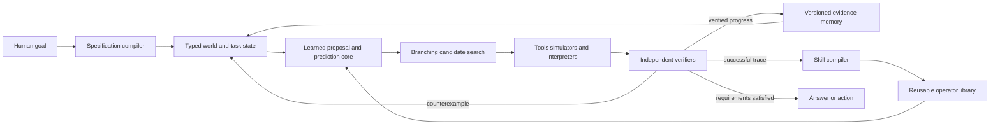
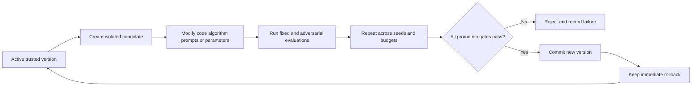

# Kritjnah Machine-Native Intelligence Blueprint

Author: Arnav123-s

Status: research direction and falsifiable architecture proposal; not implemented, trained, or validated

## 1. Decision

Kritjnah will not use the human brain as its master blueprint.

Biology remains useful evidence about learning, stability, and efficient physical computation, but it is not the ceiling or the goal. A machine can use abilities unavailable to a biological brain:

- exact copying and replay;
- explicit, searchable memory;
- branching into many candidate futures;
- checkpointing and rollback;
- deterministic calculators and interpreters;
- formal proof checking;
- millions of repeated trials without boredom;
- changing the amount of thought used for each problem;
- compiling a discovered solution into reusable executable code;
- evaluating candidate versions against identical tests.

The design target is therefore not “an artificial brain.” It is:

> **A machine-native intelligence that translates human goals into explicit specifications, searches over possible solutions, checks them against reality or formal rules, remembers verified results exactly, and compiles successful reasoning into reusable capabilities.**

## 2. Honest constraint

A new architecture does not automatically create frontier-level general intelligence. Current frontier systems obtain broad knowledge from enormous datasets and training compute. A laptop cannot reproduce that pretraining process from scratch.

There are two separate goals:

1. **Immediate useful intelligence:** begin with one capable pretrained local model as the language-and-proposal prior, then make the complete system much stronger through search, tools, exact memory, verification, and compilation.
2. **Original core research:** train small Kritjnah cores from scratch on controlled tasks to discover whether the proposed architecture learns and generalizes better per unit of compute.

The first can produce a strong personal agent. The second is the scientific experiment that may eventually replace more of the inherited model. Neither is presently a claim of frontier performance.

## 3. How most capable models are currently developed

The dominant recipe has several layers.

| Stage | Common method | What it provides | Main limitation |
|---|---|---|---|
| representation | attention-based sequence model, sometimes sparse experts or state-space layers | flexible pattern learning over text and other sequences | knowledge and algorithms are entangled in opaque parameters |
| initial objective | predict hidden, next, or corrupted pieces of data | learns broad statistical regularities without manual labels | predicting likely data is not the same as proving correctness |
| optimization | reverse-mode gradients and variants of stochastic gradient descent | efficiently adjusts huge numbers of continuous parameters | memory intensive; does not naturally search discrete programs or architectures |
| scaling | increase useful data, parameters, and compute according to measured scaling relationships | predictable average improvements | extremely expensive and eventually constrained by data, energy, and hardware |
| specialization | supervised examples and task-specific fine-tuning | teaches desired formats and capabilities | can overfit, forget, or imitate mistakes in demonstrations |
| preference training | preference optimization or reinforcement learning from feedback | changes behavior toward chosen preferences | reward models and preferences can be incomplete or exploitable |
| reasoning training | reinforcement learning with checkable answers, synthetic problems, or process feedback | strengthens strategies that lead to verified outcomes | only works where the verifier and task distribution are sufficiently good |
| inference scaling | longer deliberation, multiple samples, branching search, voting, or verifier-guided selection | spends more compute on difficult questions | weak verifiers can choose polished errors; cost grows quickly |
| augmentation | retrieval, tools, code execution, memory, and agent loops | connects the model to current facts and actions | often added as a harness rather than learned as one coherent process |
| efficiency | quantization, distillation, sparsity, caching, and conditional experts | makes deployment cheaper | generally preserves or compresses an existing paradigm rather than replacing it |
| automated discovery | architecture search, evolutionary code search, meta-learning, and automated experiments | searches designs humans may not invent | requires strong evaluators and can consume enormous compute |

The dominant core still normally learns by turning large datasets into parameter updates and then emits one token after another. Modern systems improve this with tools and search, but exact state, verification, and reusable algorithm discovery are usually surrounding components rather than the fundamental unit of cognition.

## 4. What the dominant recipe leaves unsolved

### 4.1 Fluency and correctness share one output channel

A statistically plausible answer and a logically established answer are both represented as token sequences. The architecture does not inherently mark which steps were measured, retrieved, inferred, assumed, tested, or proved.

### 4.2 Memory is split awkwardly

Parametric memory is compressed and difficult to edit. Context memory is temporary and expensive. External retrieval finds documents but does not automatically form a coherent, executable skill.

### 4.3 A single rollout commits too early

Left-to-right generation chooses one continuation at a time. It can reconsider through prompting, but branching, rollback, and comparison are not native state operations.

### 4.4 Learning is expensive

Changing a fact or adding a small procedure may require fine-tuning many parameters. That risks unrelated regressions and catastrophic forgetting.

### 4.5 The stopping rule is weak

Systems often stop when an answer looks complete rather than when declared tests, evidence requirements, or proof obligations are satisfied.

### 4.6 One scalar score can be gamed

When correctness, usefulness, cost, novelty, and safety are collapsed into one reward, an optimizer may exploit the score while violating its intended meaning.

### 4.7 Self-modification is usually not trustworthy

Letting the running system edit itself in place destroys the clean comparison between old and new versions. It can also damage the evaluator, hide regressions, or make rollback impossible.

## 5. The different core: verified search and compilation

The proposed model is named the **Kritjnah Verified Search and Compilation Core**, shortened to **Kritjnah Core** or **K-VSCC**.

Its exact proposed type is:

> **A neural-guided, verifier-grounded, branch-and-compile cognitive machine with an explicit typed workspace, adaptive test-time search, exact versioned memory, and continual synthesis of reusable operators.**

The core does not try to place all intelligence inside one stream of activations. It learns to create and guide explicit state transformations that can be executed, inspected, tested, saved, reused, and improved.

The diagram shows the key difference: the learned network proposes and predicts, but it does not get to declare itself correct. Execution and independent verification close the loop. Successful work becomes a reusable operator rather than merely disappearing into a conversation.

## 6. The core's state

At time \(t\), the complete cognitive state is

\[
X_t=(G_t,W_t,B_t,M_t,L_t,R_t).
\]

| Symbol | Component | Contents |
|---|---|---|
| \(G_t\) | goal contract | desired outcome, hard constraints, allowed actions, stop conditions, and evidence requirements |
| \(W_t\) | typed workspace | facts, hypotheses, variables, subgoals, programs, proofs, observations, and unresolved conflicts |
| \(B_t\) | branch frontier | alternative candidate states and their ancestry |
| \(M_t\) | evidence memory | source-linked facts, experiment records, failures, counterexamples, and provenance |
| \(L_t\) | operator library | executable procedures with preconditions, postconditions, tests, cost, and confidence |
| \(R_t\) | resource state | time, memory, thermal, compute, storage, and tool budgets |

This state is explicit and checkpointable. The trainable parameters help operate on the state, but they are not the entire state.

## 7. The learned part

K-VSCC contains one trainable core with shared internal representations and several functional heads:

1. **Specification head:** converts a human request into a proposed typed goal contract.
2. **Operator proposal head:** proposes the next executable reasoning or action operator.
3. **World-transition head:** predicts likely consequences before expensive execution.
4. **Value-and-progress head:** predicts which branches are worth exploring.
5. **Uncertainty head:** predicts where the system is likely to be wrong or under-informed.
6. **Compilation head:** proposes reusable abstractions from successful traces.

These are parts of one model, not separate conversational models. Deterministic tools, databases, compilers, solvers, and verifiers are not additional models.

The first implementation may use an efficient recurrent or selective state-space substrate because the target device favors fixed-size sequential state. That substrate is replaceable. The architectural invention being tested is not a particular matrix layer; it is verified branch-and-compile cognition.

## 8. The language-to-specification boundary

Natural language is ambiguous. Before search begins, the core produces a machine-readable contract:

\[
G=(O,C,A,E,S),
\]

where:

- \(O\): objective;
- \(C\): hard constraints;
- \(A\): permitted actions and resources;
- \(E\): required evidence or tests;
- \(S\): conditions for success, pause, or stop.

The user can inspect this contract for important tasks. If an ambiguity changes the objective or external effects, the system asks. Otherwise it proceeds using a recorded assumption.

Understanding a human therefore means more than predicting their next words. It means building a correct task contract, remembering their private preferences, tracking uncertainty, and returning evidence that the requested outcome was achieved.

## 9. Typed operators replace unrestricted text as the thinking primitive

An operator is an executable state transformation:

\[
o:(X,\mathrm{preconditions})\rightarrow(X',\mathrm{claims},\mathrm{obligations}).
\]

Example operator classes include:

- retrieve a source;
- derive a logical consequence;
- propose a hypothesis;
- generate a program;
- execute a test;
- search for a counterexample;
- call a calculator or solver;
- compare two artifacts;
- revise a plan;
- compress a successful trace;
- restore a checkpoint.

The model may still use internal continuous representations and produce natural language. But durable reasoning is recorded as typed operations and claims with provenance.

## 10. Branching is native

Instead of committing to one line of thought, the proposal distribution creates candidate operators:

\[
o_k\sim P_\theta(o\mid X_t,G),
\qquad k=1,\ldots,K.
\]

Each valid candidate produces a branch:

\[
X_{t+1}^{(k)}=T(X_t,o_k),
\]

where \(T\) is an executable transition, not just predicted text.

A search priority can be

\[
U(b)=Q_\theta(b)
+c\sqrt{\frac{\log(1+N)}{1+N_b}}
+\lambda_n N_{\mathrm{novel}}(b)
-\lambda_c C_{\mathrm{compute}}(b),
\]

subject to hard correctness, authority, and resource constraints.

- \(Q_\theta\) predicts progress;
- the exploration term revisits uncertain branches;
- novelty preserves genuinely different approaches;
- compute cost prevents endless repetition;
- constraints cannot be traded away for a higher scalar score.

Failed branches are useful data. They remain linked to their assumptions and counterexamples so the system does not repeatedly rediscover the same failure.

## 11. Verification is part of cognition

The verifier returns a vector rather than one vague reward:

\[
V(b)=(v_{\mathrm{correct}},v_{\mathrm{progress}},v_{\mathrm{evidence}},
v_{\mathrm{novel}},v_{\mathrm{cost}},v_{\mathrm{risk}}).
\]

Selection is lexicographic or constrained:

1. reject authority or hard-safety violations;
2. reject failed correctness checks when correctness is decidable;
3. require evidence and provenance thresholds;
4. compare progress and generalization;
5. minimize cost among equivalent candidates;
6. use novelty to preserve alternative routes, not to excuse errors.

Different domains use different verifiers:

- unit, integration, property, and mutation tests for code;
- proof assistants for formal mathematics;
- numerical residuals and dimensional checks for equations;
- simulators for controlled systems;
- source agreement and contradiction searches for research;
- held-out tasks and calibration tests for learned behavior.

For open-ended questions, verification can remain incomplete. The system must then report degrees of evidence and unresolved obligations rather than silently converting confidence into proof.

## 12. Compilation is the main form of continual learning

A verified successful trace

\[
\tau=(X_0,o_0,X_1,o_1,\ldots,X_n)
\]

is compressed into a candidate operator

\[
\hat o=\operatorname{Compile}(\tau).
\]

The candidate stores:

- a name and version;
- typed inputs and outputs;
- preconditions;
- executable implementation;
- proof or test obligations;
- known failure cases;
- resource cost distribution;
- provenance and licensing;
- the tasks on which it was validated.

It enters the permanent library only if it reproduces the result and passes protected tests. This gives Kritjnah a new skill without immediately changing millions of model parameters.

This is a machine advantage: the system can turn one hard-won solution into exact, fast, repeatable machinery.

## 13. Parameter learning remains, but it is not the only learning

Backpropagation is useful for continuous function approximation and does not need to be rejected on principle. K-VSCC combines several kinds of learning according to what they are good at.

### Gradient learning

Train the proposal, transition, value, and uncertainty heads with

\[
\mathcal L
=\mathcal L_{\mathrm{proposal}}
+\alpha\mathcal L_{\mathrm{value}}
+\beta\mathcal L_{\mathrm{transition}}
+\gamma\mathcal L_{\mathrm{uncertainty}}
+\delta\mathcal L_{\mathrm{invariance}}.
\]

Verified successful and failed branches provide the data. Failure is not discarded; it trains rejection, uncertainty, and counterexample prediction.

### Reinforcement learning

Use checkable outcomes to improve branch selection and resource allocation. Never let an unverified self-rating be the sole reward.

### Program synthesis

Search discrete operator and algorithm space where gradients are unsuitable.

### Evolutionary search

Maintain diverse candidate algorithms or architecture versions, mutate them, evaluate them, and preserve reproducibly better variants.

### Exact memory updates

Store new facts and artifacts with provenance without retraining the core.

### Distillation

Periodically teach the proposal core to imitate verified efficient traces, making future search cheaper. The original executable skills and tests remain available to detect compression loss.

## 14. Machine-native self-improvement

The running version never rewrites itself in place.

Candidate modifications may include:

- operator implementations;
- search policy;
- memory indexing;
- scheduling;
- model architecture;
- learning rule;
- quantization or kernels;
- tool-use policies;
- training curriculum.

Promotion requires all of the following:

1. protected capabilities do not regress beyond declared tolerances;
2. claimed improvement repeats across held-out tasks and seeds;
3. wall time, memory, temperature, and storage stay within budget;
4. the candidate cannot alter its evaluator results;
5. provenance and diff are recorded;
6. rollback remains functional;
7. an external stop mechanism remains available.

Relentlessness comes from durable goals, checkpoints, queues, and resumable bounded work units—not from removing control. A scheduler can keep resuming an unsolved goal while each experiment remains finite, auditable, and stoppable.

## 15. Personal intelligence for one user

Kritjnah's personal layer is local, inspectable, and separate from universal knowledge.

It stores:

- the user's vocabulary and preferred explanation depth;
- recurring projects and constraints;
- confirmed preferences, not guessed identity traits;
- local files and work history with permission boundaries;
- corrections the user has explicitly made;
- reusable workflows compiled from successful tasks.

Personalization should first change retrieval, planning, output style, and skill selection. Parameter updates occur only after enough evidence and regression testing. This reduces forgetting and prevents one unusual conversation from rewriting the entire system.

## 16. Why this could exceed a biological brain on selected work

| Machine-native ability | Advantage |
|---|---|
| exact versioned memory | recalls artifacts without biological reconstruction noise |
| unlimited external notation | keeps large proofs, programs, datasets, and dependency graphs outside working memory |
| branching and rollback | explores incompatible hypotheses without forgetting the starting state |
| formal execution | converts reasoning into behavior a machine can test exactly |
| variable compute | spends seconds on easy work and hours or days on a hard branch |
| cloned experiments | compares alternative methods under identical conditions |
| reusable compilation | converts discoveries into fast permanent operators |
| cross-domain tool use | combines mathematics, code, retrieval, simulation, and measurement |
| complete provenance | tracks where each claim and change came from |
| hardware-aware optimization | searches implementations for this exact device |

These strengths can produce superhuman performance where specifications and evaluators are strong. Open-ended common sense, underspecified human goals, novel social situations, and research without decisive experiments remain much harder.

## 17. What is actually new and what is borrowed

The components have precedents:

- neural-guided tree search and learned world models;
- formal proof search;
- retrieval and external memory;
- program synthesis and counterexample-guided refinement;
- evolutionary program search;
- reinforcement learning from verifiable outcomes;
- test-time compute scaling;
- distillation and skill libraries;
- automated architecture and learning-rule discovery.

The proposed research contribution is their integration around a different unit of intelligence:

> **The durable learning unit is a verified, typed, executable operator with declared evidence and tests—not merely a changed weight or another generated token.**

The other proposed distinction is that goal state, evidence, competing branches, failures, and resource state are native parts of the cognitive state. This is a design hypothesis, not yet a validated novelty claim.

## 18. Comparison with the physics-native and biological directions

| Question | Physics-native core | Brain-inspired refinement | Machine-native K-VSCC |
|---|---|---|---|
| basic object | particle-like latent cell | excitable compartmental cell | typed state plus executable operator |
| main computation | dynamical relaxation | electrochemical recurrent dynamics | branch, execute, verify, and compile |
| memory | latent states and masses | synapses, cell state, support fields | exact evidence store plus operator library |
| learning | equilibrium contrast and structural split/merge | local plasticity plus homeostasis | hybrid gradient, verified RL, synthesis, evolution, and compilation |
| persistence | momentum and recurrent state | cellular and synaptic time constants | explicit checkpoints and resumable task graph |
| truth criterion | low-energy compatible state | stable predictive behavior | domain verifier and unresolved proof obligations |
| growth | cell fission | synapse and branch change | addition of verified operators and candidate versions |
| strongest benefit | novel continuous inductive bias | physical and biological plausibility | exactness, auditability, cumulative skill, and variable search |
| primary risk | elegant dynamics without intelligence | copying biological limitations | verifier bottlenecks and search cost |

K-VSCC should now be the primary system-level research direction. The physics-native and biological cores remain candidate proposal substrates that must earn inclusion through controlled comparisons.

## 19. First buildable experiment

The first experiment should be small enough for this device and should not attempt general language pretraining.

### Tasks

Use a mixed set with exact evaluators:

- arithmetic-expression discovery;
- short program synthesis from tests;
- grid transformations;
- small planning worlds;
- formal propositional proofs;
- algorithm optimization under runtime and correctness tests.

### Baselines

Compare equal-budget versions:

1. one-pass sequence generator;
2. generator plus retry loop;
3. generator plus branching and verifier;
4. full K-VSCC with branch memory and operator compilation.

### Measurements

- solved tasks;
- verifier-confirmed correctness;
- calibration;
- unique failure recurrence;
- time and energy per solved task;
- peak RAM and graphics memory;
- number of compiled operators reused;
- improvement on later tasks after operator reuse;
- protected-task retention;
- performance under a fixed thermal and compute envelope.

### Decisive test

K-VSCC succeeds only if compiled operators make later related tasks more accurate or cheaper without causing protected regressions. A larger log or more generated text is not improvement.

## 20. Route toward broad capability

1. Prove branch-and-verify gains on exact toy tasks.
2. Prove that compiled operators transfer to held-out task families.
3. Add scientific retrieval with source provenance and contradiction tracking.
4. Add code, shell, calculator, and proof-assistant operators inside sandboxes.
5. Add a pretrained local language prior for broad communication and candidate generation.
6. Distill verified traces into the trainable core while retaining executable tests.
7. Search alternative proposal substrates, including state-space, sparse graph, energy-based, and program-native variants.
8. Permit isolated architecture and learning-rule candidates only after the external evaluator is mature.
9. Scale data and compute only when a measured scaling curve justifies it.
10. Call the system frontier-level only if independent, broad, contamination-controlled evaluations support the claim.

## 21. What not to do

- Do not train a tiny model from random weights on a few textbooks and call it generally intelligent.
- Do not use Riemann-hypothesis progress as the only intelligence metric.
- Do not let the proposer edit or disable its evaluator.
- Do not accept its own confidence as proof.
- Do not run one unbounded loop without checkpoints, budgets, or failure classification.
- Do not continually fine-tune on its own unverified generations.
- Do not confuse more parameters, logs, branches, or runtime with learning.
- Do not hide regressions by changing the benchmark after a result.
- Do not claim novelty or frontier capability before controlled comparisons.

## 22. Simple explanation

Most current models are like a person who has read an enormous library and learned to continue sentences extremely well. Training changes billions of tiny internal numbers until useful patterns appear. Newer systems also practice against rewards, use tools, retrieve documents, and spend longer thinking.

Kritjnah's new direction is more like a machine laboratory:

1. turn your request into a checklist that a machine can inspect;
2. create several possible plans instead of trusting the first one;
3. execute safe parts of each plan;
4. use tests, measurements, sources, or formal logic to reject mistakes;
5. keep failed attempts so they are not repeated blindly;
6. save a successful solution as a reusable machine skill;
7. train the proposal system from everything that was independently checked;
8. try improved candidate versions in isolation and keep only repeatable winners.

The model supplies imagination and generalization. Search supplies persistence. Tools supply real effects. Memory supplies continuity. Verifiers supply resistance to self-deception. Compilation turns experience into permanent capability.

## 23. Research basis

### Dominant training methods

- The attention-based sequence architecture that became the dominant language-model foundation: <https://proceedings.neurips.cc/paper_files/paper/2017/hash/3f5ee243547dee91fbd053c1c4a845aa-Abstract.html>
- Empirical scaling relationships between model size, data, and compute: <https://openai.com/index/scaling-laws-for-neural-language-models/>
- Compute-optimal allocation between model size and training data: <https://proceedings.neurips.cc/paper_files/paper/2022/hash/c1e2faff6f588870935f114ebe04a3e5-Abstract.html>
- Direct preference optimization as a simpler alternative to a reward-model-plus-reinforcement-learning pipeline: <https://proceedings.neurips.cc/paper_files/paper/2023/hash/a85b405ed65c6477a4fe8302b5e06ce7-Abstract-Conference.html>
- Selective state-space sequence modeling as an efficient alternative substrate: <https://openreview.net/pdf?id=tEYskw1VY2>
- Interleaving reasoning and external actions: <https://openreview.net/pdf?id=WE_vluYUL-X>

### Machine-native search, verification, and discovery

- Planning with a learned model and neural-guided tree search: <https://www.nature.com/articles/s41586-020-03051-4>
- Program evolution with an automatic evaluator for mathematical and algorithmic discovery: <https://www.nature.com/articles/s41586-023-06924-6>
- Reinforcement-guided discovery of provably correct matrix-multiplication algorithms: <https://www.nature.com/articles/s41586-022-05172-4>
- Neural proposal combined with symbolic deduction for formal geometry: <https://www.nature.com/articles/s41586-023-06747-5>
- Formal proof search trained using machine-checkable outcomes: <https://deepmind.google/blog/ai-solves-imo-problems-at-silver-medal-level/>
- Evolutionary search over complete learning algorithms using primitive mathematical operations: <https://proceedings.mlr.press/v119/real20a/real20a.pdf>
- Evolutionary code search guided by multiple automatic evaluators: <https://arxiv.org/abs/2506.13131>
- Automated discovery of a reinforcement-learning update rule evaluated across environments: <https://www.nature.com/articles/s41586-025-09761-x>
- Evidence that verifier-guided allocation of test-time compute can outperform naive repeated sampling: <https://arxiv.org/abs/2408.03314>

These works demonstrate pieces of the proposed direction. They do not prove that combining them will yield a generally frontier-level local system. The blueprint must be treated as an experimental program whose claims rise only with reproducible evidence.
