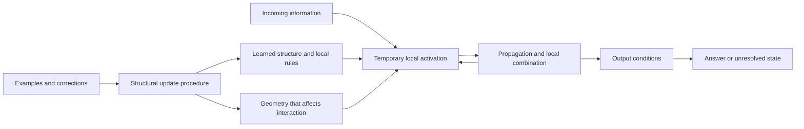

# Geometry, activation and learned configuration

Author: [Arnav123-s](https://github.com/Arnav123-s)

Research note, 7 September 2026. This clarifies the intended architecture; no biological simulation, new learning rule or training run is introduced.

## What configuration includes

The owner's comparison concerns the arrangement of a working nervous system: connections, geometry, local response properties, current activation and changes caused by experience. Its computational analogue is an adaptive recurrent system whose structure and local dynamics determine how incoming information propagates. Discrete graph structure and geometry can coexist; neither description should restrict the design to a forward sentence recognizer.

Three objects must remain distinguishable: persistent learned organization; temporary activity during an input; and the rule that changes organization from experience. They can belong to one integrated system without being mathematically identical. A correction may change persistent structure so that later inputs produce a different trajectory, without retaining a wrong-answer episode inside the model. Whether that structural change generalizes is an experimental question.

## Folds, wiring and firing are different scales

The cortex's raised folds are gyri and its grooves are sulci. [Tallinen et al. (2016)](https://www.nature.com/articles/nphys3632) used physical gel models and numerical simulations to show how differential growth and mechanical instability, constrained by starting geometry, can produce realistic folding patterns. This concerns developmental shape formation. It does not establish that an individual fold corresponds to a word, a learned rule or an intelligence level.

One proposed and empirically investigated coarse scaling relation is:

$$A_t\sqrt{T}=k A_e^{5/4},$$

where A_t is total cortical area, A_e is exposed area, T is average thickness and k is a dimensionless coefficient when units are consistent. [Wang et al. (2019)](https://www.nature.com/articles/s42003-019-0421-7) examine the relationship across cortical regions. This relation constrains aggregate morphology; it does not generate every fold or provide a formula for thinking. Regional analysis also requires the paper's geometric corrections, rather than applying the whole-cortex relation independently to arbitrary patches.

At a larger activity scale, [Pang et al. (2023)](https://jchrispang.github.io/files/papers/2023_Nature_geometric_eigenmodes_compressed.pdf) reconstruct fMRI activity using modes derived from brain geometry. Their eigenvalue problem can be written:

$$-\Delta_M\phi_j=\lambda_j\phi_j,$$

where M is the cortical surface and its Laplace–Beltrami operator determines spatial modes. This supports a role for geometry in constraining activity patterns. It does not show that shape alone learns tasks or replaces every connectivity detail. The comparative geometry-versus-connectome claim has been challenged in [Mansour and colleagues' 2024 preprint](https://doi.org/10.1101/2024.04.16.589843), whose [author repository](https://github.com/sina-mansour/brain_eigenmodes) supplies alternative-connectome analyses. Its indexed abstract and repository were inspected; its analyses were not reproduced here.

## How local activation depends on configuration

“Lighting up” is a useful metaphor for activity, but firing is an electrical event governed by membrane state and currents. In the squid-axon model of [Hodgkin and Huxley (1952)](https://materias.df.uba.ar/dnla2019c1/files/2019/03/hodgkin1952.pdf), membrane current contains capacitive and ionic components. With an explicit inward-applied/outward-ionic convention, its current balance can be expressed as:

$$C_m\frac{dV}{dt}=I_{\rm applied}-I_{\rm ionic},$$

with voltage- and time-dependent channel conductances specifying the ionic terms. Current density and capacitance per unit area must use consistent units. This is only the current-balance part of the model, not its complete gating equations and not a formula for a human brain. A neuron is consequently not fully described by a binary “on” marker; its response depends on evolving local state.

Branch arrangement also affects what incoming activity does. [Pagkalos, Chavlis and Poirazi (2023)](https://www.nature.com/articles/s41467-022-35747-8.pdf) model dendritic attenuation, nonlinear integration, local spikes and coincident inputs using reduced compartmental models. Their work gives concrete examples of how the position and timing of inputs can change output. It is a modelling framework with supplied equations and parameters; adopting its components would not demonstrate that Kavi learned those mechanisms.

Activity can alter subsequent transmission. In cultured hippocampal neurons, [Bi and Poo (1998)](https://www.gatsby.ucl.ac.uk/~pel/course_wuhan/papers/bi.poo_1998.pdf) found that the relative timing of repeated pre- and postsynaptic activity affected the direction of synaptic modification. Their measured timing window, initial-strength dependence and cell-type conditions are specific to that preparation. The result supports timing-sensitive plasticity; it does not supply a universal correction rule for arbitrary concepts. Biological learning includes changes in connection efficacy, so it is not evidence that every learning system can discard numerical state.

## Translation into Kavi

The following is a proposed specification, not an implemented neural model. Let K contain persistent connectivity and local rule choices, g any functional geometry, s temporary activation and bindings, and x input:

$$s_{t+1}=F_{K,g}(s_t,x_t),\qquad (K',g')=U(K,g,\mathcal E),$$

where the development evidence E may include traces, examples and corrections. F describes execution and U describes learning. Naming these functions does not define their algorithms. Their admissible local operations, state precision, recurrence, scheduling and acceptance checks still have to be specified or learned within a supplied substrate.

Geometry must change the executed transformation to have computational meaning. It might determine which ports can interact, propagation delays, branch-local combinations or a spatial transport operator. Coordinates used only to draw the graph do not change its computation. If distances, thresholds, couplings or delays are retained, their storage and precision count as model state even when they are not called weights. A graph can also represent geometric constraints discretely; a literal three-dimensional brain shape is not required.

The recurrent arrow is part of the intended architecture, not a capability already demonstrated by the acyclic sentence experiment. A stronger signal or a settled state is not by itself a correct interpretation. Output conditions and independent tests must establish what a resulting configuration accomplishes.

## Consequence for the next experiment

The next core experiment should let a bounded learner choose recurrent connections and local activation rules, then test late-arriving information that requires revising an earlier binding. It should compare fixed geometry, geometry with no effect on execution, and geometry that changes defined interactions; keep available information and resource budgets matched. Measure transfer, retention, actual events and total stored state. An engineered neuronal component, a learned arrangement of such components and an acquired learning rule are separate results.

The [input-driven design](INPUT_DRIVEN_PATHWAYS.md) retains the discrete graph and rewrite contract. The [physical-pathway research](PHYSICAL_PATHWAY_RESEARCH.md) retains optional thermal and catalytic mechanisms. The current arithmetic and incremental language experiments remain narrow evidence; none yet demonstrates a learner that acquires this general dynamic configuration.

The cited folding and neuronal papers were used at the stated levels: folding study abstract and reported mechanism, regional-scaling introduction/equation, geometric-mode formulation, original membrane-current section, dendritic model description and timing-plasticity results. No source code from those projects was installed or run. No new source-based teaching occurred.
