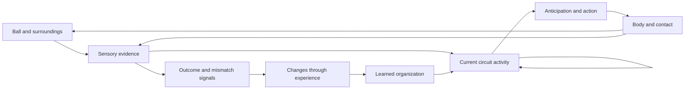
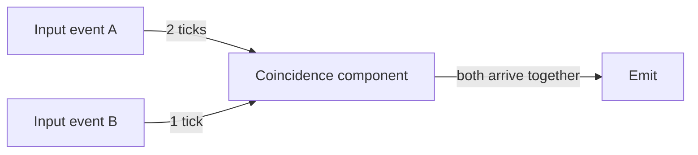

# Learning as changing activity configurations

Author: [Arnav123-s](https://github.com/Arnav123-s)

Research and architecture study, 7 September 2026. This document develops a computational interpretation of neural pathways, feedback, mastery and structural change. The subsequent [finite recurrent experiment](../experiments/2026-09-07-recurrent-configuration.md) tests acquired cycles and retained behavior; no biological simulation is reported.

## The object to learn

Kavi's proposed learning target is the organization that makes useful activity unfold: which components interact, when they interact, what information they combine, and how an outcome changes later interactions. A component can participate in several computations. Its role need not correspond to one word or a permanent human label.

The successor can replace part or all of the configuration, retaining earlier valid abilities in a different representation. Its size may increase or decrease. Biological pruning and emotional modules are optional comparisons, not architectural requirements. The companion [animal-learning and configuration-change study](ANIMAL_LEARNING_AND_CONFIGURATION_CHANGE.md) formalizes this transformation and distinguishes learning a configuration from learning its update procedure.

A pathway in this account is a trajectory through a recurrent configuration. It can branch, converge, revisit a component and change direction as information arrives. Wiring alone does not specify the trajectory: local state, timing, inhibition and the incoming evidence also matter. The geometry of an active state space is distinct from the physical geometry of a brain surface.

The closest broad mathematical description is an adaptive recurrent dynamical system. A directed, timed graph or hypergraph supplies a discrete representation; graph rewrites describe structural learning. This extends the [input-driven design](INPUT_DRIVEN_PATHWAYS.md) and [geometry study](NEURAL_GEOMETRY_AND_ACTIVATION.md). It does not establish a new model family by renaming existing neural mechanisms.

## What the neuroscience supports

### Populations, overlapping roles and timing

In macaques making decisions about noisy visual stimuli, **Mante et al. (2013)** explained complicated individual-neuron responses through population dynamics. A trained recurrent network reproduced important features: relevant input selection and evidence integration occurred within the same evolving circuit. Their task included a context cue; this is evidence for integration within a circuit, not evidence that context information can be omitted. [Original study](https://www.nature.com/articles/nature12742).

An especially close computational relative is **Izhikevich's polychronization model (2006)**. Different conduction delays let overlapping groups of neurons respond to different timings of activity. Individual neurons participate in multiple groups. The published simulation uses synaptic weights, timing-dependent plasticity and supplied delays; its many possible groups do not establish general understanding or an equivalent number of reliably usable concepts. [Paper, including model and code appendix](https://www.izhikevich.org/publications/spnet.pdf).

**Gallego et al. (2020)** recorded sensorimotor populations during monkey reaching over periods up to two years. Aligned, low-dimensional population dynamics remained stable despite turnover in the recorded units. That supports studying stable behavior at the population level. Turnover in recorded units does not establish that those neurons died, nor that arbitrary neurons can be removed without consequence. [Original study](https://www.nature.com/articles/s41593-019-0555-4).

Individual elements can still matter. **Houweling and Brecht (2008)** found that stimulation of a single somatosensory neuron could influence a rat's response in a detection task. A useful system-level description must retain the possibility of such causal effects. [Original study](https://pubmed.ncbi.nlm.nih.gov/18094684/).

For Kavi, internal meaning should be assessed through behavior and interventions: what changes when a component is silenced, delayed or connected differently, across several tasks? An activation picture alone cannot establish meaning. Two nodes with similar activity need not be interchangeable.

### Firing and changing a connection are separate events

Membrane state and channel currents govern spikes; dendritic branches can combine inputs nonlinearly before a neuron produces an outgoing spike. The earlier [geometry study](NEURAL_GEOMETRY_AND_ACTIVATION.md) covers Hodgkin–Huxley current balance, reduced dendritic models and the timing experiments of Bi and Poo. A digital component can use a simpler local transition rule when the experiment does not require ion-channel realism.

Weights conventionally describe connection efficacy, not the importance of a neuron. Studying pathways does not make biological synaptic strengths disappear. Kavi can test learning through discrete changes in wiring and local rules, but this is a design choice. Retained delays, counters, thresholds, rule identifiers and graph structure all count as learned state.

## What happens after “wrong” or “correct”

There is no universal set of neurons that fires whenever any statement is wrong. Different experiments identify different signals, with different roles:

| Situation | Evidence | Consequence for the design |
| --- | --- | --- |
| An outcome is better or worse than expected | Schultz, Dayan and Montague described dopamine activity related to reward prediction error. An expected reward can produce no new phasic increase. | Success, surprise and logical correctness need separate definitions. |
| A person detects an action error | Fu and colleagues recorded neurons in pre-SMA and dorsal anterior cingulate cortex during a Stroop task; activity tracked errors and subsequent adjustment. | An internal mismatch can affect ongoing control and later behavior. |
| Feedback arrives after relevant activity | Yagishita and colleagues found a restricted timing window for dopamine-dependent spine enlargement in a mouse striatal preparation. | Recently active structures need a way to remain eligible for a later update. |
| A teacher explains a mistake | Understanding the explanation is itself a language and task competence. The experiments above do not supply that competence. | A verdict, a corrected answer and an explanation carry different amounts of information. |

The source for reward prediction is [Schultz, Dayan and Montague (1997)](https://web.math.princeton.edu/~sswang/fundamental-readings-for-Wang-lab-members/schultz_montague97_science.pdf). Their temporal-difference interpretation can be written, with conventional indexing, as

$$\delta_t=r_{t+1}+\gamma\widehat V(s_{t+1})-\widehat V(s_t).$$

Here r is reward and V predicts discounted future reward. A negative delta is not a mathematical proof of falsity. This equation is a reference model of reward learning, not a new Kavi implementation.

[Fu et al. (2019)](https://pmc.ncbi.nlm.nih.gov/articles/PMC6354767/) studied self-monitored errors, not arbitrary verbal criticism. Error-related responses appeared first in pre-SMA and later in dACC; coordinated activity was associated with subsequent slowing. Detection can therefore change the speed or control of a response without immediately teaching the correct alternative.

[Yagishita et al. (2014)](https://pubmed.ncbi.nlm.nih.gov/25258080/) separately stimulated glutamatergic and dopaminergic inputs. Dopamine promoted spine enlargement within approximately 0.3–2 seconds after the relevant stimulation in that preparation. This motivates a temporary eligibility mechanism; it does not prescribe a universal human learning window or prove that every recently active connection caused an error.

A correction cycle for Kavi should consequently distinguish four operations:

1. Produce and record the answer before feedback arrives.
2. Interpret the feedback under a declared teaching interface. An unexplained rejection only rules out the rejected behavior on that case.
3. Propose changes to relevant structure and check their consequences. Activity identifies candidates for investigation, not automatic blame.
4. Retain a change only when it corrects the declared development cases and preserves protected valid behavior. Evaluate transfer on fresh cases.

The learned graph need not contain a record saying “this particular answer was once wrong.” It does need persistent changes that carry what was learned. A temporary trace linking feedback to earlier activity is working state, even if it is discarded afterwards. Public experiment records remain separate from the model.

## What changes during mastery

Mastery can combine stronger coordination, structural stabilization, reduced need for supervisory control and better anticipation. It is not a universal progression toward fewer firing neurons or fewer connections.

In mice learning forelimb skills, **Fu et al. (2012)** observed new dendritic spines forming in clusters; clustered spines were more likely to persist than isolated new spines. These are changes to connections on existing neurons, not a new neuron for each learned answer. [Original study and figure descriptions](https://pubmed.ncbi.nlm.nih.gov/22343892/).

**Hayashi-Takagi et al. (2015)** selectively shrank spines potentiated during a motor task. This disrupted the acquired skill, whereas the corresponding manipulation of spines associated with a different task did not. This intervention gives stronger evidence for a relevant structural ensemble than observing activity alone. [Original study](https://pubmed.ncbi.nlm.nih.gov/26352471/).

In a human motor-sequence study, **Bassett et al. (2015)** found that increasing skill was associated with greater autonomy of sensorimotor systems and changes in frontal and cingulate participation. The measurements were functional MRI correlations, not direct observations of individual synapses being deleted. [Original study](https://www.nature.com/articles/nn.3993).

Learning also involves cells other than neurons. **McKenzie et al. (2014)** blocked formation of new oligodendrocytes in adult mice while leaving existing oligodendrocytes and myelin intact. The mice failed to master a wheel with irregular rung spacing. The finding implicates adaptive myelination in that motor skill; it does not make each glial cell an independent reasoning agent. [Original study](https://pubmed.ncbi.nlm.nih.gov/25324381/).

Practice need not be continuous input. **Buch et al. (2021)** observed compressed replay associated with consolidation during short waking rest periods in a human sequence-learning task. Replay is a candidate mechanism to investigate, not permission to assume that a model's imagined outcomes are true. [Original study](https://pubmed.ncbi.nlm.nih.gov/34107255/).

For Kavi, the relevant hypothesis is that a useful arrangement becomes easier to enter, executes with less unnecessary work, and remains available while new arrangements are acquired. Faster execution might follow from shared subcomputations, parallel events or a validated fused operation. Fewer visible nodes do not demonstrate less computation if a larger supplied operation has been hidden inside one node.

## Formation, survival and removal

Synapse formation, synapse elimination, neuron birth and neuron death are different processes. They occur at different scales and cannot be treated as interchangeable versions of a correction command.

- **Schafer et al. (2012)** observed activity- and complement-dependent microglial engulfment of presynaptic inputs during development of mouse visual circuitry. This is a specific developmental pruning mechanism. [Original study](https://pubmed.ncbi.nlm.nih.gov/22632727/).
- **Southwell et al. (2012)** studied programmed death of developing mouse cortical interneurons. Their results concerned developmental population regulation, not the removal of a neuron whenever an adult makes a mistake. [Original study](https://www.nature.com/articles/nature11523).
- **Dumitru et al. (2025)** identified proliferating neural progenitors in the adult human hippocampus. This provides evidence concerning a particular neurogenic region, not rapid replacement throughout the cortex. [Original study](https://pubmed.ncbi.nlm.nih.gov/40608919/).
- **Disouky et al. (2026)** reported molecular signatures of neurogenic cell populations in human post-mortem hippocampi across age and cognitive groups. Cell identification and molecular associations do not by themselves establish the causal contribution of newborn neurons to a specific learned skill. [Original study](https://www.nature.com/articles/s41586-026-10169-4).

A digital system can make reversible copies and test temporary removals. It does not need biological cell death as its deletion rule. Rarely active structure may support a rare but essential task. Safe replacement means preserving the required behavior, not simply preferring the most frequently used components. The earlier deferred retirement and compression recommendations remain deferred; this study does not install them.

## Catching a ball: behavior as a closed loop

The ball example is best described as a loop involving sensory evidence, the current nervous-system state, muscle activity and body mechanics. Incoming light affects sensory activity, but the same stimulus can lead to catching, dodging or ignoring depending on the rest of the state. That dependence can be represented inside the configuration without an external subject classifier.

**Lacquaniti and Maioli (1989)** measured anticipatory and reflex muscle responses while people caught falling balls. Some muscle preparation preceded impact and varied with the expected ball momentum; impact evoked additional responses. Their mechanical model examined how preparation and reflexes stabilized the limb. This supports coupling prediction, feedback and body mechanics, rather than a single stimulus-to-action chain. [Original study](https://pubmed.ncbi.nlm.nih.gov/2913200/).

**Pruszynski et al. (2011)** showed that a pathway involving primary motor cortex integrates information across joints during fast feedback control in humans and monkeys. Fast responses can therefore incorporate information about limb mechanics. This does not imply that every reflex performs abstract reasoning. [Original study](https://www.nature.com/articles/nature10436).

This is a functional diagram, not an anatomical map or a measured sequence of individual neurons. Body mechanics contribute to control; that does not establish that every cell thinks in the cognitive sense. Biological activity also consumes metabolic energy: sensory information directs activity but is not its entire energy supply. Kavi should likewise distinguish input information from the work budget needed to process it.

The useful part of the Spider-Man analogy is fast, anticipatory behavior acquired through an effective configuration. A digital counterpart to “reflex becoming thinking” would let an internally generated prediction or partial result activate another learned computation. Familiar cases could complete quickly; unfamiliar cases could require recurrent revision. Predictions still depend on available information and acquired regularities. No mechanism here supplies perception without signals or guarantees that fast intuition is correct.

## A finite mathematical model

The following is a proposed engineering model, not a claim about the brain's exact equations.

Let the persistent configuration be

$$K=(V,E,\mathcal P,\mathcal R,d),$$

where V contains components, E connects typed ports P, R assigns admissible local rules, and d assigns bounded event delays. Temporary state s contains local activations, partial bindings, pending events and any learning tags. An internal event has the form

$$s_{k+1}=F_K(s_k,u_k),\qquad u_k\in\mathcal X\cup\{\varnothing\}.$$

An empty input permits internal processing between arrivals. A fixed scheduling rule resolves simultaneous enabled events; its behavior is part of the supplied substrate. The learner can choose arrangements and rules within a declared space. An algorithm that invents the substrate itself would be a further result.

Output requires an explicit condition:

$$y=O_K(s_k)\quad\text{when }A_K(s_k)=1.$$

For exact arithmetic, A can include executable type and domain checks plus a verified operation contract. For open language tasks, a confidence score is not a truth certificate. The learner cannot demonstrate correctness merely by learning a gate that always accepts its own answer.

### A small timing example

Consider a supplied coincidence component C. It emits only when events from A and B arrive on the same tick. Delays are two ticks from A and one from B. No event is retained at C beyond its arrival tick.

| Input times | Arrival times at C | Result |
| --- | --- | --- |
| A at 0; B at 1 | 2 and 2 | Emit |
| A at 1; B at 0 | 3 and 1 | No emission |
| A at 5; B at 6 | 7 and 7 | Emit |

The relation is `t_B - t_A = 1`. The same configuration responds to a relation between events, including a shifted example. This is a hand-worked illustration, not an acquired Kavi circuit or a biological measurement. A learning experiment would have to discover the arrangement from evidence rather than receive it as the answer.

### Delayed feedback without an episode archive

One discrete eligibility candidate uses a temporary counter h_e for each recently active edge, with a fixed maximum H:

$$h_e(k+1)=\begin{cases}H,&e\text{ transmitted at event }k,\\
\max(0,h_e(k)-1),&\text{otherwise}.\end{cases}$$

When feedback arrives, positive counters identify recently used connections. This is a proposed recency tag, not a synaptic-strength update or a causal explanation. It can miss a much earlier cause. Changing H trades coverage against memory and attribution precision. Counters, their precision and the event clock must be counted and varied in controls.

Let D contain development evidence, R_valid the protected earlier valid cases, and N_B(K) a finite set of allowed edits within a resource bound. Candidate selection can be specified by

$$K'\in\arg\min_{G\in N_B(K)}\big[L_D(G)+\lambda W_D(G)+\mu\,\operatorname{bits}(G)\big],$$

subject to passing R_valid and all supplied execution contracts. Required correctness is a hard constraint; cost coefficients are optional and may be zero. A smaller graph is not intrinsically preferred to a larger graph that meets the task better. Include unchanged K as a candidate, and reject the update if no acceptable improvement exists. Eligibility can prioritize edit locations, with a declared bounded expansion if that neighborhood fails. Candidate evaluation must account for unused alternatives as learning cost.

This states what must be optimized; it is not a solution to searching the space efficiently. An initial implementation would enumerate a declared set of edge additions, edge redirections and local-rule changes with deterministic tie handling. That local search is an initial experimental restriction, not a prohibition on later whole-configuration replacement. Selection sees development cases only. Co-activity alone must not authorize a rewrite.

### Replacement while preserving behavior

For deterministic event systems, one sufficient condition for replacing K by K' is a state mapping h that respects every reachable transition and observable output:

$$h(F_K(s,u))=F_{K'}(h(s),u),\qquad O_K(s)=O_{K'}(h(s)).$$

Treat waiting, acceptance and failure as observable outcomes, and match initial states. Induction on the input/event sequence then preserves observations under these assumptions. Changes that alter the number of internal events need a corresponding relation allowing internal steps, rather than this strict one-step condition. This is a mathematical specification of behavioral preservation, not a proved property of arbitrary graph compression.

Passing a finite regression set establishes only finite-set retention. It does not prove this condition for every future input. A wrong previous answer belongs in the correction set, not the protected set.

To bound execution, charge each event a positive cost:

$$b_{k+1}=b_k-c_k,\qquad c_k\geq 1.$$

Starting with integer budget B allows at most B events. An unfinished computation is reported as unresolved when the budget expires. This guarantees stopping, not correct convergence. A stronger signal, an attractor or an exhausted budget cannot be used as a substitute for correctness.

## The discriminating Kavi experiment

The next experiment should establish learned recurrence before adding a detailed neuron simulator. Register the graph grammar, input encoding, feedback interface, seeds, limits and final banks before running it.

| Test | Required observation | Important control |
| --- | --- | --- |
| Shared entry | The same symbol enters common structure across uses. | No externally supplied math/language subject label. |
| Late evidence | Additional input changes an earlier provisional binding. | Compare forward-only, engineered feedback and learned recurrence with matched total budgets. |
| Correction transfer | Feedback on one construction improves different withheld values and combinations. | Compare with an unchanged model; score each prediction before teaching. |
| Learned internal roles | Useful recurrent edges and state roles are selected by the learner. | Do not supply a special `a -> alpha` recovery routine or semantic node names. |
| Mastery | Equal or better held-out accuracy with reduced work or latency after further learning. | Count expanded execution, candidate search and the full retained representation. |
| Ambiguity | Insufficient evidence produces an unresolved result. | Matched input prefixes with different later continuations; no hidden information. |
| Stability | Valid earlier uses survive corrections and new learning. | A protected development suite and a separate untouched final retention bank. |
| Causal role | Disabling a learned connection affects the predicted behavior. | Matched inactive-edge interventions; failure to affect behavior is also recorded. |
| Digital robustness | The circuit tolerates declared delay or event-order perturbations. | Fix scheduling semantics and vary only the registered perturbation. |

The initial task can use controlled symbol streams with later definitions, role constraints and familiar arithmetic. This isolates the recurrent-learning question; it would not establish comprehension of unrestricted prose. Compare against an ordinary constraint solver with the same supplied information. Keep train-and-correct development separate from final evaluation; a separate online evaluation may learn after each scored prediction.

The live display should show **what arrived, what remains possible, what changed, why an answer is accepted, and what a correction changed**. It should expose Pause and Stop, label engineered and learned mechanisms, and show actual event counts rather than artificial activity animations.

## Repository status and evidence scope

The existing [arithmetic work](../experiments/2026-09-07-foundation-curriculum.md) demonstrates bounded reusable procedures. The [incremental sentence experiment](../experiments/2026-09-07-incremental-paths.md) demonstrates shared compiled states and an annotated construction repair. Its graph is acyclic; it does not acquire the recurrent mechanisms specified here. The [learned-routing study](../experiments/2026-09-07-experience-routing.md) concerns program-search guidance. These results do not yet establish the proposed general configuration learner or master's-level competence.

The research for this note inspected primary-paper abstracts and available figure descriptions for the listed biological studies; the Mante supplementary figure descriptions, Bassett discussion, Fu error-monitoring results, Yagishita timing and preparation descriptions, Schultz reward examples and equations, and Izhikevich delay mechanism and model appendix were also inspected. The 2026 neurogenesis result was checked through the publisher's indexed abstract and discussion. No claim is made to have reproduced those studies or to have read every cited paper in full.

No biological source bodies were admitted as training material and no external learning code was installed. A subsequent [authored stream trial](../experiments/2026-09-07-recurrent-configuration.md) acquired recurrent connections and a successor preserving the old finite-state task, after a failed course and a coverage repair. Its recurrence occurs across input tokens. Learned internal event scheduling, semantic binding, neural timing, causal credit assignment and learned update rules remain unimplemented. The trial is a restricted first test of the direction specified here.
