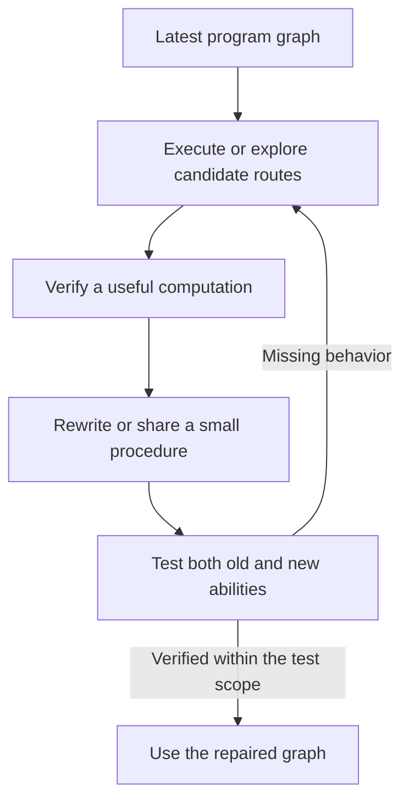

# Learning executable paths, not merely adjusting coefficients

Author: Arnav123-s. Clarified research target, 2026-09-04.
**Architecture proposal; not implemented by the current numerical core.**

## Child-friendly description

Imagine a small board of reusable instructions. A question enters, follows
several connected steps, and produces an answer. "Thinking" means trying
different routes through those instructions. If a route works and its answer
is verified, learning changes the board so that the useful procedure is easier
to reuse. The learned object is the procedure, not a saved question/answer pair.

Two procedures may share most of their steps and differ only at a junction.
Learning can redirect a connection, add a small branch, replace several steps
with an equivalent shorter composition, or discover a reusable loop. This is
closer to learning a program than updating a fixed network of weighted sums.

The current byte core does not implement this full design: it still learns
input/output matrices and continuous routing coefficients. Its repair-forward
experiment does not establish that a path-program learner works.

The repository also has an earlier typed-composition prototype. Its curriculum
supplies structural contracts directly rather than discovering the target
operators from example computation traces. That executor is relevant prior
work, but supplied routes are not evidence that the proposed learner can invent
its own reusable procedures.

## Mathematical object

Let $G$ be a finite directed program graph, with node instructions $o_v$ from
a declared executable library, conditional connections $E$, and working state
$s$. A trace records executed operations, branches, and iterations:

$$\tau=(v_1,v_2,\ldots,v_T),\qquad
y=\operatorname{Execute}(G,x,\tau).$$

A trace is an observable computation log, not a claim to record a person's
private thoughts or to explain all human reasoning. A reusable procedure must
generalize beyond that one trace; simply storing every trace would grow memory.

Candidate learning is a graph rewrite:

$$G_{k+1}=\operatorname{Rewrite}(G_k,\tau,\text{verified feedback}).$$

Possible rewrite moves are branch-condition changes, redirecting an edge,
replacing an instruction, introducing a bounded loop, factoring a shared
subprogram, and adding or removing a small connector. The operator library and
rewrite rules are explicit computational assumptions, not intelligence supplied
by a quantum metaphor.

For a verified set of old and newly acquired abilities $D$, a search objective
could be

$$\min_{G'}\;\operatorname{bits}(G')+
\lambda\,\mathbb E_{x\in D}\operatorname{cost}(\tau_{G'}(x))$$
$$\text{subject to }\operatorname{Execute}(G',x)=y
\text{ for }(x,y)\in D,\quad \operatorname{bits}(G')\le B.$$

Execution cost counts operations actually performed, including branches tried,
failed searches and any verifier. Minimum graph edge count alone is not minimum
time. The globally shortest correct program is generally not available from a
cheap universal algorithm; a practical implementation searches a bounded
grammar and reports the cheapest verified candidate it found.

## Forward repair without freezing a predecessor

The working branch stays on the latest graph and adds repairs; it need not
return to old parameters after each failure. Old versions may remain archived
for audit but are not consulted during inference. Some transformations can
have exact equivalence proofs within a defined operation system. A finite
regression test alone cannot supply that proof for arbitrary inputs.

If two requirements demand different answers for exactly the same input and
context, a route cannot make both correct. The specification needs an explicit
context distinction or a decision about which requirement was corrected.

## Multiple paths and finite memory

Classical execution can explore several candidate paths, sharing common
prefixes to avoid redundant work. A bounded beam or graph search is not a
quantum superposition: each evaluated operation uses device time and state.
Complex amplitudes can be optional routing mathematics, but do not confer
entanglement or free parallel computation.

Learned reusable rules may apply to arbitrarily many possible inputs without
storing each input. That is generalization, not unlimited recall of independent
facts. A fixed graph budget requires compression, replacement, or accepting
capacity limits. A graph's configuration is itself stored information.

## Research connection and decisive experiment

[DreamCoder](https://arxiv.org/abs/2006.08381) is a relevant original example of
program search and learned reusable abstractions. It is not this proposed graph
system, and does not establish unlimited fixed-size memory or frontier ability.

### Preserve meaning while changing the path

[egg](https://arxiv.org/abs/2004.03082) and its
[author's explanation](https://blog.sigplan.org/2021/04/06/equality-saturation-with-egg/)
offer another ingredient: compactly share equivalent expressions in an e-graph,
then extract a low-cost represented computation. Equivalence classes are not
separate answering models. The search representation can still grow and needs
a strict budget. Keeping alternatives during optimization does not require
executing every alternative in the extracted model.

The quantum-computing connection is
[ZX-calculus and PyZX](https://arxiv.org/abs/1904.04735): graph transformations
can optimize and validate quantum circuits within their defined mathematical
semantics. The transferable principle is **sound structural rewriting**, not
entanglement as a memory or instantaneous-answer mechanism. Kavi does not use
PyZX, quantum hardware, or an e-graph in its present implementation.

Crucially, equivalence-preserving rewriting cannot repair a wrong function:
it preserves that wrong function too. Separate two operations:

1. **Repair:** discover a changed computation that satisfies both old and new
   requirements. Conditional branches or small shared procedures may help;
   discovering a correct branch condition is part of learning, not assumed.
2. **Compress:** use sound identities to reorganize that repaired computation
   without changing its meaning. Extract only the chosen program for inference.

For example, for a pure finite string s, reversing it twice returns s. Replacing
that two-operation subpath with an identity path preserves every string input,
not merely a sample of tests. But replacing a wrong endpoint selector with
the right one is a behavior change and needs independent justification.
Algebraic identities must respect types and domains; exact-real identities can
fail for floating-point operations, overflow, division by zero or side effects.

These connections motivate a future synthesis-and-rewrite experiment. The
papers do not demonstrate that combining these ingredients yields the proposed
general learner. Sources inspected here were the original paper abstracts and
the egg author's technical explanation, not an exhaustive review of the fields.

A distinct prototype would need:

1. A small documented instruction grammar, with no hidden full task solver.
2. A trace-producing executor with explicit time, branching and memory bounds.
3. A learner that changes graph instructions/connectivity, not input/output
   weight matrices disguised as paths.
4. Independent feedback and verification; no expected test answer at inference.
5. Tests that compare before/after behavior on old tasks and genuinely new
   compositions, including ablations against fixed routing and parameter learning.
6. A complete ledger of graph bits, working memory, archived versions, search
   attempts and wall time. Count learning/search cost as well as final execution.

This remains the next architecture-level experiment. The
[repair-forward comparison](../experiments/2026-09-04-forward-repair.md) measures
only a narrower question in the existing core and must not be presented as
the new path-program model.
