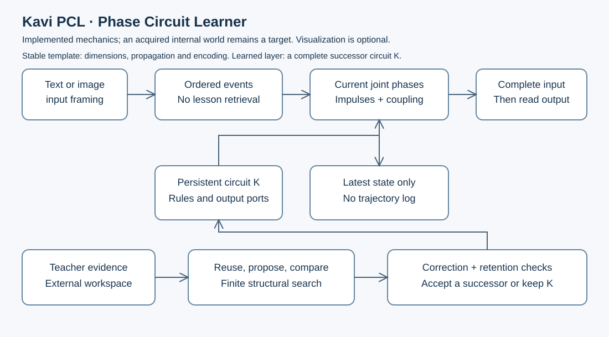

# Kavi PCL: Phase Circuit Learner

Author: [Arnav123-s](https://github.com/Arnav123-s)

8 September 2026. Architecture, implementation boundary and staged development plan.

## Purpose

PCL studies whether supervised reconstruction of interacting recurrent circuits can acquire reusable distinctions and procedures. An input changes the circuit's current state. Later input can redirect an interpretation that earlier input left unresolved. A teaching round constructs complete candidate circuits using inherited structure and new relationships, then selects a successor. The deployed circuit need not retrieve the original lesson.

The intended outcome is a conversational learner whose acquired configuration forms an internal executable world: learned relationships, distinctions and transformation rules through which new input produces answers. This world is the retained organization of learning, not a visual display added to a separate answer system. Visual reasoning and image generation are optional extensions. The current implementation is a small discrete phase-circuit substrate and structural learning procedure. It has not acquired this internal world, general English, psychology, emotions or research-level science. The previous source-based psychology experiment used a different event-graph learner and failed its generalization tests; it is not evidence that PCL understands psychology.

“Phase” names a component's position in a finite cycle. “Circuit” names the executable relationships between components. “Learner” names supervised selection of those relationships. PCL is a working engineering name, not a claim of a new mathematical class or a literal quantum brain. Earlier Kavi implementations remain comparison systems.

## Design contract

1. Consume each event in order. The effect of a word or character depends on the current configuration state, not solely its identity.
2. Allow one component to hold its state while another changes. A later event can activate their relationship again. The same component can participate in several computations.
3. Separate transient interpretation from persistent learning. Merely receiving an input does not establish that a structural change is correct.
4. Release an output only after the caller completes the input. An unknown or failed transition must not release an obsolete answer.
5. Prefer reusing existing dynamics before proposing additional structure. A correction must be tested on related unseen cases and earlier valid abilities.
6. Keep original lessons outside deployed inference. Measure the configuration itself as persistent memory; do not claim zero storage or guarantee that a graph cannot memorize.
7. Treat learned meanings as hypotheses about behavior. Test them by changing inputs, composition and relevant internal relationships.
8. Keep source collection, teaching, candidate selection and final evaluation separately inspectable.
9. Treat the internal world as the learned executable organization itself. Persistent relationships shape possible activity; a particular input activates a situation within that organization. Neither image processing nor a rendered display is a prerequisite.



## Two kinds of change

There are also two structural layers. A relatively stable template defines the allowable phase dimensions, propagation schedule, input codec and coupling capacity. The learned circuit above it specifies event impulses, interactions and output organization. The main learning path creates a fresh complete circuit for each proposal; it does not mutate the active circuit one connection at a time. After verification, the accepted successor becomes the active generation. A rejected round keeps the earlier circuit available rather than installing a worse circuit merely to increment a generation number.

The implementation is [layers.py](../kavi/phase/layers.py). Its `CircuitTemplate` is distinct from `CircuitGeneration`. Reconstruction samples inherited relationships and new ones across the complete definition, then rebuilds its readout from the declared evidence. It stores the resulting circuit, not an indefinitely growing chain of parent circuits. The initial reuse candidate tests whether the existing dynamics can already support the lesson. The current inheritance probability, proposal grammar and selection procedure are supplied. Learning the template or the reconstruction algorithm itself is a later target.

Writing a complete new object is insufficient on its own: its behavior must incorporate earlier valid capabilities. Current admission checks the finite protected bank. It does not prove that every untested earlier behavior survives. A template change is explicit and is not performed by the present reconstruction procedure. State transfer across a template revision also remains unimplemented.

Let K be a persistent configuration, z its current activity, x an input event and e supervised evidence. The two updates are:

$$z_{t+1}=F_K(z_t,x_t),\qquad K_{r+1}=L(K_r,e_r).$$

The first equation describes reading or executing. The second describes learning. K can change between turns without preserving a transcript. It nevertheless stores learned information. The eventual design may propose temporary structural changes within a turn; admission into persistent K still needs a correction or other declared verification signal. The PCL prototype currently changes activity during a turn and selects persistent replacements between invocations.

An input is not physical fuel. Execution time, current activity, candidate structures and teaching workspace consume device resources. A finite circuit also cannot preserve every distinction among infinitely many histories. Histories that reach the same state become indistinguishable to subsequent execution unless additional state or structure is introduced.

## Implemented phase dynamics

For n components, component i has phase p_i in the integers modulo m_i. The joint state is p=(p_1,...,p_n), initially zero. An input impulse has the form (x,i,d): event x increments phase i by d. Several impulses can target the same component.

First apply all matching input impulses:

$$q_i=\left(p_i+\sum_{(x_t,i,d)\in I}d\right)\bmod m_i.$$

A coupling (j,a,i,d) adds d to component i when component j has phase a. Each propagation tick reads one common snapshot:

$$q_i^{k+1}=\left(q_i^k+\sum_{(j,a,i,d)\in C}\mathbf{1}[q_j^k=a]d\right)\bmod m_i.$$

All increments are applied simultaneously. Reordering the coupling list therefore leaves a tick unchanged. A fixed number of ticks follows each event. There is no assumption that the circuit reaches a physical equilibrium. Zero net increment holds a phase; later input can change it. The current implementation has no autonomous motion between input events.

The output map assigns integer ports to selected joint phases. An unassigned phase is unresolved. Output ports are not natural-language answers. Readout happens only on explicit input completion. An unrecognized event marks the invocation failed; it cannot be skipped to recover an earlier answer.

The runtime retains the latest joint phases and status flags, plus the configuration and work counter. It does not retain the input trajectory. For fixed moduli, the phase state requires at least enough bits to distinguish its reachable states, at most the naive representation of sum_i ceil(log2(m_i)) phase bits, excluding object overhead. The runtime's Python objects and counters occupy additional storage.

This is a finite transition system with a factorized state representation. Its joint state space has at most product_i m_i states. A large product is a representational capacity, not evidence that every state contains useful knowledge or that search over those states is cheap.

## Package organization

| Module | Responsibility | Boundary |
| --- | --- | --- |
| [model.py](../kavi/phase/model.py) | Immutable circuit schema, validation, serialization and complete-input execution | Moduli, impulse semantics, coupling semantics and readout format are supplied |
| [runtime.py](../kavi/phase/runtime.py) | Input impulses, synchronous coupling, held phases, final gate and interruption failure | Fixed ticks; no continuous differential-equation solver |
| [encoding.py](../kavi/phase/encoding.py) | Distinct text and grayscale input framing | Lossless supplied encoding, not a learned semantic representation |
| [learning.py](../kavi/phase/learning.py) | Reuse-first structural proposals and supervised phase readouts | Local edits from a supplied grammar; no learned update algorithm |
| [selection.py](../kavi/phase/selection.py) | Correction scoring and explicit earlier-behavior obligations | Finite-bank retention only |
| [layers.py](../kavi/phase/layers.py) | Stable template, full candidate assembly, inheritance and transactional generation replacement | Main reconstruction path; template and proposal procedure remain supplied |
| [evaluation.py](../kavi/phase/evaluation.py) | Frozen evaluation with wrong/unresolved counts and configuration fingerprints | Caller must keep the bank separate from teaching and selection |
| [phase tests](../tests/test_phase_configuration.py) and [learning tests](../tests/test_phase_learning.py) | Executable regression checks | Small authored test fixtures are not curriculum data |

The package uses the existing interruptible work counter. Configuration objects are immutable, and a failed update leaves the caller's old model available. Separate invocations do not share phase activity. JSON round trips preserve the validated circuit. The package does not launch background training or change its own source code.

## What learning does now

The teacher supplies complete event sequences and outcome ports. The main `reconstruct` procedure first tries the current dynamics, then builds complete candidate impulse and coupling collections from inherited and newly proposed relationships. Each proposal executes the evidence and attempts to assign final phases to the supplied outcomes. Two examples requiring different outcomes at the same final phase reject that proposal. The earlier `teach` procedure in `learning.py` remains a local-edit comparison, not the primary two-layer reconstruction algorithm.

Among admissible candidates, selection minimizes correction errors, then serialized bytes. Every candidate must pass the explicit protected bank. The result records examined proposals, truncation, acceptance and residual errors. All returned information is configuration and measurements; the returned model contains no original sequences. The teacher still needs transient examples to compare candidates. Retaining a phase-to-port association can itself encode a narrow answer, so absence of a text lookup table does not prove abstraction.

The proposal order and grammar are engineered. Changing one rule can alter many future trajectories, but local search can miss a solution requiring several coordinated changes. A finite candidate limit is not evidence that no solution exists. The current prototype does not grow its component count, infer hierarchical groups, synthesize new operator semantics, perform conversational credit assignment or learn how to learn. Those are explicit stages below.

The initial PCL regression methods check order sensitivity, delayed release, synchronous interactions, unknown-input handling, current-state retention, correction, blocked regression, encoding, serialization and interruption. The [layer tests](../tests/test_phase_layers.py) also check template retention, whole-circuit reconstruction, reproducibility and transactional interruption. One fixture acquires a recurrent impulse from two short labelled streams and checks longer lengths. The phase grammar makes that task expressible; this is an algorithm check, not evidence of natural-language learning or a new theorem.

## Input representation and optional visualization

The text adapter preserves each Unicode code point, including whitespace, case and punctuation. It keeps `a` and `α` distinct. A future learned interpretation can connect their uses when the context supports that relationship; the input codec must not silently declare them equivalent. The grayscale adapter preserves dimensions, row boundaries and pixel values. These are separate namespaces so identical numbers in an image and in a sentence cannot accidentally share a raw port.

Encoding is not encryption. Encryption needs a stated threat model, keys and a security construction. A private-looking internal representation has no automatic secrecy guarantee. The target here is a learned representation whose usefulness is measured by what can be reconstructed, distinguished and composed from it. It need not be readable as a human word at each node.

Optional visual work has three separate milestones: recognize relationships in supplied images; maintain or transform spatial relationships; and produce a diagram that agrees with a solved problem. These do not gate development of the internal world. Accepting image events satisfies none of them by itself. The existing adapter supports grayscale framing only. Color, audio, video and arbitrary file formats remain unimplemented.

## Internal world model

The internal world is where the shape of learning resides. It consists of the learned circuit's persistent distinctions, relationships and executable rules. Reading an input activates and changes a current situation within that world. Answering means following or transforming those relationships under the input's constraints. Teaching constructs a successor world by combining useful inherited organization with new learned structure, subject to checks of earlier valid capabilities.

The Matrix analogy expresses an internally constructed reality governed by the system's acquired organization. It does not require a three-dimensional scene, simulated light, human-like imagery or a copy of physical reality. Mathematical relations, word meanings, intentions and causal possibilities can belong to this world as executable structures. A future display would expose an interpretation of those structures; the structures must already do useful work without that display.

The two-layer formulation remains: the relatively stable template supplies the available computational forms, and the reconstructed learned circuit supplies the world's acquired organization. In the notation above, K carries that organization and z is its current activity. A particular situation need not become a permanently stored episode. General relationships can persist in K after its temporary activity is discarded. This distinction does not eliminate memory costs: K stores learned information and z requires working storage.

Use the term *world model* for this target. It does not assert that the program experiences a reality or has conscious imagery. A representation must distinguish information stated in the input, conclusions inferred under assumptions, counterfactual alternatives and unresolved details. The system must not turn an imagined alternative into a factual premise merely because its internal circuit can represent it.

Learning goals are identity across descriptions, binding properties to the right subject, logical and causal relationships, controlled hypothetical changes, and answer grounding in the resulting activity. Spatial relationships can be added when relevant. Tests must include descriptions with the same words but reversed relationships, contradictions, missing information and counterfactual questions. The learned world should support different questions about one situation and change the relevant answers when a premise changes.

This is not implemented by the current phase-to-port readout. The implementation target is acquisition of the relationships and transformations that constitute the world, with answers depending on their execution. A separately stored scene description, a manually labelled graph or a visualization of arbitrary phases would not establish that the circuit learned such a world. The present prototype supplies a substrate for investigating this target; no acquired internal reality or grounded answer generation is claimed.

## AEG connection and research boundary

The AEG research discussions inspected for this revision describe resource-constrained adaptive systems, fast activity and slower structural change, and mechanism objects with explicit assumptions and observables. The relevant engineering lesson is to specify what a mechanism does and when it is valid before composing it with another mechanism. This review covered accessible discussion text from the neuroscience/knowledge-representation, behavioral-equation and UGIL research-plan discussions. It did not independently reconstruct or verify every attached monograph, simulation or claim in AEG, and it is not a complete review of the AEG archive.

For PCL, a proposed component needs an input/output interface, state definition, transition rule, validity conditions, cost measurements and a testable effect. Approximate resemblance should propose a connection; it should not certify equivalence. Pairwise near-equality is not generally transitive, so it cannot justify unrestricted merging of an entire group. Likewise, a one-way simulation preserving old executions is different from a bidirectional equivalence or a repair that intentionally changes wrong behavior.

Physics, chemistry and quantum mathematics can suggest actual operators: diffusion, nonlinear coupling, damping, conservation constraints or signed interference. Each must have executable semantics and a comparison against a simpler operator. None is installed in PCL merely by calling a phase a pendulum, heat source or qubit. An ordinary digital simulation inherits ordinary computation and storage costs.

Coupled oscillatory sequence models already exist. Rusch and Mishra's [coRNN](https://arxiv.org/abs/2010.00951) uses discretized nonlinear oscillator dynamics and gradient-based learning. PCL currently uses finite modular phases and structural proposals. Both are recurrent dynamical computations; the difference in update method does not establish a performance advantage. Oscillation itself is not a novelty claim.

## Curriculum and acceptance plan

Curriculum order is an experimental choice. Psychology cannot teach language to a system that cannot yet interpret its sentences. Basic language and classification therefore precede advanced readings; richer mathematics follows once elementary compositional interpretation works. All source-based stages require original, attributable material and independent evaluation. No synthetic lessons or fabricated diary entries are admitted. Unit fixtures remain separate.

| Stage | Teaching objective | Test for advancement |
| --- | --- | --- |
| 0. Execution contract | Ordered input, interaction, delayed output, correction and interruption | Regression suite, explicit supplied-versus-learned audit; implemented as small checks |
| 1. Classification | Learn distinctions shared across authentic examples rather than grouping by spelling alone | Unseen exemplars, class balance controls, held-out forms, order and irrelevant-input controls |
| 2. Meaning and elementary language | Relations, roles, reference, negation, comparison, variable binding and instruction changes | Unseen combinations; reversed roles; corrected interpretations; independent authors |
| 3. Internal executable world | Acquire persistent relationships and transformation rules; activate situations from language within that organization | New combinations, multiple questions about one situation, premise changes, counterfactuals and missing-information checks |
| Optional visual extension | Connect original licensed diagrams and images to the same learned relationships; add a display later if useful | New layouts and sources; answers remain grounded in the underlying circuit; not a prerequisite for stage 3 |
| 4. Conversational correction | Connect a correction to the relevant earlier interpretation; ask when information is missing | Correct related unseen cases; retain valid old cases; useful rather than habitual clarification |
| 5. Psychology and first-person accounts | Learn claims about thought, intentions, uncertainty and emotions; distinguish observation from interpretation | Questions from separate textbooks; source contradictions; distinguish a person's report from a general law |
| 6. Mathematics | Arithmetic, algebra, discrete mathematics and calculus through reusable procedures | New values and problem structures; explicit assumptions; symbolic or numerical independent verification |
| 7. Sciences | Units, causal relations, laws and models across physics, chemistry and biology | Unseen textbooks; unit and boundary checks; changed assumptions and counterexamples |
| 8. Research work | Formulate hypotheses, derive consequences, identify missing evidence and verify solutions | Problems held outside teaching and selection; independent assessment; reproducible artifacts |

Psychopathy and related personality concepts belong within psychology education, not as an assumed shortcut to intelligence. The proposed benefit of teaching those topics before other subjects must be tested against a matched general-psychology curriculum. Patrick's [primary educational module](https://nobaproject.com/modules/psychopathy) describes competing conceptions and differentiated traits; it does not establish that these conditions are a superior or compressed cognitive architecture. Recognizing or producing emotional language also does not demonstrate subjective emotion.

Diaries provide first-person descriptions filtered through memory, purpose and writing. They are valuable sources, but not direct recordings of neural activity or objective explanations of all behavior. Record original language, edition, author, translation and documented provenance. Do not infer a diagnosis from writing style or select people on an unsupported assumption of exceptional intelligence.

## Development sequence

1. Establish the narrow phase substrate and regression checks. Completed in this revision; no broad curriculum promotion follows.
2. Design a source-backed classification packet with inspectable annotations and a frozen independent bank. Compare the existing event learner, PCL with coupling, and PCL without coupling under equal work budgets.
3. Add learned input grouping only if it improves unfamiliar cases. Compare raw code-point events, supplied word events and acquired grouping, counting all representation storage and selection work.
4. Develop the internal world as reusable learned relationships, transformation rules and interacting groups within the circuit. Require new combinations, state isolation and evidence that changing a relevant relationship changes the appropriate answers. Do not require a visual renderer or an image curriculum first.
5. Add transactional conversation updates. Keep only needed current-turn state in the model; retain review evidence locally outside inference. Test disagreement, correction scope, ambiguity and rollback.
6. Explore bounded growth, splitting and consolidation. Permit global replacement only with a state-transfer contract and explicit preservation obligations. Protect valid abilities, not every past mistake.
7. Compare physical operators one at a time, then selected combinations. Include ordinary discrete controls, matched total cost and failed searches. Learn operator selection only after useful operators have been demonstrated.
8. Advance through the curriculum table only when the preceding capabilities generalize. Keep the final test bank outside training; corrections to a failed test require a new held-out bank for the next claim.

Stages 2–8 are a plan, not completed implementation. Increasing a benchmark score, accumulating text or making a trace complicated does not by itself establish the intended model.

## Evaluation and resources

For every source-based run, record source hashes and licences, partitions, candidate grammar, seed, maximum candidates, work budget, runtime configuration and selected model hash. Report training, development and final scores separately, along with abstentions, wrong answers, earlier-skill losses and baseline scores. Learned uncertainty needs calibration and decision-quality measurements; an unresolved transition is not automatically learned doubt.

Report persistent circuit bytes, input representation bytes, runtime overhead, temporary phase activity, candidate copies, retained teacher data, total search work, wall time, CPU time and available memory telemetry. The present work counter covers named operations and serialized candidate bytes; it is not an instruction counter or a replacement for timing and memory measurement. Proposal enumeration, Python allocation, input decoding and host overhead also cost resources.

The installed limits are experimental controls, not a claim that useful learning requires a particular ceiling. Long-running courses must expose pause and stop, persist an auditable run state and never resume silently. This revision adds no background course. The previous completed runs and new regression checks are retained as the starting evidence for the next curriculum.

## Reproduce the implementation checks

Validation on 8 September 2026: all 290 repository tests passed, including 14 PCL tests and four earlier-circuit transfer tests. This count is a software regression result, not a count of learned abilities. Existing published artifact and implementation fingerprint checks also passed. No source-based PCL curriculum was run.

```powershell
python -B -m unittest tests.test_phase_configuration tests.test_phase_learning tests.test_phase_layers
python -B -m unittest tests.test_event_transfer
```

The main package interfaces are `CircuitTemplate`, `CircuitGeneration`, `PhaseConfiguration`, `PhaseActivity` and `reconstruct`; `teach` is the local-edit comparison. A teacher supplies source-derived event sequences and integer output ports; the deployed model receives events without consulting that teaching bank. There is no PCL conversational application or trained visual model to launch yet.
