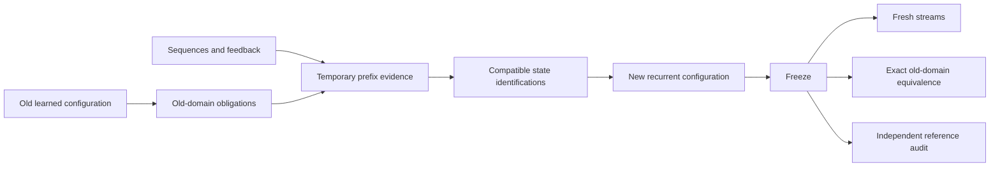

# Recurrent configuration experiment

Author: [Arnav123-s](https://github.com/Arnav123-s)

Protocol recorded before the measured run, 7 September 2026.

## Question

Can examples determine reusable recurrent connections, and can a successor configuration acquire a new interpretation while preserving the valid behavior of its predecessor?

The existing incremental sentence compiler produces a directed acyclic graph from annotated frames. This experiment uses a separate finite-state learner. Its teacher supplies token sequences and final labels, without internal state names or target connections. A supplied state-merging procedure constructs a deterministic Moore machine. Its saved configuration contains transitions and output labels; teaching sequences remain in the external learning workspace.

This isolates recurrence, correction, late evidence and configuration replacement. It does not test prose understanding, biological simulation, unbounded reasoning or a learned learning algorithm.

## Model and learning rule

For a graph $K=(Q,\Sigma,\delta,q_0,o)$, input tokens update activity by

$$q_{i+1}=\delta(q_i,x_i),\qquad f_K(x)=o(q_{|x|}).$$

Apart from the input iterator and optional inspection trace, inference needs only the current state identifier. Each token selects one outgoing connection. Unknown transitions or outputs return unresolved. Recurrence means a state can be visited again as subsequent tokens arrive; there are no autonomous transitions between tokens in this experiment.

The learner builds a prefix tree from labeled sequences, then proposes identifications between an established state and a frontier state. Identifying states also identifies their equally labeled successors. A proposal is rejected if this closure joins different known outputs. Compatible proposals are committed in a seeded order until the frontier is exhausted. Finite evidence need not determine the correct or smallest graph.

This is a state-merging approach to automata inference. [Oncina and García (1992)](https://doi.org/10.1142/9789812797902_0004) studied regular-language inference from labeled examples. [Lang, Pearlmutter and Price (1998), sections 7–10](https://www.bcl.hamilton.ie/~barak/papers/icgi98.pdf) describe compatibility, determinization and the red/blue frontier. This experiment uses first compatible merges, without their evidence-driven scoring. Connections are learned; the state representation, compatibility rule, merge ordering and executor are supplied.

## Teaching sequence

1. **Ambiguous lesson.** Teach the empty sequence, `b`, and `aa`, all with output zero. Record the prediction for `a` before feedback. These observations allow an incorrect constant-output hypothesis.
2. **One correction.** Add `a → 1`; rebuild the graph and measure transfer to longer sequences. Keep any failures in the record.
3. **Shared foundation.** Teach every `a,b` sequence of length at most four, labeled by the parity of the number of `a` tokens. The unfolded prefix-tree control receives exactly the same observations.
4. **Late interpretation.** Introduce `?a` and `?b`, selecting which stream's parity to report. Either selector may arrive after the events it refers to. The default is stream `a`. Teach every sequence containing a selector up to length four. Earlier `a,b` labels come from the previous learned graph, without reading its original lessons. Rebuild one successor graph from these obligations and new evidence.
5. **Development repairs.** A fixed bank of 256 distinct sequences of length 5–12 can supply at most twelve counterexamples per round for at most twelve rounds. Log predictions before adding labels. This bank is training/selection evidence. Stop repair when it has no errors or the allowance ends.
6. **Frozen evaluation.** Save models before generating final test banks. Evaluate 256 distinct streams of length 13–64 per condition, using seeds separate from teaching order and development data. No final answer changes the model.

Repeat with merge-order seeds 7, 19 and 43. The order changes search, not the label rule. Keep the prefix-tree control at each stage. Random final accuracy is separate from exact finite-state checks. Development feedback can improve a candidate, but final criteria remain unchanged.

## Retention and exact audit

The old valid domain is every finite string over `a,b`. After freezing models, traverse pairs of old and new states under this alphabet. If every reachable pair has equal output and both transitions exist for every permitted token, their answers agree for all finite streams in this domain. On failure, return a shortest distinguishing sequence.

A separately authored reference machine permits the same comparison over the full alphabet. This evaluator's state structure is never passed to the learner. Exact audits occur after freezing and never supply repair examples during the run. Finite-state equivalence is possible here because the model class is finite and deterministic; it does not solve preservation for arbitrary programs.

The successor may grow or shrink and change all identifiers and wiring. It need not contain a separate old model. Finite old-behavior obligations alone do not guarantee retention; the separate product audit determines whether retention actually holds.

## Budget and measurements

One worker, five minutes maximum wall time including pauses, at most 2,000 prefix states and 20,000 proposed merges per learning call. Stop if observed worker working-set memory exceeds 512 MiB. Poll pause, stop and limits during graph construction, merging and evaluation. Existing hardware policies remain in effect. A visible window presents lessons, failures, repairs and learned connections in ordinary language.

Record teaching counts, generated old-domain obligations, prefix and learned states, transitions, serialized model bytes, proposed merges, merge-closure work, stage durations, process peak memory and external run-folder bytes. Report unavailable measurements. UI pacing is counted separately. The inference model contains no examples, but learning uses external evidence and its storage is counted.

Criteria fixed in advance: correction transfers; folding outperforms the same-data prefix control on longer inputs; later input selects an earlier stream; no old-domain regression; all final failures remain visible. Score each independently. Completion alone is not success.

## Follow-up: coverage repair

Recorded after the first completed trial and before the follow-up. The first trial preserved the old domain exactly but failed the new task on every seed. A single correction left `ab` unresolved. A 256-case development bank reached full accuracy while fresh longer streams still failed; its coverage was insufficient.

The follow-up keeps the learner and three merge-order seeds unchanged. It adds the already exposed correction `ab → 1`, then teaches every sequence up to length six for the late-selection task. All 127 old-domain observations up to that length are generated from the old configuration; 5,334 selector-containing sequences receive teacher labels. Together they cover 5,461 sequences. The temporary prefix-state ceiling increases to 6,000; the five-minute, single-worker and 512 MiB limits stay unchanged. This is more informative externally supplied teaching, not a new learning algorithm.

Development checks use the same bank and retain the same repair allowance. Frozen final streams use new seeds 90003 and 90004; the earlier final bank is not reused as fresh evidence. Exact old-domain and full-task audits remain unchanged. The additional correction is evaluated as a separate stage, so the original single-correction failure cannot disappear from the record. Report all original and follow-up costs separately.
