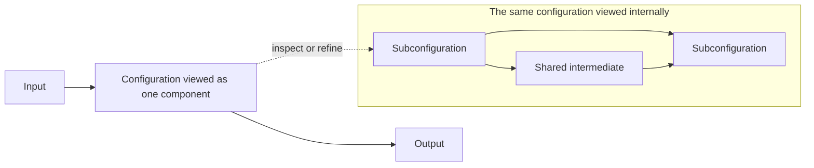
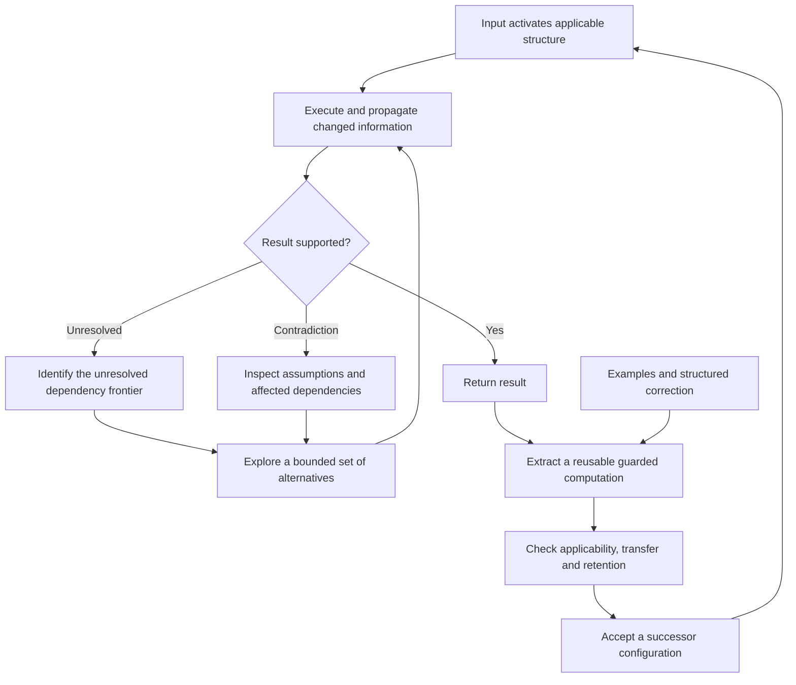

# Reusable configurations, local reasoning and learned shortcuts

Author: [Arnav123-s](https://github.com/Arnav123-s)

The [interacting-configuration specification](INTERACTING_CONFIGURATIONS.md) develops the stateful part of this interface. A shared definition can have distinct current states in different uses. Repeated component identities need not imply repeated meaning: order, coupled activity and later input matter. It also records the proposed learning of component groups and the current execution checks.

7 September 2026. Architecture refinement following the [mechanism audit](../experiments/2026-09-07-mechanism-audit.md). The later [composition experiment](../experiments/2026-09-07-composable-science-and-conversation.md) implements a shared acyclic interface, completion at a supplied missing-call boundary and dependency-guarded expansion. The broader relational mechanism below remains unimplemented. The [alignment audit](DESIGN_ALIGNMENT_AUDIT.md) identifies the remaining gaps, including learned interpretation and whole-configuration replacement beyond finite formal tasks.

## The intended learning cycle

Kavi should use an acquired configuration directly when its conditions fit. Where the current computation cannot proceed, it should investigate that unresolved part, reuse relevant established components, and propagate the consequences of alternatives through their dependencies. A successful resolution should become a reusable configuration, subject to its applicability conditions and earlier valid behavior. Corrections should repair the relevant relationship or conditions, so similar future cases can benefit without replaying the original lesson.

This is different from repeatedly searching the entire configuration. It is also different from choosing a stored answer by a task label. The desired retained object is a computation with variable inputs and conditions for use. Those conditions concern the input and its relationships, not a separate externally supplied subject tag.

The previous experiment perturbed individual transitions under a development score and a temperature schedule. It did not implement the complete cycle above, structured explanatory feedback, or interacting physical dynamics. Its negative temperature result concerns that search procedure, not the full design described here.

## One object at several scales

A component and a pathway should be two views of an executable configuration. From outside, it exposes ports and behavior. From inside, it contains other configurations and connections. A connection may itself perform a transformation and therefore have an internal configuration.

Write a configuration as

$$C=(I,O,S,G,\Delta,\Gamma),$$

where $I$ and $O$ are input and output interfaces, $S$ is local state, $G$ is its internal graph, $\Delta$ describes execution, and $\Gamma$ records applicability and behavioral obligations. This is an interface definition, not a claim that the representation or its semantics have already been learned.

If $C_1:A\to B$ and $C_2:B\to D$ have compatible interfaces, their composition $C_2\circ C_1:A\to D$ is another configuration of the same kind. Several configurations can share a component definition. For a stateful component, sharing its definition does not require sharing one active state: separate instances need separate state unless coupling them is intended. Feedback can revisit a component with new temporary state; a feedback connection needs explicit initialization, scheduling and termination or stopping behavior.

A trace is one execution through a configuration. A trace alone is not yet a reusable rule: numerical values must be represented as inputs where appropriate, relevant conditions must be retained, and alternative cases must be handled. Collapsing an observed trace into a named box without these steps can simply hide a memorized episode.

The mathematical connection is to compositional open graphs and graph rewriting. [Dixon and Kissinger](https://arxiv.org/abs/1011.4114) give a formal account of open-graph composition and rewriting. That supplies relevant structural language; it does not provide Kavi's learning algorithm or establish the correctness of arbitrary feedback dynamics.

## Equations can become executable configurations

The inventory is not restricted to arithmetic or physics. An equation, relation, solver, logical deduction or transformation of another configuration can become a component when its behavior is represented and its use is understood. Learning may acquire that behavior, its applicability, its implementation, or some combination of them. These are different levels of supervision.

| Example | Configuration behavior | Required interpretation |
| --- | --- | --- |
| Rectangle area | Length and width produce area | The shape is a rectangle; units and representations agree |
| Differentiation | A represented function produces another represented function | The expression language and differentiation assumptions are defined |
| Quantum evolution | A Hamiltonian, initial state and interval produce a later state | Complex state, model assumptions, units and numerical accuracy are specified |
| Relativistic rest energy | Rest mass and the speed of light produce rest energy | The relation is $E_0=mc^2$, with the appropriate physical interpretation |
| Relational reasoning | Several facts restrict possible assignments or actions | The relations and their conditions have defined or acquired semantics |
| Configuration improvement | A configuration and evidence produce a proposed successor | The rewrite preserves the required interface and verified obligations |

For example, a learned multiplication component can participate in rectangle area, scaling and other computations. Acquiring the interpretation of area is additional learning; attaching the word “area” to multiplication does not supply that interpretation. Differentiation needs a function representation, while a quantum solver needs a state representation. A common configuration format can accommodate different interfaces without treating all inputs as interchangeable numbers.

An operation on configurations fits this format too. Differentiation can accept the representation of $f(x)=x^2$ and produce a representation of $f'(x)=2x$. The produced configuration can then run on numerical inputs or become part of a larger configuration. This requires an expression representation and transformation rules; the current arithmetic catalog does not yet perform this operation. The example illustrates how learning can change both the available computations and the ways new computations are constructed.

The [equations-as-components study](EQUATIONS_AS_PATHWAY_COMPONENTS.md) states the quantum-evolution assumptions in detail. An equation may either model an external physical process or define an internal computational dynamic. The second use needs a task encoding and output interpretation that make the dynamic useful for solving the task.

## Interactions determine the available paths

The relationship analogy adds more than independent connection strengths. One condition can enable a process, a second can inhibit it, and a combination of several conditions can change which alternatives are admissible. A three-way or four-way relation may not be adequately described by separate pairwise links.

Represent such dependencies by hyperedges or factors over groups of variables. For a finite first implementation, let $D_v$ be the possible values at a port, let $N(v)$ be its adjacent known relations, and let $R_f$ be the permitted joint assignments to the ports $S_f$ of relation $f$. A local consistency update can remove a value $a$ at port $v$ when an adjacent relation has no compatible assignment for its other ports:

$$D_v\leftarrow\left\{a\in D_v:\forall f\in N(v),\ \exists r\in R_f,\quad r_v=a\ \land\ \forall u\in S_f,\ r_u\in D_u\right\}.$$

Here $r_u$ is the value assigned to port $u$ in the supporting tuple $r$. Support is checked separately for each adjacent relation. Those separate witnesses need not combine into one global solution.

The update must consult the whole participating group. It cannot independently score each edge and assume that their sum describes every interaction. Unknown relations remain unresolved; they must not be silently treated as verified constraints.

When a port changes, schedule the affected relations. Their consequences may change other ports, which schedule further relations. A local correction can therefore affect distant parts of the configuration through shared dependencies. A truly disconnected part cannot be affected unless there is a common input, global condition or connection that was omitted from the representation. No literal anger, friendship or betrayal module is required by this analogy.

Factor graphs provide a close mathematical relative. [Kschischang, Frey and Loeliger](https://www.isiweb.ee.ethz.ch/papers/arch/aloe-2001-1.pdf) show how local functions and messages can express global computations. Their exact results for cycle-free factor graphs do not make arbitrary cyclic dynamics exact or convergent. The proposed finite consistency engine is not automatically the probabilistic sum-product algorithm.

Local propagation alone can miss global contradictions. For example, three binary variables constrained to be pairwise different have no joint solution, even though every pair individually has compatible values. A settled local state must therefore not be confused with a proved valid answer.

## Explore only the unresolved computation

The proposed executor separates three cases:

1. **Applicable acquired path.** Its input conditions hold and its result has the required evidence status. Execute it without searching alternative complete programs.
2. **Unresolved choice.** Some compatible values, relations or subprograms remain. Explore a bounded part of that uncertainty, propagate its consequences and reuse unaffected work.
3. **Contradiction or failed check.** Reconsider the assumptions and dependencies involved. A familiar route is not exempt from correction merely because it has worked before.

The unresolved frontier is a property of the current computation. It includes missing bindings, incompatible relations, unknown subcomputations and competing completions. It is not simply low confidence in a whole-task classifier.

Equivalent intermediate work should be shared when equivalence is justified. A branch is temporary exploration, not a permanent new model entry. If several internal possibilities lead to the same answer, the executor need not distinguish them merely to produce that answer, but it still needs evidence that a valid completion exists and that the result meets the output contract. If it cannot establish the required condition within its budget, it returns unresolved.

Exploration order can later be learned, but initially it must be explicit and measured. A promising first comparison uses only unresolved dependencies as candidates and keeps the rest of the configuration fixed during that local investigation. This is a different question from whether random changes to arbitrary graph edges improve an overall score.

## Turn reasoning into a reusable shortcut

A candidate shortcut contains a guard $g$, a parameterized computation $P$ and its dependency versions. For a reference behavior $F$ and the claimed domain, the intended obligation is:

$$\forall x,\quad g(x)\Longrightarrow P(x)=F(x).$$

For nondeterministic relations, use an appropriate relation-preservation condition instead of function equality. Finite examples support only a finite empirical claim unless a stronger argument is available.

The construction procedure should identify which input relations and intermediate steps actually justified the result. It can replace incidental values or names by parameters, retain the necessary conditions, and compose the participating operations. The result may contain branches, shared intermediates or loops. A later query matching those conditions can invoke that configuration directly.

This is closely related to explanation-based learning and Soar's chunking. [Laird, Rosenbloom and Newell](https://iiif.library.cmu.edu/file/Newell_box00090_fld06269_doc0001/Newell_box00090_fld06269_doc0001.pdf) describe resolving difficulties through subgoals and acquiring rules from that problem solving. The [Soar procedural-learning documentation](https://soar.eecs.umich.edu/soar_manual/04_ProceduralKnowledgeLearning/) explains how such rules can bypass later similar reasoning, and also documents overgeneralization problems. Kavi has not implemented Soar's architecture or demonstrated equivalent learning.

This is the relevant interpretation of “jump to the best path”: acquired conditions select a useful computation before repeating its discovery. It does not imply that the globally best unseen solution can be selected without information or work. The cost of recognizing applicability, maintaining dependency versions and checking results must also be counted.

## Correction should carry more than a final number

Teaching can supply different evidence:

- A wrong output refutes the current behavior for that input.
- A corrected value constrains the result but may leave the faulty step unidentified.
- An intermediate correction identifies a missing or incorrect relation more narrowly.
- An explanation can state an applicability condition, an invariant, a counterexample or a valid construction.

The learner should use those forms distinctly. Until an explanation parser is learned and evaluated, a structured explanation supplied by the teaching interface is supervision, not independent language understanding.

When an underlying relation changes, affected shortcuts must be invalidated or rechecked. Otherwise a fast route can preserve the very mistake the correction was meant to remove. A retained dependency relation or guarded rule is structural memory. A private transcript kept for evaluation is not part of the deployed reasoning path.

“Does not repeat the mistake” is a testable target over the corrected domain and relevant variations. One example cannot guarantee that every future interpretation, numerical regime or dependency change is correct. A proved domain admits a stronger retention claim than a sampled one.

## Speed, size and quantum mathematics

Digital representation permits copying, composing, replacing and compiling structures more freely than biological tissue. It still uses finite memory and computation. A compact algorithm can cover arbitrarily many potential inputs, with work growing as needed; that is different from storing infinitely many independent facts or simultaneously executing infinitely many alternatives.

With $n$ fixed labeled components, there are $2^{n(n-1)}$ simple directed graphs without self-loops before type and validity restrictions. Cycles are allowed in this count; parallel edges are not. A huge possible configuration space does not make its useful members easy to find. Reuse, locality and learned search control matter because they can avoid some of that search.

An acquired shortcut can make a familiar class of problems much faster by removing rediscovery. It does not remove the operations needed to read input or produce the result. Biological thought also transforms information through physical dynamics; absence of conscious written calculation is not absence of processing.

Quantum mathematics offers several candidate representations, rather than one universal acceleration switch. [Aaronson and Gottesman](https://arxiv.org/abs/quant-ph/0406196) give efficient classical methods for a restricted stabilizer-circuit family. [Markov and Shi](https://arxiv.org/abs/quant-ph/0511069) relate classical tensor-network simulation cost to the circuit graph's treewidth: $T^{O(1)}\exp[O(d)]$ for their model, with $T$ gates and treewidth $d$. These results make structure relevant to simulation cost; they do not prove that a larger or more connected graph is easier, faster or more intelligent.

A useful quantum-inspired experiment must identify the representation, evolution or contraction rule, task encoding, observable output and verification procedure. It must compare the resulting learner with ordinary selective reasoning under matched total budgets. It should not substitute an unrelated annealing failure for that comparison.

## Implementation gaps and the closer experiment

| Requirement | Current implementation | Needed next |
| --- | --- | --- |
| Reuse an acquired computation | Procedure calls, shared intermediates and catalog execution | One compositional interface for primitive, composed, relational and stateful configurations |
| Let incoming information activate paths | Finite token transitions and constrained sentence graphs | General applicability conditions over the current relational state |
| Investigate only a blocked part | Whole small-program enumeration and separate edge-repair searches | Explicit unresolved dependencies with local alternatives and propagation |
| Use multi-component interactions | Some shared programs and recurrent state | Group relations, enabling/inhibiting conditions and controlled feedback updates |
| Convert successful reasoning into a shortcut | Selected programs can be retained | Dependency-based guard extraction and parameterized trace-to-configuration construction |
| Correct a shortcut after its basis changes | Pinned immutable dependencies reject version mismatch | Selective invalidation, repair and rechecking of dependent configurations |
| Learn how to investigate or compile | Update and search rules are supplied | A later, separately evaluated learner over those rules |

The next experiment should compare the same formal tasks under four conditions: complete search, local investigation without shortcut learning, local investigation with guarded shortcuts, and a negative control that omits a necessary guard. Begin with learned arithmetic components and small finite relational tasks whose full behavior can be checked. Reserve differently named variables, new values, changed dependency structure, unseen combinations and deliberately violated shortcut conditions for evaluation.

Measure first-encounter work, later work on new instances, branch proposals, repeated intermediate executions, matching cost, saved configuration bytes, correction transfer, old-skill retention and stale-shortcut errors. Include a change that makes an earlier shortcut invalid. Success requires both transfer and reduced total work, not merely returning a stored answer or moving the search into an uncounted preprocessing stage.

This is the specification for the next comparison, not a report that it has run. No new training result, physics solver, quantum advantage or mastery claim is introduced by this revision. Earlier deferred external-review recommendations remain deferred; the proposed selective-reasoning design is recorded separately for implementation and measurement.
