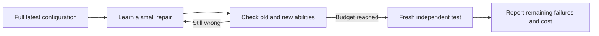

# Repair forward: keep the latest and repair earlier behavior

Author: Arnav123-s. Protocol written before execution, 2026-09-04.
Status: completed isolated comparison; no live replacement.

## Changed requirement and scope

The previous search could choose a smaller fraction of a learned change.
This experiment instead continues from the **full latest trained configuration**.
A failed development check becomes feedback for that same candidate's next
update. No earlier checkpoint is restored and no update is interpolated
against the predecessor. Only the final iterate of each run is assessed.

The starting point is the chronologically last trained candidate in the
small-repair report: joint repair, seed 53123, with 80,159 updates. This choice
does not use final-test accuracy. The old 79,979-update model only identifies
verified earlier successes for teaching/evaluation; it is never called during
candidate inference. All original and added parameters remain trainable.

The subsequent clarification asks for learning executable paths themselves,
not primarily numerical coefficients. **This experiment is not that complete
architecture.** It tests forward repair within the existing numerical core.
The [path-program design](../docs/PATH_PROGRAM_LEARNING.md) states the difference.



## Two methods

- **Reuse:** continue learning with the eight existing repair connections.
- **One jump:** add one context-sensitive connection, then continue learning.

The additional edge carries a complex signal from source $s$ directly to
destination $d$, using the earlier contextual repair law:

$$q=\sigma(w^\top[\Re z_s,\Im z_s,\Re e_d,\Im e_d]+b),\qquad
\delta m_d=\tfrac12\tanh(\beta)\,q\,e^{i\phi}z_s.$$

Initially $\beta=0$: insertion preserves the latest outputs before learning.
This adds seven float32 parameters (28 parameter bytes), two graph indices,
optimizer moments, gradients and computation. Runtime memory is much larger.

Choose endpoints from eight predefined, unoccupied pairs. A temporary probe
adds eight zero-effect edges and differentiates the feedback loss with respect
to their gains. Select the largest absolute derivative, discard that probe
without any optimizer step, and insert only the chosen edge. Its eight
feedback presentations and probe time are counted separately.

This is a first-order heuristic among eight choices, not a global shortest-path
search. All soft-gated edges are evaluated. "Shortest" here means comparing
zero versus one added edge at matched update budgets, not proving the shortest
correct computation. The candidates contain no answer-lookup table.

## Preserve both generations of successful behavior

For each bank define correct-question sets

$$O=\{x:f_{old}(x)=y_x\},\quad N=\{x:f_{latest}(x)=y_x\},\quad
C_k=\{x:f_k(x)=y_x\}.$$

The target is $O\cup N\subseteq C_k$. Report old losses $|O\setminus C_k|$,
latest losses $|N\setminus C_k|$, and union losses
$|(O\cup N)\setminus C_k|$ separately. Gains elsewhere cannot cancel a
protected regression. This is a target checked by the evaluator, not a theorem
enforced by the sampled supervised objective.

Keeping the latest working candidate does not authorize publishing an
unverified result into the live learner. An unresolved repair remains available
locally for further research, without a false success label.

## Sealed teaching and tests

Use partition seed 993071, excluding all prior reserved multi-symbol strings
and reversals. Single-symbol and familiar two-symbol copying are retention
checks, not novel-language evidence. Each bank has 419 questions.

- The partition named teacher_selection is explicitly **feedback/TRAINING**:
  correct targets may be taught, and its score is not unbiased evaluation.
- pathway_selection is an independent guard, never used in optimization.
- confirmation stays untouched until the method ranking is sealed.

Use seeds 64121, 64122, 64123 for both methods: six runs, each with 120 updates
and eight answer-supervised examples per update. Both use learning rate 0.0003
and inherit all previous optimizer moments. Smaller *future updates* do not
shrink the already learned starting configuration.

Each update takes two failed old successes and two failed latest successes;
empty categories fall back to other feedback mistakes. Rehearse two old
successes and two latest successes too. Sampling is with replacement. Reassess
the feedback bank every 40 steps. The mistake pools can differ between methods
as they learn; update count and sampling policy are matched, not every realized
example. Both consume the same initial sample draw; only the jump arm performs
the extra endpoint-gradient probe.

The answer-only cross-entropy and Adam update change original and added
parameters. There is no freezing, predecessor inference, rollback, or selection
of an earlier iterate. Rank methods by mean guard union losses, then fewer
extra edges, then total correct. Evaluate all six final iterates on confirmation
after sealing that ranking. Do not train on final failures.

These are narrow symbol-operation exercises, not textbook training or evidence
of English comprehension or master's-level knowledge.

## Resources and verification

One numerical CPU thread, serial candidates, memory-dependent microbatches
1/2/4, 10 ms rest per update, 900-second wall ceiling, at least 2 GiB free
RAM/disk and at most 1 GiB working set. No temperature estimate or thermal-limit
change. The live learner must stay paused.

Tests check zero-effect insertion, exact latest-state and optimizer migration,
bounded proposals, read-only probing, checkpoint round trips and old/new
protection accounting. Exact questions, answers, checkpoints and source hashes
stay in ignored local run files. Only aggregate findings are published.

```powershell
python -m unittest tests.test_forward_repair -v
python -u scripts/run-forward-repair.py --source runs/small-repair-trials-20260904 --reserved-manifest runs/verified-consolidation-20260904/manifest.json --teacher-ledger runs/contrast-comparison-20260904/input-teacher.json --live-run runs/learning-live-20260904-143553 --output runs/forward-repair-20260904
```

## Why a direct jump is not entanglement

Entanglement produces correlations, not an arbitrary chosen-message channel
or a learning rule that preserves answers. The original
[teleportation paper](https://doi.org/10.1103/PhysRevLett.70.1895) requires an
entangled pair and classical communication.
[IBM's lesson](https://quantum.cloud.ibm.com/learning/en/modules/computer-science/quantum-teleportation)
explains why teleportation cannot transmit usable information faster than light.

An ordinary graph can already connect nonadjacent components. This jump uses
classical complex phase, not quantum entanglement. Shared-computation changes
can still disturb multiple answers; the old/new checks measure that separate
problem.

## Results

All six runs completed 120 forward updates, ending at 80,279 updates. No
predecessor or earlier iterate was restored. Source hashes matched, both input
files were unchanged, and all final checkpoints passed exact fingerprint round
trips. The full repository suite passed 138 tests.

### Feedback: repaired practice cases, not demonstrated generalization

The feedback bank had 197 old successes and 207 latest successes, with 238
distinct questions in their union. Initially the latest model missed 31 of
the old successes. Both methods ended with identical feedback totals and
loss counts for each seed:

| Seed | Total correct / 419 | Old successes now wrong | Latest successes now wrong | Union successes now wrong |
| --- | ---: | ---: | ---: | ---: |
| 64121 | 246 | 1 | 2 | 2 |
| 64122 | 250 | 0 | 2 | 2 |
| 64123 | 243 | 2 | 3 | 4 |

This is useful correction of taught cases, but these targets were used for
learning. Even here, fixing all old cases in one seed did not preserve every
new success. No feedback checkpoint met the full union requirement.

### Guard selection

The independent guard had 193 old successes, 214 latest successes and a union
of 239. The latest model initially missed 25 union successes. Mean final union
losses were 34.33 for reuse and 33.67 for one jump. Mean total correct counts
were 213.33 and 214.00 respectively. The prespecified ranking selected one jump
because of its slightly lower union loss, not because either method passed.
Both methods covered less of the protected union than the starting latest
configuration on this guard. No live deployment followed the selection.

### Untouched confirmation

The old model answered 227/419 correctly; the latest answered 228/419. Their
union contained 258 correct cases, so the starting latest missed 30 of the
union. The following results apply to **both methods**, separately for each
teaching seed:

| Seed | Total correct / 419 | Old successes now wrong | Latest successes now wrong | Union successes now wrong |
| --- | ---: | ---: | ---: | ---: |
| 64121 | 231 | 26 | 11 | 33 |
| 64122 | 232 | 25 | 11 | 31 |
| 64123 | 231 | 25 | 10 | 32 |

The paired methods had identical correctness flags on every final question.
Their actual text was not entirely identical: three wrong outputs differed
for seed 64121, none for 64122, and two for 64123. None of these differences
changed a wrong answer into a correct answer. The additional jump provided no
confirmation accuracy or preservation benefit in this experiment.

Forward repair recovered 8, 10 and 8 of the old answers that the latest had
lost, respectively, but also lost 11, 11 and 10 latest successes. Some were
successes shared by both starting models. There were 6, 5 and 5 additional
correct answers outside the protected union. Total accuracy rose by three or
four answers, while union preservation became worse by one to three cases.
Aggregate score alone would conceal this failure to preserve both generations.

Primary operation counts were 93/192, 94/192 and 93/192, versus 90/192 for
the latest and 93/192 for the old model. These are narrow task results, not
general language competence. Confirmation answers were not used for another
training or selection round.

### Costs and decision

The reuse model has 66,936 trainable parameters, 264 total connections,
267,744 parameter bytes and 535,536 optimizer bytes. One jump has 66,943
trainable parameters, 265 connections, 267,772 parameter bytes and 535,592
optimizer bytes. Graph indices, gradients and activations are additional.

Mean training times were 24.27 s for reuse and 24.41 s for one jump, plus
0.18-0.22 s for each jump-selection probe. There were 720 additional optimizer
updates and 5,760 training presentations in total, plus 24 probe presentations.
All evaluation and feedback-generation work also counts: total wall time was
450.53 s (7 minutes 31 seconds) and process CPU time 440.48 s. Peak working set
was 515,035,136 bytes (491.2 MiB). The private artifact inventory before the
final report write was 8,311,478 bytes (about 7.9 MiB).

**The forward-repair mechanism ran, but the preservation goal was not met.**
Keep all final candidates as experimental local artifacts. The live learner
remains paused and unchanged. The result does not test the full path-program
learning proposal and must not be presented as either proving or disproving
that architecture. It establishes that this small numerical-connector variant
does not resolve forgetting under the tested budget and teaching procedure.
