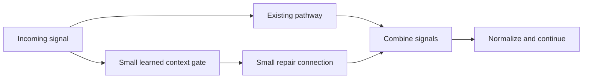

# Small connections that repair mistakes without replacing old paths

Author: Arnav123-s. Protocol written before this experiment's execution.
Date: 2026-09-04. Status: completed; isolated candidates, no live rollout.
Pre-execution revision: the owner clarified that the base should keep changing.
The measured arms below therefore do not freeze any original trainable group.
The adapter-only implementation remains a unit-test control, not the solution
or an arm in this experiment.

## The idea, and the mismatch being corrected

The earlier pathway experiment changes route update size, rewires routes, or
splits existing routes. Splitting supplies extra capacity but is not, by itself,
a mechanism for repairing specific failures while retaining successful behavior.

This experiment tests a closer version of the intended idea: a small additional
connection can alter the signal in particular contexts, without replacing the
existing path. A context gate must be learned from signals available to the
model, never from a grader's answer or an external failure flag at inference.



This is a static architecture drawing, not a recording of actual activations.
In both repair arms the original and added parameters learn. Signal still passes
through the base. No separate answering model or stored answer lookup is
introduced. A projection rule in the flow-repair arm aims to preserve earlier
behavior, not earlier parameter values.

## Mathematical formulation

Use the existing node state $z$, byte encoding $e$, and incoming message $m$
from the [current model specification](../docs/WAVE_MODEL_MATH.md). Add eight
connections. For connection $a$, choose destination
$d_a=\lfloor aN/8\rfloor$ and source $s_a=(d_a+1)\bmod N$.
This is an explicit fixed-placement heuristic, not learned topology discovery.

The four-dimensional real context is

$$h_a=[\operatorname{Re}z_{s_a},\operatorname{Im}z_{s_a},
       \operatorname{Re}e_{d_a},\operatorname{Im}e_{d_a}].$$

Learn a context gate, a signed bounded gain, and a phase:

$$q_a=\sigma(w_a^Th_a+b_a),\qquad
\gamma_a=\tfrac12\tanh(\beta_a),$$

$$\Delta m_{d_a}=\gamma_a q_a e^{\mathrm{i}\psi_a}z_{s_a},
\qquad m'_i=m_i+\sum_{a:d_a=i}\Delta m_{d_a}.$$

Use $m'$ in the original update:

$$\widetilde z_i=z_i+\tfrac12m'_i+\tfrac14e_i,\qquad
z'_i=\frac{\widetilde z_i}{\sqrt{1+|\widetilde z_i|^2}}.$$

Each connection has four context weights, one bias, one gain, and one phase:
seven float32 parameters. Eight connections add 56 parameters, 224 parameter
bytes, plus optimizer state and two eight-entry integer index buffers. Model
parameters increase from 66,880 to 66,936 (about 0.084%), and message connections
from 256 to 264. The CPU runtime is much larger than these parameter arrays.

Initialize $\beta_a=0$, $\psi_a=0$, $b_a=0$, with small seeded context weights.
Since $\tanh(0)=0$, all repair contributions start at zero, so the complete
output map agrees with the original model for every finite input in exact
arithmetic. Tests also check exact float32 agreement on a bounded example.
Gradients can change $\beta_a$ first; gates and phases become trainable through
that nonzero gain afterward. This is a trainable internal residual connection,
not a handwritten first/last operation.

The architectural motifs relate to [residual learning](https://arxiv.org/abs/1512.03385)
and [parameter-efficient adapters](https://proceedings.mlr.press/v97/houlsby19a.html).
Kavi's connection-level, complex-valued gated correction is a local adaptation,
not a reproduction of either complete published architecture.

## Preserve function while configurations continue to change

Write all base and repair settings as $\xi=(\theta,\psi)$. All arms minimize
the same equal mixture of focus and reference answer loss:

$$L=\tfrac12 L_{focus}+\tfrac12 L_{reference}.$$

Let $g_r=\nabla_\xi L_{reference}$ and $\Delta$ be Adam's proposed displacement
from this mixed loss. The flow-repair arm uses

$$\Delta'=\Delta-\frac{\max(0,g_r^T\Delta)}{g_r^Tg_r}g_r,$$

when $\|g_r\|^2>10^{-20}$, and leaves the displacement unchanged otherwise.
Then $g_r^T\Delta'\le0$ in exact arithmetic. This is the nearest displacement
in Euclidean distance satisfying the one linearized average-loss constraint.
Components that do not conflict with that constraint remain free to move.
It does not freeze a parameter group, an earlier model, or an old internal state.

The first-order interpretation is
$L_{reference}(\xi+\Delta')\approx L_{reference}(\xi)+g_r^T\Delta'$.
Higher-order terms, sampled reference coverage, and float32 rounding prevent a
global no-forgetting guarantee. Adam moments keep the unprojected proposal's
gradient history. This is a displacement-projection variant inspired by
[A-GEM](https://arxiv.org/html/1812.00420v2), not its original gradient-update
algorithm. Reference examples are external teacher rehearsal, not memories
retrieved by the model at inference, and their resource costs are counted.

The same idea can be described geometrically: the parameter configuration moves
while trying to stay in a region that preserves useful input/output behavior.
It does not claim literal coexistence across past and future physical time.
Control constraints, geometry, circuit bypasses, and wave interference provide
different mechanisms here, not interchangeable laws of intelligence.

A useful sufficient preservation condition concerns output margins. Suppose
the original correct next byte has logit margin $\kappa>0$ over every other
byte. If the changed model's logits at the same prefix satisfy

$$\|\ell'-\ell\|_\infty<\kappa/2,$$

the correct argmax cannot change at that prefix: the winning logit falls by at
most the bound and a competitor rises by at most the bound. Preserving a whole
generated answer requires this condition at every prefix on its old generated
trajectory, including termination. This is a sufficient mathematical condition,
not a globally enforced constraint or certificate produced by this experiment.
Fresh exact-answer tests remain essential.

After learning, $|\Delta m_{d_a}|\le |z_{s_a}|/2$ locally. That bounds a
single addition, not its accumulated recurrent influence or its correctness.
Soft gates are computed for all eight slots; they are not hard conditional
execution or a quantum-computational shortcut.

## Experiment algorithm

1. Complete the six-teacher/four-pathway comparison first; do not run candidate
   experiments concurrently. Use its sealed teacher selection, not its final
   confirmation answers, to choose the common teaching recipe.
2. Return to the same original frozen 79,979-update checkpoint, including its
   optimizer state, rather than continuing the previously winning candidate.
3. Seal fresh selection and confirmation questions, excluding all reserved
   multi-symbol strings and reversals from the previous comparisons and using
   the original exposure ledger for novelty checks. A third generated partition
   is reserved but unused. Each used bank contains 419 questions with the same
   length/task/retention structure as the earlier experiment.
4. For each teaching seed 53121, 53122, and 53123, compare the three arms below.
   Each receives exactly 180 updates: four teacher-selected examples and four
   separately seeded common-reference examples per update. This is 1,440
   presentations: 720 from the common teacher (including 144 of its own review
   presentations) and 720 additional copying-reference presentations. Thus 70%
   of these examples are copying; this differs from the first experiment but is
   identical across all three repair arms. No final answers enter training.
5. Save each candidate, verify its checkpoint round trip, and score selection.
   Record whether original parameters changed and how many proposals were
   projected, while total parameters remain within the 56-parameter growth cap.
6. Seal a retention-first ranking before generating final-confirmation answers.
   Then test all three arms on confirmation with no further updates. Record
   baseline-wrong primary questions repaired and baseline-right questions broken,
   as well as the separate earlier-skill retention failures.
7. Report unsuccessful repairs as well as successful ones. No automatic live
   replacement, curriculum advancement, or source-code evolution is performed.

| Arm | Original parameters | Added parameters | Optimizer behavior |
| --- | --- | --- | --- |
| Ordinary | Learn | None | Original Adam state preserved; mixed focus/reference loss. |
| Adapter joint | Learn | 56 learn | Original moments preserved for base parameters; additions acquire new moments; same mixed loss. |
| Flow repair | Learn | 56 learn | Same joint proposal, then project displacement against the reference loss gradient. |

The joint arm asks whether additions help alongside ordinary configuration
changes. The flow-repair arm asks whether steering those changes helps retain
earlier behavior. None gets extra training examples or optimizer updates over
the other arms. All compute the reference and focus gradients; only flow repair
uses the reference gradient to project the displacement. Architecture and
projection overhead and training time are measured.

## Resource policy and reproducibility

One candidate at a time, one numerical CPU thread, 10 ms rest after each update.
RAM-based 4/2/1-row microbatching accumulates to one eight-example optimizer step.
Use the same 2 GiB minimum free memory/disk and 1 GiB process working-set ceiling
as the earlier comparison, and a 1,200-second maximum. This is not temperature
control: reliable CPU-temperature readings are unavailable. No hardware safety
threshold changes are made. The live pause must remain present throughout.

```powershell
python -m unittest tests.test_repair_trials -v
python -u scripts/run-repair-trials.py --parent-experiment runs/teaching-and-pathway-trials-20260904 --live-run runs/learning-live-20260904-143553 --output runs/small-repair-trials-20260904
```

The output directory must not exist beforehand. Raw logs, checkpoints, and
question/answer records stay local under ignored `runs`. This report publishes
only reviewed aggregate findings. Exact replication requires the private
historical starting checkpoint. Unit tests remain independently reproducible.

## Results

All nine candidates completed, and all original parameter groups changed rather
than remaining frozen. Each candidate finished at 80,159 updates, exactly 180
above the common starting checkpoint. All source hashes and the input checkpoint
matched their sealed values. The live learner stayed paused and unchanged.

### Selection and independent confirmation

Selection baseline: 71/192 primary answers (36.98%), with 99 protected copying
answers. Ordinary updates scored 38.89% primary on average and lost 2/0/0 old
answers across seeds. Joint additions scored 37.67% and lost 3/0/1. Flow repair
scored 40.45% and lost 3/1/1. The prespecified retention-first rule selected
ordinary updates. No arm preserved all old selection answers across seeds.

The independent confirmation baseline was 66/192 (34.38%), with 22 correct
copying pairs and 75 correct single symbols: 97 protected retention answers.
All three methods were tested, as specified before final answers were generated.

| Method | Mean final primary accuracy | Correct out of 192, by seed | Old copying answers lost, by seed |
| --- | ---: | --- | --- |
| Original unchanged checkpoint | 34.38% | 66 | 0 by definition |
| Ordinary + common rehearsal | 41.49% | 73, 90, 76 | 2, 1, 2 |
| Eight joint repair connections | 42.36% | 73, 90, 81 | 1, 0, 2 |
| Joint connections + flow constraint | 42.19% | 68, 91, 84 | 3, 1, 2 |

These are new question banks; do not compare their absolute percentages directly
with the earlier teacher experiment as though they were the same exam. The
common rehearsal budget also differs. Within this experiment all arms use
identical example/update schedules for a given seed.

The joint connections improved mean primary accuracy by 0.87 percentage points
over ordinary updates and had fewer copying-retention losses on this final bank.
That is a small measured difference, not decisive evidence from three seeds of
one historical checkpoint. Flow projection did not improve final retention.

### Corrected failures versus newly broken primary answers

| Method | Previously wrong primary answers corrected, by seed | Previously right primary answers broken, by seed |
| --- | --- | --- |
| Ordinary | 29, 38, 30 | 22, 14, 20 |
| Joint additions | 27, 37, 32 | 20, 13, 17 |
| Flow constraint | 28, 37, 34 | 26, 12, 16 |

The net gain equals corrections minus breaks. This is why an improving total
score must not be described as no forgetting. The original protection score
only covers copying; the table separately exposes broken first/last/copy/join
primary answers. The next [verified consolidation test](2026-09-04-verified-consolidation.md)
protects every formerly correct answer across its guard groups.

All methods retained 75/75 single symbols on confirmation. Length-five transfer
averaged only 5.73% in all three arms. Mixed-script operation accuracy averaged
38.54% ordinary, 40.10% joint, and 38.54% flow, versus 42.19% at baseline. No
mastery gate was met, and the broader adaptive-circuit design was not evaluated.

### What the constraint actually achieved

The flow rule projected 62, 55, and 54 of 180 updates across the three seeds.
Original parameters still changed in every run. Removing a first-order
reference-loss conflict is not the same as preserving individual generated
answers. References cover copying, the loss is averaged over sampled examples,
Adam makes finite nonlinear steps, and future input contexts differ. The
observed regressions are consistent with those explicit limitations, and reject
any claim that this projection already solves forgetting.

### Cost

The joint/flow candidates had 66,936 trainable parameters and 264 total message
connections (256 original plus eight repairs). Parameter storage was 267,744
bytes; optimizer storage was 535,536 bytes, plus graph buffers, gradients,
activations, and the CPU runtime. Ordinary candidates had 66,880 parameters,
267,520 parameter bytes, and 535,072 optimizer bytes. Tiny additions are not
memory-free, and optimizer tensor counters add overhead beyond twice the new
parameter bytes.

Mean optimizer-training time for 180 eight-example updates was about 23.85 s
ordinary, 34.28 s joint, and 34.83 s flow. The added operations cost about 44-46%
more training time here despite only about 0.084% extra parameters. No learning
speed advantage was demonstrated. Total experiment wall time was 448.81 s
(7 minutes 29 seconds); process CPU time 429.45 s. Peak process working set was
521,383,936 bytes (497.2 MiB). The private artifact inventory before the final
report write was 11,440,318 bytes (about 10.9 MiB).

All updates used four-row microbatches, serial candidate execution, and one
numerical CPU thread. No measured temperature or device-wide energy conclusion
is available. Source validation and 129 unit tests passed before execution.

## Decision

Do not install any candidate. Small corrections can improve selected answers
without freezing the base, but this version still breaks previously correct
answers and costs more computation. Keep it as an experimental mechanism, not
a solved learning system. Test exact finite behavioral preservation next rather
than treating the same averaged-loss rule as a guarantee.
