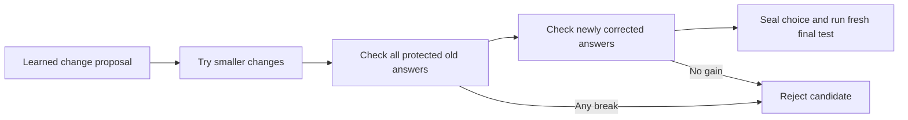

# Verifier-gated configuration search

Author: Arnav123-s. Protocol written before execution, 2026-09-04.
Status: completed, isolated inference-only search; no live replacement.

## Problem and stronger rule

Small extra connections and an average-loss projection did not prevent all
regressions in the [repair comparison](2026-09-04-small-repair-connections.md).
The next question is whether a **smaller configuration change** can preserve
measured old behavior while correcting at least one failure. This does not
freeze parameters or infer correctness from a phase/gating metaphor.

For every trained proposal $\xi_p$, search

$$\xi(\alpha)=\xi_0+\alpha(\xi_p-\xi_0),\qquad
\alpha\in\{1,1/2,1/4,1/8,1/16,1/32,1/64\}.$$

The source is the same 79,979-update parent. For repair proposals, embed that
parent into the expanded circuit with zero-effect connections before
interpolating all continuous parameters. Discrete buffers must agree; this is
not interpolation of incompatible graph topologies. Original and added
parameters remain trainable, but no gradient training occurs in this search.

Use all nine completed ordinary/joint-repair/flow-repair proposals, each already
trained for 180 updates in the earlier experiment. There are 63 configurations,
not 63 newly trained models. All incurred prior training costs remain part of
the research cost. Learned proposals, not a handcrafted answer operation, supply
the search directions. This is whole-configuration consolidation, not yet
per-question route search during inference.



## Exact finite acceptance condition

Generate fresh guard and confirmation partitions with seed 981503, excluding
every reserved multi-symbol string and reversal from the earlier experiments
and checking novelty against the original exposure ledger. The generated
pathway-selection partition is reserved but unused. Each used bank contains
419 questions: 192 primary, 64 longer-transfer, 64 mixed-script, 24 copying
pairs, and 75 single-symbol questions.

Evaluate the parent on the guard bank. Protect **every baseline-correct answer
in every group**, not only the earlier copying tasks. This includes already
correct first/last and transfer responses. A candidate is eligible only if:

$$\forall(x_i,y_i)\in D_{protected},\quad f_{\xi(\alpha)}(x_i)=y_i,$$

$$\#correct_{primary}(\xi(\alpha))>
\#correct_{primary}(\xi_0).$$

Reject as soon as any protected answer breaks. For candidates passing that
gate, complete the guard assessment and require at least one additional correct
primary answer. Rank by primary gain, then fewer parameters, then smaller
fraction, then stable mode/seed ordering. An unchanged model with zero gains is
not an improvement and is not eligible.

The evaluator can temporarily cache the fixed candidate's own generated outputs
to avoid repeating guard questions. It never supplies expected answers through
the model's inference interface. That cache is external evaluation bookkeeping,
not a feature or memory lookup in the model.

Seal the choice before opening confirmation. Evaluate only that selected
candidate and the original parent on the untouched confirmation bank. Report
all newly broken formerly correct answers, including primary and transfer
groups. Do not use these final answers to repeat or retune this search.

The hard guard gives exact preservation **on that finite guard set**. It does
not prove preservation on untested past inputs or unseen inputs. The independent
confirmation checks whether preservation extends beyond the selection cases.
This is stronger measurement than a first-order average-loss constraint, but
still not a universal mathematical correctness certificate.

## Algorithm and resources

```text
seal guard/final questions and fixed candidate directions/fractions
measure the parent; collect all correct guard answers
for each learned direction and fraction:
    construct a separate compatible circuit configuration
    reject if any protected answer changes from correct to wrong
    otherwise finish the guard test
    keep eligible configurations with strictly more primary answers correct
seal the best eligible configuration, if any
evaluate it on the final questions without further selection
report gains, broken answers, time, and storage; do not deploy
```

Use one numerical CPU thread, serial candidate evaluation, a 2 ms delay between
question checks, a 600-second ceiling, at least 2 GiB free RAM/disk, and at most
1 GiB process working set. No CPU-temperature estimate or hardware safety-limit
change is introduced. The live pause must remain present.

Interpolation has no uniquely correct inherited Adam moment history. Saved
interpolated candidates therefore reset optimizer moments and retain the
proposal's ancestry counters. They are marked inference-test candidates; a live
training resume is not authorized or implicitly performed. Input checkpoints,
source hashes, model fingerprints, and exact answers remain in private ignored
runtime files. Only aggregate findings are published here.

```powershell
python -m unittest tests.test_consolidation_trials -v
python -u scripts/run-verified-consolidation.py --source runs/small-repair-trials-20260904 --teacher-ledger runs/contrast-comparison-20260904/input-teacher.json --live-run runs/learning-live-20260904-143553 --output runs/verified-consolidation-20260904
```

## Results

All 63 configurations were evaluated under the fixed protocol. Twelve were
eligible: each preserved every baseline-correct guard answer and corrected at
least one additional primary answer. The unchanged input and all sealed source
hashes matched. The selected checkpoint survived an exact fingerprint round trip.
No live model was replaced or resumed.

### Guard result

The parent had 196 correct answers across the entire 419-question guard bank.
These 196 were all protected, including first/last and transfer tasks. Primary
accuracy started at 74/192 (38.54%). The selected configuration used the
flow-repair proposal from seed 53121 with fraction 1/16. It retained all 196
protected answers and improved primary accuracy by four answers to 78/192
(40.63%). It contains 66,936 parameters and eight extra repair connections.

The selected fraction scales the whole continuous change, not only the eight
new connections. It therefore does not isolate the additions as the cause of
improvement. Some ordinary configurations were also eligible; for example, one
ordinary proposal at fraction 1/16 gained three primary answers with no guard
regressions. Claims about a uniquely necessary repair mechanism are unsupported.

### Untouched final result

| Group | Original correct | Selected correct | Previously correct answers newly broken |
| --- | ---: | ---: | ---: |
| Three-symbol operations | 52/96 | 52/96 | 1 |
| Four-symbol operations | 11/96 | 17/96 | 0 |
| Five-symbol operations | 1/64 | 1/64 | 0 |
| Mixed-script operations | 34/64 | 34/64 | 1 |
| Familiar copying pairs | 23/24 | 23/24 | 0 |
| Single symbols | 75/75 | 75/75 | 0 |

Primary accuracy increased from 63/192 (32.81%) to 69/192 (35.94%). Across all
419 final questions, eight formerly wrong answers became correct and two
formerly correct answers became wrong: a net gain of six. The two breaks were
one three-symbol operation and one mixed-script operation, not the copying
retention groups. Equal totals in a row do not mean identical answers were
preserved: a new success can conceal a new failure.

The exact finite guard succeeded, but no-forgetting did **not** extend to every
fresh confirmation case. This is a measured partial result, not a solution for
all old and new inputs. The confirmation answers were not used for another
search or to select a replacement candidate.

### Cost and decision

Search wall time was 196.97 s (3 minutes 17 seconds), process CPU time 173.34 s,
and peak working set 505,180,160 bytes (481.8 MiB). The private artifact inventory
before the final report write was 2,932,570 bytes (about 2.8 MiB). There were no
new optimizer updates. These costs are additional to the earlier 36 trained
candidates, not an independent claim of learning from no data or compute.

The live pause remained present. Candidate evaluation used one numerical CPU
thread; no thermal limit changed, and no CPU-temperature measurement was
available. The three additional consolidation unit tests passed before the
search; the final full-suite check contains 132 tests.

Keep the candidate experimental. This implements a concrete method for finding
smaller configurations that preserve a finite set of verified behaviors, but
does not solve arbitrary-history retention. The next architecture-level work
would need better conditional isolation or verifiable compositional rules,
followed by new sealed tests; simply weakening or reusing the final test would
not establish the desired property.
