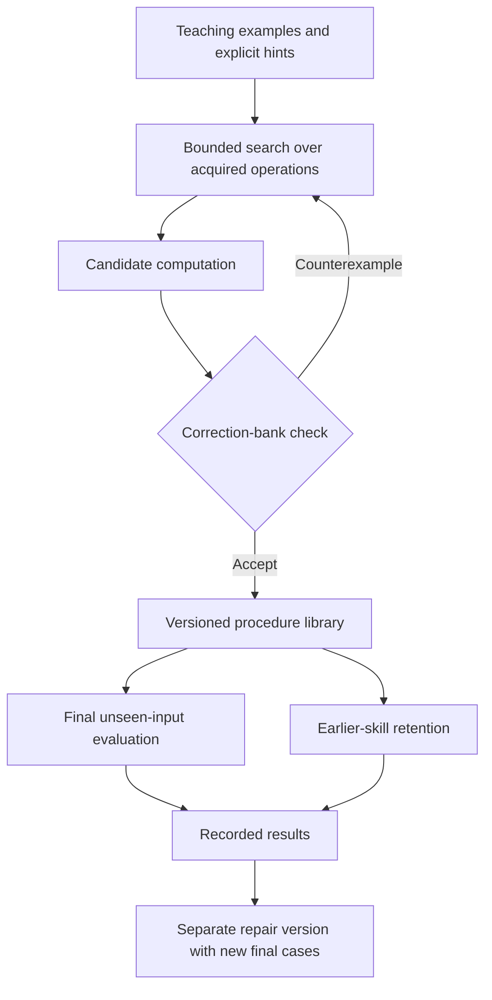

# Multi-track foundation curriculum

Author: [Arnav123-s](https://github.com/Arnav123-s)

## Protocol before execution

Starting revision: `2761ce0`. The starting arithmetic library is the cumulative artifact embedded in the preceding configuration-reuse record. All conditions receive this same artifact. The tasks are authored numeric exercises, not quotations from books or evidence of reading comprehension.

Two teaching-bank seeds (17 and 41) compare a fixed starting library against a cumulative library on eight tasks: cube, sum of squares, shifted square, scaled square, affine expression, quadratic expression with an offset, cube with an offset, and fourth power of a sum. Four initial examples come from inputs 0 through 5. Up to sixteen other examples form a correction bank. At most two failing correction cases may be added to training. Final examples use inputs 6 through 12 and are not used for any selection, correction or promotion. Each final bank contains up to 24 cases; unary tasks have seven.

The unchanged search uses at most three nodes, 4,000 candidates, 100,000 candidate cases, 12,000 cached entries and three seconds per attempt. Each execution is bounded by 5,000 calls, 200,000 gates and 256 iterations. The total single-worker run is bounded by 300 seconds and a sampled 512 MiB process working set. Pauses count against wall limits. These are a new protocol's limits; the earlier 32-iteration result remains unchanged. Partial failures and stopped runs must be retained.

Language teaching supplies 18 authored annotated sentences for five numeric patterns and four relation patterns. Fresh slot contents test recognition; novel wording separately probes coverage. Scientific calculation patterns name force, position and twice kinetic energy in simplified scalar settings. The teacher supplies the interpretation and operation mapping. No units, physical-law discovery, passage interpretation, literary criticism or argument validity are inferred by those annotations.

Final evaluation begins after every arithmetic arm and language teaching phase finishes. Every acquired numeric candidate is tested on its final bank and initial teaching cases after all later learning. Earlier addition, multiplication, square, fourth and eighth power are retested. Language routes are evaluated against every final library, rather than selecting the best library from final scores. All versions are saved separately; none is promoted to the main library based on final results.

Unsupported signed/rational arithmetic, general quantum states and open-ended argument construction are recorded as representation or assessment gaps. These are not scored as graduate-level exercises. A subsequent engineering repair must have its own tests and provenance.

Run `python -B scripts/run_foundation_curriculum.py live --run-dir runs/foundation-20260907-01` from the repository root. The window uses plain-language progress and Pause, Resume and Stop controls. Replace `live` with `run` for direct execution and always use a new directory.

## Repair protocols recorded before follow-up runs

The first run exposed search interference: the larger cumulative library acquired fewer tasks within the same time limit. A direct-composition condition now restricts candidate syntax to calls, leaving the default search unchanged. This is a supplied search configuration, not an acquired search policy. The original loops remain available in the ordinary mode. The repair repeats the teaching/correction banks and uses a new final range of 13 through 19. Because its design responds to the first run, this is a follow-up experiment, not an independently preregistered discovery. Language prompts and retention checks are repeated diagnostics, not fresh tests. Run it with `python -B -m scripts.run_composition_repair live --run-dir runs/composition-repair-20260907-01`.

A separate signed/fractional repair supplies exact sign handling, fraction construction, gcd normalization and division semantics over the acquired addition, subtraction and multiplication dependencies. Fraction normalization is host arithmetic. The learner is taught reciprocal, ratio, signed affine expression, secant slope and pair mean from eight examples each. A fixed seed of 71 defines disjoint training and final rational inputs; final numerators and denominators come from different sets. Each acquired procedure has 24 final cases, opened only after all teaching finishes. Three-node call-only search is bounded by 20,000 candidates, 200,000 candidate cases and ten seconds per task; the worker has a 120-second wall limit. Primitive-selection successes are distinguished from composition. No main-library promotion occurs. Run `python -B scripts/run_rational_curriculum.py live --run-dir runs/rational-20260907-01`.

The first fraction run was aborted before learning because the harness attempted to select 24 distinct unary cases from 12 possibilities. The sampling loop prevented its control/time checks from running. The worker was explicitly terminated; bounded sampling replaced the loop and a regression test now checks bank size, uniqueness and separation. The corrected protocol uses 12 final reciprocal cases and 24 for each higher-arity task. Its run is `rational-20260907-02`. The aborted record is preserved.

The corrected run acquired reciprocal, ratio and signed affine composition; slope and mean exhausted their search time. A subsequent teacher-hinted condition supplies the operation sets `{subtract, divide}` for slope and `{add, divide}` for mean, with 30 seconds per task and otherwise unchanged search limits. It starts from the scalar base library. This adds teaching information and time, so it cannot establish an equal-budget search improvement. New final values use numerators -41, -37, -31, 29, 37, 43 and denominators 11, 13, with 24 cases per task; none is used for teaching. Run `python -B -m scripts.run_rational_repair live --run-dir runs/rational-repair-20260907-01`.

The call-only arithmetic repair reduced some failures but did not remove search interference. A further teaching condition supplies a relevant operation family for each task, recorded in each lesson's `supplied_operation_hint`. For example, sum of squares receives addition and square; fourth power of a sum receives addition and fourth power. Cumulative conditions may receive an earlier learned cube or scaled-square component. These hints are additional teaching, not a learned relevance selector. Search retains its three-second and candidate limits. Its new final input range is 20 through 26. Run `python -B -m scripts.run_composition_hints live --run-dir runs/composition-hints-20260907-01`. This is a teaching-assisted repair, not an equal-information comparison with the first run.

## Measured arithmetic results

Each row describes both seeds: they acquired the same number of tasks. The full final bank has 175 cases per arm. Cases belonging to unacquired tasks count as unsuccessful coverage below; they are not omitted from the denominator.

| Condition | Fixed library: acquired tasks; final coverage | Cumulative library: acquired tasks; final coverage | Total elapsed time |
| --- | --- | --- | --- |
| Original search | 5/8; 103/175 | 4/8; 79/175 | 58.161 s |
| Calls only | 6/8; 127/175 | 6/8; 127/175 | 41.866 s |
| Calls with teacher operation hints | 8/8; 175/175 | 8/8; 175/175 | 6.797 s |

Every acquired candidate passed its final examples. Earlier arithmetic passed 254/254 retention cases in every arm of every condition. Initial teaching answers for acquired procedures also survived later teaching. Final input ranges differ between conditions because earlier failures informed subsequent development. These are descriptive measurements from one machine, not a matched speed benchmark.

The original cumulative library ended at 1,491 canonical bytes, the call-only version at 1,829, and the hinted version at 2,073. The fixed library remained 962 bytes because new expressions were evaluated separately and not installed there. Those expressions still occupy storage in the experiment record; 962 bytes is not the complete learned state or total experiment footprint. Search caches, Python, the executor, logs and operating-system memory are additional costs. Sampled peak working sets for the three runs were 27,922,432, 28,004,352 and 27,590,656 bytes respectively.

Under the hinted condition, candidate counts were 3,265 fixed versus 926 cumulative for seed 17, and 2,965 versus 898 for seed 41. Reuse helped under the supplied task-specific hints. This does not establish that Kavi learned to identify relevant operations by itself. The original run demonstrated the opposite risk: extra components can obstruct bounded search.

## Signed and fractional results

The corrected rational run took 26.356 seconds and acquired three of five tasks. A follow-up with hints and a larger per-task allowance acquired the remaining two in 2.945 seconds. Each used new final inputs as specified above.

| Task | Acquired expression | Final cases | Condition |
| --- | --- | --- | --- |
| Reciprocal | `divide(1, x0)` | 12/12 | Initial rational run |
| Ratio | `divide(x0, x1)` | 24/24 | Initial rational run; primitive selection |
| Signed affine expression | `add(x2, multiply(x0, x1))` | 24/24 | Initial rational run |
| Secant slope from a supplied nonzero interval | `divide(subtract(x0, x1), x2)` | 24/24 | Teacher-hinted repair |
| Pair mean | `divide(add(x0, x1), add(1, 1))` | 24/24 | Teacher-hinted repair |

Together these are 108 passing final cases across two versions, not one untouched final assessment. The first run exhausted its search time on slope and mean; their later success does not erase those failures. Reported peak working sets were 26,968,064 and 26,468,352 bytes. These rational runners read peak memory at completion; they do not implement the arithmetic runner's sampled 512 MiB guard.

For fractions `a/b` and `c/d`, with positive denominators, the supplied scalar wrapper represents addition by `(ad + bc)/(bd)`, multiplication by `(ac)/(bd)` and division by `(ad)/(bc)` when `c != 0`. It handles signs and canonical normalization. Numerator and denominator arithmetic calls the earlier acquired integer dependencies; greatest-common-divisor normalization uses host arithmetic. Only composition above this supplied representation is learned in this trial. Fractions have bounded 4,096-bit components. Floating-point inputs and zero divisors are rejected. Gate counters exclude host normalization and therefore do not measure all work.

## Language and consolidation

Nine patterns acquired from 18 authored sentences passed nine fresh-slot interpretation cases. These are known sentence constructions. The final cumulative arithmetic libraries in the hinted condition executed all five numeric routes. The fixed arms intentionally lacked newly installed procedure names: four of their five routes failed lookup even when an equivalent standalone expression had been acquired. That is an integration difference, not evidence of poorer mathematical generalization.

Unfamiliar wording remained unsupported. Recognizing a sentence as a reason relation did not establish argument validity. There was no new training on literary works, no physical-law discovery and no assessment of creative writing in this run.

Consolidation used the lowest-seed cumulative hinted artifact and retained existing implementations wherever procedure names already existed. It added the missing natural-number procedures and combined the five acquired rational procedures. The first language merge exposed one regression: the new general attribution pattern competed with an older, more specific paper-claim pattern. A supplied optional resolution rule now prefers the matching pattern with the most literal tokens; equally specific conflicting interpretations remain ambiguous. The original default behavior is unchanged. This is an engineered parser policy, not learned meaning or general conflict resolution.

The successful combined checkpoint contains 22 natural-number procedures and nine rational entries, of which four are supplied scalar primitives and five are acquired procedures. It passed 44 natural-number integration checks, ten rational checks and all 28 previous language interpretation checks. The local language checkpoint has 25 frames and retains earlier lexical memory. These small integration banks check consolidation; they do not prove universal retention or graduate competence.



## Saved state and use

| Artifact | Canonical encoded bytes | Scope |
| --- | --- | --- |
| [Natural-number checkpoint](foundation-natural-20260907.json) | 3,473 | 22 procedures including existing acquired dependencies |
| [Rational checkpoint](foundation-rational-20260907.json) | 1,678 | Embedded integer dependencies, scalar declarations and five learned compositions |
| [Public sentence checkpoint](foundation-language-20260907.json) | 4,774 | 24 authored frames; source-derived rule, lexical memory and definitions excluded |
| Complete local sentence checkpoint | 28,298 | Frames plus earlier source-derived lexical memory and definitions |

The three public checkpoints total 9,925 canonical bytes. The complete local set totals 33,449. These totals count the duplicated dependencies in separate saved files. They exclude runtime code, Python, teaching data, research sources, search workspace and execution costs. They are not comparable to a general-purpose language model's weight count or evidence that general intelligence fits in this space. The public sentence checkpoint intentionally excludes one source-derived frame and cannot recall the excluded definitions; the 28/28 historical retention result concerns the full local version. Export uses `scripts/export_foundation_language.py` to keep source-derived memory private.

From the repository root:

```powershell
python -B -m kavi.curriculum_cli show
python -B -m kavi.curriculum_cli ask "twice kinetic energy for mass 7 and speed 11"
python -B -m kavi.curriculum_cli exact mean_pair -- -1/2 2/3
```

The latter queries return `847` and `1/12`. They inspect saved procedures without starting learning. The numerical scientific phrase carries the teacher's simplified interpretation; no unit analysis is performed.

## Evidence and remaining work

Machine-readable records: [original curriculum](2026-09-07-foundation-curriculum.json), [call-only repair](2026-09-07-composition-repair.json), [operation-hinted repair](2026-09-07-composition-hints.json), [aborted sampling run](2026-09-07-rational-aborted.json), [corrected rational run](2026-09-07-rational-curriculum.json), [rational hinted repair](2026-09-07-rational-repair.json), and [consolidation checks](2026-09-07-foundation-integration.json).

All 189 repository tests passed on Python 3.13.5. New checks cover partition separation, finite sampling, exact signed arithmetic, budgets, search restrictions and language precedence. The failed sampling harness and failed language integration are retained locally and described above. Earlier measured scores are unchanged.

This stage closed concrete execution, search configuration, sampling and integration gaps. Automatic relevance selection, symbolic algebra, units, vectors, proof construction, paragraph interpretation and argument evaluation remain unimplemented. The next work is to supply and verify the necessary representations, then teach reusable computations above them with separate final tests. The [graduate capability program](../docs/GRADUATE_CAPABILITY_PROGRAM.md) defines the three tracks and the evidence needed before claiming advanced competence.
