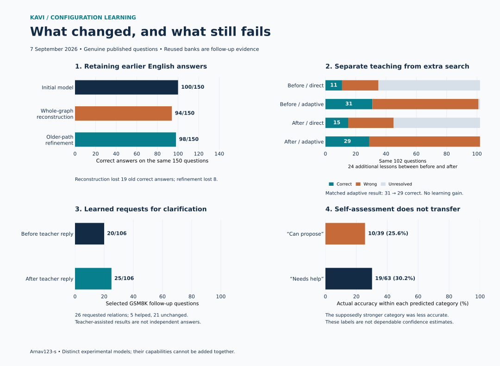

# Incremental correction and changing executable configurations

Author: [Arnav123-s](https://github.com/Arnav123-s)

7 September 2026. Five completed, separately controlled courses using genuine published questions. [Measurements](2026-09-07-incremental-inquiry-transfer.json) preserve candidate results, partitions, failures, work counters and artifact fingerprints without publishing source bodies.

## What changed

Corrections can change Kavi's retained configuration, and a small acquired policy can learn when to ask a teacher about a relationship. Refining older pathways retained more earlier answers than reconstructing the whole language graph in this comparison. Further experiments learned the recurrent word transitions themselves and constructed provisional executable connections while input arrived. This addresses part of the architectural mismatch in the earlier predicate-based experiments.

The adaptive course corrected all 24 new teaching examples and retained all 144 earlier teaching answers. It did **not** improve its final adaptive follow-up score: the same constructor scored 31/102 before the additional teaching and 29/102 afterward. Its acquired self-assessment did not reliably distinguish answers it could get right. More activity and more completed answers did not establish better understanding.

These results do not establish a unified intelligent model. The direct event learner is substantially weaker at answering unfamiliar English questions than the earlier arithmetic-language predictor. Its learned states have no assigned concept names, but unnamed states are not evidence that useful semantics have emerged. The earlier arithmetic core learned reusable calculations; it did not demonstrate algebraic understanding. Supplied equation isolation and a correct calculator output must not be counted as learned algebra.

## Incremental teaching and inherited pathways

Both courses started with the first English model and its 389 ASDiv teaching questions. They added the same genuine GSM8K batches of 5, 80 and 80 questions. Each candidate had to retain the previous model's correct answers on the earlier teaching bank. The 216-question development bank chose candidates. The original 150-question ASDiv bank was revisited only after freezing.

| Measurement | Initial model | Whole-graph reconstruction | Refinement through older paths |
| --- | ---: | ---: | ---: |
| Teaching questions presented in the course | 389 | 554 | 554 |
| Final teaching answers correct | 330/389 | 550/554 | 542/554 |
| Same expanded development bank | 93/216 | 103/216 | 95/216 |
| Original ASDiv bank | 100/150 | 94/150 | 98/150 |
| Earlier correct answers retained | 100 | 81 | 92 |
| Earlier correct answers lost | — | 19 | 8 |
| Earlier wrong answers corrected | — | 13 | 6 |
| Serialized configuration | 5,201 bytes | 21,901 bytes | 25,421 bytes |

The initial model has a 5,243-byte serialization when wrapped in the streaming format; its predicate decisions are unchanged. The 5,201-byte figure refers to the original format.

Both successor courses accepted only candidates with zero losses on their finite earlier teaching obligations. Nevertheless, both lost answers on other questions. Preserving a teaching bank is not equivalent to preserving the full skill. Inherited paths reduced that loss in this follow-up, but scored lower on development and used a larger final artifact. No successor is an automatic replacement for the initial model.

Reconstruction selected depth 48 after the first increment, kept that configuration after the second, and selected a new depth-48 configuration after the third. Path refinement kept the initial model after the first increment, then selected local depth-8 refinements after the second and third. The latter preserves old internal decisions and teaches distinctions at their destinations. Its update algorithm is supplied; it has not learned to invent a learning algorithm.

Protocols: [incremental course](../docs/INCREMENTAL_ENGLISH_PROTOCOL.md), [older-path transfer](../docs/PATHWAY_TRANSFER_PROTOCOL.md).

## A representational error exposed by correction

The reconstruction course's four remaining teaching errors were all grouping errors. Its proposed programs had the correct pairwise operation labels. The correct numerical result existed elsewhere in the six-candidate beam, but the supplied ranking selected the wrong grouping. The affected teaching identifiers are `gsm-train-2782`, `gsm-train-2550`, `gsm-train-5813` and `gsm-train-5365`.

The representation loses information. Consider two different programs on nonzero inputs:

$$ P(x,y,z)=\frac{x}{y/z}, \qquad Q(x,y,z)=\frac{x/y}{z}. $$

Both give division as the operator where each pair of argument branches first meets. Yet:

$$ P(12,6,2)=4, \qquad Q(12,6,2)=1. $$

Therefore the mapping from a program to these pairwise operator labels is not one-to-one. Even perfect classification of those labels cannot uniquely determine the intended program. More examples alone cannot restore a distinction absent from the representation. The learner needs information about scope or grouping as well as operator identity. This is a counterexample about the implemented representation, not a new mathematical theorem.

The executable configuration format already distinguishes these arrangements. The missing part is teaching the interpreter of language to select their structure reliably. The direct event course below begins with two quantities and does not claim to have solved this three-quantity scope problem.

## Questions learned from correction

The questioning course used the reconstructed language model unchanged. It received genuine feedback from the 554 teaching questions and 240 additional human-authored training questions. These produced 443 pair-level `ask` labels and 1,385 `answer` labels. A wrong final proposal and a mismatched relation in the original worked derivation supplied an `ask` target. Correct answers, reference formulas and teacher replies were unavailable to the policy when it chose its question.

A question requests the operation joining two branches of the current calculation. The teacher supplies only that relation from the published solution. The current calculation is then reconstructed subject to the reply. The acquired graph decides whether and where to ask. The wording, six response choices, input-order tie rule and one-question allowance are supplied.

| Follow-up bank and policy | Independent correct | Questions asked | Correct after replies | Helpful / harmful / unchanged questions |
| --- | ---: | ---: | ---: | --- |
| ASDiv, learned asking | 94/150 | 2 | 94/150 | 0 / 0 / 2 |
| ASDiv, always ask about the first pair | 94/150 | 150 | 131/150 | 37 / 0 / 113 |
| GSM8K, learned asking | 20/106 | 26 | 25/106 | 5 / 0 / 21 |
| GSM8K, always ask about the first pair | 20/106 | 106 | 34/106 | 15 / 1 / 90 |

The learned policy selected fewer questions and helped on five GSM8K problems. It did not improve the ASDiv score. It also missed many useful opportunities to ask, as the always-ask control shows. Its unassisted answers were correct on 93/148 ASDiv questions and 15/80 GSM8K questions. These are weak uncertainty decisions, not calibrated confidence or general doubt.

The 106 GSM8K problems are the official test subset admitted by this course's two- or three-quantity, four-operation grammar with every explicit quantity used once. The other 1,213 official questions are outside that selected grammar; 25/106 must not be presented as a whole-benchmark score. The banks appeared in earlier project experiments and are follow-up evidence, not new independent examinations.

The selected policy has 113 nodes and occupies 3,788 bytes. With its inherited language graph and format metadata, the artifact is 25,742 bytes. Policy depth 12 was selected by development utility: correct answers after replies minus one tenth of the question count. Its development result was 107/216 after 17 questions, versus 103/216 without questions. All final artifact fingerprints remained unchanged during evaluation. Teacher replies were temporary input, not persistent updates. [Protocol](../docs/LEARNED_INQUIRY_PROTOCOL.md).

~~~mermaid
flowchart LR
    A[Completed input] --> B[Proposed calculation]
    B --> C[Acquired decision to ask]
    C --> D[Request one relationship]
    D --> E[Teacher gives the published relation]
    E --> F[Reconstruct the current calculation]
    C --> G[Answer without clarification]
    F --> H[Measure assisted result separately]
~~~

## Directly learning the changing state

The first three courses still learn predicate trees. A stateful wrapper does not turn their learning procedure into learning of interacting dynamics. The fourth course therefore uses a different language core: each word event directly changes an acquired recurrent state. The resulting state selects a port connected to older acquired arithmetic. Held quantities and interpretation state participate in the same event runtime.

It uses 144 original ASDiv questions, taught in three increments of 48. Each question has two explicit quantities and at most 60 tokens. The supplied encoder keeps 128 frequent training word stems, a shared port for other words, two quantity-position markers and an end marker. No concept or intent name is assigned to an acquired state. State merging is the supplied learning algorithm; transition targets, recurrent connections and final operation ports are learned. No target state graph is given.

| Teaching stage | Correct on new batch before correction | Correct on all teaching questions afterward | Development |
| --- | ---: | ---: | ---: |
| First 48 questions | 0/48 | 48/48 | 1/80 |
| Next 48 questions | 0/48 | 96/96 | 8/80 |
| Final 48 questions | 4/48 | 144/144 | 9/80 |

Each stage selected seed 19 over seed 7 using development results, teaching accuracy and artifact size. No encoding collision triggered the declared literal-word fallback. All earlier correct teaching answers survived.

The frozen graph contains 16 states and 863 sparse edges. With vocabulary and metadata it occupies 9,143 bytes. Inference retains four current values: the latest event, the held quantity tuple, the interpretation state and the current result. Revision counters, pending calls, vocabulary, graph and runtime are additional storage. The current invocation does not consult a word history.

On 102 eligible ASDiv follow-up questions it answered **11 correctly**, issued **24 wrong answers**, and left **67 unresolved**. The literal prefix control, with 4,338 states and 84,491 serialized bytes, answered 0/102 and left every question unresolved. Its unfurled source paths remain private. The initial predicate model answered 76/102 on the same questions, although it had a larger teaching bank and a different representation; this is context, not a matched training comparison.

The direct event learner thus generalizes beyond literal paths in a small number of cases, but is much too weak for useful broad understanding. The learned question policy above is not integrated into this recurrent language core. These are separate experiments, and their capabilities must not be added together as if one model possessed them all. [Direct-state protocol](../docs/DIRECT_EVENT_LEARNING_PROTOCOL.md).

~~~mermaid
flowchart TD
    W[Next word or quantity event] --> S[Learned interpretation state]
    S --> S
    W --> Q[Current quantity activity]
    S --> O[Acquired operation port]
    Q --> A[Older arithmetic configuration]
    O --> A
    E[End marker and completion] --> R[Release available result]
    A --> R
    T[Original lesson and correction] --> L[Learn a successor transition graph]
    L --> S
~~~

## Changing executable connections during input

Changing a current state is different from changing the connections it can execute. The fifth course adds the latter. When a word encounters a defined transition, that route executes directly. At a missing transition, the runtime constructs alternatives among established states. Later words traverse those provisional connections. Each candidate retains its current state and at most four proposed edges; at most 16 candidates remain active. The constructor and its preference for fewer edits are supplied. The resulting connections can become persistent after genuine correction. [Protocol](../docs/ADAPTIVE_EVENT_PROTOCOL.md).

The course started from the 144-lesson direct event graph and presented the next 24 original ASDiv training questions. It made a first prediction before revealing each published relation. It then accepted a consistent extension or attempted a bounded global repair.

| Correction measurement | Result |
| --- | ---: |
| New answers correct before feedback | 8/24 |
| New answers correct after feedback | 24/24 |
| Complete teaching bank afterward | 168/168 |
| Accepted extensions | 15 |
| New edges across those extensions | 27 |
| Accepted global repairs | 6 |
| Already consistent lessons | 3 |
| Source-lesson presentations replayed by global repairs | 918 |
| Losses on checked earlier correct teaching answers | 0 |

The 27 accepted edges are a cumulative count; later global repairs can replace that structure. The final graph has 20 states and 973 edges. Its serialized artifact, including vocabulary and the acquired self-assessment, occupies 10,590 bytes.

| Same 102-question follow-up | Correct | Wrong answers issued | Unresolved |
| --- | ---: | ---: | ---: |
| Before additional teaching, direct execution | 11 | 24 | 67 |
| Before additional teaching, adaptive constructor | 31 | 70 | 1 |
| After additional teaching, direct execution | 15 | 30 | 57 |
| After additional teaching, adaptive constructor | 29 | 73 | 0 |

Direct execution gained four correct answers. Provisional construction produced substantially more answers, but the matched adaptive comparison lost two correct answers after teaching. The difference between 11 and 29 is not a learning gain: it changes both the configuration and the execution procedure. The 80-question development results after teaching were 11 correct under direct execution and 21 under adaptation. These follow-ups did not select a new model. The stored graph fingerprint stayed unchanged; temporary structural proposals remained enabled during adaptive evaluation.

### What can be preserved exactly

Let the old event machine have partial transition function $\delta$ and output function $o$. An extension $\delta'$ keeps the same states and outputs and satisfies:

$$ \delta'(s,a)=\delta(s,a) \quad\text{whenever }\delta(s,a)\text{ is defined}. $$

Induction over the input sequence shows that every previously defined execution follows the same states and gives the same output. This preserves wrong defined answers too. It cannot correct an existing wrong route. Global repairs therefore require a different acceptance condition; in this course they preserved the finite earlier correct teaching bank, not every possible prior execution. Neither argument establishes an unconditional inability to forget.

### Learning an assessment of its own answers

A seven-node, 341-byte component learned from the 24 actual first-prediction outcomes: eight correct and sixteen wrong or absent. Its supplied inputs describe current candidates, proposed connections, operation choice and agreement. Its learned branches choose `can_propose` or `needs_help`. These names are actions, not calibrated probabilities or feelings.

On development, answers marked `can_propose` were correct on 11/27 questions, against 10/53 marked `needs_help`. On follow-up, the ordering reversed: **10/39 (25.6%)** versus **19/63 (30.2%)**. This does not establish reliable self-knowledge. Training used only 24 outcomes collected while the parent model was changing, so the evidence for transferring this policy to the final model was weak. It has not been promoted into the conversation interface.

~~~mermaid
flowchart LR
    A[Next input event] --> B{Defined connection?}
    B -->|Yes| C[Execute the known connection]
    B -->|No| D[Propose bounded new connections]
    C --> E[Current activity]
    D --> E
    E --> F[Later input uses the candidate structure]
    F --> G[Complete input and propose an answer]
    G --> H[Genuine teacher correction]
    H --> I[Accept an extension or check a global repair]
    I --> J[Retest earlier valid teaching answers]
~~~

## Cost and reproducibility

| Course | Wall time | CPU time | Display pacing included | Peak worker bytes | Local run evidence bytes |
| --- | ---: | ---: | ---: | ---: | ---: |
| Reconstruction | 64.335 s | 46.094 s | 18.270 s | 144,371,712 | 5,101,527 |
| Learned questions | 24.541 s | 10.422 s | 14.199 s | 115,974,144 | 881,607 |
| Older-path refinement | 43.704 s | 29.016 s | 14.734 s | 86,392,832 | 4,999,783 |
| Direct event learning | 33.128 s | 19.828 s | 13.215 s | 41,074,688 | 467,276 |
| Provisional adaptation | 46.154 s | 35.844 s | 10.364 s | 37,593,088 | 220,308 |

Each course ran visibly with Pause, Resume and Stop, a five-minute limit and a 512 MiB observed worker ceiling. The model files are part of local evidence totals, which exclude the census file itself. The separate window process, source files, interpreter installation and other open applications are additional resources. Temperature telemetry is unavailable. No recurring training was installed.

The [source attribution record](../docs/ENGLISH_DATA_ATTRIBUTION.md) describes ASDiv's CC BY-NC 4.0 and GSM8K's MIT provenance. Source files and original answers remain local. The [earlier English report](2026-09-07-published-english.md) records their byte counts and SHA-256 fingerprints. All new teaching in these five courses uses the original published questions and reference annotations. Implementation fixtures and the numerical grouping counterexample are checks, not a synthetic teaching corpus.

The experiment files are [reconstruction](english-20260907-incremental-model.json), [questioning](english-20260907-inquiry-model.json), [inherited paths](english-20260907-transfer-model.json), [direct event transitions](english-20260907-event-model.json) and [adaptive event transitions](english-20260907-adaptive-model.json). Their fingerprints and measured implementation hashes are in the machine-readable record. The protocols name the visible runners and declare their limits. Reproduction requires the same locally acquired source snapshots; repeated use of the same final banks remains follow-up measurement.

## Verification

The complete implementation suite passed 272 tests under Python 3.13.5. The report checker verified 12 serialized artifacts, 54 implementation fingerprints, 27 documents and 308 local links. It also rechecked the earlier finite-state preservation result, numerical scope counterexample and published science regressions without new teaching. Ten display equations in the new report and configuration design notes were typeset successfully. JSON artifacts use fixed LF line endings so a checkout does not change their recorded byte counts or fingerprints. The result figure was rendered and visually inspected. These software checks do not count as additional capability questions.

## What the evidence supports

The direct-state experiment now tests learning of transitions that drive interpretation. The adaptive course also tests executable structural changes during input. Neither learns a coupling schedule, its own learning algorithm, broad semantic categories or multi-operation scope. The best older-path result supports continued study of inherited structure, while its regressions refute an automatic no-forgetting claim. The question experiment supports a narrow learned request for clarification, with limited benefit and substantial missed opportunities. The latest assessment component failed to identify its own reliable answers on follow-up.

No result establishes foundation mastery. The courses with a declared 90% development threshold did not reach it. College and research-level source files remain reserved; they were not taught or examined in these courses. The [notebook and first-person source catalogue](../docs/PRIMARY_NOTEBOOK_CURRICULUM.md) is researched but untrained. Kavi has not acquired research-level capability across fields, learned algebraic understanding, or become a model that reliably answers arbitrary questions. The immediate missing capabilities are useful state generalization, learned grouping and scope, and a correction process that improves new cases while preserving prior skills. Broader emergence remains a hypothesis to test against those outcomes.
