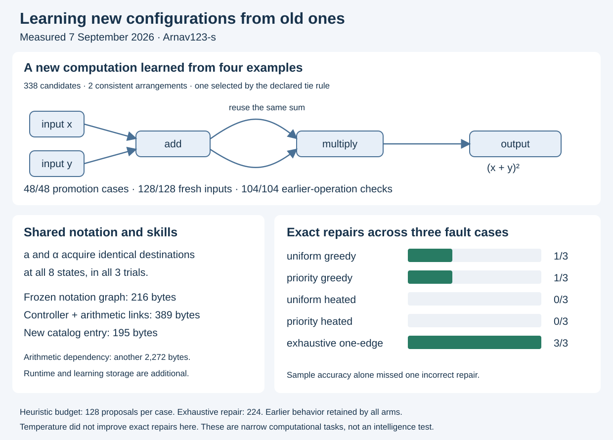
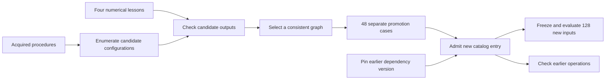

# Configuration reuse, supervised composition and structural repair

Author: [Arnav123-s](https://github.com/Arnav123-s)

7 September 2026. Completed local experiment using Python 3.13. See the [reviewed protocol](../docs/MECHANISM_AUDIT_PROTOCOL.md), [measurements](2026-09-07-mechanism-audit.json) and [project assessment](../docs/PROJECT_ASSESSMENT.md). The earlier [recurrent experiment](2026-09-07-recurrent-configuration.md) remains a separate record, including its failed course.

The experiment adds three measured capabilities: acquiring a shared connection pattern for another notation, learning connections from a recurrent controller to existing arithmetic, and constructing a new arithmetic graph from numerical examples. It also tests classical temperature and error-path priority as search mechanisms. Temperature did not improve exact repair in this experiment.



## What was supplied and what was learned

| Part | Supplied | Learned or selected |
| --- | --- | --- |
| Recurrent model | Token alphabet, finite-state executor, compatible state-merging procedure | States, transitions, recurrent connections and outputs |
| Arithmetic bridge | Controller output interface, candidate procedures `add`, `subtract`, `multiply` | Which procedure fits the numerical feedback for each controller output |
| New computation | Two inputs, acyclic call-graph grammar, at most two calls, candidate enumeration and tie rule | Operation names, argument connections and shared intermediate use |
| Admission | Separate promotion examples, dependency digest, immutable existing names | The candidate admitted after meeting those obligations |
| Repair | One-edge neighborhood, retention check, score, proposal rules and temperature schedule | A candidate configuration selected by the supplied search |

The model does not invent its own search algorithm, evaluator or primitive execution semantics. The exported bridge and catalog contain configuration data and dependency references, without the teaching examples. The configuration itself is persistent learned information; absence of an answer table does not mean absence of memory.

## 1. Connections matter; state names do not

The original eight-state graph has 32 transitions. Replacing each destination with each of the other seven states gives 224 interventions. Every intervention changed behavior under exact comparison. Ten state renamings preserved all behavior. Adding one unreachable state with an arbitrary output also preserved all reachable behavior.

The learned event transitions for `a` and `b` commute at every state. The selector transitions `?a` and `?b` commute at none: the latest selector matters. Interchangeable information can share a route, while order-sensitive information still changes the result.

These controls establish that behavior depends on the reachable connections and outputs. They do not measure intelligence. The state numbers have no teacher-supplied concept names; this small machine can nevertheless be understood from its behavior.

## 2. Another notation acquires the same path

In this authored task, `α` contributes an event to the same stream as `a`. The learner receives no alias map. It sees 19,531 labeled sequences through length six: 5,461 old-alphabet labels generated by the earlier model, plus 14,070 labels involving `α` supplied by the teacher.

| Merge-order seed | Learned states | Transitions | Saved bytes | Fresh longer streams | Exact new task | Exact old task |
| --- | ---: | ---: | ---: | ---: | --- | --- |
| 7 | 8 | 40 | 216 | 128/128 | Pass | Pass |
| 19 | 8 | 40 | 216 | 128/128 | Pass | Pass |
| 43 | 8 | 40 | 216 | 128/128 | Pass | Pass |

At every state in every trial, `a` and `α` have identical destinations. Each input still follows one transition per token. It does not try several complete interpretations at inference time.

The final bank contains streams of length 13–64 and is shared across seeds. This is 128 distinct streams evaluated against three models, not 384 independent questions. Exact comparison covers every finite stream under the declared task, separately from that sample. The finding concerns this notation rule; it does not establish unrestricted word meaning or make every use of the English article `a` equivalent to alpha.

## 3. Numerical feedback connects earlier skills

The acquired controller emits an internal identifier, zero or one. The bridge learner tries candidate arithmetic procedures against the final numerical answers.

The first two lessons both use operands `(2,2)` and answer `4`. Addition and multiplication both fit, so both connections remain ambiguous. Two further lessons use `(2,3)`: an empty token stream gives `5`; the stream `a` gives `6`. These numerical corrections select addition for controller output zero and multiplication for output one. Desired operation names are not teaching labels.

The frozen 389-byte bridge includes its 216-byte controller and a digest of the 2,272-byte arithmetic dependency. It answered all 128 fresh token/value combinations correctly, using operands up to one million and streams of length 13–64. An unknown token returned unresolved, with no numerical answer. The dependency must match before execution.

This is a connection between two previously separate computational cores. The tokens still have an authored task, and the bridge interface is supplied. Natural-language interpretation is not part of this trial.

## 4. Constructing a new configuration from existing ones

The new task has the opaque catalog name `relation_01`. Four teaching pairs are supplied:

| Inputs | Answer |
| --- | ---: |
| 2, 3 | 25 |
| 1, 4 | 25 |
| 0, 3 | 9 |
| 4, 2 | 36 |

Search receives these examples and the acquired arithmetic library. It does not receive the target expression. The enumerated space contains two input-only candidates, twelve one-call candidates and 324 two-call candidates: 338 total. Each call can read either input or an earlier intermediate. Candidate checking stops at the first mismatch or invalid execution.

There were 344 attempted graph/example executions, including 61 invalid executions, and two consistent graphs. The two survivors differ by swapping the arguments of their addition node. The declared canonical tie rule selected:

$$v_2=\operatorname{add}(x,y),\qquad v_3=\operatorname{multiply}(v_2,v_2),\qquad y_{\rm out}=v_3.$$

The sum is computed once and reused. This is a graph with a shared intermediate, not two separately executed copies of the addition. Conditional on the arithmetic dependencies and their limits, inspection identifies the relation as $(x+y)^2$. That expression is an evaluator description of the acquired graph, not a formula supplied to the learner.



The candidate passed all 48 promotion cases. After admission and serialization, it passed all 128 final inputs and 104 checks across the 13 original procedures. Teaching, promotion and final operand pairs have no overlap. Promotion is part of candidate acceptance, not final evaluation.

The new catalog is 195 bytes and refers to the existing library. Admission cannot replace an existing name; the earlier library digest must still match. This demonstrates supervised addition of a new computation. It does not compress or rewrite the whole catalog, infer a specification from an arbitrary question, or judge correctness without external evidence. The earlier recurrent experiment, rather than this append-only catalog step, provides the evidence for replacing an entire old graph while preserving its old task.

## 5. Does temperature help find better configurations?

The physical-mechanism hypothesis concerns the learning process: a mechanism may help construct or discover a more useful configuration, which may improve overall capability. The comparison measures that chain. Neither a physics label nor additional structural detail is counted as an improvement by itself.

Three copies of the eight-state graph receive distinct selector-edge faults. Search receives the damaged graph and 128 development examples. It does not receive the fault location or the correct destination. Each proposal changes one edge; an exact old-task obligation rejects regressions before numerical scoring.

The score is the fraction of incorrect development examples. Heated search uses a finite geometric cooling schedule. Error-path priority increases proposal weight for edges traversed by failing examples. Because that proposal is asymmetric, acceptance includes the reverse/forward proposal ratio:

$$A(K,K')=\min\left(1,\exp\frac{E(K)-E(K')}{T}\;\frac{q(K\mid K')}{q(K'\mid K)}\right).$$

This is classical structural search inspired by [simulated annealing](https://hedibert.org/wp-content/uploads/2013/12/1983KirkpatrickGelattVecchi.pdf). No actual thermal, chemical or quantum process is simulated. The algorithm, priority rule and cooling schedule are supplied. The experiment makes no asymptotic convergence claim.

Each cell below is **fresh correct answers out of 128 / exact full-task result**.

| Search method | Case 7 | Case 19 | Case 43 | Exact repairs |
| --- | --- | --- | --- | ---: |
| Uniform greedy | 95 / fail | 128 / pass | 122 / fail | 1/3 |
| Error-path priority, greedy | 98 / fail | 128 / fail | 128 / pass | 1/3 |
| Uniform heated | 93 / fail | 100 / fail | 123 / fail | 0/3 |
| Error-path priority, heated | 99 / fail | 100 / fail | 123 / fail | 0/3 |
| Exhaustive one-edge repair | 128 / pass | 128 / pass | 128 / pass | 3/3 |

The four heuristic methods receive at most 128 proposals each; early success stops a search. Exhaustive repair checks all 224 alternatives from each original damaged graph. It has a larger budget and a different coverage guarantee. The table therefore does not establish an equal-cost advantage for exhaustive search. It establishes that the three faults are repairable within this small neighborhood and that the tested heuristic settings often miss the repair.

All fifteen resulting configurations retained the earlier `a,b` task exactly. The unsuccessful search outcomes and their first counterexamples remain in the measurement record. Temperature allowed worse candidates but did not yield an exact repair in any tested heated condition. Error-path priority improved some development scores without producing a consistent advantage across these three cases. This small comparison neither supports a general temperature benefit nor rules one out under other tasks, schedules or neighborhoods.

Case 19 with greedy priority is especially useful: it passed all 128 fresh sampled inputs but failed exact comparison. Passing a sample is not the same as learning the full rule. That [incorrect model](mechanism-20260907-inexact-repair.json) is retained alongside an [exact repair](mechanism-20260907-exact-repair.json); the incorrect one is not promoted as a correct task model.

The shortest distinguishing sequence is `a b ?b ?b a`. It selects stream `b`, which contains one event, so the correct output is `1`. The sampled-perfect candidate outputs `0`. A five-token counterexample exposes the mistake despite the successful longer random bank.

## 6. Existing capability boundaries

The addition graph again passed all eight local identities, ten large/carry-boundary additions up to the 4,096-bit input limit, and rejection of an input above that limit. Two cases produce 4,097-bit outputs at the direct circuit interface. The procedure-library interface separately restricts intermediate and output values to its natural-number limit. See the [theorem and assumptions](../docs/ADDITION_CORRECTNESS.md).

All six supported sentence calculations worked, including `twice kinetic energy for mass 7 and speed 11 → 847`. Six authored requests for an unfamiliar proof, a calculus derivation, a physical explanation, literary interpretation, a philosophical comparison and a new poem returned unsupported. These are interface probes, not a formal graduate examination. They show that current arithmetic reuse does not by itself provide broad subject understanding.

## Resources and evidence

| Quantity | Measurement |
| --- | ---: |
| Worker wall time, including visible pacing | 22.967 s |
| Worker CPU time | 3.266 s |
| Deliberate display pacing | 19.907 s |
| Worker peak working set | 38.883 MiB |
| Separate display process, observed after completion | 41.117 MiB |
| Complete local run evidence, excluding its storage census | 2,668,554 bytes |
| Alias learning proposals, across three fits | 461 |
| Alias determinization closure pairs | 59,440 |
| Alias copied transition cells | 9,743,965 |
| Repair proposals, including exhaustive searches and rejected candidates | 1,998 |
| Repair scoring token traversals | 1,677,510 |
| Failed-path priority increments | 502,881 |
| New graph candidates | 338 |
| Controller, arithmetic connections, new catalog and shared arithmetic dependency | 2,856 bytes |

The last row counts the 389-byte bridge, 195-byte catalog and 2,272-byte shared arithmetic library once. The separately exported 216-byte alias graph duplicates the controller already embedded in the bridge. These bytes are not the size of the whole repository, language models, Python runtime or learning workspace. The 22-procedure foundation checkpoint is a separate artifact, not another capability silently included in this 2,856-byte total.

Detailed measurements retain arithmetic calls, gates, loop iterations, proposal counts, scoring traversals, priority updates and retention comparisons by stage. CPU and wall time include orchestration, labels, checks and failed proposals. This is not a count of every processor instruction. The display memory observation is not a simultaneous combined peak; hardware temperature and energy use were unavailable. The faster control-file polling in this run changes overhead, so its timing is not a direct benchmark against the earlier recurrent runs.

Full teaching banks, candidate failures, controls and transcripts remain in ignored local storage. Public artifacts contain the small executable models and compact evidence. No source-text curriculum was run in this experiment.

## Reproduce and inspect

The reviewed live run uses a fresh folder and provides Pause, Resume and Stop:

```powershell
python -B -m scripts.run_mechanism_audit watch --run-dir runs/mechanism-audit-replay
```

It starts four seconds after opening. Closing the window requests a stop; the worker also enforces five minutes including pauses and an observed 512 MiB working-set ceiling. The recorded run finished all scheduled stages. The source and seeds define the experiment; the compact export also records hashes of the measured implementation.

Query the saved models without replaying learning:

```powershell
python -B -m kavi.configuration_cli graph relation_01 17 19
python -B -m kavi.configuration_cli bridge 17 19 a
python -B -m kavi.configuration_cli bridge 17 19 a a
```

The answers are `1296`, `323` and `36`. The first uses the new shared computation. The second and third select multiplication or addition through the acquired controller. These commands take structured inputs; they are not an unrestricted question-answering interface.

Implementation validation: **217 regression tests passed** before the live run. Additional publication checks validate artifact digests, exact-model claims, data partitions, links and the diagram. The [project assessment](../docs/PROJECT_ASSESSMENT.md) relates these results to the broader goal and lists the ideas that remain untested.
