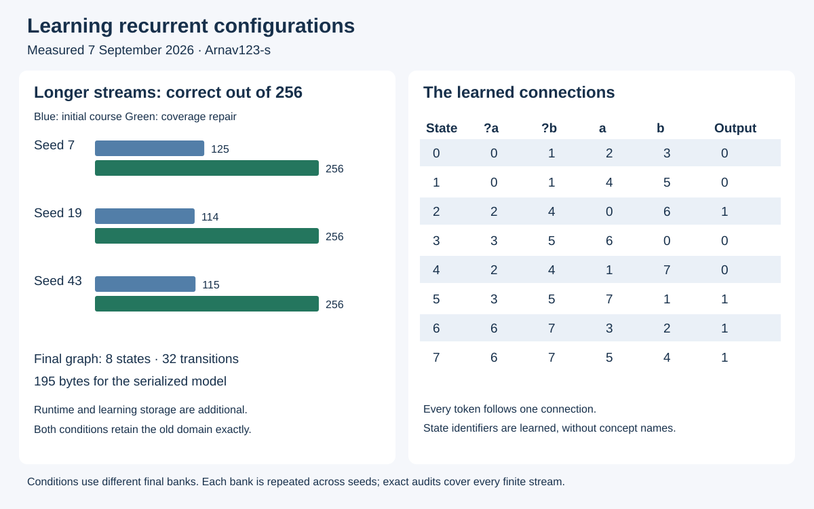
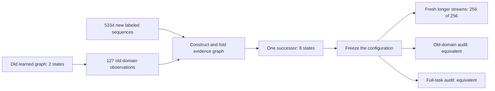
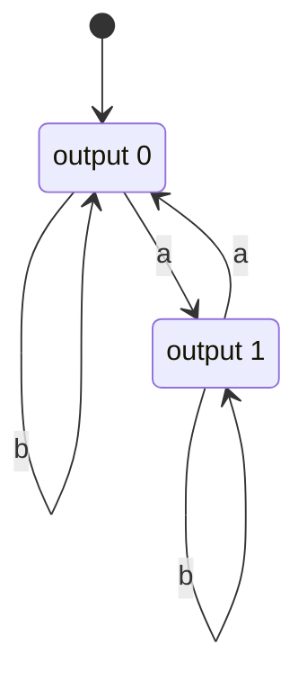
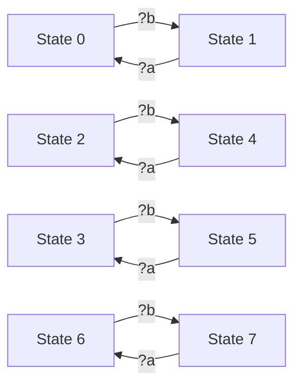

# Learned recurrence, correction and configuration replacement

Author: [Arnav123-s](https://github.com/Arnav123-s)

7 September 2026. Base revision: `f504600`; implementation revision: `ec3b760`. [Protocol](../docs/RECURRENT_CONFIGURATION_PROTOCOL.md) · [Measurements](2026-09-07-recurrent-configuration.json) · [Saved model](recurrent-20260907-model.json).

## Result

Kavi learned a recurrent graph from labeled token streams, then built a successor with a new interpretation while preserving the earlier task. The successful successor has **eight states, 32 transitions and a 195-byte serialized representation**. All three merge-order seeds passed 256 fresh longer streams and an independent exact comparison covering every finite stream in the defined task. Earlier behavior was also preserved exactly on its original alphabet.

The first course failed the new task. Repeated correction on a limited development bank produced graphs with 18–19 states that passed that bank but performed poorly on longer inputs. A follow-up with systematic short-sequence coverage acquired the correct eight-state configuration without further development repairs. The learner was unchanged; the teaching became more informative.



This is a finite symbolic learning result. It does not establish language comprehension, biological intelligence, a learned learning algorithm, quantum computation or graduate subject competence. It does establish acquired recurrence and a behavior-preserving successor in a setting where those claims can be checked completely.

## Task and supplied structure

The initial task returns the parity of the number of `a` events: zero for even and one for odd. `b` events initially do not change the answer. The new task introduces `?a` and `?b`, which select the stream to read. Selectors can arrive after the events. The latest selector applies; the default is `a`.

For example, after `a b`, the default answer is one. Appending `?b` also gives one. Appending another `b` changes the selected answer to zero; appending `?a` returns it to one. Correct execution requires retaining distinctions that might only become relevant later.

The teacher supplies complete input sequences and final labels. It does not supply parity registers, target wiring, recurrent edges or semantic names for the internal states. The learner constructs a prefix evidence graph and folds compatible states using a supplied state-merging algorithm. A merge can turn a finite history into a reusable cycle.

The representation, token vocabulary, deterministic transition semantics, output interface, search order and compatibility rule are engineered. A token selects one outgoing edge. There is no autonomous circulation between tokens, no invented instruction set and no online graph mutation during a frozen query. Temporary activity is the current state identifier; persistent knowledge is the transition/output table. Examples are external learning evidence and are absent from the exported inference model.

This is an implementation of an established automata-learning family. [Oncina and García (1992)](https://doi.org/10.1142/9789812797902_0004) provide an early regular-language inference reference. [Lang, Pearlmutter and Price (1998)](https://www.bcl.hamilton.ie/~barak/papers/icgi98.pdf) describe state compatibility and frontier merging. The current implementation takes the first compatible merge in its declared ordering; it does not implement their evidence-driven scoring method.

## What failed and how it was repaired

The first three lessons were the empty sequence, `b`, and `aa`, each labeled zero. They permitted a one-state constant-output hypothesis. Its prediction for `a` was recorded as zero before teaching `a → 1`.

One correction created a two-state graph but left `ab` unresolved. It passed only 2/256 initial long-stream cases; 254 were unresolved. The unchanged constant predictor scored 126/256 by returning zero everywhere. Therefore the original single-correction transfer criterion failed. Becoming more selective is not the same as becoming generally correct.

Teaching all 31 `a,b` sequences up to length four acquired the correct two-state foundation in every seed. That graph passed the long-stream bank and the exact audit. In the follow-up, adding the specific missing continuation `ab → 1` to the original four lessons was sufficient to acquire the same complete behavior from five lessons. The single-correction result remains reported separately.

The first new-task course used 31 old-domain observations generated by the foundation graph and 310 selector-containing lessons, all up to length four. Each candidate was then corrected against a separate 256-case development bank. The process reached full development accuracy while retaining incorrect generalizations.

| Merge seed | Repair rounds | Added repair labels | Final states | Model bytes | Development result | Fresh longer streams |
| --- | ---: | ---: | ---: | ---: | ---: | ---: |
| 7 | 9 | 70 | 19 | 359 | 256/256 | 125/256 |
| 19 | 9 | 73 | 18 | 347 | 256/256 | 114/256 |
| 43 | 8 | 72 | 18 | 343 | 256/256 | 115/256 |

Correction was not monotonic. For seed 7, development accuracy moved from 215 to 253, then fell to 216 after another rebuild. The whole trajectory is in the measurement record. Previously supplied teaching labels remained constraints; the changing development errors occurred outside the currently taught set.

The exact audit also rejected every initial new-task graph. For seed 7, `a b ?b a ?b` distinguished the learned result zero from the required result one. The [initial graph](recurrent-20260907-initial-model.json) is preserved alongside the successful successor.

The follow-up taught every sequence up to length six. The 127 old-domain labels came from the earlier learned graph; the teacher supplied 5,334 new selector-containing cases. These 5,461 observations produced an eight-state graph for all three seeds, with no additional development repairs.

| Follow-up condition | States | Serialized bytes | Fresh result per seed | Exact audit |
| --- | ---: | ---: | ---: | --- |
| Two corrections, five lessons total | 2 | 105 | 256/256 | All finite `a,b` streams |
| Foundation, 31 lessons | 2 | 105 | 256/256 | All finite `a,b` streams |
| New recurrent configuration | 8 | 195 | 256/256 | All finite streams over all four tokens |
| Same-data prefix control for new task | 5,461 | 97,288 | 0/256, all unresolved | Does not extrapolate beyond observed prefixes |

The follow-up final banks use different seeds and have zero overlap with the earlier final banks. Inputs contain 13–64 tokens. Each condition repeats its 256-case bank across three merge-order seeds: 768 successful model-input evaluations do **not** mean 768 distinct questions. No final case or exact-audit witness updates the candidate during that run.

The prefix control isolates the effect of folding with the same observations. It is not a competitive baseline against neural models, other automata learners or a hand-written parity program. No superiority claim follows from beating it.

## What the successor retains

The new model is a single transition table. It does not load the old model at inference time or retain an answer dictionary. During learning, the old graph generates declared behavioral obligations. An independent product traversal then compares the frozen old and new graphs on all reachable state pairs under `a,b`.

That audit visits four pairs and finds equal outputs and complete transitions throughout. Induction on input length therefore establishes

$$f_{K_{new}}(x)=f_{K_{old}}(x)\quad\text{for all }x\in\{a,b\}^{*}.$$

The old learned model has two states; the successor has eight. Retention concerns behavior, not equal node counts or a one-to-one correspondence between states. This is one concrete instance of

$$K_{new}=T(K_{old},E),$$

where the supplied transformation uses observations generated from the old configuration and new labeled evidence. The experiment does not learn $T$ itself, copy the old graph's hidden organization directly or establish arbitrary-program equivalence. Older arithmetic and sentence artifacts were not rewritten by this separate stream-learning experiment.



The two-state foundation actually contains a cycle:



The names Even and Odd explain the acquired behavior after inspection; the saved graph uses numeric identifiers. In the successor, late selectors connect corresponding states as follows. Event-driven transitions are in the complete table in the figure.



Repeatedly selecting the current stream leaves that state unchanged. Those self-loops are omitted from this selector-only diagram and included in the transition table.

## Closest mathematical relative

For this implementation, the closest relative is **inference of a deterministic finite-state machine by merging equivalent input histories**. The relevant equivalence is

$$u\sim v\quad\Longleftrightarrow\quad \forall z,\ f(uz)=f(vz).$$

Two histories may share a state when every possible continuation produces the same behavior. This relation is stable under appending a token: taking $z=sw$ shows that $u\sim v$ implies $us\sim vs$. Its classes define a reusable transition structure. The implementation approximates compatibility from finite evidence; the final audit checks the resulting finite machine against the task reference.

This explains the late-evidence requirement precisely. Two histories that currently output zero may still need separate states because a later `?b` distinguishes them. Merging solely because current answers match loses information needed for future interpretation.

The task has eight necessary residual behaviors, represented in the evaluator by $(p_a,p_b,m)\in\{0,1\}^3$. All eight are reachable. `?a` distinguishes different $p_a$ values; `?b` distinguishes different $p_b$ values. With the same pair of parities but different selectors, either the current output differs, or appending `a` distinguishes the states when the parities are equal. Thus every distinct reference state has a distinguishing continuation, so a complete deterministic model needs at least eight states. The learned graph attains that bound. This argument is specific to this task.

The broader Kavi proposal is still an adaptive dynamical system whose computational graph changes through learning. This experiment supplies a tractable discrete instance, not a new mathematical family.

## Costs and verification

| Measurement | Initial completed course | Coverage repair |
| --- | ---: | ---: |
| Wall time, including display pacing | 125.789 s | 105.712 s |
| Explicit display pacing | 63.447 s | 35.576 s |
| Summed learning-call wall time | 36.855 s | 32.004 s |
| Worker CPU time | Not recorded | 70.156 s |
| Proposed merges, including rejected proposals | 6,978 | 407 |
| Merge-closure pairs processed | 31,941 | 17,123 |
| Transition cells copied during proposals | 4,446,868 | 2,168,988 |
| Peak worker memory | 36.66 MiB | 37.93 MiB |
| Final external run-folder size | 4,646,595 bytes | 4,826,455 bytes |

The 195-byte inference artifact excludes Python, source code, lookup machinery, temporary state, the teacher, prefix graphs, candidate copies, test banks, old versions, reports and the display. The follow-up display process was separately observed at 45.13 MiB working set after completion. The worker and display measurements are separate processes; their peaks were not measured simultaneously. CPU temperature, energy use and per-object heap peaks were unavailable.

The slower initial course had more rebuilds and more display pauses. These timings are instrumented experiment costs, not a controlled inference-speed comparison. The full regression suite also ran alongside part of the initial course. No speedup claim rests on the wall-time difference. All inputs execute one graph transition per token; reducing logical state count does not remove that input-reading work.

The first launch ended after 1.244 seconds because Windows could not encode an arrow in progress output. Output was changed to UTF-8 and the experiment restarted in a fresh folder. The failed launch and the unsuccessful first course remain in the evidence record.

The implementation regressions check learned cycles, order-sensitive behavior, serialization, unresolved inputs, conflicting labels, cancellation, resource limits, late selectors, old-domain retention and deep distinguishing sequences. The full suite passed **208 tests**. The independent evaluator and teacher use different formulations of the task and are checked for agreement on short sequences. Exact-audit code is tested against deliberately differing machines; it does not certify two incomplete machines merely because both are unresolved.

## Reproduce and inspect

Python 3.11 or later; this run used Python 3.13.5 and the standard library. From the repository root, use a new run folder:

```powershell
python -B -m scripts.run_recurrent_configuration live --run-dir runs/recurrent-initial-replay
python -B -m scripts.run_recurrent_configuration repair-live --run-dir runs/recurrent-coverage-replay
```

Each visible run starts automatically after four seconds and offers Pause, Resume and Stop. Closing its window stops active teaching. Inspect the protocol before running. The five-minute limit includes pauses. Completed model files and evidence remain in the local run folder.

Query the public model without any teaching records:

```powershell
python -B -m kavi.recurrent_cli a b "?b" b "?a" --trace
```

The final answer is `1`. The trace shows which learned state each token reaches. `?b` selects an already observed stream; it does not restart the input or recall a stored teaching sentence.

## Implication for the project

The useful result is that acquired connections can retain distinctions for later interpretation, reuse a small state space indefinitely, and carry an established behavior into a replacement configuration. Systematic teaching closed this experiment's coverage gap. Feedback alone did not ensure monotonic progress, and perfect performance on a small development bank was insufficient.

The next unresolved architectural step is compositional transfer: a learned interpretation should bind values, call acquired arithmetic and survive unfamiliar constructions, without a task-specific semantic frame supplied for each form. The current stream learner remains separate from the arithmetic and sentence systems. Learned update rules, spontaneous internal event scheduling, causal credit assignment, dynamic migration during a query and broad subject competence remain open. The [neural](../docs/NEURAL_PATHWAY_LEARNING.md) and [animal-learning](../docs/ANIMAL_LEARNING_AND_CONFIGURATION_CHANGE.md) studies specify those distinctions and their primary research basis.
