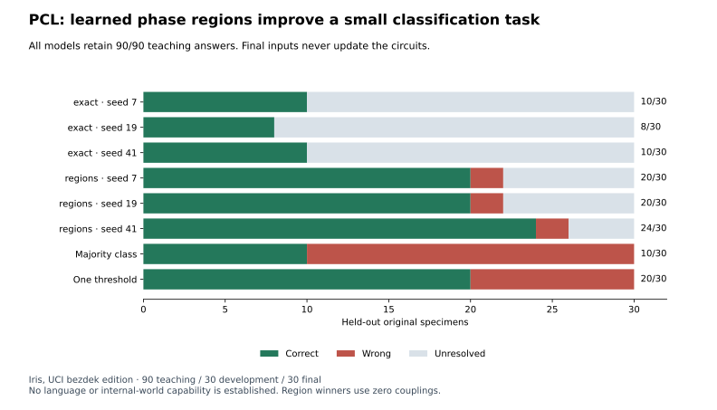

# PCL classification: phase regions and retained teaching

Author: [Arnav123-s](https://github.com/Arnav123-s)

PCL completed its first source-based classification course. Learned phase-region rules answered 20, 20 and 24 of 30 unseen Iris specimens correctly across three fixed seeds, compared with 10, 8 and 10 for exact-state readouts. All six models retained 90/90 teaching answers, including the 44 earlier lessons. This is a narrow classification result; it does not establish language understanding or an acquired internal world.



## What changed

The [phase-region extension](../docs/PCL_PHASE_REGIONS.md) allows an output rule to apply to an interval conjunction over current phases. A learned rule can therefore cover an unshown state without retrieving a nearest teaching example. Inference returns unresolved when no rule applies or conflicting rules apply. The ordinary interval-covering algorithm is supplied; the bounds and outcomes are learned.

The [protocol](../docs/PCL_CLASSIFICATION_PROTOCOL.md) was fixed before final evaluation. Each arm rebuilt complete circuit candidates above the same stable template, with twelve proposals at each of two stages and seeds 7, 19 and 41. Second-stage candidates inherited the first-stage circuit and protected its 44 teaching outcomes. Development scores did not select models or change the protocol. After all fits finished, frozen models were evaluated on the final bank.

## Source and representation

The source is the unchanged `bezdekIris.data` edition from the [official UCI Iris archive](https://archive.ics.uci.edu/dataset/53/iris), attributed to R. A. Fisher (1936), DOI 10.24432/C56C76, under CC BY 4.0. UCI documents discrepancies between distributed editions and the historical paper; this run uses the named edition without repairing it or claiming reconstruction of the original paper's table.

The 150 measured records contain 149 distinct measurement tuples. Duplicate grouping keeps identical tuples in the same partition. The resulting split is 90 teaching, 30 development and 30 final records; the first stage uses 44 of the teaching records. Source bodies and six derived checkpoints remain local. [Aggregate evidence](2026-09-08-pcl-classification.json) records the source hashes, partition identifiers, candidate outcomes, work, resources and checkpoint fingerprints.

Four initial phase counters encode the four dimensions in exact tenths of a centimetre. Input consists of repeated field events, and each counter has modulus 256. This encoding, its units and the association between fields and counters are supplied. The course does not teach the meaning of a plant, species, sepal or petal from language.

The Zoo dataset was considered but excluded because its source describes it as artificial. No invented measurements or labels were introduced into this course. The four new regression methods use small interpreter fixtures, which are separate from source-based teaching.

## Final results

| Readout | Seed | Correct / 30 | Wrong | Unresolved | Artifact bytes | Output rules | Couplings |
| --- | ---: | ---: | ---: | ---: | ---: | ---: | ---: |
| Exact | 7 | 10 | 0 | 20 | 1,310 | 66 | 0 |
| Exact | 19 | 8 | 0 | 22 | 1,423 | 72 | 2 |
| Exact | 41 | 10 | 0 | 20 | 1,310 | 66 | 0 |
| Regions | 7 | 20 | 2 | 8 | 457 | 5 | 0 |
| Regions | 19 | 20 | 2 | 8 | 457 | 5 | 0 |
| Regions | 41 | 24 | 2 | 4 | 437 | 5 | 0 |

The majority-class control scores 10/30. A single-threshold classifier trained on the same measurements scores 20/30. That control uses petal length and predicts the most common class on either side of its learned threshold. The range model's best result exceeds this control on this one small partition; it does not establish superiority over standard classifiers or a reliable population-level advantage. The three seeds share one final bank and are not three independent datasets.

All models pass their 90 teaching cases and 44 earlier-case checks. Final development scores are 8, 4 and 8 of 30 for exact readouts and 21, 21 and 25 for region readouts. No candidate was stopped by the work limit. Final model fingerprints remained unchanged during evaluation.

## What the circuits learned

The region models for seeds 7 and 19 retain the supplied counter dynamics and learn only five output regions. They produce identical final artifacts. This gain is readout generalization, not learned coupling or discovery of a new internal simulation.

Seed 41 selects zero impulses for both sepal measurements and retains the petal counters. The reconstructed circuit therefore ignores the sepal dimensions and classifies from petal dimensions. This is a concrete acquired input-selection behavior within the supplied grammar. It has five output rules and no couplings. Some rules remain point-like, so the result does not support a claim that all acquired information has become broad abstraction.

None of the successful region models requires coupled phase interactions. The experiment consequently provides no evidence that pendulum-style coupling caused the improvement. Its useful result is that a complete successor can retain earlier finite teaching outcomes while replacing exact answers with more general phase rules and, in one seed, selecting useful input dimensions.

## Costs and limitations

The entire visible course took 37.48 wall seconds and 21.61 CPU seconds, including 16.02 seconds of display pacing. Reported peak working set was 28,114,944 bytes. Local run files totalled 56,562 bytes before their own storage census; source files and interpreter storage are additional. The downloaded archive was 3,738 bytes. No reliable CPU-temperature measurement was available.

Artifact sizes include the serialized template, circuit, readout rules and generation number. They exclude interpreter code, input decoding, teacher data, candidate copies and current activity. The 437-byte artifact is a tiny specialist, not a generally intelligent model. Exact and region arms share candidate counts, not identical CPU work: covering and execution costs are recorded separately in the aggregate evidence.

The evidence supports classification of held-out measurements from this edition. It does not establish cross-dataset transfer, raw-language interpretation, causal reasoning, autobiographical memory, an internal reality, autonomous template learning or graduate-level science. Exact checks here concern the interpreter; retained abilities are measured on a finite teaching bank, not proved for every input.

## Next test

Before advancing to broader subjects, test relational composition and correction on independently sourced tasks: the same acquired relationship must support different questions and unfamiliar combinations. Separate an acquired relationship from supplied input encoding and readout grammar. Keep the final classification bank frozen; do not repeatedly teach against its mistakes and continue calling it unseen.

## Verification and reproduction

All 294 repository tests passed before the source course, including the four new phase-region regression methods. The run completed through the existing readable window with Pause, Resume and Stop controls. No worker or restart is scheduled after completion.

```powershell
python -B -m unittest tests.test_phase_regions
python -B -m scripts.acquire_iris_source
python -B -m scripts.configuration_lab_window --runner scripts.run_pcl_classification --run-dir runs/pcl-classification-reproduction
```

Use a fresh run folder. If the Python certificate store cannot retrieve the archive, acquire the same stated UCI URL with a system-verified HTTPS client and pass its local path with `--archive`. The acquisition script records the bytes and hashes; do not disable certificate checks or substitute generated rows.
