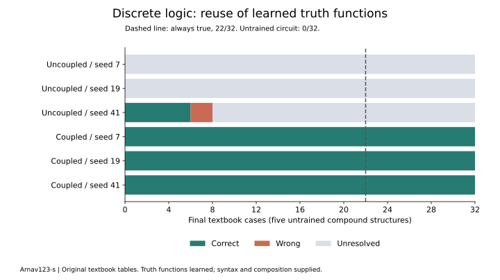

# Discrete mathematics: learned truth functions and compound formulas

Author: [Arnav123-s](https://github.com/Arnav123-s)

8 September 2026. Completed first discrete-mathematics course. [Protocol](../docs/PCL_DISCRETE_PROTOCOL.md) · [Aggregate evidence](2026-09-08-pcl-discrete.json).

## Result

All three coupled runs learned all 18 primitive truth cases for AND, OR, NOT, implication and equivalence. Each retained the initial eight AND/OR cases through whole-circuit reconstruction. Using those learned operations with a supplied composition executor, every coupled run answered all 32 final textbook cases correctly.

This is a useful change from position classification: the same acquired operation is reused inside different expressions. The experiment does not demonstrate that Kavi independently invented expression decomposition, understood textbook prose or learned all of discrete mathematics.



## How the teaching works

Oscar Levin's original [third-edition section on propositional logic](https://discrete.openmathbooks.org/dmoi3/sec_propositional.html) supplies the teaching cells and compound examples. Source rights are CC BY-SA 4.0; attribution and original edition are preserved. The HTML and extracted cases stay local. No generated examples or Gutenberg source enters the course.

The teacher reads each primitive truth-table row as a short event sequence and target. A binary call gives the left truth value, connective name and right truth value. Negation gives its name followed by its input. Candidates change impulses, couplings and output organization; no built-in Boolean connective computes the circuit's answer. The first round teaches eight AND/OR rows, and the second round teaches all 18 rows while preserving those eight targets.

The compound executor traverses a supplied syntax tree. It asks the learned circuit for the result of each connective, then feeds that result into its parent operation. This executor supplies structure, variable binding and execution order. It does not supply the truth functions. An unresolved child makes the whole expression unresolved.

```text
Original truth-table cells -> supervised whole-circuit reconstruction
                                              |
                                              v
                                    learned logical circuit
                                              ^
                                              |
New formula -> supplied syntax traversal -> repeated circuit calls -> result
```

Training includes the complete finite primitive domain. There are no unseen primitive truth assignments left. The final evaluation checks untrained compound formula structures, not newly discovered connective meanings. Four source cases from example 3.1.1 form the development bank; 32 cases from examples 3.1.2, 3.1.3 and 3.1.5 form the final bank. All five final formula structures are absent from teaching and development. All examples are from the same author; independent-textbook transfer remains unmeasured.

## Every run

| Coupling capacity / seed | Initial teaching /8 | Complete primitive domain /18 | Earlier targets retained /8 | Development /4 | Final correct /32 | Wrong | Unresolved | Artifact bytes |
| --- | ---: | ---: | ---: | ---: | ---: | ---: | ---: | ---: |
| 0 / 7 | 8 | 8 | 8 | 0 | 0 | 0 | 32 | 340 |
| 0 / 19 | 8 | 8 | 8 | 0 | 0 | 0 | 32 | 339 |
| 0 / 41 | 8 | 11 | 8 | 3 | 6 | 2 | 24 | 338 |
| 6 / 7 | 8 | 18 | 8 | 4 | 32 | 0 | 0 | 532 |
| 6 / 19 | 8 | 18 | 8 | 4 | 32 | 0 | 0 | 530 |
| 6 / 41 | 8 | 18 | 8 | 4 | 32 | 0 | 0 | 529 |

The final coupled circuits have four, three and three couplings respectively. Always answering true scores 22/32. An untrained circuit with the same composition executor scores 0/32, with every result unresolved. The three seeds share one bank and are not independent datasets. All fits finished before final scoring, and frozen circuit hashes remain unchanged during evaluation.

Uncoupled dynamics cannot distinguish the reversed mixed inputs to implication: false implies true and true implies false have the same event counts but different targets. This explains why no uncoupled candidate fits the full primitive lesson. Seed 41's additional correct primitive answers are incidental behavior of its earlier circuit; its second teaching round admits no replacement.

## What can be established mathematically

For each successful frozen circuit, exhaustive checking covers every Boolean input combination of each of the five connectives. If those checks pass and the composition executor implements its stated syntax correctly, correctness extends by structural induction to every finite, well-formed expression using these connectives and supplied Boolean variable assignments, within available resource limits:

1. A variable leaf returns its supplied truth assignment.
2. Assume each child expression returns its correct truth value.
3. The checked learned connective returns the correct value for those child values.

This is a conditional compositional correctness argument, not a claim that 32 tests prove the whole program correct. The executor still requires software verification. It is also standard mathematics, not a newly discovered theorem. It provides a precise scope for the learned functions; it does not establish English comprehension, theorem discovery or unrestricted reasoning.

The circuit contains a finite representation of the truth functions. It does not retrieve source rows during inference, but exact phase readouts can encode a truth table. This is stored information, not a memory-free system or proof that memorization has been eliminated. Working memory includes the expression, traversal plan, operand stack and phase states.

## Costs and remaining limits

The visible course completed in 17.658 wall seconds and 1.813 CPU seconds, including 16.019 seconds of display pacing. Peak and final working set were 26,710,016 bytes. The teaching HTML is 276,967 bytes. Local run files total 50,072 bytes before the storage census; the saved licence page, repository and interpreter are additional. CPU temperature was unavailable.

Each of 12 fits permits 256 complete candidates: 3,072 proposals in total. Named work and source/implementation fingerprints are in the aggregate evidence. Artifact sizes count the serialized template, circuit and generation; they exclude interpreter code, source data, candidate workspace and composition machinery. This is not a size comparison with a general language model.

The course keeps the earlier strict readout admission rule unchanged. Its success on the small finite truth domain does not repair the poor generalization observed in the [English position course](2026-09-08-pcl-relations.md). These task-specific circuits are separate; cross-domain consolidation and retention have not been tested.

Next discrete-mathematics stages are finite sets and membership, relations and functions, graph reachability, counting and induction. Each needs a source-backed packet and a clear boundary between supplied representation and acquired behavior. Neither set theory nor proof construction was taught in this run.

## Reproduction

The pre-run checks passed 16 relevant methods, including six new composition/source-reader tests. They verify that an untrained circuit gains no Boolean answers from the executor, operand order is preserved, missing assignments remain unresolved, malformed inputs are rejected and finite limits interrupt execution. Fixtures are software checks, never teaching examples.

After the course, all 308 repository tests passed in 10.465 seconds. Exact run-source fingerprints, historical experiment checks, documentation links and the rendered result chart also passed review.

```powershell
python -B -m unittest tests.test_phase_logic tests.test_phase_layers tests.test_phase_configuration
python -B -m scripts.acquire_pcl_discrete
python -B -m scripts.configuration_lab_window --runner scripts.run_pcl_discrete --run-dir runs/pcl-discrete-reproduction
```

Use a fresh run folder. The source helper checks the original HTML fingerprint and refuses a changed edition. The completed course exposes no ongoing worker or automatic restart.
