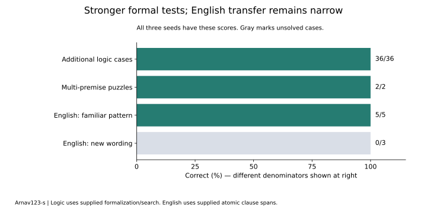

# Harder logical problems and a first English-to-logic bridge

Author: [Arnav123-s](https://github.com/Arnav123-s)

8 September 2026. Completed run. [Fixed protocol](../docs/PCL_ENGLISH_LOGIC_PROTOCOL.md) · [Aggregate results](2026-09-08-pcl-english-logic.json).

## Results

All three frozen logical circuits passed 36 additional textbook cases and solved two original multi-premise puzzles. No truth-function retraining occurred. The first English phrase circuit learned all eight teaching examples, retained the first four, and correctly interpreted five final sentences whose connecting patterns were present in teaching. It left all three new formulations unresolved.

The English result is 5/8 exact interpretations and 20/32 end-to-end Boolean valuation checks. A constant forward-implication answer also scores 5/8 interpretations, although on different cases. This result does not establish broad English understanding or an advantage over that baseline.



## Harder questions

The six additional formula structures come from previously unused tables in Oscar Levin's [propositional logic section](https://discrete.openmathbooks.org/dmoi3/sec_propositional.html). Their displayed cells supply 36 reference answers. These formulas differ from the development and final structures in the preceding course. Each of seeds 7,19,41 scores 36/36.

Two source investigations then require satisfying several premises at once:

| Investigation | Formal variables | Total syntax nodes in premises | Maximum connective depth | Assignments examined per model | Result |
| --- | ---: | ---: | ---: | ---: | --- |
| Holmes clothing, section 3.1 | 4 | 18 | 2 | 16 | Unique solution found; matches annotated source interpretation |
| Three trolls, section 0.2 | 3 | 45 | 6 | 8 | Unique solution found; matches annotated source interpretation |

Holmes's premises imply a non-tweed suit, sandals, a purple shirt and a tie. The formalization treats a bow tie as a tie and the two stated suit choices as exhaustive. The trolls' knight indicators are true, false, true. Both results are obtained in all three seeds.

The solver enumerates assignments; it does not learn the search procedure. Each compound premise is evaluated by repeated calls to the acquired truth circuit. The original English-to-formula conversion for these puzzles is supplied by the teacher, not produced by the English learner below. Expected puzzle solutions are teacher annotations checked against the formal premises, not independent published machine-verifier results. These are harder than the preceding single-formula examples, but remain small propositional problems rather than research-grade mathematics.

All 18 primitive truth cases remain correct after the English course. Original logic checkpoint hashes are unchanged. Unresolved premise evaluations prevent an assignment from being reported as a confirmed solution unless another premise already rules it out.

## How English was connected to discrete mathematics

The source is Levin's [Mathematical Statements section](https://discrete.openmathbooks.org/dmoi3/sec_intro-statements.html), original English, third edition, CC BY-SA 4.0. Eight examples cover conjunction, disjunction, prefix conditionals, equivalence, if, only if, and necessary/sufficient formulations. Their two atomic clause spans and logical targets are explicit teacher annotations of the author's examples and explanations.

The caller marks both clauses. Their text is replaced by a shared clause marker, while the connecting words remain. The first clause is assigned P and the second Q. A separate phase circuit maps this event sequence to one of five supplied formula templates: AND, OR, forward implication, reverse implication or equivalence. Its predicted formula is then evaluated by the previously learned logic circuit from seed 7, selected before this run.

```text
Original English + marked clause spans
                  |
                  v
       supplied masking and tokenization
                  |
                  v
       learned phrase-to-formula circuit
                  |
                  v
       frozen learned truth-function circuit
                  |
                  v
       answer under supplied clause truth values
```

Clause boundary discovery, clause vocabulary, variable binding and factual truth are not acquired here. The downstream Boolean tests supply clause truth assignments; Kavi is not deciding whether an English assertion about the world is factually true. Language and logic remain two separate circuits, not one consolidated learned world.

## All English runs

| Seed | Teaching /8 | Earlier targets /4 | Familiar-pattern final /5 | New-formulation final /3 | End-to-end valuations /32 | Phrase artifact bytes |
| --- | ---: | ---: | ---: | ---: | ---: | ---: |
| 7 | 8 | 4 | 5 | 0 | 20 | 448 |
| 19 | 8 | 4 | 5 | 0 | 20 | 448 |
| 41 | 8 | 4 | 5 | 0 | 20 | 448 |

All three phrase artifacts are identical: SHA-256 `4c66f97b5f3435a4672c7d567e872b1ed810ad9e474bebebe04ac22bee4b6384`. They retain the initial impulse dynamics, use no couplings and learn seven exact phase readouts. The larger candidate search did not improve on rebuilding the initial circuit's output rules. The evidence is therefore a learned finite pattern mapping after supplied abstraction, not learned recurrent English interpretation.

The five successful final sentences use different original clauses but the same masked connector sequences as teaching. Those inputs are not novel to the phrase circuit after masking. The three failed formulations contain untrained wording, including a word absent from the teaching alphabet, so the current runtime cannot route them to an answer. They produce no incorrect Boolean answers because they remain unresolved. An untrained phrase circuit interprets 0/8; constant forward implication gives 5/8, compared with the learner's 5/8.

These failures are retained. They were not added to teaching and rescored as unseen. The next language improvement needs broader original paraphrase supervision, acquired clause structure and a fresh evaluation bank. This course does not repair the whole-candidate rejection issue or demonstrate learned paraphrase inference.

## Costs and verification

The complete visible run took 10.454 wall seconds and 1.281 CPU seconds, including 9.255 seconds of display pacing. Peak working set was 26,767,360 bytes and final working set was 26,447,872 bytes. Local run files total 28,151 bytes before the storage census. The English HTML occupies 282,955 bytes; the existing logic HTML, original checkpoints, interpreter and repository are additional. No reliable temperature telemetry was available.

Each of six English fits examined 256 complete candidates: 1,536 total. Per-stage compatibility counts and named work are recorded. The phrase artifact is 448 bytes and its preselected downstream logic artifact is 532 bytes, totaling 980 serialized artifact bytes. This excludes the formula-port templates, tokenizer, solver, syntax traversal, active states and teaching workspace. No general-model size comparison is implied.

Original source bodies and checkpoints remain local. Public [annotations](../curriculum/pcl-english-logic-annotations.json) contain source offsets, clause offsets and formula ports, permitting reconstruction from the fingerprinted HTML without embedding the sentences in the repository. Full source text is joined and whitespace-normalized by the documented reader before offsets are applied.

Eleven relevant pre-run tests passed, covering the new bounded assignment search, clause masking, formula-port delegation and earlier logic execution. Software fixtures never enter the curriculum. Original source fingerprints, source-sentence reconstruction, the five/three evaluation split and non-overlap with prior formula structures were checked. Teaching has stopped; no restart is scheduled.

After the run, all 313 repository tests passed in 9.837 seconds. Exact implementation fingerprints, historical artifact checks, report links and the rendered chart also passed review.

## Reproduction

```powershell
python -B -m unittest tests.test_phase_reasoning tests.test_phase_logic
python -B -m scripts.acquire_pcl_english_logic
python -B -m scripts.configuration_lab_window --runner scripts.run_pcl_english_logic --run-dir runs/pcl-english-logic-reproduction
```

The run requires the three original discrete-course checkpoints in the documented local run folder. Recreate those through the preceding course if unavailable. Their hashes must match its published evidence. Use a fresh output folder. Rerunning these same evaluation questions is a reproduction, not another independent generalization result.
