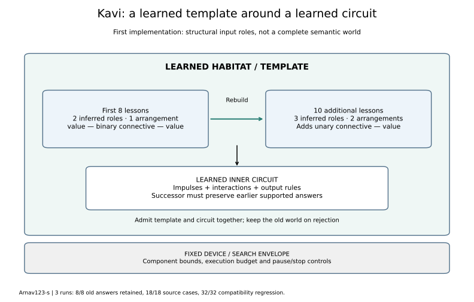

# A learned template boundary and whole-world replacement

Author: [Arnav123-s](https://github.com/Arnav123-s)

8 September 2026. [Protocol](../docs/PCL_LEARNED_HABITAT_PROTOCOL.md) · [Aggregate evidence](2026-09-08-pcl-habitat.json).

## What changed

The template is now an acquired part of the prototype. It describes structural roles and admitted input arrangements. An inner learned circuit computes within that boundary. The old fixed `CircuitTemplate` remains the device/search envelope; it no longer stands in for the intended learned template.

The first implementation is deliberately specific: it learns an input-role grammar, called a habitat. It does not yet model people, buildings, ownership, locations, causal laws or an internally experienced reality. It also does not learn the algorithm used to infer the template. The change implements a first structural layer of the proposed world boundary, not the complete world model.



## Measured behavior

All three runs start with an empty habitat. Eight original AND/OR truth cases produce two unnamed roles and one pattern. Only ten additional original source cases are supplied in the second teaching call. The successor habitat has three roles and two patterns:

| Stage | Inferred role domains | Admitted arrangements | Admitted inputs |
| --- | --- | --- | ---: |
| Initial | `{and, or}`; `{false, true}` | value, binary connective, value | 8 |
| Additional | `{and, iff, implies, or}`; `{false, true}`; `{not}` | value, binary connective, value; unary connective, value | 18 |

The human descriptions “value,” “binary connective” and “unary connective” interpret the measured groups after inference. Those names are not supplied labels. A role means interchangeable placement in the finite input language; it does not mean the members have identical truth functions. AND and OR occupy the same structural role while retaining different meanings in the inner circuit.

| Seed | New cases learned in second round /10 | Earlier answers /8 | Complete source cases /18 | Prior compound regression /32 | Final habitat bytes | Final inner bytes | Complete world bytes |
| --- | ---: | ---: | ---: | ---: | ---: | ---: | ---: |
| 7 | 10 | 8 | 18 | 32 | 92 | 506 | 619 |
| 19 | 10 | 8 | 18 | 32 | 92 | 475 | 588 |
| 41 | 10 | 8 | 18 | 32 | 92 | 526 | 639 |

The initial habitat is 62 bytes. Complete world sizes include wrapper keys as well as the habitat and inner-generation records. They exclude interpreter code, proposal search, teacher data, role-inference workspace and active phase states.

No independent generalization result is claimed here. The 32 compound cases were published in the preceding discrete course and are now a compatibility regression. All three fits finished before that regression. The source is the same fingerprinted Oscar Levin textbook packet with the same attribution and licence; it is not a generated curriculum.

## How the template is learned

For a finite confirmed event language L, define the contexts of a symbol a as:

$$C_L(a)=\{(u,v):uav\in L\}.$$

Two symbols share a role exactly when their context sets are equal. The learner records the resulting role domains and the role pattern of each admitted input. It reconstructs the complete partition when new confirmed structure arrives; roles can gain members or split. A software fixture demonstrates splitting while retaining the older boundary.

The inferred habitat represents L exactly. To see why, start with an observed word and substitute one symbol with another from the same role. Context equality preserves membership in L. Repeat this for each position. Every word generated by an admitted role pattern therefore remains in L, while every observed word is represented by construction.

This factorization finds shared structure but does not extrapolate beyond the finite observed language. New unobserved roles or arrangements are not silently accepted. The template is a learned boundary in this restricted sense, not a discovered general ontology. It can still encode the observed distinctions, so no zero-memory or anti-memorization claim follows.

## How old behavior survives a new world

The deployed world stores the current habitat and inner circuit, not a source-lesson list or chain of parent worlds. For a later teaching round:

1. Expand the old habitat's admitted inputs transiently.
2. Ask the old circuit for their answers, obtaining retention obligations from its own configuration.
3. Combine the old boundary with new structural observations to infer a new habitat.
4. Construct complete inner-circuit candidates using inherited and new relationships.
5. Admit the new habitat and inner circuit together only if all new targets and protected answers pass and the old admitted boundary remains covered.

Explicit corrections can replace an old answer on the corrected input. Other previously supported answers remain protected. If reconstruction fails or execution is interrupted, the old world remains available. A malformed deployed habitat that admits an unresolved input is rejected for teaching rather than treated as established knowledge.

In this source run, the second teaching call receives only the ten additional cases. It derives all eight old obligations from the old world. The external evaluator still retains the original source bank and independently verifies the resulting answers; this is distinct from the learning call receiving those old lessons.

Retention is exhaustive over this old finite boundary, not over every possible future input. Expansion is capped at 4,096 inputs and words at 64 events. Active-state transfer across a changed template is not implemented; replacement happens between invocations. The update schedule is supplied, although unchanged structural evidence need not change the inferred habitat.

The admitted input language grows monotonically in this implementation. Roles can reorganize, but retracting a mistakenly admitted arrangement requires negative structural evidence and a revision policy that are not implemented. Correcting an answer is supported; declaring a previously admitted input structurally invalid is a separate missing operation.

## Remaining distance from the intended world

The broader template should describe acquired entity kinds, relation roles, allowed transformations and their conditions. This implementation regulates input arrangements. It does not yet constrain internal coupling proposals by semantic role, discover persistent objects, learn how to decompose a situation, infer a law of motion, or decide when its own template should evolve. Its ability to reject an unsupported input is not learned doubt or understanding of why the input is wrong.

Next experiments should use original relational observations to test role discovery beyond symbol placement, followed by role-guided circuit construction and persistent situation updates. They must distinguish actual learned semantics from teacher-supplied identifiers and annotations. A visually elaborate diagram would not close those gaps.

## Costs and verification

The visible course took 9.966 wall seconds and 0.859 CPU seconds, including 9.223 seconds of display pacing. Peak working set was 26,533,888 bytes; final working set was 26,451,968 bytes. Run files total 29,809 bytes before their storage census. The existing source HTML occupies 276,967 bytes; the interpreter and repository are additional. CPU temperature was unavailable.

Six fits examined 256 complete proposals each, totaling 1,536. Every stage accepted a successor; no configured ceiling was reached. Per-stage work includes role-context construction, old-language expansion, old-circuit replay, candidate search, boundary checking and serialization. Counts are named operations, not CPU instruction counts. Context sets and expanded languages occupy transient memory even though they are not stored in the deployed world.

Seventeen relevant tests passed before the course. A subsequent exhaustive software property check covers all 64 subsets of the six nonempty words over a two-symbol alphabet of length at most two, checking exact language preservation by factorization. Other fixtures cover inferred roles, role splitting, correction, retained answers, rejection, expansion bounds and interruption. These are software tests, not synthetic teaching data.

All 321 repository tests passed after the extension in 10.167 seconds. Exact run-source fingerprints, historical experiment checks, documentation links, SVG structure and the rendered habitat diagram were verified.

```powershell
python -B -m unittest tests.test_phase_habitat tests.test_phase_layers tests.test_phase_logic
python -B -m scripts.acquire_pcl_discrete
python -B -m scripts.configuration_lab_window --runner scripts.run_pcl_habitat --run-dir runs/pcl-habitat-reproduction
```

Use a fresh output folder. Source, checkpoints and full runtime logs remain local. Teaching has completed with no worker or restart scheduled.
