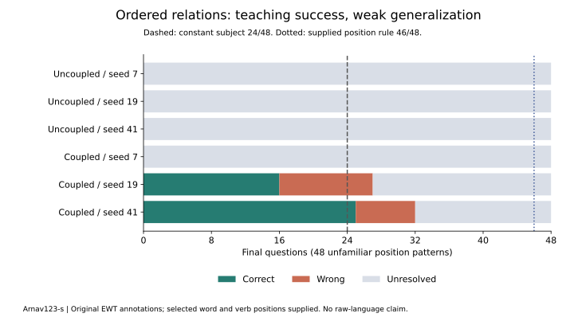

# PCL learns an ordered distinction, but transfers poorly

Author: [Arnav123-s](https://github.com/Arnav123-s)

8 September 2026. Completed original-source course. [Protocol](../docs/PCL_RELATION_PROTOCOL.md) · [Aggregate measurements](2026-09-08-pcl-relations.json).

## What happened

One coupled phase circuit learned all 48 selected teaching relationships and preserved the first 24 through a second whole-circuit reconstruction. On 48 unfamiliar position patterns it answered 25 correctly, seven incorrectly and left 16 unresolved. Its complete serialized template and learned circuit occupy 648 bytes; the interpreter and teaching workspace are additional.

The uncoupled controls acquired no answer rules. A constant subject answer scores 24/48 and a supplied before/after rule scores 46/48. The learned model therefore barely exceeds the constant control on this bank and falls far below the simple task-specific rule. This course demonstrates a narrow acquired ordered distinction, not reliable English understanding.



## What was taught

The [English Web Treebank release r2.15](https://github.com/UniversalDependencies/UD_English-EWT/tree/4dc8e10cf32352e11ab2c46e024b19853b91546e) supplies original sentences and basic grammatical annotations. A selected word and the root verb are marked in the original token sequence. Other positions emit the same neutral event. The target is the annotated subject or object relation between those two marked tokens.

The supplied representation identifies tokens and the verb; it does not expose the subject/object label to inference. Kavi sees ordered events, not the source words, dependency labels or answer records. It has not learned to recognize the verb, read arbitrary prose or decide which arbitrary word has a grammatical link. Sentences are not generated or rearranged for teaching. The projection loses lexical distinctions and can make different relationships indistinguishable.

Use 24 initial lessons and 48 total lessons, followed by 24 development and 48 final queries. Each bank is balanced between subject and object. Source partitions are respected, and selected documents and projected sequences do not overlap across training, development and final evaluation. One representative per projected sequence is selected deterministically; this narrows coverage and does not remove ambiguity from English generally. No final question was used for candidate selection. All six fits finished before final scores were exposed.

Annotations and database rights are CC BY-SA 4.0; underlying text rights vary. Credit Silveira, Dozat, de Marneffe, Bowman, Connor, Bauer, Manning and the treebank contributors. Source bodies, query identifiers, projected teaching records and checkpoints remain in ignored local folders. The public evidence contains aggregate results and fingerprints.

## All results

| Coupling capacity / seed | Initial teaching /24 | Expanded teaching /48 | Earlier targets retained /24 | Development after expansion /24 | Final correct /48 | Final wrong | Final unresolved | Bytes |
| --- | ---: | ---: | ---: | ---: | ---: | ---: | ---: | ---: |
| 0 / 7 | 0 | 0 | 0 | 0 | 0 | 0 | 48 | 242 |
| 0 / 19 | 0 | 0 | 0 | 0 | 0 | 0 | 48 | 242 |
| 0 / 41 | 0 | 0 | 0 | 0 | 0 | 0 | 48 | 242 |
| 4 / 7 | 0 | 0 | 0 | 0 | 0 | 0 | 48 | 242 |
| 4 / 19 | 24 | 32 | 24 | 2 | 16 | 11 | 21 | 546 |
| 4 / 41 | 24 | 48 | 24 | 17 | 25 | 7 | 16 | 648 |

Zero retained targets in a failed run means those targets were never acquired; it is not a loss of 24 previously correct answers. Seed 19 retains its first-generation circuit because no admissible replacement was found in stage two. It already answers 32 of the expanded teaching cases correctly. Seed 41 accepts a second generation and meets all 48 targets. The successful circuits contain three and four couplings respectively.

Each fit proposes 64 complete circuits. The stable template, event alphabet, candidate generator, modular update law and readout grammar are supplied. The selected impulses, couplings and readout bounds are acquired through the declared supervision. This is a new task-specific course; it does not combine the flower classifier with a language model or demonstrate cross-domain retention.

All 288 final branch-versus-replay comparisons agree, with the parent state unchanged. This includes unresolved predictions and is an execution check, not 288 correct answers or learned counterfactual reasoning. Both paths use the same interpreter, so the comparison is a regression check rather than an independent semantic oracle.

## Why order was necessary

Every projected input contains one candidate event, one predicate event and a number of other events. Without couplings, final state depends only on these counts. Therefore sentences of the same length are indistinguishable under any uncoupled impulse arrangement in this grammar.

For the selected training bank, let n(L,c) count examples of length L with class c. Any classifier using only this event multiset has at most

$$\sum_L \max_c n(L,c) = 31$$

correct answers out of 48. Eleven length groups contain conflicting class labels. Modular collisions can lower this ceiling further. The coupled seed-41 circuit fits 48, so its training behavior cannot be explained by an unordered event-count classifier. This is a restricted architectural argument, not a new general intelligence theorem.

## Where learning stalled

The readout builder rejects an entire candidate when two different teaching labels reach the same phase state. It cannot retain the candidate's useful distinctions while leaving only its ambiguous states unresolved. All uncoupled candidates are rejected. The coupled seed-7 search also finds none. Each successful first stage finds only one compatible candidate out of 64; seed 19 finds no compatible successor in the second stage, while seed 41 finds one.

This is a restrictive interaction between the proposal grammar and the admission rule. More broadly capable dynamics exist in the search space, but sparse random reconstruction seldom finds a fully consistent candidate. Even consistency on all teaching examples fails to guarantee transferable rules, as the final scores show.

The next improvement should separately test partial readout admission and proposals guided by conflicting trajectories. Protect previously correct outcomes, measure unresolved cases explicitly, and compare against the unchanged search. These are follow-up proposals, not implemented repairs in this course. Any follow-up using these observed failures must use a fresh final bank. Raising the candidate ceiling alone would not establish better learning efficiency.

## Costs, verification and reproduction

The visible course completed in 17.012 wall seconds and 1.172 CPU seconds, including 15.957 seconds of display pacing. Peak process memory was 81,465,344 bytes; working set at completion was 29,995,008 bytes. Source files total 17,834,786 bytes. Local run files total 54,093 bytes before their storage census. Interpreter installation, this repository and external tooling are additional. CPU-temperature telemetry was unavailable.

All 768 scheduled candidate proposals were examined across 12 fits; no time, memory or named-work ceiling was reached. Failed searches are learning failures, not resource interruptions. Named work, evaluation work, source hashes, packet fingerprint and selected artifact hashes are recorded in the aggregate evidence. Serialized model bytes exclude live phase states, Python objects, candidate copies and all teaching data.

The pre-run checks passed 16 relevant test methods covering the source adapter, branching, reconstruction and region readouts. Source fingerprints, partition separation and initial-lesson membership were checked. Four parser fixtures are software tests only and never enter teaching. No background training remains active.

After the course, all 302 repository tests passed in 10.110 seconds. Historical experiment checks, exact run-source fingerprints, report links and the rendered chart also passed review.

```powershell
python -B -m unittest tests.test_pcl_relation_source tests.test_phase_branching tests.test_phase_layers tests.test_phase_regions
python -B -m scripts.acquire_pcl_relations
python -B -m scripts.configuration_lab_window --runner scripts.run_pcl_relations --run-dir runs/pcl-relations-reproduction
```

Use a fresh run folder. The acquisition helper verifies TLS and pinned content fingerprints, and refuses to replace a differing existing source. Repeating this exact course is a reproducibility check; its final bank is no longer new evidence for further development.
